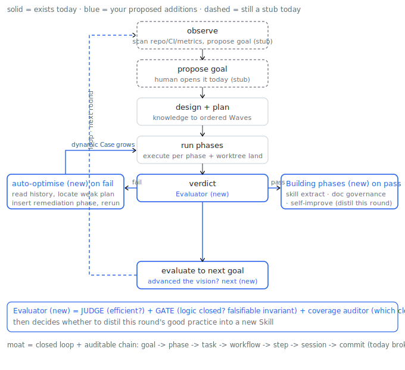
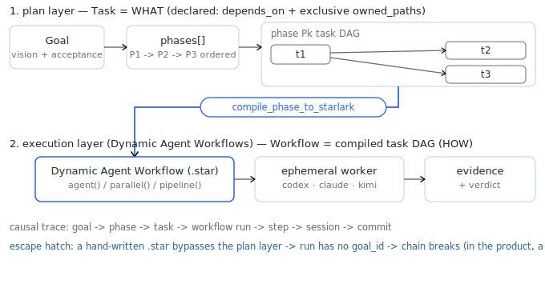

# Vision

> 把项目/业务域变成常驻 Agent 团队可持续自我推进的系统:观察 → 提案目标 → 设计 → 任务图 →
> 消息协作 → 证据 → 评审 → 决策 → 评估 → 下一目标,全程可重建因果。护城河是闭环 + 可审计证据链,
> 不是并行调度。两个验收 pilot:自托管开发(优先)与 Earning Engine adapter。

In English: turn a project or business domain into a **standing agent team that self-advances
it through a closed causal loop** — observe → propose a goal → design → decompose into a task
graph → collaborate via messages → produce evidence → review → decide → evaluate against the
vision → propose the next goal — such that any outcome can be reconstructed back to its cause.
The moat is the **closed loop + an auditable evidence chain**, explicitly NOT parallel
scheduling (that is commodity). Two acceptance pilots prove generalization: self-hosting the
harness's own development (priority 1) and an Earning Engine business-domain adapter (priority 2).

This file is the canonical vision. The harness Vision record (`vision-harness`) carries the
one-paragraph summary and points its `source_refs` here.

## Product form (fully realized)

A **"project operating system" run by a resident agent team.** An operator points the harness at
a repo (or a business domain via an adapter), writes a one-paragraph vision, and walks away:

- A standing **Observer** continuously scans the world the project lives in — repo state, CI,
  failing tests, issues, metrics, P&L — and **proposes the next goal** de novo.
- The harness **designs** the goal, the planner **decomposes** it into sequential phases each
  holding a **task DAG**, **assigns** that work to standing **agent members** (the Agents
  surface — a resident team you point goals at), runs them through **gated phases** with worktree
  isolation and per-phase landing, captures **evidence** + an LLM **verdict**, **evaluates** the
  finished goal against the vision, and **proposes the next one** — without a keystroke.
- Every commit is **reverse-indexable** to its goal / phase / task / session / decision, so an
  operator can ask "why does this code exist?" and walk the chain.

It replaces the engineering manager's plan-assign-review loop for well-scoped delivery, and the
strategy operator's observe-decide-act loop for a business domain. Audience: a solo founder or
small team who wants N domains each tended by a cheap, always-on, provider-neutral
(codex / claude / kimi) agent crew that never loses the thread of WHY.

## The core loop + the self-improvement flywheel

The loop's **execution middle** (task-graph, message-collaboration, evidence, decide) is built
and battle-used. The two **ends** (observe, evaluate → next-goal) and the **learning flywheel**
below are the work ahead. Three additions turn "a harness a human pilots" into "a system that
gets better at piloting itself":

1. **Auto-optimise (self-improvement).** When a goal's verdict fails, don't blindly retry: read
   the execution history, locate the weak link in the plan, and **insert a remediation phase**,
   then continue. The phase set (the goal's "Case") grows dynamically rather than re-running a
   fixed plan.
2. **Evaluator + Skill extraction.** After a goal completes, an Evaluator reviews the run's
   *rationality* (not just pass/fail) and decides whether to **distil this round's good practice
   into a new Skill.** Extraction follows the **knowledge-lifecycle progression**
   (note → docs → skill → schema → CLI → dashboard → plugin): promote a recurring,
   contract-stable practice to the next surface, with the **surface-responsibility matrix**
   deciding which surface owns it. The Evaluator is a panel, not a single judge (see Invariants).
3. **Doc + Skill governance.** Every goal **declares up front the docs and skills it READS
   (inputs)** and the **docs and skills it must UPDATE (outputs)** — both stated in the goal
   itself. Standing **Doc-manager** and **Skill-manager** agents own those bodies; a mandatory
   post-acceptance **doc-sync / small-reorg phase** (a Building phase) enforces the declared
   updates so docs can no longer silently drift; a **Workflow Review** (human or auto) closes out
   each goal; and when an agent edits a doc, the change **propagates along a doc dependency graph**
   (incremental re-validation — auditable causality applied to docs).
   The **methodology already exists**, written down as
   [`bootstrap-project-workflow/references/governance.md`](../skills/bootstrap-project-workflow/references/governance.md):
   the surface-responsibility matrix (who owns docs vs skill vs schema vs code vs CLI vs CI vs
   dashboard vs adapter), the knowledge lifecycle, the reorg protocol, the docs + CI/CD rubrics,
   and the audit output `doc_claim → source_of_truth → owner_surface → current_check →
   missing_gate`. The work is to **operationalize it**: the doc-sync Building phase runs the reorg
   protocol + exit rules and emits that audit output, its verdict GATE = the goal's declared
   updates are written + the registry is consistent + no claim is left with a `missing_gate`; and
   `bootstrap-project-workflow` is the **built-in doc-governance skill** the Doc/Skill-manager
   agents run — now shipped in `skills/` + the install kit (previously runtime-only).
   _What is NOT wired in yet: there is no **built-in `doc-sync` phase** — `GoalPhase` has no `kind`
   and the orchestrator can't auto-append a post-acceptance phase (see Built-in phases below) — so
   no goal ever ran doc-sync, and the existing docs have drifted from the code (being audited
   separately)._

### Built-in phases + dynamic Case (the mechanism)

Phases gain a `kind`: `execution` (the work the goal planned), `remediation` (inserted on
failure, addition #1), and **`building`** — **built-in phases the system itself provides and
auto-appends after acceptance passes** (not authored per goal): `doc-sync` (addition #3,
governance), `skill-extract` (addition #2), `self-improve`. The phase Case is therefore
**dynamic**: failure grows remediation phases; success triggers the built-in building phases.
A built-in phase compiles to a workflow like any other, but its body is fixed (e.g. the
`doc-sync` phase runs the `bootstrap-project-workflow` skill over the goal's declared doc/skill
updates).

**The project does not support this yet.** `GoalPhase` has no `kind`, there is no built-in-phase
registry, and the orchestrator has no auto-append-on-acceptance trigger (`Phase.kind` was
deliberately deferred in #151). The phase substrate (`GoalPhase` / `retry` / replan /
`run-phases`) exists; built-in phases add: `Phase.kind`, a built-in-phase registry
(doc-sync / skill-extract / self-improve), the post-acceptance auto-append rule, and the doc
dependency graph.

## Task vs Dynamic Agent Workflow

`Goal → phases[] → each phase's task DAG` is the **declarative plan** (Task = WHAT: `depends_on`
+ exclusive `owned_paths`). `compile_phase_to_starlark` compiles **one phase's task DAG** into a
**Dynamic Agent Workflow** (a `.star` program of `agent()` / `parallel()` / `pipeline()` leaves),
which `goal run-phases` executes through ephemeral workers. So a **workflow is the compiled
execution of a phase's tasks**, not a separately authored thing. Authoring a `.star` by hand is
the *escape hatch* — fast, but it bypasses the plan layer, so its run carries no `goal_id` and
the audit chain breaks. **In the product, every workflow run is a phase's compiled output**, so
it always links back to its goal.

## The moat as falsifiable invariants (GATEs)

"Auditable causal chain" is only real if it is **machine-checkable**, not prose. The moat is the
following invariants holding (each a GATE that fails the verdict if violated):

- every `WorkflowRun` carries `goal_id` + `phase_id` (Stage 0 — stamped on every orchestrated run + verified live by a real `goal run-phases`)
- every task in a phase has at least one `Evidence` row
- a phase's tasks have pairwise-disjoint `owned_paths`
- every acceptance clause is covered by at least one step's output
- every completed goal has a written `GoalEvaluation` (today: 0)
- every goal's declared doc/skill `UPDATE` outputs are actually written before it verifies (the
  doc-sync GATE — the structural fix for historical doc drift)
- a landed commit is reachable backward to `goal → phase → task → step → session`

## Current state (honest)

Real today: the **standing agent team** (`AgentMember`s — e.g. `lead` + workers — with
`Goal.owner_agent_id` / `Task.assignee_agent_id` assignment and a delivery/gateway path; the
dashboard Agents surface) and the **execution middle** are built and dogfooded at scale (≈1006
provider sessions, ≈406 workflow runs, an append-only knowledge ledger citing `file:line` + PR# +
commit). What is NOT real yet:

- **Stage 0 (CLOSED): `goal run-phases` now runs against the real store.** A real
  `goal run-phases` writes `goal_orchestration_runs.jsonl`, every orchestrated `WorkflowRun`
  carries `goal_id`/`phase_id` (forward link) + the checkpoint records `workflow_run_id` (back
  link), and the dashboard snapshot surfaces both — verified live (dry-run + a real provider run).
  Causality is now a traversable record, not "a moat made of comments". (Historically 9 of 10
  goals ran via ad-hoc Starlark workflows; that volume predates the link.)
- **observe / propose / evaluate → next-goal are stubs** with zero production records (0
  `GoalEvaluation`, 0 autonomous goals); a human is the CPU at the loop's two ends.
- The actual high-volume use (CS2 strategy, AR-card runs) **bypasses the goal loop** and uses
  the very parallel scheduling the vision says is not the moat.
- The doc-governance skill (`bootstrap-project-workflow`) is now **shipped as a built-in**, but
  there is still **no built-in `doc-sync` phase** (`GoalPhase` has no `kind`) and goals never
  declared their doc/skill inputs/outputs — so the docs have **drifted** from the code.

So: a strong, provider-neutral multi-agent **executor a human pilots step by step**. The moat is
a credible architecture, not yet a demonstrated capability.

## Roadmap (chain-first)

0. **Close + link the chain (prerequisite).** Add `goal_id`/`phase_id` to `WorkflowRun` and write
   the link on every run path; dogfood ONE real goal through `goal plan → goal run-phases`
   end-to-end (real orchestration run, fired verdict gate, `landed (run-phases)` commit). Turns
   the moat from comments into traversable records, and exercises the never-run orchestrator.
1. **Evaluator done right** (JUDGE + GATE + coverage auditor) + make `GoalEvaluation` mandatory.
2. **Built-in phases + dynamic Case**: add `Phase.kind` + a built-in-phase registry + the
   post-acceptance auto-append rule; remediation phase on fail; `doc-sync` / `skill-extract` /
   `self-improve` built-in phases on pass. (Not supported today — `GoalPhase` has no `kind`.)
3. **Doc + Skill governance**: per-goal declared doc/skill READ inputs + UPDATE outputs; the
   built-in `doc-sync` phase (from #2) runs the `bootstrap-project-workflow` skill (now shipped)
   with verdict-GATE invariants (the case taxonomy); Doc-manager / Skill-manager standing agents;
   a doc dependency graph.
4. **Self-turning loop**: LLM `observe` (scan repo/CI/issues) + LLM `evaluate → next-goal`.
5. **Standing control plane**: in-serve scheduler/heartbeat + reverse commit→goal index +
   cumulative budget that consults `capabilities().cost`.

## Pilots

- **Pilot 1 — self-hosting development (priority).** The flagship path; step 0 above is its proof.
  `goal-self-hosting` (the first goal created, never executed) is its natural carrier.
- **Pilot 2 — Earning Engine adapter.** Drive a real business domain (e.g. Polymarket/CS2
  strategy) through the loop, proving generalization. Sequenced after the loop closes on Pilot 1.

## Authoring surfaces

Visions, goals, phases, and workflows are agent-authored at runtime via the shipped built-in skill
kit: [star-goal](../skills/star-goal/SKILL.md),
[star-planner](../skills/star-planner/SKILL.md),
[star-workflow](../skills/star-workflow/SKILL.md), and
[bootstrap-project-workflow](../skills/bootstrap-project-workflow/SKILL.md) (the doc-governance /
architecture skill the `doc-sync` built-in phase runs). Diagrams (like the two above) are the
preferred medium for goal/phase/vision docs; rendering them in the dashboard Vision / Docs
surfaces is a tracked frontend follow-up.
