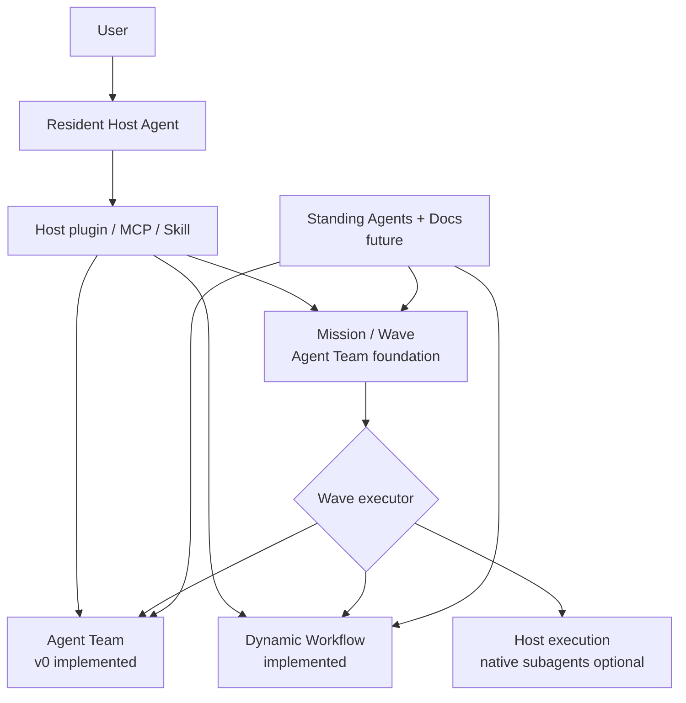
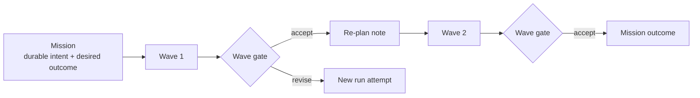
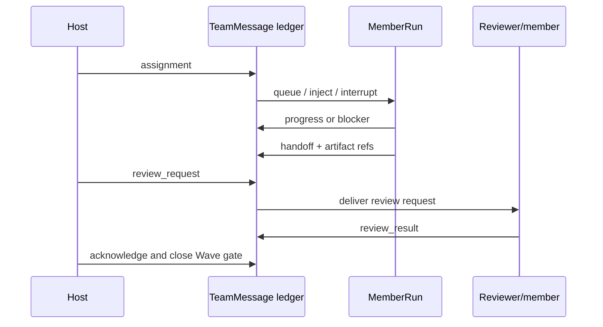
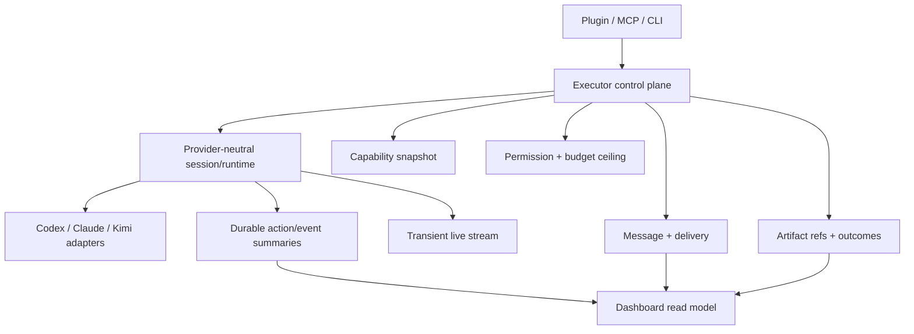

# Star Harness Architecture Map

```text
status: stable
owner_role: architecture
canonical_for: product capability map, Mission/Wave hierarchy, shared execution infrastructure, and lifecycle boundaries
```

This is the shortest canonical view of what Star Harness is becoming. It
describes the accepted product direction and labels current implementation
maturity honestly. Field truth remains in schemas and Rust code; migration
decisions live in [ADR 0026](decisions/0026-mission-wave-architecture.md).

## Product Mission

Star Harness gives resident Host Agents such as Codex, Claude Code, and Kimi
Code provider-neutral tools for structured execution and collaboration. Near
term, those tools are Dynamic Workflow, Agent Team, and Mission/Wave. Later,
Standing Agents + Docs use the same tools to operate long-lived business
processes.

## Capability Map



The three executor paths are complementary:

- `agent_team`: living collaborators communicate and own assignments inside
  one Wave;
- `dynamic_workflow`: a one-shot structured execution returns artifacts and a
  result;
- `host`: the resident Host Agent executes directly and may use provider-native
  subagents as its own implementation detail.

## Mission And Wave



A Wave is deliberately lightweight. It records objective, optional exit
criteria, executor kind/reference, status, outcome summary, artifacts, and the
gate result. It does not contain or require a Task Graph. Executor-specific
planning stays inside the executor.

`Mission` and `Wave` are canonical product terms with native ledgers and public
Agent Team authoring. Existing `Goal` records project to provenance-marked,
read-only Missions; GoalPhase ids are not converted into Waves.

## Agent Team Collaboration



The assignment message is the lightweight work identity. Its message id and
`correlation_id` connect actions, blockers, delegations, handoff, and review.
Agent Team does not require a second Task object or Task Graph to explain this
collaboration. Transitional v0 fields such as `task_ids` and `current_task_id`
describe current code compatibility, not the target product contract.

## Shared Execution Infrastructure



Workflow leaves, Team members, directly observed Host execution, and future
Standing Agents should share these runtime primitives. They remain different
product objects because their ownership and lifecycle semantics differ.

## Thinking Boundary

Thinking is an optional transient signal:

```text
provider thinking chunk
  -> sanitize + truncate + rate-limit
  -> live SSE / host UI
  -> overwrite or expire
  -> never JSONL, snapshot, replay, evidence, or peer context
```

Durable history contains explicit plans, actions, tool results, artifacts,
blockers, handoffs, reviews, and outcome summaries instead.

## Lifecycle And Maturity

| Capability | Lifetime | Current maturity |
| --- | --- | --- |
| Mission | Across Waves | native schema/store/CLI/API/MCP/read model implemented; closeout UI pending |
| Wave | One ordered Mission step | native Agent Team attempts and gate implemented; Workflow/Host routing pending |
| Dynamic Workflow | One structured run | implemented |
| AgentTeamRun | One collaborative Wave attempt | Mission/Wave link, retries, correlation, and accepted-attempt gate implemented |
| MemberRun | One TeamRun | Kimi-first v0 implemented |
| Host-native subagent | Provider-controlled | usable by Host; observation optional |
| Standing Agent + Docs | Long-lived business responsibility | future |

## Document Routing

- [Architecture](architecture.md): narrative boundary and shared contracts.
- [ADR 0026](decisions/0026-mission-wave-architecture.md): chosen model and
  non-destructive migration.
- [ADR 0025](decisions/0025-agent-team-run-control-plane.md): implemented
  Agent Team v0 control plane, amended by ADR 0026.
- [Agent Team Mission/Wave layout](design/agent-team-goal-wave-layout.md): UI
  information architecture.
- [Team Run console](dashboard/pages/team-run-console.md): transitional v0
  mechanism inventory and Team war-room contract.
