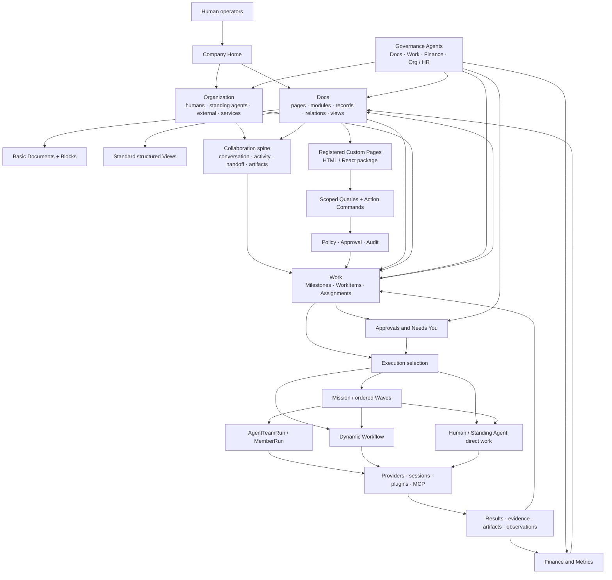

# Architecture Map

This is the canonical product-level architecture map. Detailed object contracts
live under [company-os](company-os/README.md). Implemented execution details
remain documented by the Mission/Wave, Workflow, Agent Team, runtime, and
provider specifications.

## Layer responsibilities

| Layer | Owns | Does not own |
| --- | --- | --- |
| Docs and Modules | business structure, content, record types, relations, views, templates | provider execution lifecycle |
| Organization | Actor identity, Human Owner → Lead → four Governance Agents, Org/HR → Business Agent hierarchy, role, authority, permissions, availability, capacity | one TeamRun attempt or work-routing inference |
| Collaboration | assignments, cross-actor messages, interaction routing, handoff, artifacts, explicit outcomes, and provider-native session links | responsibility, approval, finance truth, copied provider transcripts, or raw thinking |
| Work and Approval | Milestones, WorkItem responsibility, source/result provenance, policy gates, execution reference | Project hierarchy or executor-internal planning |
| Finance and Metrics | typed values, observations, audit, business relations | copied document display values |
| Execution | Mission/Wave, Agent Team, Workflow, direct delivery | company organization or document truth |
| Runtime | provider processes, native sessions, native activity readers/resume, plugins, MCP, and ephemeral projections | business approval, assignment inference, or a second provider history |

## Source-of-truth rule

Documents compose views of typed records. A value shared by two modules is one
record linked by `Relation`, not duplicated document content. Provider-native
execution remains in its native session. Only explicit outcomes, artifact/check
references, metrics, decisions, or linked record updates are promoted into
Harness/Company OS truth.

## Document runtime rule

Basic Documents, standard Views, and registered Custom Pages all render the
same canonical records. Custom HTML/React receives scoped Queries and named
Action Commands only; it cannot directly mutate company truth or bypass Policy,
Approval, and Audit. Every Custom Page has a standard Document/View fallback.

The obsolete coordination stack is retired by ADR 0028. ADR 0026 continues to
define Mission/Wave execution, while ADR 0029 defines the programmable document
runtime.
