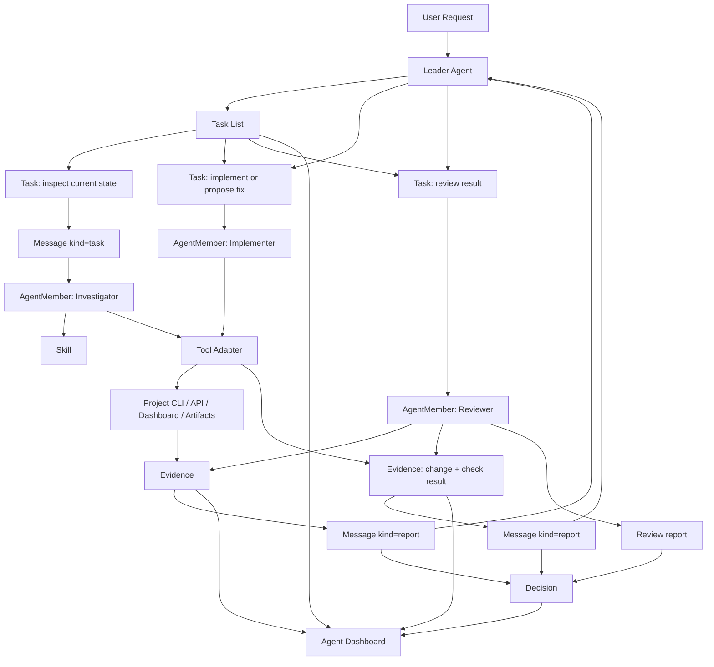

# Architecture

## Product Boundary

Multi-Agent Harness is the coordination product. A business project is a tool
environment connected through an adapter.

The reason for this boundary is described in [design-basis.md](design-basis.md):
the generic product owns coordination, evidence, governance, and agent-facing
interfaces; project adapters own domain execution and domain evaluation.

```text
Multi-Agent Harness
  AgentMember / Task / Message / Evidence / Decision
  Skill files
  Tool descriptors
  Agent Dashboard

Project Adapter
  CLI / API / Dashboard / artifacts / project permissions / evidence policy
```

The generic core must not import project-specific runtime code.

## Minimal Core Loop

The first version is intentionally small:

```text
Task -> Message -> Evidence -> Decision
```

This proves the product can answer:

- who did the work;
- what task they were assigned;
- what they said or reported;
- what evidence supports the result;
- what the Leader decided.

## Core Modules

| Module | Owns | First-version scope |
| --- | --- | --- |
| Agent Runtime | Registered agent instances | `AgentMember` status and capabilities |
| Task System | Task list, ownership, assignment, status | Flat tasks, optional assignee, acceptance criteria |
| Message System | Agent communication | `message | task | report` messages tied to a task |
| Evidence System | References to proof | CLI output, file, URL, dashboard, human note |
| Decision System | Leader outcome | decision, rationale, evidence refs |
| Skill System | How agents should work | Static skill files and prompt refs |
| Tool Adapter System | Project tools | Static tool descriptors first |
| Agent Dashboard | Operational view | Read model over the above objects |

`Skill`, `ToolAdapter`, and `Dashboard` do not need complex domain models in
the first release. They can start as config and views.

## Minimal Types

```text
AgentMember
  id
  name
  role
  capabilities
  status

Task
  id
  title
  objective
  owner_agent_id
  assignee_agent_id?
  status
  acceptance_criteria
  created_at
  updated_at

Message
  id
  task_id?
  from_agent_id
  to_agent_id? / channel?
  kind: message | task | report
  content
  evidence_ids
  created_at

Evidence
  id
  task_id?
  source_type
  source_ref
  summary
  created_at

Decision
  id
  task_id
  decision
  rationale
  evidence_ids
  created_at
```

## Scenario Flow

Example: a user asks the harness to improve a project feature.



## Rust Package Plan

```text
crates/
  harness-core      # minimal types and state enums
  harness-task      # task list and assignment helpers
  harness-store     # append-only file store, later SQLite/Postgres
  harness-adapter   # provider and project tool adapter traits
  harness-api       # HTTP/WebSocket API
  harness-cli       # CLI
```

Dependency direction:

```text
harness-cli -> harness-store -> harness-core
harness-api -> harness-store -> harness-core
harness-api -> harness-adapter -> harness-core
project adapter -> harness-adapter
harness-core -> no project dependencies
```

## Storage

Start with append-only file-backed storage:

```text
.harness/
  members.json
  tasks.jsonl
  messages.jsonl
  evidence.jsonl
  decisions.jsonl
```

Move to SQLite/Postgres only after query patterns are stable.

## Documentation Rule

Keep docs merged until a file is stable above roughly 500 lines, has a clearly
different reader, has a different lifecycle, or must be consumed by tooling.
