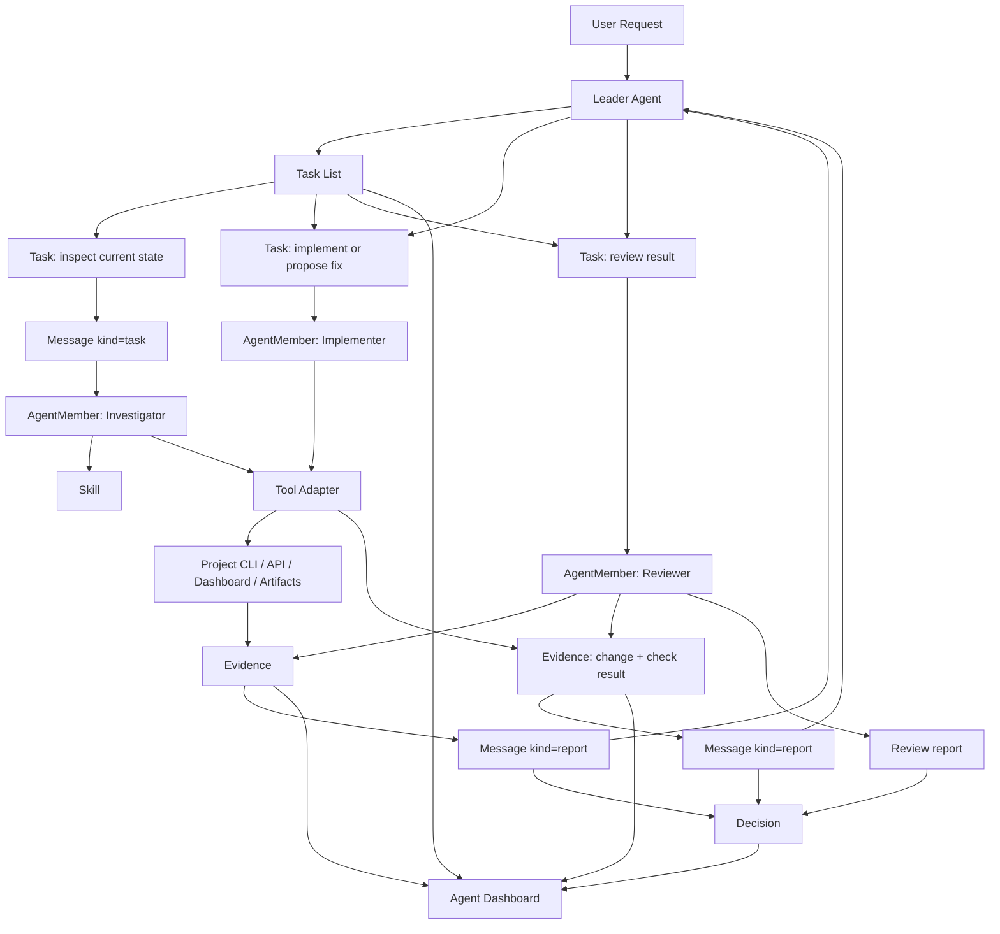

# Architecture

## Product Boundary

Multi-Agent Harness is the coordination product. A business project is a tool
environment connected through an adapter.

The reason for this boundary is described in [design-basis.md](design-basis.md):
the generic product owns coordination, evidence, governance, and agent-facing
interfaces; project adapters own domain execution and domain evaluation.

```text
Multi-Agent Harness
  Goal / AgentTeam / AgentMember / AgentRuntime / AgentEvent / Task / Message
  Proposal / Evidence / Decision / ProviderSession
  Skill files
  Tool descriptors
  Agent Dashboard

Project Adapter
  CLI / API / Dashboard / artifacts / project permissions / evidence policy
```

The generic core must not import project-specific runtime code.

## Minimal Core Loop

The first version is intentionally small:

```text
Goal -> GoalDesign -> Task -> Message -> Evidence -> Decision
  -> GoalEvaluation -> GoalCase -> Follow-up Task
```

This proves the product can answer:

- what durable outcome is being pursued;
- who did the work;
- what task they were assigned;
- what they said or reported;
- what evidence supports the result;
- what the Leader decided.
- what the evaluator learned about the workflow for future goals.

The semantic rules for these objects are defined in
[concept-model.md](concept-model.md). Architecture and code must preserve those
relationships: for example, a task assignment is not only a direct
`assignee_agent_id` field update; it must be delivered as a task message and
then reflected into task/member state.

## Core Modules

For the fuller PRD and architecture narrative for each module, see
[core-modules.md](core-modules.md). This section is the compact module index.

| Module | Owns | First-version scope |
| --- | --- | --- |
| Goal System | Long-lived outcomes and success criteria | Active goals, priority, owner, success criteria |
| Agent Runtime | Registered agent instances | `AgentMember` status and capabilities |
| Agent Control Plane | Team lifecycle and execution state | Member lifecycle, inbox/outbox, queue policy, event reducer, Dashboard actions |
| Task System | Task graph, ownership, assignment, status | DAG tasks, dependency refs, workspace refs, reviewer refs |
| Message System | Agent communication | `message | task | report` messages tied to a task |
| Evidence System | References to proof | CLI output, file, URL, dashboard, human note |
| Decision System | Leader outcome | decision, rationale, evidence refs |
| Goal Learning System | Reusable workflow examples | goal design, evaluation, case library artifacts |
| Provider Session System | External agent execution records | Codex `exec` / `review` sessions and output refs |
| Skill System | How agents should work | Static skill files and prompt refs |
| Tool Adapter System | Project tools | Static tool descriptors first |
| Agent Dashboard | Operational view | Read model over the above objects |

`Skill`, `ToolAdapter`, and `Dashboard` do not need complex domain models in
the first release. They can start as config and views.

The Goal Learning System starts as markdown and JSON examples before becoming a
stable schema. Its detailed architecture is in
[goal-learning-loop.md](goal-learning-loop.md).

## Key Mechanism Docs

The architecture is organized around mechanisms that decide whether the vision
can be accepted, not around file types.

| Mechanism | Canonical doc | Question it answers |
| --- | --- | --- |
| Object and state model | [data-model.md](data-model.md) | Which objects are source of truth, which are projections, and what invariants must hold? |
| Provider-neutral runtime | [agent-runtime.md](agent-runtime.md) | How do persistent agent members receive messages, emit events, and stay provider-neutral? |
| Agent control plane | [agent-control-plane.md](agent-control-plane.md) | How are member lifecycle, queues, peer messages, and runtime reductions operated? |
| Dashboard control surface | [dashboard.md](dashboard.md) | What must the UI show to prove the workflow actually happened? |
| Git / PR workflow | [workflow-git-pr.md](workflow-git-pr.md) | How do tasks, worktrees, branches, proposals, reviews, and decisions integrate? |
| Provider integrations | [integration/README.md](integration/README.md) | How do provider-specific docs implement the neutral runtime without redefining it? |
| Goal learning | [goal-learning-loop.md](goal-learning-loop.md) | How does completed work become reusable future guidance? |

## Goal Design

A `Goal` is a durable outcome, not a chat intention and not a single task. It
sets direction for a task graph and gives the Leader Agent a stable object to
own.

Examples:

- `self-host-mvp`: the harness can manage its own development.
- `earning-engine-strategy-matrix`: the harness can coordinate strategy-matrix
  iteration through the Earning Engine adapter.

Goal rules:

- one Leader owns final interpretation of the goal;
- success criteria must be written before tasks are marked complete;
- tasks may be added, split, killed, or reprioritized as evidence arrives;
- a goal is complete only after a decision records why the success criteria are
  met and a goal evaluation records what the workflow learned;
- if the path is unclear, the goal stays active or blocked instead of being
  replaced by a new vague goal.

## Task Graph And Assignment

A `Task` is the smallest assignable and reviewable unit of work. Parallel work
is modeled as multiple tasks in one goal, not multiple agents editing the same
task.

Task graph rules:

- each task belongs to zero or one goal;
- each task has exactly one owner and zero or one current assignee;
- each task can name a reviewer before it enters review;
- dependencies form a DAG through `depends_on_task_ids`;
- `parent_task_id` is used for decomposition, while dependencies are used for
  execution ordering;
- a blocked task must record a message or evidence explaining the block;
- a task can create follow-up tasks when evidence changes the plan.

The Leader Agent owns the graph. Worker agents own their assigned task output,
not the global plan.

## Concurrent Workspaces And PRs

Git owns code-change facts. The harness owns work ownership, assignment,
review, evidence, and decisions. The detailed workflow is in
[workflow-git-pr.md](workflow-git-pr.md).

The architectural invariant is: PR merge is not task acceptance. A non-trivial
change is accepted only after proposal, evidence, review, and Leader decision
are recorded in harness state.

## Provider Runtime And Integrations

The provider-neutral runtime contract is [agent-runtime.md](agent-runtime.md).
The provider-neutral control-plane contract is
[agent-control-plane.md](agent-control-plane.md). Provider-specific integration
rules are indexed in [integration/README.md](integration/README.md); Codex is
the first provider in [integration/codex.md](integration/codex.md).

The product target is persistent Codex-backed Agent Members:

```text
AgentMember(provider=codex)
  -> AgentRuntime(codex app-server)
  -> Message delivery
  -> AgentEvent stream
  -> Proposal / Evidence / Decision
```

`codex exec` and `codex review` remain fallback paths for one-shot tasks, CI
smoke tests, and PR review. They are not the primary runtime for persistent
Agent Members.

## Review And Decision Flow

The normal implementation path is:

```text
planned -> assigned -> running -> review -> done -> archived
                 \-> blocked
```

`done` means the assigned work passed review. It does not replace a `Decision`.
The Leader still records the decision that explains whether the task result is
accepted, rejected, used to create follow-up work, or used to update the goal.

Review requirements:

- implementation tasks need command or diff evidence;
- docs and schema tasks need governance or fixture evidence when available;
- adapter or live-operation tasks need permission and risk evidence;
- rejected reviews must create a message with missing evidence or required
  changes;
- repeated review friction should create infrastructure or skill tasks.

## Dynamic Replanning

The task graph is expected to change. Replanning is valid only when it is
recorded through messages, evidence, or decisions.

Allowed graph changes:

- split a broad task into smaller tasks;
- add a reviewer or specialist role;
- mark a task blocked and add an unblock task;
- replace a task whose assumptions were disproven;
- promote repeated manual work into CLI, schema, dashboard, or skill tasks;
- archive stale tasks with a decision explaining why.

The dashboard must make these changes visible instead of presenting only the
latest state.

## Surface Responsibility Matrix

Each surface has a different source-of-truth role. Do not make prose carry a
contract that should be owned by schema, code, CLI, CI, or Dashboard.

| Surface | Owns | Refuses | Current maturity |
| --- | --- | --- | --- |
| Docs | design basis, boundaries, scenarios, operating path | field truth, command truth, runtime truth | active |
| Skills | agent operating instructions and reusable workflow | full product docs or domain implementation | active |
| Schemas | cross-surface machine contracts | business explanation and unstable experiments | active for core objects |
| Rust code | real behavior, validation, persistence/API/adapter logic | product narrative and future roadmap | implemented for core/store/CLI slice |
| CLI | shortest executable path and structured output | prose-only output and hidden evidence | implemented for file-store workflow |
| CI/CD | verification of current commitments | blocking on immature guesses | phase 0/1 active |
| Agent Dashboard | coordination read model, evidence links, and safe operator actions | replacing project dashboards or making domain verdicts | first control-plane slice implemented |
| Project Adapter | project tools, permissions, evidence policy | generic harness runtime behavior | schema/example first |

## Data Model

Minimal object relationships, projections, and source-of-truth rules are in
[data-model.md](data-model.md). Stable field definitions live in
[schemas.md](schemas.md) and `schemas/*.schema.json`.

## Scenario Flow

Example: a user asks the harness to improve a project feature.



## Rust Package Plan

```text
crates/
  harness-core      # minimal types and state enums
  harness-store     # append-only file store, later SQLite/Postgres
  harness-cli       # CLI
  harness-task      # planned task list and assignment helpers
  harness-adapter   # planned provider and project tool adapter traits
  harness-api       # planned HTTP/WebSocket API
```

Dependency direction:

```text
harness-cli -> harness-store -> harness-core
harness-api -> harness-store -> harness-core
harness-api -> harness-adapter -> harness-core
project adapter -> harness-adapter
harness-core -> no project dependencies
```

## Storage

Start with append-only file-backed storage:

```text
.harness/
  goals.jsonl
  members.jsonl
  tasks.jsonl
  messages.jsonl
  evidence.jsonl
  provider_sessions.jsonl
  decisions.jsonl
  provider-sessions/
  prompts/
```

Move to SQLite/Postgres only after query patterns are stable.

## Documentation Rule

Keep docs merged until a file is stable above roughly 500 lines, has a clearly
different reader, has a different lifecycle, or must be consumed by tooling.
