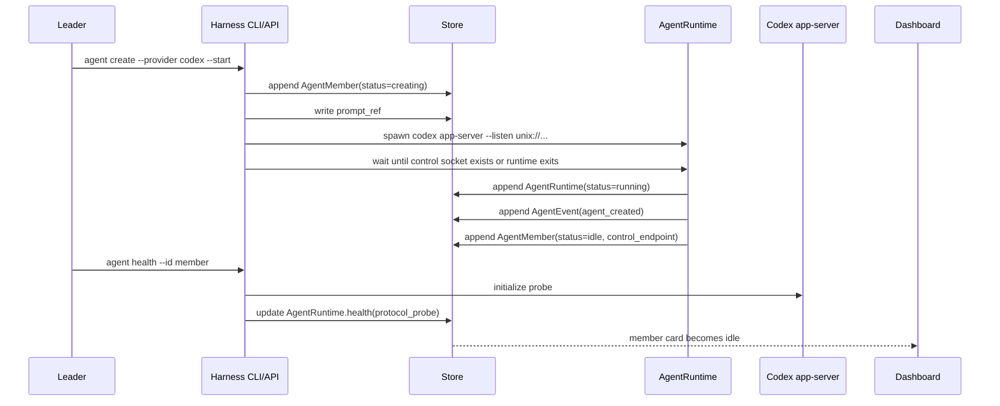
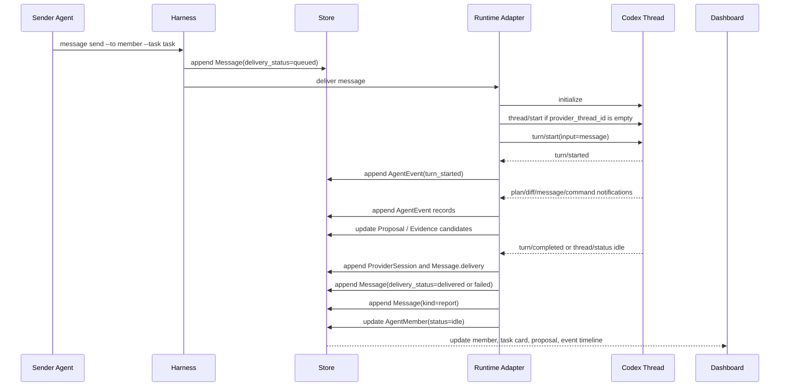
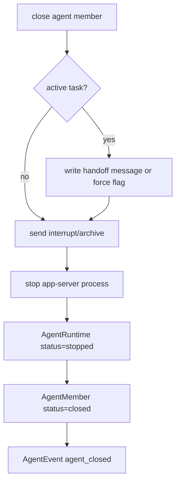

# Codex Agent Runtime

This document is a Codex runtime source-audit and implementation note. The
provider-neutral runtime contract is [agent-runtime.md](agent-runtime.md). The
canonical Codex integration boundary is [integration/codex.md](integration/codex.md).
Keep generic runtime decisions in `agent-runtime.md`; keep Codex-specific
protocol and source findings here or in `integration/codex.md`.

For the broader Codex provider integration boundary across app-server, hooks,
skills, plugins, and fallback modes, see [integration/codex.md](integration/codex.md).

## Core Decision

The MVP should use persistent Codex agents, not only one-shot `codex exec`.

```text
AgentMember(provider=codex)
  -> AgentRuntime(codex app-server)
  -> provider thread
  -> Message delivery
  -> AgentEvent stream
  -> Proposal / Evidence / Decision
```

`codex exec` and `codex review` remain useful fallback paths for CI, smoke
tests, or one-shot jobs, but they are not the main runtime for a persistent
Agent Member.

## Technology Choice

Use Rust for the harness runtime and Codex app-server for provider execution.

| Layer | Technology | Why |
| --- | --- | --- |
| Harness runtime | Rust + Tokio | Owns long-running processes, event streams, file locks, and lifecycle state. |
| Persistent Codex provider | `codex app-server` | Exposes threads, turns, hooks, skills, review, and event notifications. |
| Transport | Unix socket first, WebSocket later | Unix sockets are local, simple, and avoid auth complexity for MVP. |
| Store | append-only JSONL first | Keeps source of truth inspectable before SQLite/Postgres. |
| Dashboard feed | file-store read model first, SSE/WebSocket later | Kanban and member state can be built before a full API. |

V1 should start one Codex app-server runtime per Agent Member. This is simpler
and safer than a shared runtime because each agent has isolated process state,
thread state, cwd, worktree, prompt, and failure domain. A shared app-server
pool can come later after lifecycle semantics are stable.

## App-Server, Hooks, Skills, And Plugins

These Codex surfaces solve different problems and should not be collapsed into
one mechanism.

| Surface | Harness role | Not responsible for |
| --- | --- | --- |
| `codex app-server` | Persistent provider runtime, thread/turn delivery, streamed provider events, provider-side commands/review. | Durable task ownership, Leader decisions, or the canonical message ledger. |
| Hooks | Deterministic lifecycle side effects: log turns, enforce local policy, enrich prompts, write Stop/PostToolUse summaries back to the harness. | Agent process persistence, task graph ownership, or message routing. |
| Skills | Instructions that teach Codex how to use a project or workflow. | Runtime state or evidence storage. |
| Plugins | Packaged distribution of skills, hooks, apps, and MCP servers through a marketplace or local bundle. | The core runtime protocol or the harness source of truth. |

The runtime contract is therefore:

```text
AgentMember
  -> AgentRuntime(codex app-server)
  -> Message delivery over app-server
  -> app-server notifications + hooks
  -> AgentEvent / Proposal / Evidence / report Message
  -> optional plugin packaging after contracts stabilize
```

Plugins are a productization layer. They become useful once the harness CLI,
schemas, skills, and hook scripts are stable enough to ship as a bundle to
other repositories or teams. They should package the way Codex uses the
harness; they should not own the harness state machine.

## Codex Protocol Surface

The Codex CLI exposes an experimental app-server protocol. The protocol can be
generated locally with:

```bash
codex app-server generate-ts --experimental --out <dir>
codex app-server generate-json-schema --experimental --out <dir>
```

The relevant client methods are:

| Method | Harness use |
| --- | --- |
| `initialize` | Establish app-server session. |
| `thread/start` | Create the persistent thread for an Agent Member. |
| `turn/start` | Deliver a task or message to the agent. |
| `turn/steer` | Adjust an active turn if supported by policy. |
| `turn/interrupt` | Stop or redirect active work. |
| `thread/inject_items` | Append harness messages or context items to a thread when needed. |
| `thread/read` / `thread/list` | Reconcile provider state with harness state. |
| `thread/archive` | Close or retire provider thread state. |
| `review/start` | Run Codex review as part of PR review. |
| `skills/list` / `hooks/list` | Discover provider-side skill and hook surfaces. |

The relevant server notifications are:

| Notification | Harness mapping |
| --- | --- |
| `thread/started` | `AgentRuntime` is bound to provider thread. |
| `thread/status/changed` | `AgentMember.status` and `AgentEvent`. |
| `turn/started` | Agent begins handling a message or task. |
| `turn/plan/updated` | `Proposal` draft/update. |
| `turn/diff/updated` | Proposal changed paths or diff evidence candidate. |
| `turn/completed` | Report message and evidence candidate. |
| `hook/started` / `hook/completed` | `AgentEvent` and hook telemetry. |
| `item/agentMessage/delta` | Streaming agent output for Dashboard. |
| `item/plan/delta` | Proposal update for Dashboard. |
| `command/exec/outputDelta` | Command evidence candidate. |
| `process/outputDelta` / `process/exited` | Runtime telemetry and evidence candidate. |
| `thread/closed` | Runtime close state. |

The harness must not treat the Codex thread as the source of truth. It converts
provider notifications into durable harness objects.

## Runtime Objects

The persistent runtime needs these objects.

```text
AgentTeam
  id
  name
  description
  owner_agent_id
  member_ids

AgentMember
  id
  name
  description
  role
  provider
  model/profile
  provider_config
  capabilities
  team_ids
  prompt_ref
  skill_refs
  workspace_policy
  worktree_ref?
  permission_profile?
  runtime_workspace_roots
  status
  current_task_id?
  current_proposal_id?
  provider_runtime_id?
  provider_thread_id?
  provider_agent_path?
  provider_agent_nickname?
  provider_agent_role?
  control_endpoint?
  created_at
  last_seen_at?

AgentRuntime
  id
  agent_member_id
  provider
  status
  pid?
  control_endpoint?
  command
  args
  started_at
  ended_at?
  last_event_at?
  health(process/socket/protocol/delivery)

AgentEvent
  id
  agent_member_id
  provider_runtime_id?
  task_id?
  provider
  provider_thread_id?
  provider_turn_id?
  provider_child_thread_id?
  event_type
  summary
  payload_ref?
  created_at

ProviderChildThread
  id
  provider
  agent_member_id
  provider_runtime_id?
  task_id?
  parent_provider_thread_id?
  provider_thread_id
  provider_agent_path?
  provider_agent_nickname?
  provider_agent_role?
  status
  last_message_ref?
  created_at / updated_at

Proposal
  id
  task_id
  agent_member_id
  title
  summary
  status
  changed_paths
  evidence_ids
```

Messages also need delivery state:

```text
Message
  from_agent_id
  to_agent_id? / channel?
  task_id?
  kind
  delivery_status: queued | delivered | acknowledged | failed
  delivery(provider_session_id, request_id, thread_id, turn_id, terminal_source)
```

## Prompt Composition

Codex does not need a custom internal system prompt for MVP. The harness creates
a deterministic bootstrap prompt and passes it through app-server thread and
turn parameters.

```text
Harness contract
  + role prompt
  + project skill refs
  + task/message content
  = Codex thread instructions and turn input
```

The bootstrap prompt should include:

- Agent Member id, name, description, role, and team;
- message protocol and delivery expectations;
- how to read task state and report progress;
- evidence and decision rules;
- workspace, branch, PR, and owned-path rules;
- relevant skill refs;
- project adapter refs when operating a project.

## Agent Creation Flow



V1 creates the provider thread lazily on first delivery. This keeps `agent
create --start` focused on process lifecycle and makes `agent health` the
explicit protocol probe. The first `agent deliver` call runs
`initialize -> thread/start -> turn/start` when `provider_thread_id` is empty,
then stores the thread id on the member.

## Message Delivery Flow



If the target Agent Member is offline, the message remains `queued`. The
runtime delivery worker retries when the member is running.

Runtime startup is not considered healthy until both the process is alive and
the Unix control socket exists. Startup must fail fast if app-server exits
before creating the socket; otherwise `agent deliver --start-runtime` can
create duplicate runtimes and hide the real failure behind a later proxy error.

## JSON-RPC Delivery Contract

The current CLI can create persistent Agent Members and queue messages. The
runtime delivery worker turns a queued message into a Codex turn through an
explicit protocol state machine.

```text
queued Message
  -> connect control_endpoint
  -> initialize
  -> thread/start if provider_thread_id is empty
  -> parse provider thread id from thread/start response or notification
  -> initialize
  -> turn/start(thread_id, input=message)
  -> notification stream
  -> AgentEvent / Proposal / Evidence / report Message
```

Delivery rules:

- `initialize` validates the provider protocol and records runtime health;
- `thread/start` binds one provider thread to one Agent Member;
- the harness must not invent a provider thread id;
- `turn/start` must only be sent after a real provider thread id is known, or
  against a previously persisted `provider_thread_id`;
- `turn/start` is the only normal path for task/message delivery;
- `thread/inject_items` may add harness context, but not replace messages;
- `turn/interrupt` is used for close, reassignment, or explicit stop;
- delivery state moves `queued -> delivered -> acknowledged` only from durable
  provider events;
- JSON-RPC errors become `Message(delivery_status=failed)` plus `AgentEvent`;
- empty provider output, process failure, JSON-RPC error, or missing thread id
  produces a failed provider session and a reproducible request/stdout/stderr
  fixture under `.harness/provider-sessions/<delivery-id>/`;
- provider notifications are evidence candidates, not final decisions.

The first CLI implementation uses bounded proxy calls and stores one file set
per phase:

```text
thread-start.request.jsonl
thread-start.stdout.jsonl
thread-start.stderr.log
turn-start.request.jsonl
turn-start.stdout.jsonl
turn-start.stderr.log
```

The delivery adapter connects directly to app-server's WebSocket-over-Unix
socket transport. It treats `turn/completed` as the preferred terminal event and
`thread/status/changed(status.type=idle)` as a fallback terminal signal when the
provider thread has finished but the connection did not emit `turn/completed`.
A failed protocol fixture is better than a fake successful delivery because it
gives the next agent a concrete request and response artifact to debug.

## Hook Integration

Hooks should be used as deterministic lifecycle observers and guardrails:

- `SessionStart`: add harness role context and report session/thread creation;
- `UserPromptSubmit`: attach message/task ids and block prompts that omit the
  required harness envelope;
- `PostToolUse`: record command/check output as `AgentEvent` or evidence
  candidates;
- `Stop`: write the final assistant message, transcript path, and turn id back
  to the harness as a report candidate;
- `PreToolUse` / `PermissionRequest`: enforce local safety rules for destructive
  shell commands or unexpected write scopes.

Hooks are not the canonical delivery path. If app-server delivery says a
message was not accepted, a hook must not mark it delivered. If a hook observes
a completion that the app-server client missed, the harness may reconcile it
against the provider session and rollout transcript before creating a report.

## Plugin Integration

The first plugin should be built only after the CLI/API/schema contract is
stable enough to reduce setup variance. Its bundle should include:

- harness workflow skills;
- optional Codex hooks for event/report backfill;
- MCP server or command wrappers for safe harness CLI access;
- plugin metadata that explains the workflow and required permissions.

This plugin would make Codex better at operating a repository that adopts the
harness. It would not replace the Rust backend, append-only store, Agent
Dashboard, app-server runtime, or Leader decision model.

## Close Flow



Close is not deletion. It preserves the member, prompt, runtime refs, events,
messages, proposals, evidence, and decisions.

Close stops every latest non-stopped runtime recorded for the Agent Member, not
only the most recent runtime id. This prevents stale startup attempts from
leaking provider processes.

## Dashboard Read Model

The Agent Dashboard should show:

- teams and member rosters;
- member cards with id, name, description, role, provider, prompt ref, skill
  refs, runtime status, current task, current proposal, and last event;
- Kanban task board with assignee, reviewer, workspace, branch, PR, evidence,
  blockers, messages, and provider sessions;
- message inbox/outbox by member and channel;
- event timeline per member and task;
- proposal board with draft/submitted/accepted/rejected states;
- runtime health, pid, control endpoint, and last event time.

The project dashboard remains the place for domain-specific charts. The Agent
Dashboard shows coordination, delivery, runtime state, and evidence flow.

## Implementation Stages

1. Persist the runtime objects and message delivery state.
2. Add CLI/API commands for `agent create/list/show/start/health/send/deliver/ingest/close`,
   `team create/list/show`, `message send/list/status`, `event add/list`, and
   `proposal create/from-diff/list/status`.
3. Implement Codex app-server process lifecycle over Unix sockets.
4. Implement bounded JSON-RPC delivery files for `initialize`, `thread/start`,
   `turn/start`, provider proxy execution, explicit ingestion, and runtime
   health checks.
5. Convert plan/diff/message/command notifications into `AgentEvent`,
   `Proposal`, `Evidence`, and report messages.
6. Add hook-based lifecycle backfill for Stop/PostToolUse/UserPromptSubmit.
7. Add Dashboard read model and later a realtime update path.
8. Package stable skills/hooks/MCP helpers as a Codex plugin.
9. Keep `codex exec/review` as fallback and PR review helper.

## Non-Goals For V1

- Do not require a Codex plugin for correctness.
- Do not make hooks the source of truth.
- Do not use shared app-server pooling before per-member lifecycle works.
- Do not let provider chat replace harness messages.
- Do not hide queued delivery, blocked delivery, or stale runtimes from the
  Dashboard.
