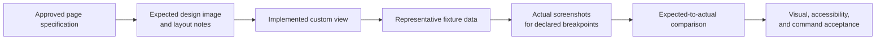

# Agent-Programmable Pages

```text
status: target architecture contract with first metadata/UI inspection slice implemented
owner_role: product + platform
canonical_for: page tiers, custom-view boundaries, and governed page actions
```

## Purpose

The Company OS should provide the clarity, nesting, and database views people
expect from a Notion-like workspace without adopting Notion's assumption that
every important interface must be hand-assembled from a universal editor.

In an Agent-native company, most everyday knowledge should remain easy to
write and organize. A smaller set of durable, high-value operating surfaces
can be specifically composed in React/HTML by an Agent. The page is then a
presentation and interaction layer over Company OS truth; it is never an
alternative database, permission system, or approval mechanism.

This document defines the intended architecture. The first implemented slice
now covers `CustomPageDefinition` / `CustomPagePackage` metadata creation,
verification, candidate-package publish records, and Human-visible contract
inspection in the Docs module page. It is **not** yet a sandboxed custom-page
runtime and does not claim that generated React/HTML has been executed as a
trusted plugin.

## Three page tiers

| Tier | Creation route | Appropriate for | Available composition | Authority boundary |
| --- | --- | --- | --- | --- |
| **Basic document** | A human or Agent edits a `Document`. | Briefs, research, meeting notes, decisions, SOPs, and one-off plans. | Rich text, headings, lists, checklists, callouts, media, code, attachments, comments, sub-pages, mentions, and an ordinary table. | The document is authoritative only for its content; business actions create first-class records. |
| **Structured page** | A document template combines standard Blocks and saved Views. | Milestone control documents, simple registers, application briefs, release plans, and common reporting. | Database table, board, timeline, calendar, chart, related-records, WorkItem list, Approval queue, finance view, actor list, and metric block. | Blocks render canonical Queries/Views and use governed actions; they do not copy data. |
| **Custom coded page** | A governed `CustomPageDefinition` registers a versioned `CustomPagePackage` for an approved module/page specification. | Company home, finance cockpit, organization map, a stable module home, or a complex control surface that needs several types of information in one deliberate layout. | Shared UI components plus scoped read queries and command actions; React/HTML is an implementation choice, not an unconstrained application. | Code may compose and request actions. It cannot become a source of truth or directly mutate durable business state. |

The tiers are progressive, not competing. A custom page remains connected to a
normal Document, standard Views, and its related typed records. Users must be
able to open those underlying objects even if a custom renderer is unavailable.

## Common building blocks

The baseline interaction model is intentionally familiar:

```text
Document
  -> Block (prose, table, media, embed, standard structured component)
  -> TypedRecord / Relation / View
  -> BusinessModule (reusable business contract)
  -> CustomPageDefinition (governed registration)
  -> CustomPagePackage (optional HTML/React artifact)
```

`Document`, `Block`, `TypedRecord`, `Relation`, `View`, and `BusinessModule`
retain the meanings in the [Document System](document-system.md) and
[Concept Model](concept-model.md). A custom page does not redefine a record
type, relation, or approval policy in page code.

## Custom-view runtime boundary

A future custom-page runtime has four explicit boundaries.

### 1. Registered specification

Every custom page is registered against a stable target, such as a module home
or a document template. Its registration declares at least:

- purpose and primary user question;
- parent `BusinessModule` or owning `DocumentSpace`;
- allowed record types, relation paths, saved Views, and metric definitions;
- supported command names and the actor/policy context they require;
- component/dependency version, owner, and a standard-view fallback; and
- the page's fixture and visual acceptance artifacts.

The registration is a governed product/configuration record. An arbitrary HTML
file pasted into a document does not receive data or action authority.

Current implementation note: `harness company docs page scaffold` and
`harness company docs page-definition create` create this registration and an
initial package metadata row. `harness company docs page verify` checks that
the module, fallback View, package, declared queries, declared Actions, policy
refs, and visual contract are present. `harness company docs page publish`
records a candidate `CustomPagePackage`; it deliberately does not switch the
active `CustomPageDefinition.package_ref` until a later governed promotion
command exists. The Docs frontend renders this active/candidate/fallback state
for Human review.

### 2. Scoped reads

The runtime gives a page only policy-filtered queries over declared records and
relations. A page receives presentation data, stable identifiers, and the
minimum action context needed to render. It may not bypass module, document,
field, retention, or sharing policy by issuing its own store query.

Views remain derived presentations. An aggregate, amount, owner, or status
shown by a custom page must be traceable to a canonical record or a declared
metric calculation; it must not be re-created as page-local truth.

### 3. Governed commands

The only durable writes available to a custom page are named Action Commands,
for example:

```text
work-item.create
trademark.application.create
trademark.material.link
approval.request
approval.decide
finance.commitment.request
document.open / record.open
```

On invocation, the command layer—not the page—validates identity, current
permissions, field rules, record lifecycle, separation of duties, approval
policy, idempotency, and audit events. If a command needs a human decision,
the result is an `Approval` or a blocked/pending state, never a simulated
success in the user interface.

Page code must not directly write a `TypedRecord`, alter an `Approval`, mark a
payment settled, grant access, or submit a legal filing. A UI may make the
request intelligible and show the returned state, but it cannot authorise
itself.

### 4. Sandboxed execution

The custom renderer runs with a restricted capability set rather than ambient
access to the Company OS. The intended sandbox prevents access to unscoped
records, credentials, provider sessions, hidden browser state, arbitrary
network destinations, and direct database/store clients. It exposes only:

- approved shared UI components and deterministic presentation utilities;
- scoped query results and pagination handles;
- explicitly registered Action Commands; and
- an auditable error/reporting channel.

Any extra integration or elevated capability is a module/security change and
requires the applicable review and approval; it is not silently acquired by
generated code.

## When custom code is justified

Custom code is an exception for a clear operating need, not a cosmetic upgrade
for every document. It is justified when all of the following are true:

1. The page has a stable, repeated audience and a primary question that a
   standard document cannot make clear.
2. It needs a purposeful composition of several information types—for example
   records, WorkItems, Approvals, finance, metrics, actors, and evidence.
3. The same data has already been modelled as canonical records, relations,
   Views, and policies, or the module proposal explicitly supplies those
   missing contracts.
4. A named owner can maintain the view, its fallback, and its acceptance
   fixtures.
5. The expected operational benefit outweighs the maintenance and security
   cost.

Ordinary pages should stay basic or structured when a document template and
standard blocks answer the user's question with less cost and less semantic
risk. A custom page is especially inappropriate when it exists only to hide a
missing data model, duplicate a dashboard, automate a policy-gated decision,
or display a one-time presentation.

## Standard-view fallback and portability

Every custom page has a non-code route to the same underlying knowledge:

```text
CustomPagePackage unavailable, rejected, or disabled
  -> linked owning Document
  -> standard Blocks and saved Views
  -> canonical TypedRecords, Relations, WorkItems, Approvals, and finance records
```

The fallback must retain source links, ownership, status, approval state, and
the next available action. It does not need to reproduce the custom layout.
This makes renderer failures recoverable and preserves portability across
devices, accessibility modes, and later visual redesigns.

## Visual contract

A core custom page is accepted through an explicit visual-and-behavioural
contract, not an assertion that generated code "looks right":



The expected image communicates hierarchy, density, navigation, information
priority, and responsive intent. It does not alter source-of-truth contracts.
The comparison records meaningful differences, their disposition, and the
actual build/component version. Visual approval never substitutes for the
business-policy tests required by governed commands.

## Trademark Management example

The **Trademark Management** module illustrates all three tiers:

- A Brand Owner writes a basic source document explaining the intended mark,
  territory, classes, and filing rationale.
- The application detail remains a structured page: its document embeds
  canonical views of `TrademarkApplication`, materials, deadlines, linked
  WorkItems, legal review, `Approval`, and `FinancialRecord` data.
- Once the process is stable, the module home can be a custom coded page that
  answers: *Which applications need a decision, what legal milestone is next,
  and what is committed or awaiting payment approval?*

The custom home may render an application pipeline, a deadline timeline, a
"Needs You" approval panel, current work, and source-linked finance totals.
Its **New application** button invokes `trademark.application.create`; its
**Request ¥3,000 filing approval** button invokes a finance/approval command.
Neither button writes a payment record or approves a filing directly. The
Brand Owner's approved human decision, the `CN-2026-018` WorkItem, the
`TrademarkApplication`, and associated financial records stay the same linked
objects described in the [trademark example](examples/trademark-registration.md).

## Relationship to future skills

`company-module-designer` and `company-page-builder` are optional Agent
capabilities that help create proposals and implementations under this
architecture. They are not product authorities, policy engines, or a source of
truth. Their proposed contracts are in [Skill Contracts](skill-contracts.md).
