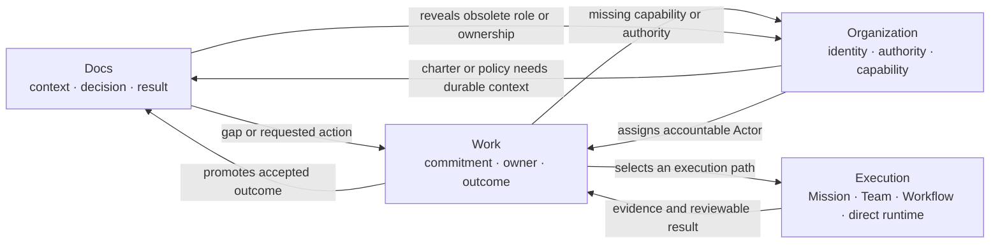

# AgentOS self-hosting dogfood loop

```text
status: canonical operating contract
owner_role: AgentOS Lead
canonical_for: using Organization, Docs, and Work to continuously develop AgentOS itself
```

## Dogfood means operating the company through the product

AgentOS dogfood is not a scripted demo and it is not one fixed
`Docs -> Work -> Docs` pipeline. It means that the team building Star Harness
uses the Company OS as its normal operating system:

- durable company identities and authority are visible in **Organization**;
- company context, decisions, specifications, and accepted results live in
  **Docs**;
- commitments, ownership, lifecycle, blockers, review, and outcomes live in
  **Work**;
- complex execution may use Mission/Wave, Agent Team, Dynamic Workflow, direct
  Agent runtime, humans, or external participants without replacing Company
  records;
- every material defect discovered while operating the system becomes a
  linked WorkItem or an explicit accepted exception, and the next dogfood
  cycle uses the repaired product.

Docs, Work, and Organization are coequal. Any of them may initiate the next
cycle:



The arrows are relations, not a required sequence. A single real operating
day should normally exercise several directions.

## Actor model

The minimum AgentOS organization is:

```text
Human Owner
└── AgentOS Lead (durable Standing Agent)
    ├── Docs Governance Agent
    ├── Work Governance Agent
    └── Platform Development Agent
```

Org/HR Governance is added when governed organization mutation becomes a live
product capability. Finance is conditional and must not appear in a normal
non-monetary software WorkItem.

The current Codex task acts as an **AI Supervising Operator** during bootstrap:
the Human speaks to it, it inspects the Company Store, and it may operate or
coach the AgentOS Lead. The Operator is not silently inserted into
Organization and does not replace the durable Lead. Once the Lead runtime and
Inbox are connected, the Operator sends governed messages to the Lead and the
Lead remains the company identity, owner of its queue, and source of its
history even if its provider later changes.

The deterministic **Runtime Supervisor** is a separate technical role. It owns
runtime leases, delivery, retry, recovery, health, and Close. It does not make
company judgments and is not an Organization Actor.

Only durable Standing Agents appear in the organization chart. Agent Team
MemberRuns and provider-native subagents may be used by a Standing Agent, but
they remain execution details. An upper Standing Agent may propose or manage a
lower Standing Agent only when Organization records and the applicable module
permission policy permit it.

## Authority is declared per product system

Each system owns its permission catalog. Creating an Agent does not grant a
generic "full access" flag.

| System | Example capabilities | Sensitive boundary |
| --- | --- | --- |
| Docs | read, comment, propose structure, append/update governed records | archive, bulk migration, policy or module-schema change |
| Work | create, assign, execute, report, review | reassign accountability, close high-risk work, change lifecycle policy |
| Organization | inspect, propose child Agent/unit, manage delegated capacity | provision, expand permissions, change reporting or authority |
| Finance | inspect permitted records, propose commitment | approval, payment, credentials, settlement |

`propose`, `execute`, `review`, and `approve` are different authorities. A
parent Agent may delegate only within its own ceiling. Human approval remains
mandatory for legal, financial, credential, external-access, or material
organization changes.

## Continuous operating loop

The Lead repeatedly performs this loop:

1. **Observe native truth.** Read needs-attention signals from Docs, Work, Org,
   runtime health, code/project bindings, and external gateways.
2. **Judge.** Decide whether the observation is noise, a direct low-risk fix,
   a WorkItem, an organization-capability proposal, or a Human decision.
3. **Record before substantial execution.** Put durable intent, source refs,
   responsible Actors, acceptance, and risk in the owning Company objects.
4. **Execute through the smallest honest path.** Direct Agent work is valid;
   Mission/Wave, Agent Team, Workflow, human, or external execution is selected
   only when useful.
5. **Review and promote.** Preserve explicit outcome, evidence, and reviewer
   judgment. Update Docs or Org only with accepted results.
6. **Re-observe.** The result may expose the next Docs, Work, or Org gap. That
   is the next dogfood cycle, not a failure of the model.

Examples:

- Docs Health finds an ownerless policy, so Work Governance creates a
  maintenance WorkItem and Organization supplies the accountable Agent.
- Work repeatedly needs a capability no Actor owns, so the Lead asks
  Organization Governance for a child-Agent proposal and Docs records its role
  charter.
- Organization shows a Agent with an obsolete charter, so Docs Governance
  updates the charter and Work Governance opens follow-up migration work.
- A Platform Development WorkItem ships a Dashboard fix; the result document
  records browser evidence, and a new usability observation creates the next
  WorkItem.

### Running Agents reconcile after Harness changes

Standing Agent identity is durable, but its current provider process is not
assumed to run compatible code forever. Each dogfood cycle distinguishes:

- projection-only changes, which require no Agent restart;
- a process crash/restart under the same adapter contract, which resumes the
  same unclosed MemberRun and provider-native session under a higher Supervisor
  generation;
- communication, adapter, permission, model/effort, or Plugin contract changes,
  which require a controlled drain/interrupt and explicit replacement runtime
  generation;
- an incompatible native session, which remains historical evidence while the
  new runtime starts a new native session.

The Runtime Supervisor performs that reconciliation. The Lead decides when the
company can tolerate the handoff and which Work carries forward. Restart never
changes the Standing Agent id, silently ACKs mail, duplicates a top-level
writable turn, or copies the provider transcript into Harness.

The restart acceptance probe is not only a health check. It must prove the new
Supervisor generation can deliver a fresh correlated message to an existing
MemberRun, that the same provider-native session answers, and that the Host can
ACK the resulting handoff. Reconciliation also compares Company identity,
current Work/Assignment, permission and provider-control snapshots, and queued
mail. Any incompatibility becomes visible Work rather than a silent reset.

## Product-truth and UI acceptance

The Company OS UI is an operator surface over native records. It must:

- show the AgentOS hierarchy and let a Human open every durable Agent;
- show each Agent's queue, linked Docs, permissions, runtime state, and Inbox
  without conflating organization availability with process health;
- make Work rows navigable and display only relations linked to the selected
  WorkItem;
- never attach an unrelated Approval, financial record, typed record, Actor,
  or business line merely because it is the first row in a snapshot;
- preserve Company Store, Execution Space, and Project Binding parameters in
  every internal deep link;
- label disabled or unavailable actions honestly; controls that look enabled
  must have a working governed transport;
- provide needs-attention views for unresolved Docs structure, blocked or
  unowned Work, missing organizational capability, undelivered mail, and
  unhealthy runtimes.

The visual and interaction contract for the first self-hosting slice is
[`agentos-self-hosting-loop-v1`](../design/company-os-v5/agentos-self-hosting-loop-v1/README.md).
It inherits the approved Standing Agent workspace direction instead of
redesigning the whole product.

## What counts as a successful dogfood cycle

A cycle is accepted only when native state can reconstruct:

- the observation and its originating Document, WorkItem, Org record, gateway,
  or runtime fact;
- the accountable Actor and any assigned executor;
- the authority and approval boundary;
- the execution reference when execution was used;
- the explicit result, evidence, and reviewer judgment;
- the promoted change to Docs, Work, or Organization;
- any newly discovered issue and the Lead's next judgment.

One successful path is evidence for one slice, not completion of dogfood.
AgentOS dogfood is healthy when multiple real paths can keep running, defects
become visible and actionable inside the product, and the team no longer needs
hidden spreadsheets, ad hoc chat memory, or manual JSON edits to operate.

## Current implementation truth

The current Store contains the AgentOS Lead, Docs Governance, Work Governance,
Org/HR Governance, and Platform Development Standing Agents. Each has an
explicit reusable AgentMember execution identity. A real Mission-scoped
Codex-only governance TeamRun proved native sessions, Host Inbox delivery and
ACK, direct peer coordination, and read-only Docs/Organization handoffs.

That same TeamRun was then reconciled across a real Harness restart. Supervisor
generation 2 reattached the same unclosed MemberRuns and native Codex sessions,
delivered new WorkItem-correlated assignments, and received a
`RECONCILIATION_OK` handoff. The Org Governance Agent subsequently used the
implemented Company Action path to transition its own
`work-agentos-org-role-permission-closure-v1` from `submitted` to
`in_progress`; the ActionCommand and both policy-authorized/executed audit
events preserve its actor, policy, subject, and Work identity.

The live run also found the current acceptance gaps:

- Org Governance currently proves self-transition only through the broad
  actor-level `company.work.execute` permission. Docs Governance still lacks
  that permission, and a governed module/policy/role-scoped grant with
  revocation and durable denial evidence remains unimplemented;
- nine non-completed WorkItems remain actor-visible while pointing to archived
  Documents in the live/master projection. The clean implementation candidate
  adds exact read-only archived-document resolution and retained Work links;
  Docs health detection and explicit WorkItem supersession remain follow-up;
- peer confirmation messages produced several acknowledgement-only provider
  rounds before converging. `work-agentos-team-message-convergence-v1` tracks
  explicit response intent and bounded peer-message convergence;
- Kimi ACP ordinary messages use a next-round boundary rather than live steer.
  [Issue #274](https://github.com/cyl19970726/multi-agent-harness/issues/274)
  showed that queued mid-turn corrections can be mistaken for provider
  delivery and can leave a stale handoff visible.
  `work-agentos-kimi-mid-turn-delivery-v1` owns explicit deferred status,
  safe-boundary pumping, stale-handoff fencing, ordered exactly-once delivery,
  and the restart/resume canary;
- governed organization-change proposal/provisioning is not implemented;
- generic reporting relations and module-scoped authority remain planned;
- the same-contract restart/resume path is proven manually, while runtime
  build/config fingerprinting and automatic restart-required reconciliation
  remain a tracked implementation slice.

These are dogfood Work, not reasons to maintain a second operating process
outside the product.
