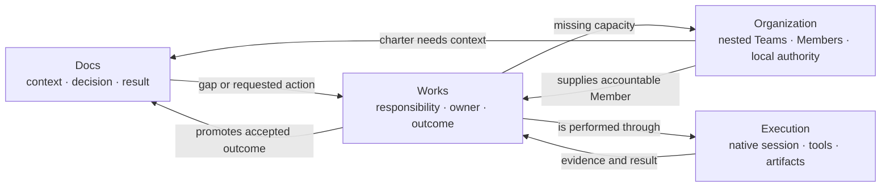

# AgentOS self-hosting dogfood loop

```text
status: canonical operating contract
owner_role: AgentOS Lead
canonical_for: using recursive Organization, Docs, and Work to continuously develop AgentOS itself
```

## Dogfood means operating through the product

AgentOS dogfood is not a scripted demo or one fixed `Docs -> Work -> Docs`
pipeline. The team building Star Harness must use Company OS as its normal
operating system:

- durable Members and nested Team authority are visible in Organization;
- context, decisions, specifications, and accepted results live in Docs;
- responsibility, lifecycle, blockers, review, and outcomes live in Works;
- Members perform Work through their provider-native sessions and may create
  child Teams or use internal subagents; and
- every material defect discovered while operating becomes linked Work or an
  explicit accepted exception before the loop continues.

Docs, Work, and Organization are coequal sensors and result surfaces:



## Minimum operating organization

The minimum dogfood organization is deliberately small:

```text
Root AgentTeam
└── AgentOS Lead (Host AgentMember)
    ├── Docs Member
    ├── Work / Product Member
    └── CTO Member
        └── optional child development Team
            ├── implementation Member
            ├── frontend Member
            └── reviewer Member
```

These role names are examples, not schema requirements. The Lead can add or
remove direct Members. Any Member can create unassigned or self-owned Work. A
Member that needs durable parallel ownership may create a child Team and
delegate child Work while remaining responsible for its parent Work.

The current Codex task acts as a **Supervising Operator** during bootstrap. The
Human speaks to it; it can inspect the complete organization, create unassigned
intake Work in an explicit Team, communicate with the Lead, and help recover a
broken path. It is not silently inserted into the Team and does not replace the
Lead. The Lead's identity, Work, child Teams, native session, and history outlive
this conversation.

The deterministic **Runtime Supervisor** is technical infrastructure. It owns
leases, delivery, retry, recovery, health, and Close. It does not decide Work
priority, assignment, acceptance, or company structure.

## Simple authority model

Routine scheduling authority follows Team topology:

- ordinary Member: create unassigned or self-owned Work in its current Team;
- Team Host: assign and accept Work for direct Members;
- child Team Host: administer only its child Team;
- Supervising Operator: global read and unassigned intake, not routine assign
  or acceptance; and
- Human: supplies root intent and only the exceptions selected by product
  policy.

Sensitive business effects such as payments, legal submissions, credentials,
and irreversible external actions may still require Approval. Ordinary software
development, Docs maintenance, task decomposition, provider execution, and
child-Team creation should not be slowed by a universal permission bureaucracy.

## Continuous operating loop

Each Team Host repeats the same local loop:

1. **Observe native truth.** Read Docs, Works, Team capacity, runtime health,
   code/project bindings, and relevant external gateways.
2. **Judge.** Decide whether the observation is noise, a direct low-risk fix,
   new Work, a child Team need, or a Human exception.
3. **Record responsibility before substantial execution.** Create Work with
   source refs, context, completion criteria, and appropriate owner.
4. **Delegate at the lowest useful level.** Assign direct Members, leave
   claimable Work unassigned, or create child Work inside a child Team.
5. **Execute through the smallest honest path.** A Member may work directly,
   use internal subagents, or host a child Team.
6. **Review and promote.** Team Host accepts or requests changes. Parent Member
   integrates child results and submits parent Work upward.
7. **Re-observe.** New gaps become the next Work, not hidden chat memory.

This loop runs at every level, not only at the root Lead. Every Member may
create self-owned or unassigned follow-up Work. A Member that Hosts a child
Team may assign discovered Work to direct children. The root Lead therefore
receives integrated outcomes and material escalation instead of becoming the
only source of new tasks.

Mission/Wave is optional. Use it when the Lead needs durable long-horizon
intent, material re-plan history, multi-Team context, or closeout. The Works
board remains the scheduling surface.

## Runtime recovery during dogfood

AgentMember identity and unfinished Work remain stable while runtime generation
changes:

- UI or Docs projection changes do not require a restart;
- same-contract process failure resumes the same MemberRun and compatible
  provider-native session after fencing the previous driver;
- adapter, protocol, permission, model/effort, or Plugin contract changes use a
  controlled drain/interrupt before starting a new generation;
- an incompatible native session stays as historical evidence and a new native
  session is bound; and
- two runtime generations never drive the same writable Workspace at once.

After restart, acceptance checks Member identity, current Work/version,
queued Work deliveries and Messages, Team topology, provider controls, native
session binding, and Workspace lease. The Team Host decides whether Work
continues, is reassigned, or is cancelled.

## Product and UI acceptance

The Store-live product must let the Human and Supervising Operator:

- see the real root Team and recursively expand every child Team;
- open every Member and distinguish organizational identity from runtime state;
- see assigned and unassigned Work for each Team and globally;
- create unassigned intake Work in an explicit Team;
- trace parent Work through child-Team delegation and back to the accepted
  result;
- read Work-linked questions, blockers, review messages, and deliveries;
- inspect native session/runtime evidence without duplicating provider
  transcript truth; and
- navigate among Docs, Work, Org, GitHub/project binding, and execution without
  losing Company, Execution Space, or Project context.

No fixture-only Agent, invented availability state, arbitrary first-row
relation, or hidden local task list counts as dogfood evidence.

## What counts as a successful cycle

A cycle is accepted only when native state can reconstruct:

- the originating observation and related Docs or records;
- the Work, Team scope, creator, assignee, and completion criteria;
- any parent/child Work and nested Team delegation;
- Work-linked coordination and material blockers;
- provider-native execution and useful evidence;
- Host review and accepted result;
- the promoted Docs/Work/Org update; and
- any new Work revealed by the result.

One successful path proves one slice. Healthy dogfood means several real paths
keep running without hidden spreadsheets, ad hoc chat-only assignments, manual
JSON repair, or the Supervising Operator doing all implementation itself.

## Current implementation truth

Current Company Store data and UI still expose `StandingAgent`, `OrgUnit`,
Company `WorkItem`, Company Assignment, and explicit
`StandingAgent.execution_agent_member_ref` compatibility structures. Existing
dogfood runs prove parts of provider sessions, Work delivery, Message delivery,
recovery, and Company Actions, but they do not prove the recursive Organization
target.

The next dogfood acceptance must therefore use a fresh explicit slice:

1. root Lead creates or assigns parent Work to a CTO Member;
2. CTO creates a child Team and delegates at least two child Works;
3. child Members communicate and submit results through native sessions;
4. CTO reviews, integrates, and submits the parent Work;
5. Lead accepts it;
6. Docs and the global Works view receive the result; and
7. Organization reconstructs the exact Team tree without compatibility
   identity inference.
8. Child execution and review create new self-owned and unassigned/delegated
   follow-up Works, proving that the next cycle arises from actual operation.

Until that path passes Store, CLI/API, Dashboard, recovery, and provider-live
checks, [ADR 0052](../decisions/0052-nested-agent-teams-are-the-agent-organization.md)
remains an accepted target rather than an implemented claim.
