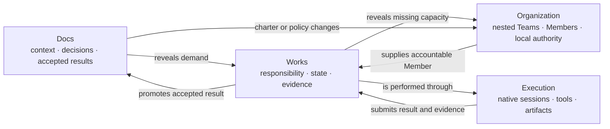

# Collaboration and Agent Work

```text
status: canonical Company OS contract
owner_role: product
canonical_for: Work, Message, recursive delegation, result promotion, and execution boundary
```

## One small collaboration model

Company OS collaboration uses four concepts:

```text
Team topology = who may administer whom
Work          = responsibility and lifecycle
Message       = communication and clarification
Execution     = how a Member actually performs Work
```

Organization is the persistent projection of recursive Agent Teams. It does
not place a separate StandingAgent scheduler, Company Assignment router, or
Supervisor assignment layer in front of Team Works.

## Work owns responsibility

`Work` is the shared responsibility kernel for Agent Team and Organization. It
records context, completion criteria, Team scope, optional assignee, state,
parent/child relation, source relations, evidence, and outcome.

Responsibility changes only through Work operations:

- create unassigned or self-owned Work;
- assign or release;
- atomically self-claim eligible unassigned Work;
- start, block, resume, submit, request changes, accept, cancel; and
- create child Work when delegating owned responsibility.

The Team Host manages all Work in its direct Team. An ordinary Member may
create unassigned Work, self-owned Work, and child Work beneath Work it owns.
It cannot force assignment to a same-level peer. When it creates a child Team,
it becomes that Team's Host and may assign child Work to direct child Members.

## Message owns conversation

`TeamMessage` carries authored Markdown conversation:

- question / answer;
- progress or context;
- blocker;
- review discussion;
- coordination; and
- steer or interrupt intent when backed by the selected provider mode.

A Message may link `work_id`, correlation, reply lineage, and response intent.
It never creates ownership or changes Work status. There is no Assignment
Message. A Host that wants a Member to do something creates or assigns Work;
it may then send a short Work-linked Message when explanation is useful.

Provider-native questions or approvals that truly pause a turn remain
`PendingInteraction`. Work delivery and Message delivery are durable transport
records, not responsibility objects.

## Agent Team and Subagent boundary

An AgentMember owns end-to-end Work. It may use provider-native subagents as an
internal implementation technique. Those subagents do not automatically become
Organization Members, child Teams, or separately accountable actors.

Create a child AgentTeam when the parent Member needs durable independent
owners, direct conversation, separate Works, reusable sessions, or explicit
review. Use a subagent when the parent Member can safely retain all ownership,
integration, evidence, and acceptance responsibility.

## Parent and child collaboration

Consider one development Work assigned to a CTO Member:

```text
Root Team / W0: ship nested Organization
  assignee: CTO

CTO child Team
  W1: schema and store       -> Runtime Engineer
  W2: recursive UI           -> Frontend Engineer
  W3: independent acceptance -> Reviewer
```

The Runtime Engineer may ask the Frontend Engineer a Work-linked question.
The Reviewer may block W3 and explain the issue by Message. The CTO sees all
child Work and conversation because it Hosts the child Team. It decides what
to integrate, requests changes where necessary, and submits W0 upward. The root
Lead does not need every child chat turn; it needs W0 status, material blockers,
and the integrated result.

This is how hierarchy reduces communication: decisions stay at the lowest Team
that has enough context and authority. Accountability still rolls upward
through parent Work.

## Self-evolution through Work discovery

Every Lead, lower Host, and ordinary Member is expected to discover new Work
while operating. A result may reveal a defect, a review may reveal a missing
check, a Document may reveal an absent policy, and a runtime failure may reveal
recovery work. These observations must not disappear into chat.

The Member creates a provenance-backed Work row and chooses the narrowest legal
placement: self-owned, unassigned in its current Team, or assigned to a direct
child in a Team it Hosts. Anything requiring a peer, ancestor, sibling, or
broader Team remains unassigned or is raised to the appropriate Host by a
Work-linked Message.

This recursive loop gives the company self-evolution without creating a free
assignment graph. Work makes demand durable; topology contains authority;
Messages explain ambiguity; Hosts prioritize and accept.

## Docs, Work, and Organization

Docs, Work, and Organization are related views of one operating loop, not a
fixed pipeline:



Finance, Approval, Milestone, BusinessModule, external gateway, GitHub, and
Mission relations attach to Work through typed references. They do not create
a second assignment lifecycle.

Existing Company `WorkItem` remains implementation compatibility truth until
the Work-kernel migration is explicit. No feature may silently dual-write Team
Work and Company WorkItem or infer that one status transition completed the
other.

## Supervising Operator boundary

A Supervising Operator may read all visible Teams, Work, Messages, and runtime
health; communicate with the Lead; and create unassigned intake Work in an
explicit Team. It cannot impersonate a Member, assign routine Work to peers,
accept Team Work, or become a hidden organizational node.

The Operator is therefore useful for Human intake and dogfood recovery without
becoming the day-to-day scheduler. The Lead and lower Team Hosts continue
working when the current Operator conversation ends.

## Runtime and recovery

AgentMember identity and Work survive provider process loss. For an unfinished
Work item:

1. the durable Runtime Supervisor detects loss and fences the old driver;
2. queued Work deliveries and Messages remain durable;
3. a compatible native session resumes under the same MemberRun, or a new
   native session is bound while the old one remains evidence;
4. no delivery is silently ACKed or replayed twice; and
5. the Team Host decides whether to continue, reassign, or cancel Work.

Runtime recovery does not create a new company identity or alter Team topology.

## Product surfaces

| Surface | Primary question | Native truth |
| --- | --- | --- |
| Organization overview | Who Hosts whom, and where is capacity or blocked Work? | recursive Teams, Members, global Works, runtime state |
| Team War Room | What does this Team own and what needs Host judgment? | Works, Members, Messages, reviews, deliveries |
| Member Focus | What am I responsible for and what am I doing? | assigned Works, native session, linked Messages, child Team |
| Docs | What context or accepted result should persist? | Documents, Blocks, records, Work relations |
| Global Works | What is unassigned, active, blocked, in review, or complete across the organization? | Work kernel grouped by Team path |

UI may reuse cards, avatars, conversation, activity, artifacts, and composers,
but it must preserve these object boundaries. A chat bubble is not a Work row;
a runtime badge is not organizational authority; a child Team is not a native
subagent group.

## Mission and Wave

Mission/Wave remains a useful optional control plane for durable outcome,
multi-Team context, material re-plan, and closeout. It is not required for
ordinary Organization Work and is not replaced by the Works board:

- Mission explains the durable objective;
- Wave records the Host's current plan and judgment;
- Work records current responsibility and state; and
- Message records conversation.

## Acceptance

This collaboration model is accepted only when native state can reconstruct:

- Team ancestry and the Host at every level;
- Work creator, assignee, parent Work, state, and acceptance authority;
- questions, blockers, and review discussion as Work-linked Messages;
- execution through resolvable provider-native sessions;
- parent accountability after child delegation;
- recovery without duplicate execution or lost delivery; and
- the accepted result returned to related Docs or business records.

See [Nested Agent Team organization](nested-agent-team-organization.md),
[ADR 0050](../decisions/0050-agent-team-work-board-and-message-boundary.md),
and [ADR 0052](../decisions/0052-nested-agent-teams-are-the-agent-organization.md).
