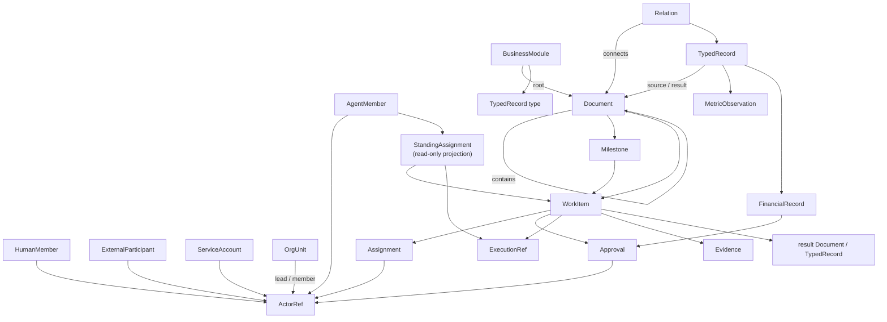

# Company OS Concept Model

## Status and scope

This document defines the target product model for Star Harness as an AI
Company Operating System. It is additive to the current execution substrate:
Mission/Wave, Agent Team, Dynamic Workflow, Host, and provider objects retain
their own execution contracts.

The product centre is:

```text
Documents + mixed human/Agent organization
  -> WorkItems, approvals, evidence, metrics, and financial records
  -> selected execution foundation
  -> results written back into the relevant documents and records
```

A WorkItem may choose a structured executor, but its business intent,
responsibility, and document connection remain meaningful without one.

## Core relationship map



## Participants and organization

### ActorRef

`ActorRef` is a typed reference used wherever a person, Agent, external
collaborator, or service can participate:

```text
actor_type = human | agent | external | service
actor_id
```

It is a reference, not an identity record. It lets a WorkItem record who
submitted, requested, owns, executes, reviews, or approves work without
pretending all participants have the same lifecycle.

### HumanMember

A durable internal human participant. It holds identity, title, organization
membership, responsibilities, permissions, availability, and membership state.
Human participation is required for policies that explicitly demand human
authority, such as funds movement, legal filing, organization changes, or
credential delegation.

### AgentMember

A durable standing Agent identity. Existing AgentMember capabilities remain
valid: provider/model configuration, prompts, skills, permission posture,
runtime/session links, and delivery lifecycle. The Company OS additionally
needs a business profile separate from provider runtime state:

```text
org_unit_id?
responsibility_summary
availability = available | busy | paused | offline | unknown
assignment_capacity: integer | null
exclusive_assignment_ref: string | null
```

`availability` is an explicit business declaration. It must never be inferred
from `AgentMember.status`, process liveness, provider sessions, or message
history. Runtime state answers whether an execution substrate is healthy;
availability answers whether the Agent may accept business work.

### ExternalParticipant and ServiceAccount

An `ExternalParticipant` represents a bounded outside collaborator, such as a
lawyer, accountant, supplier, or contractor. A `ServiceAccount` represents a
non-human/non-Agent system identity, such as a finance integration. Both use
`ActorRef`, but neither gains an internal Agent runtime or human approval power
merely by being referenced.

### OrgUnit

An `OrgUnit` is a durable business grouping:

```text
id
name
purpose
parent_unit_id?
lead_actor_ref?
member_actor_refs[]
policy_refs[]
created_at / updated_at
```

The first release can be flat (`Company -> members`). `parent_unit_id` permits
later departments and sub-teams without changing member identity. An OrgUnit
may contain Humans, Agents, and approved external participants. Its lead can
be a Human or Agent only when policy permits; required human approvals remain
typed policy requirements, not a title convention.

## Documents, business modules, and company knowledge

### Document and Block

A `Document` is a durable page in the company knowledge system. It has a title,
Block representation, parent document or space, document kind, permission
policy, lifecycle state, templates, references, and audit metadata. Documents
contain intent, context, decisions, synthesized outcomes, and human-readable
operating knowledge. They are the normal entry point for company work.

`Block` is the basic, freely editable document capability: rich text, headings,
lists, checklists, callouts, code, media, attachments, simple tables, comments,
mentions, and embedded standard views. A simple table belongs to the Document;
it becomes structured business data only when a Module defines the appropriate
TypedRecord type and Relation contract.

Documents should not persist provider thinking, raw private chain-of-thought,
or noisy transient runtime logs. They may reference concise, reviewable
summaries, artifacts, evidence, and the source records that support them.

### BusinessModule

A `BusinessModule` defines a reusable business area, such as delivery,
content operations, finance, or trademark management. It owns a root document,
templates, allowed TypedRecord types, relation rules, default views, policy
refs, lifecycle rules, and expected metric definitions.

Creating a module is a governed design action, not merely creating a folder.
The Module Design must specify at least the document structure, records,
relations, financial linkage, work/approval rules, permissions, and archival
policy. The Document Architecture Agent may propose it; applicable governance
and human gates approve it.

### TypedRecord, Relation, View, and custom-page package

`TypedRecord` is structured business data owned by a Module. Its minimum
envelope is:

```text
id
module_id
record_type
title
fields
lifecycle_status
source_document_ref?
created_by / updated_by ActorRef
created_at / updated_at
```

The `fields` payload is type-specific. The generic core keeps the envelope and
relation mechanism domain-neutral; a module or adapter owns domain schemas such
as trademark applications, content assets, or milestone-specific records.

`Relation` joins two typed targets without duplicating their facts:

```text
from_ref
relation_type
to_ref
provenance_ref?
created_by ActorRef
created_at
```

`View` is a saved presentation/query over Documents, TypedRecords, Relations,
WorkItems, Metrics, or FinancialRecords. Table, board, timeline, calendar,
chart, and dashboard are view modes over the same source data; a view never
becomes the canonical record.

A `CustomPageDefinition` is the governed registration for an optional
module-owned core surface. It declares purpose, allowed data queries, approved
UI components, Action Commands, standard-view fallback, owner, package version,
fixture, and visual contract.

A `CustomPagePackage` is the versioned HTML/React implementation artifact
referenced by that definition. Package code may compose declared sources but
owns no business facts and has no direct store mutation capability. The action
boundary validates permissions, policy, audit, relation integrity, and required
Approval before a state change occurs. A package failure cannot make its
underlying Document or TypedRecords inaccessible.

## Work, responsibility, and approval

### Milestone

A `Milestone` is the only durable grouping layer above WorkItems. It describes
one stage outcome, accountable owner, target time, acceptance criteria, source
Document or BusinessModule, and contributing WorkItems. The product has no
separate canonical Project object.

A Milestone is not a Mission Wave. Milestone answers which company outcome a
set of WorkItems must achieve; Wave answers how one optional long-running
execution is ordered.

### WorkItem

A `WorkItem` connects document intent to accountable execution. It is a
product-level business record and does not carry executor-internal dependency
or workspace semantics.

```text
id
title / objective / status
source_document_ref
milestone_ref?
work_type
submitted_by ActorRef
requested_by ActorRef?
accountable_owner ActorRef
assignee_refs[]
contributor_refs[]
reviewer_ref?
approver_ref?
execution_ref?
result_document_ref?
result_record_refs[]
evidence_refs[]
created_at / updated_at
```

The role fields are intentionally distinct:

- `submitted_by`: formally entered the WorkItem into the system.
- `requested_by`: originated the business need, when different.
- `accountable_owner`: owns the business outcome.
- `assignee_refs`: direct executors.
- `contributor_refs`: collaborators without primary delivery ownership.
- `reviewer_ref`: evaluates quality or completeness.
- `approver_ref`: authorizes a controlled action or acceptance.

### Assignment

An `Assignment` is the durable, deliverable act of asking an Actor to work. It
contains the WorkItem, recipient ActorRef, sender ActorRef, delivery state,
delivery policy, assigned role, correlation, timestamps, and optional scope.

An assignee field alone is never proof of delivery. For Agent recipients, the
existing Message/TeamMessage delivery contract remains the execution proof and
may materialize an Assignment. For Human and external recipients, delivery may
be acknowledged through an approved notification or collaboration channel, but
the resulting Assignment state must remain durable and auditable.

### Approval

An `Approval` is a first-class controlled decision about any subject reference.
It records requested action, required actor type or policy, requester,
designated approver(s), status, decision, rationale, evidence refs, timestamps,
and escalation/deadline details where relevant.

High-risk policies can require `actor_type=human`. An Agent may prepare,
review, or recommend a decision but cannot satisfy a required-human approval.

### ExecutionRef

`execution_ref` is a typed reference from a WorkItem to a selected execution
attempt. It may reference a Mission/Wave, AgentTeamRun, WorkflowRun, Host
execution record, or a documented human/external execution. It does not make
that executor the owner of the WorkItem or the source of business truth.

## Evidence, metrics, and finance

### Evidence

Evidence is a reviewable pointer to supporting material with source, summary,
provenance, and timestamps. It may support a Document, TypedRecord, WorkItem,
Approval, MetricObservation, FinancialRecord, or execution outcome. Thinking
remains excluded from Evidence.

### MetricDefinition and MetricObservation

`MetricDefinition` specifies what is measured, unit, aggregation, source
method, owner, and update policy. `MetricObservation` records a measured value,
time range, source/evidence, and relevant typed relations. Metrics are
structured records, then rendered into documents and dashboards as linked
views. For example, a video page can display its playback and engagement
observations while an operating dashboard aggregates the same observations.

### FinancialRecord

A `FinancialRecord` is an auditable structured record:

```text
type = budget | commitment | invoice | payment | refund
amount / currency
status
submitted_by ActorRef
approval_ref?
evidence_refs[]
```

Relations link it to the relevant BusinessModule, Milestone, source document,
and typed records. A trademark application therefore links to its fee records;
the trademark page and finance reporting are views of the same records, not
copies of an amount typed in two places.

## StandingAssignment projection

`StandingAssignment` is a read-only Agent-centric projection. It answers which
explicit work contexts a durable Agent is actively serving across modules and
execution modes. It is not another executor.

```text
id
agent_member_id
source_kind = work_item | mission_wave | workflow_participation | direct_assignment
source_ref
title
role
status
assigned_at
last_activity_at?
navigation_target
```

Projection rules:

- WorkItem assignments require an explicit Assignment addressed to that Agent.
- Mission/Wave participation requires an explicit durable Agent link, such as
  `MemberRun.agent_member_id`; never infer it from name, role, provider, model,
  or timing.
- Workflow participation requires an explicit recorded member/session owner.
- Direct conversation is activity, not an Assignment.
- Retries are execution lineage for one source assignment, not duplicate active
  business work.
- Missing links remain missing and produce no StandingAssignment.

## Invariants

1. Every responsibility, approval, comment, or record provenance reference is
   an ActorRef with a valid actor type.
2. A human, Agent, external participant, and service account retain distinct
   identities and lifecycle; no runtime state grants human authority.
3. A WorkItem always has a source document and accountable owner; it does not
   require an execution reference at creation.
4. Assignment delivery is durable; changing an assignee list is insufficient
   to claim an Agent received work.
5. Only explicit, typed links create StandingAssignment rows.
6. Document pages, reports, and views derive financial and metric facts from
   linked structured records rather than duplicated values.
7. Financial, legal, organization, permission, and other governed actions
   have policy-selected Approval trails and evidence appropriate to risk.
8. Documents and Evidence retain explicit summaries, artifacts, decisions, and
   outcomes, never private provider thinking.
9. A new BusinessModule declares its required cross-module relations before it
   becomes an operating surface.
10. A custom page is a declared presentation package: it reads only allowed
    data sources, requests only governed Actions, and has a standard-view
    fallback.
