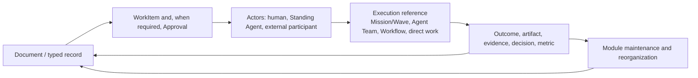

# Document System

```text
status: canonical product contract
owner_role: product
canonical_for: document-driven company knowledge, action, and reorganization
```

## Purpose

Docs are the AI Company OS's default work surface: the durable place where the
company understands a subject, records its decisions, starts work, receives
results, and sees the current state of the business. They are not a passive
wiki and they are not a replacement for the execution substrate.

A Notion-like experience is the intended interaction model: people can write
rich pages, nest pages, embed tables and views, and move from a company-level
dashboard to progressively more specific business context. The product copies
that clarity of use, not Notion's assumption that every surface must be
manually assembled from generic blocks. Its underlying model must preserve
ownership, relationships, permissions, evidence, and auditability while
allowing an Agent to compose a purpose-built core page when the business needs
one.

## Operating loop



Every action that matters begins from a document or a typed record with enough
business context to explain *why* it exists. Results return to that source and
to every related record; a result is not complete merely because an executor
reported success. The execution reference establishes how bounded work ran; it
does not replace the WorkItem's accountable owner or its source context.

## Core primitives

| Primitive | Role | Examples |
| --- | --- | --- |
| `Document` | A durable rich page and contextual container. | Company home, brand strategy, trademark application brief. |
| `DocumentSpace` | A navigable business area with ownership, policy, and a page hierarchy. | Brand & IP, Finance, Content Operations. |
| `Block` | A composable unit within a document. Blocks may be rich text, list, checklist, callout, code, media, attachment, simple table, embed, metric, decision, WorkItem, or relation summary. | A decision callout, meeting notes table, KPI chart, embedded payment table. |
| `TypedRecord` | A strongly typed business fact with a stable identity, fields, lifecycle, and audit trail. | `TrademarkApplication`, `FinancialRecord`, `WorkItem`, `Approval`. |
| `Relation` | A typed, directional or bidirectional link between durable objects. It avoids copied facts and lets one change be visible in all relevant contexts. | Application `incurs` payment; WorkItem `originates_from` document. |
| `View` | A filtered, sorted, grouped, or visual presentation of documents or records. A view never creates a second source of truth. | Board, timeline, finance roll-up, milestone dashboard. |
| `BusinessModule` | A governed package of a recurring domain's record types, relations, policies, standard views, and optional custom pages. | Trademark Management, Content Operations. |

Documents contain Blocks and can reference or host Views. TypedRecord types
define collections of business facts. Relations join these objects across
spaces. A page may look free form while its important business facts remain
typed, relational, and auditable.

## Three page capabilities

The system deliberately has three levels of composition, all backed by the
same substrate.

| Level | Composition | Appropriate use |
| --- | --- | --- |
| Basic document | Rich `Block`s, nested pages, attachments, comments, mentions, and simple tables. | Notes, research, meeting records, SOPs, and one-off plans. |
| Structured document | Standard `View`s and relation-aware blocks over TypedRecords. | Milestone plans, application lists, approval queues, budget details, and recurring operating pages. |
| Custom page | A module-registered HTML/React composition using approved components, queries, and actions. | Company home, finance cockpit, organization map, and a domain control centre. |

Basic documents must remain fast to create and edit; a local simple table is
document content, not a hidden business database. Structured documents provide
the common Notion-like table, board, timeline, calendar, chart, and related
record experiences over durable records. A custom page is reserved for a
stable, high-value surface that must make several kinds of information and
actions legible together.

## Custom pages are presentation, never the system of record

A `BusinessModule` may register a custom page when standard blocks and views
no longer make a core operating surface clear. The page may be generated or
maintained by an Agent, but its code is a constrained presentation package:

- it reads through declared queries and Views, then composes approved UI
  components in HTML/React;
- it cannot persist business facts in page state, duplicate a record as its
  own source of truth, or write directly to a store;
- every mutation is a named, policy-checked Action Command, which validates
  permissions, relation rules, audit requirements, and any Approval policy;
- it exposes navigation to the underlying Document and TypedRecords; and
- a missing, failed, or withdrawn custom page falls back to the module's
  standard Document and View experience without losing data.

For example, a Trademark Management home may place application metrics, a
filing table, deadlines, related WorkItems, required Approvals, and Finance in
one layout. Its "submit filing" button requests a governed Action; it never
directly changes application status or moves money.

## Documents are company memory, not a log dump

Company knowledge includes reviewed documents and typed records, explicit
WorkItems and Assignments, Approvals, decisions, final outputs, evidence, and
meaningful metrics. A document should preserve the rationale and outcome of
work, not every transient event that occurred while producing it.

The following never become authoritative company knowledge merely by appearing
in a stream:

- ordinary chat or an unaddressed message;
- raw provider transcripts, private model reasoning, or token streams;
- inferred responsibility from matching names, sessions, or timing; and
- copied totals or status text when a related typed record is the source.

Sanitized live thinking, when available, is transient and non-replayable. It
cannot be evidence, approval, accountability, or a document update.

## Work and result contract

A Document or TypedRecord may create a `WorkItem`, but it does not make every
paragraph a task. A WorkItem must retain its `source_document` or source record
and identify the business question, desired outcome, accountable owner,
participants, status, result location, and supporting evidence. Assignments,
reviews, and approvals remain explicit and may refer to humans, Standing
Agents, constrained external participants, or an execution reference.

The executor may be direct human or Agent work, or a reference to a
Mission/Wave, Agent Team, Dynamic Workflow, or host execution. Those objects
keep their own lifecycle semantics. A completed run updates the WorkItem and
its source document only through an explicit result/update action; it must not
silently become the company's final decision or record.

## Relationships and shared views

Relations are a first-class design requirement. They express business links
such as:

```text
Document --describes--> TypedRecord
WorkItem --originates_from--> Document
WorkItem --accountable_to--> Actor
WorkItem --executed_by--> execution reference
TypedRecord --requires--> Approval
FinancialRecord --allocated_to--> BusinessModule / Milestone / Brand / legal matter
MetricObservation --measures--> release / campaign / Milestone
```

Views must render the linked source record rather than replicate it. For
example, a trademark application's page may embed its related budget,
commitment, invoice, and payment records. Finance can independently aggregate
the same records by period, Milestone, brand, or legal matter. Updating the
payment status changes both views without manually editing two documents.

## Spaces, navigation, and dashboards

`DocumentSpace` provides a home for a durable business domain, not merely a
folder. It defines its owner(s), permitted participants, default templates,
record types, relation rules, and archival policy. Spaces may nest when that
clarifies ownership, but a relation is preferred over duplicating a record into
multiple folders.

The company home is itself a composite document and dashboard: it can embed
views for priorities, milestone progress, financial health, key metrics,
approvals, and organizational availability. Milestone progress, finance, and
work management therefore have dedicated typed data and richer dedicated
views, while remaining usable from the document where their business context
lives. They are neither isolated apps nor unstructured prose.

## Growth and reorganization

New business activity is not automatically filed under the nearest existing
folder. When a new domain appears, the system evaluates whether an existing
space, record type, relation, and template can safely contain it. If not, the
next step is a Module Design proposal, not an orphaned page.

The Docs Governance Agent may inspect orphaned pages, duplicate
structures, oversized documents, broken relations, missing source links,
obsolete templates, and new recurring work patterns. It may propose a move,
split, merge, new space, record type, template, relation, standard View, or
custom-page package. It must state
the impact and migration plan, preserve provenance, and never silently erase
history or rewrite existing records.

Low-risk, reversible organization changes may follow the applicable space
policy. Changes that alter permissions, financial controls, legal records,
retention, shared schemas, automation scope, or organization-wide structure
require the appropriate explicit Approval, often including a human approver.

## Boundaries

- Mission/Wave and other executor objects remain canonical for their execution
  semantics; Docs store stable references to them rather than absorbing them.
- No view, dashboard, or Agent activity feed may invent a relation, assignment,
  approval, financial total, or source document that has not been recorded.
- Custom page code is presentation only: it reads declared data and issues
  governed Actions; it cannot become an alternate store or bypass policy.
- Documents and record relations obey permission and retention policy even when
  they are embedded in another page.

See [Module Design](module-design.md) for the mandatory design contract when a
new business domain needs its own document structure.
