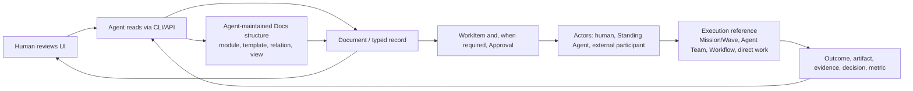

# Document System

```text
status: canonical product contract
owner_role: product
canonical_for: document-driven company knowledge, action, and reorganization
```

## Purpose

Docs are the AI Company OS's durable company memory and business-structure
system. They are the place where the company understands a subject, records
decisions, starts work, receives results, and sees the current state of the
business. They are not a passive wiki, not a human-first Notion clone, and not
a replacement for the execution substrate.

The product stance is **Agent-operated, Human-reviewed**:

- Agents are the primary maintainers. They read, edit, reorganize, and verify
  Docs through CLI/API plus procedural skills.
- Humans are the primary reviewers. They use the UI to inspect structure,
  relationships, status, evidence, risks, and Agent-authored changes.
- The UI may expose necessary low-risk editing affordances, but rich manual
  editing is not the main product interface. The authoritative machine
  interface is CLI/API.
- Core business pages are not assembled primarily by Humans through a generic
  editor. Agents may scaffold and maintain code-declared custom pages over the
  Docs substrate when a business module needs a purpose-built UI.

A Notion-like experience is the intended interaction model: people can write
readable pages, inspect nested pages, review tables and views, and move from a
company-level dashboard to progressively more specific business context. The
product copies that clarity of use, not Notion's assumption that every surface
must be manually assembled by humans from generic blocks. Its underlying model must preserve
ownership, relationships, permissions, evidence, and auditability while
allowing an Agent to compose a purpose-built core page when the business needs
one. This product decision is recorded in
[ADR 0036: Agent-operated Docs and Code-declared Pages](../decisions/0036-agent-operated-docs-and-code-declared-pages.md).
The current implementation status of each Docs surface is tracked in the
[Docs operating surface matrix](docs-operating-surface-matrix.md).

## Interface priority

Docs implementation priority is:

```text
1. Schema, Store, Action, and projection truth
2. CLI/API query, write, governance, and verification capability
3. Agent skill procedures that choose safe commands and verify results
4. Acceptance checks and native evidence
5. Code-declared custom page contracts for core business pages
6. UI that lets Humans review structure, status, relations, risk, and outcomes
7. Minimal UI action affordances for necessary low-risk operations
8. Full rich collaborative editing and drag/drop polish
```

This means a capability is product-real first when an Agent can operate it
through governed CLI/API and prove the Store effects. UI support follows to make
that truth understandable to Humans. UI-only editing is not enough to claim a
Docs capability is implemented.

## Storage and read model

The current canonical Docs Store is append-only JSONL ledgers with latest-row
projections. It is intentionally inspectable while object contracts and governed
Actions are still evolving.

SQL is the planned derived read/query/index layer, not the current canonical
write Store. It should serve Agent-facing query/search/view/health/diff/export
needs after the CLI/API read contracts stabilize. A SQL row may speed up a
query, but it must be rebuildable from the canonical ledgers and must not
authorize a write by itself. The governing decision is
[ADR 0035: Company OS SQL Read Model](../decisions/0035-company-os-sql-read-model.md).

## Operating loop



Every action that matters begins from a document or a typed record with enough
business context to explain *why* it exists. Results return to that source and
to every related record; a result is not complete merely because an executor
reported success. The execution reference establishes how bounded work ran; it
does not replace the WorkItem's accountable owner or its source context.

The normal operating cycle is:

```text
Human reviews UI
  -> Agent queries exact Docs truth through CLI/API
  -> Agent performs governed CLI/API mutation when needed
  -> Agent verifies Store rows and side-effect boundaries
  -> UI renders the updated truth for Human review
```

## Core primitives

| Primitive | Role | Examples |
| --- | --- | --- |
| `Document` | A durable rich page and contextual container. | Company home, brand strategy, trademark application brief. |
| `DocumentSpace` | A navigable business area with ownership, policy, and a page hierarchy. | Brand & IP, Finance, Content Operations. |
| `Block` | A composable unit within a document. Blocks may be rich text, list, checklist, callout, code, media, attachment, simple table, embed, metric, decision, WorkItem, or relation summary. | A decision callout, meeting notes table, KPI chart, embedded payment table. |
| `TypedRecord` | A strongly typed business fact with a stable identity, fields, lifecycle, and audit trail. | `TrademarkApplication`, `FinancialRecord`, `WorkItem`, `Approval`. |
| `Relation` | A typed, directional or bidirectional link between durable objects. It avoids copied facts and lets one change be visible in all relevant contexts. | Application `incurs` payment; WorkItem `originates_from` document. |
| `View` | A filtered, sorted, grouped, or visual presentation of documents or records. A view never creates a second source of truth. | Board, timeline, finance roll-up, milestone dashboard. |
| `BusinessModule` | A governed package of a recurring domain's record types, relations, policies, standard views, and optional custom pages. | Trademark Management, Content Operations. |

Documents contain Blocks and can reference or host Views. TypedRecord types
define collections of business facts. Relations join these objects across
spaces. A page may look free form while its important business facts remain
typed, relational, and auditable.

## Three page capabilities

The system deliberately has three levels of composition, all backed by the
same substrate.

| Level | Composition | Appropriate use |
| --- | --- | --- |
| Basic document | Rich `Block`s, nested pages, attachments, comments, mentions, and simple tables. | Notes, research, meeting records, SOPs, and one-off plans. |
| Structured document | Standard `View`s and relation-aware blocks over TypedRecords. | Milestone plans, application lists, approval queues, budget details, and recurring operating pages. |
| Custom page | A module-registered HTML/React composition using approved components, queries, and actions. Agents can scaffold, verify, and publish its PageDefinition/PagePackage metadata. | Company home, finance cockpit, organization map, trademark console, and a domain control centre. |

Basic documents must remain fast to create and inspect; a local simple table is
document content, not a hidden business database. Structured documents provide
the common Notion-like table, board, timeline, calendar, chart, and related
record experiences over durable records. A custom page is reserved for a
stable, high-value surface that must make several kinds of information and
actions legible together.

## Custom pages are presentation, never the system of record

A `BusinessModule` may register a custom page when standard blocks and views
no longer make a core operating surface clear. The page may be generated or
maintained by an Agent, but its code is a constrained presentation package:

- it reads through declared queries and Views, then composes approved UI
  components in HTML/React;
- it cannot persist business facts in page state, duplicate a record as its
  own source of truth, or write directly to a store;
- every mutation is a named, policy-checked Action Command, which validates
  permissions, relation rules, audit requirements, and any Approval policy;
- it exposes navigation to the underlying Document and TypedRecords; and
- a missing, failed, or withdrawn custom page falls back to the module's
  standard Document and View experience without losing data.

For example, a Trademark Management home may place application metrics, a
filing table, deadlines, related WorkItems, required Approvals, and Finance in
one layout. Its "submit filing" button requests a governed Action; it never
directly changes application status or moves money.

The first CLI contract for this layer is:

```text
harness company docs page scaffold
harness company docs page verify
harness company docs page publish
```

`page scaffold` creates governed `CustomPageDefinition` and
`CustomPagePackage` metadata for a code-declared page. `page verify` checks the
definition, package, module, fallback View, data-query, action, policy, and
visual-contract boundary. `page publish` records a candidate package artifact
metadata row; it does not switch the active definition package pointer until a
future governed promote/atomic package-switch command exists. These commands
do not generate a second data store and do not make a visual mock an
implemented product claim.

## Documents are company memory, not a log dump

Company knowledge includes reviewed documents and typed records, explicit
WorkItems and Assignments, Approvals, decisions, final outputs, evidence, and
meaningful metrics. A document should preserve the rationale and outcome of
work, not every transient event that occurred while producing it.

The following never become authoritative company knowledge merely by appearing
in a stream:

- ordinary chat or an unaddressed message;
- raw provider transcripts, private model reasoning, or token streams;
- inferred responsibility from matching names, sessions, or timing; and
- copied totals or status text when a related typed record is the source.

Sanitized live thinking, when available, is transient and non-replayable. It
cannot be evidence, approval, accountability, or a document update.

## Work and result contract

A Document or TypedRecord may create a `WorkItem`, but it does not make every
paragraph a task. A WorkItem must retain its `source_document` or source record
and identify the business question, desired outcome, accountable owner,
participants, status, result location, and supporting evidence. Assignments,
reviews, and approvals remain explicit and may refer to humans, Standing
Agents, constrained external participants, or an execution reference.

The executor may be direct human or Agent work, or a reference to a
Mission/Wave, Agent Team, Dynamic Workflow, or host execution. Those objects
keep their own lifecycle semantics. A completed run updates the WorkItem and
its source document only through an explicit result/update action; it must not
silently become the company's final decision or record.

## Relationships and shared views

Relations are a first-class design requirement. They express business links
such as:

```text
Document --describes--> TypedRecord
WorkItem --originates_from--> Document
WorkItem --accountable_to--> Actor
WorkItem --executed_by--> execution reference
TypedRecord --requires--> Approval
FinancialRecord --allocated_to--> BusinessModule / Milestone / Brand / legal matter
MetricObservation --measures--> release / campaign / Milestone
```

Views must render the linked source record rather than replicate it. For
example, a trademark application's page may embed its related budget,
commitment, invoice, and payment records. Finance can independently aggregate
the same records by period, Milestone, brand, or legal matter. Updating the
payment status changes both views without manually editing two documents.

## Spaces, navigation, and dashboards

`DocumentSpace` provides a home for a durable business domain, not merely a
folder. It defines its owner(s), permitted participants, default templates,
record types, relation rules, and archival policy. Spaces may nest when that
clarifies ownership, but a relation is preferred over duplicating a record into
multiple folders.

The current CLI-backed read and authoring primitives cover the first safe
subset: `harness company docs query` returns one read-only Agent operating
context for a Document or BusinessModule over latest projections, including
ordered Blocks, child Documents, templates, TypedRecords, Relations, Views,
scoped health findings, available commands, and explicit side-effect
boundaries; `harness company docs module create` creates a governance-scoped
BusinessModule with a fallback View and optional explicit relation rules such
as Document → TypedRecord `source_for`, `harness company docs page-definition
create` installs a CustomPageDefinition, package, server ActionPolicyDefinition
bundle, and module reference, `harness company docs document create` creates a
scoped child Document, `harness company docs document rename|move|archive`
perform governed structure maintenance by updating the latest Document row
through `document.append` while preserving identity, existing Blocks and
existing references; `move` can change `parent_document_id` without duplicating
the page and rejects parent cycles, while `archive` requires `--confirm` unless
it is a dry-run. `harness company docs template create` creates an
explicit reusable `Document(kind=template)` and can copy ordered Blocks from a
source Document, `harness company docs template status` updates a template's
`lifecycle_status`,
`harness company docs block append` appends a Block and updates the owning
Document's `block_ids`, `harness company docs block update` updates an
existing Block's content/kind/position through `block.append` without changing
Document order, `harness company docs block archive` marks a Block archived in
`Block.content` and removes it from visible Document order without physical
delete, `harness company docs block remove` removes a Block from visible
Document order while preserving the Block row, and the block reorder command
updates `Document.block_ids` order while preserving the exact existing Block set,
`harness company docs typed-record append` creates a source-linked TypedRecord
in a BusinessModule, `harness company docs typed-record update` writes a
governed latest-row update for an existing TypedRecord while preserving its
identity, module, record type, source Document, creator, and creation time,
`harness company docs view create` creates a standard View for that module, and
`harness company docs relation link` creates a scoped active Document ↔
TypedRecord Relation. `harness company docs relation unlink` is lifecycle
archive, not deletion: it writes a new latest Relation row with
`lifecycle_status=archived`, preserves endpoints/type/provenance/creation
metadata, requires `--confirm` unless dry-run, and makes active query/health
projections ignore that Relation. Module and
page-definition creation use the administrative governance envelope and require
a Human `company_os.admin` authority; ordinary document, block, record, view,
and relation writes are governed Action wrappers, not direct store writes. A
Store-live Document Focus page can use the same governed transport to create a
child Document and append structured Blocks. The verified authoring subset is
`rich_text`, `heading`, `callout`, and simple `table`: the UI builds the native
`block.append` command, preserves structured `Block.kind`/`Block.content`, and
also dispatches the required `document.append` update so `Document.block_ids`
remains navigable. Store-backed Document Focus projections render actual
Document Blocks before falling back to fixture explanatory content.
Template creation is non-mutating toward the source page: `--from-document`
copies the source Document's ordered native Blocks into the new template
through governed `block.append` and `document.append` updates, but it does not
change the source Document's identity, kind, block order, references, or
relations. Template lifecycle changes are also scoped: `template status`
accepts only `Document(kind=template)` and updates only that template row's
`lifecycle_status`; archiving or pausing a template does not mutate existing
Documents that already carry its `template_ref`. Child Document creation can preserve a `template_ref` provenance
pointer when the selected template is a template Document. By default this is
provenance-only. The CLI can opt into template Block instantiation with
`--instantiate-template`, and the Store-live Document Focus UI exposes the same
explicit opt-in as a browser Action sequence. Both paths copy the template
Document's ordered native Blocks into the child Document through governed
`block.append` and `document.append` updates. They do not create TypedRecords,
Relations, WorkItems, Approvals, Finance effects, or business acceptance.
When a module declares a Document → TypedRecord relation rule, the Docs UI
shows that policy next to templates and provides the concrete `relation link`
command. The rule is not a template side effect: the child Document,
TypedRecord, and Relation are still separate governed records.
The current Document Focus editor surface includes a governed Block composer:
users can choose paragraph, heading, callout, or simple table Blocks, see empty
Document and template provenance states, explicitly decide whether template
Blocks should be copied, and receive an explicit warning that composer content
becomes company truth only after the relevant Actions are accepted. The composer
now has a first slash-menu affordance for governed Block type selection, visible
native `Document.block_ids` order, an honest disabled
fallback for generated Blocks, governed Up/Down reorder controls for native
Blocks, and explicit permission/error feedback when the governed write path is
unavailable or rejected. Reorder is a scoped `document.append` wrapper: it may
change only `Document.block_ids` order and must preserve the exact Block set.
The Docs Workspace also renders a native template library: template Documents
show their ordered Block counts and the UI copy distinguishes default
`template_ref` provenance from explicit Block instantiation through governed
Actions. Its first search affordance is projection-only: it filters the
operating areas, template Documents, and recent records already supplied to the
page. It is not yet a global full-text index and does not read hidden stores.
The standard
module view exposes the remaining scoped Docs actions:
creating source-linked TypedRecords, creating standard Views, and linking a
Document to an existing TypedRecord through Relation truth. Standard module
views expose provenance for the module scope, native View, source kinds, query
summary, and record count; an empty view means the declared query returned no
records, not that the module or source records were deleted. They also expose
the first saved configuration slice from native `View.query`: mode, filters,
grouping, and sorting for table/board/timeline presentation. That configuration
changes how records are viewed; it does not copy, mutate, approve, or settle the
underlying TypedRecords, WorkItems, Approvals, or FinancialRecords. The canonical module
route is `?surface=docs&module=<business-module-id>`; it renders the Docs-owned
standard module page over native BusinessModule TypedRecords and shows Work,
Approval, Finance, and actor facts only as references. Store-live browser
acceptance for the trademark scenario proves the standard module page can
create a TypedRecord, create a View, and link a Document ↔ TypedRecord Relation
through governed Actions with no WorkItem, Approval, Commitment, or Payment side
effects; the View action can persist table/board/timeline mode plus simple
filter/group/sort query configuration. Fixture and read-only projections must show the contract or disabled
state rather than pretending to write. A collaborative Notion-like rich editor,
drag/drop layout editing layered on the governed reorder Action, full template
instantiation in Store-live browser UI, calendar/chart View modes, inline saved-view editing, advanced field
configuration, and broad document
restructuring commands remain planned
until their own policies and acceptance evidence exist.

The company home is itself a composite document and dashboard: it can embed
views for priorities, milestone progress, financial health, key metrics,
approvals, and organizational availability. Milestone progress, finance, and
work management therefore have dedicated typed data and richer dedicated
views, while remaining usable from the document where their business context
lives. They are neither isolated apps nor unstructured prose.

## Growth and reorganization

New business activity is not automatically filed under the nearest existing
folder. When a new domain appears, the system evaluates whether an existing
space, record type, relation, and template can safely contain it. If not, the
next step is a Module Design proposal, not an orphaned page.

The Docs Governance Agent may inspect orphaned pages, duplicate
structures, oversized documents, broken relations, missing source links,
obsolete templates, and new recurring work patterns. It may propose a move,
split, merge, new space, record type, template, relation, standard View, or
custom-page package. It must state
the impact and migration plan, preserve provenance, and never silently erase
history or rewrite existing records.

The product exposes this as a **Docs Structure Health** review surface at
`?surface=docs&health=structure`. It is an operating review over native
Document, Block, TypedRecord, Relation, View, and BusinessModule projections,
not a cleanup script. The page may show findings such as orphaned parents,
duplicate document titles, missing TypedRecord source Documents, missing
Document ↔ TypedRecord Relations, invalid module roots, and oversized
documents. For Store-live projections that expose a scoped
`work_item.append` Action declaration, it can create an in-module corrective
WorkItem for Docs Governance while keeping Work truth in the Work ledger. It
also surfaces a cleanup queue for high-judgment operations such as rename,
split, merge, archive, and migration; those candidates route to corrective
WorkItems and are not executed directly by Health Review. When the same
Store-live projection also exposes a scoped `relation.append` declaration and
policy, it may directly repair the narrow missing
Document ↔ TypedRecord Relation case. The server still validates source
Document, TypedRecord, module scope, actor permission, policy, and idempotency
before writing Relation truth. Direct cleanup mutations remain gated until
their own Docs Action policy is present. The review may recommend, route, or
execute only explicitly declared Docs Actions; it does not silently delete,
merge, or rewrite company memory.

Low-risk, reversible organization changes may follow the applicable space
policy. Changes that alter permissions, financial controls, legal records,
retention, shared schemas, automation scope, or organization-wide structure
require the appropriate explicit Approval, often including a human approver.

## Boundaries

- Mission/Wave and other executor objects remain canonical for their execution
  semantics; Docs store stable references to them rather than absorbing them.
- No view, dashboard, or Agent activity feed may invent a relation, assignment,
  approval, financial total, or source document that has not been recorded.
- Custom page code is presentation only: it reads declared data and issues
  governed Actions; it cannot become an alternate store or bypass policy.
- Documents and record relations obey permission and retention policy even when
  they are embedded in another page.
- Docs Health is a review and routing surface. It can identify structural
  issues, point to CLI/Skill commands, and create scoped corrective WorkItems
  when a Store-live Action contract proves that authority. It can also apply
  the narrow scoped `relation.append` repair for missing Document ↔ TypedRecord
  links. Other document changes still belong to governed Docs, Work,
  Organization, or Finance Actions according to ownership.

See [Module Design](module-design.md) for the mandatory design contract when a
new business domain needs its own document structure.
