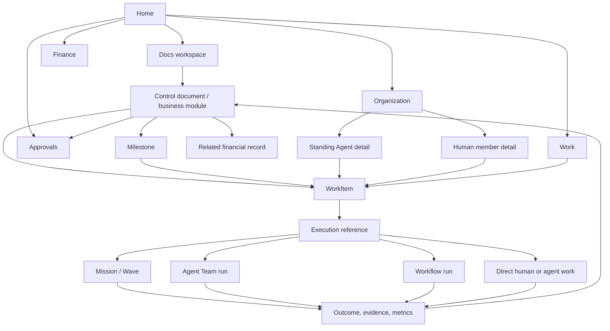

# Company OS Frontend Information Architecture

```text
status: proposed canonical frontend direction
owner_role: product-design
canonical_for: Company OS navigation, page ownership, shared visual grammar,
  responsive policy, and execution-tool placement
```

## Product premise

The product is an AI Company Operating System, not an execution dashboard.
Its primary experience begins with company context and responsibility:

```text
Docs establish intent and business context
  -> WorkItems and Approvals make action and authority explicit
  -> humans, Standing Agents, and external participants take responsibility
  -> Mission/Wave, Agent Team, Workflow, or direct work execute it
  -> results, evidence, financial records, and metrics return to Docs
```

Mission/Wave, Dynamic Workflow, Agent Team, provider sessions, and plugins
remain essential execution substrate. They answer how a bounded action ran;
they are not the default information architecture of the company.

## Navigation model

The primary navigation has three first-class destinations:

```text
Home
Docs
Organization
```

The following company-wide operational views are secondary destinations. They
are global projections of the same records that appear inside documents; they
must never become copied or competing sources of truth.

```text
Work
Approvals
Finance
```

Execution tools are a distinct lower navigation group, opened from a WorkItem,
document, or relevant actor whenever possible:

```text
Missions
Workflows
Agent Teams
```

Utility destinations remain secondary:

```text
Settings
Providers & Plugins
Debug
```

### Primary navigation ownership

| Destination | Answers | Owns | Refuses |
| --- | --- | --- | --- |
| Home | What needs company attention now? | composed company control document, urgent decisions, milestone health, key metrics | a second task database or raw runtime logs |
| Docs | Where does this business context live and how is it connected? | page tree, spaces, templates, typed-record views, document relations | disposable execution transcript ownership |
| Organization | Who is responsible and how is the company organized? | mixed organization, roles, policies, Standing Agent and human profiles | a transient AgentTeamRun roster |
| Work | What outcomes and actions remain, and who owns them? | Milestones, global WorkItem views, work types, filters, and workload | a separate Project hierarchy, independent business context, or approval authority |
| Approvals | What needs authorized human or policy-gated action? | approval inbox, detail, audit trail | inferred consent or hidden policy decisions |
| Finance | What money is planned, committed, invoiced, or paid? | auditable financial-record views and business relations | unreviewed free-text totals |
| Missions / Workflows / Agent Teams | How did a selected action execute? | native execution views and run history | standing organization, business ownership, or document truth |

## Page hierarchy and handoffs



The user must be able to travel in both directions:

- a document can open the WorkItem it created, its assigned actors, approvals,
  finance records, and execution attempts;
- a run page can show the source WorkItem and return to its originating document
  without claiming that the run itself owns company context;
- a Standing Agent profile can show explicit assignments, maintained document
  spaces, and participation history, but only through stable links.

The first Organization experience is lead-first: Human Owner, Lead Agent, and
the Lead's direct second-level Standing Agents. The Lead workspace is the
coordination surface for direct-report work, blockers, organization proposals,
and object-linked conversation. It is not an AgentTeamRun console.

## Actor and organization policy

The organization is mixed by design. Use a shared `ActorRef` wherever an
accountable person, executor, reviewer, approver, or collaborator is named:

```text
ActorRef = human | agent | external | service
```

The UI must retain distinct objects and language:

| Actor | UI shows | UI must not imply |
| --- | --- | --- |
| Human member | role, organization, authority, availability, decisions, contributions | provider runtime, model, or session state |
| Standing Agent | role, org placement, availability/capacity, permissions, document stewardship, explicit assignments, runtime | that process health equals availability or human approval |
| External participant | engagement scope, limited permissions, responsible sponsor, deliverables | internal membership or unrestricted access |
| Service | system capability and audit identity | human agency or organizational accountability |
| MemberRun | one execution attempt's participation and assigned lane | durable employment, Standing Agent identity, or a department seat |

`AgentTeamRun` is a transient execution group. It must never appear as a
standing department merely because a similar name or role exists.

## Document-first interaction model

Docs use a Notion-like composition model: nested pages, rich blocks, typed
databases, table/board/timeline/calendar views, relations, inline metrics,
and embedded record views. The result is expressive without allowing facts to
drift into unstructured prose.

Every embedded operational block is a view of an existing record:

- a Work table is a filtered WorkItem projection;
- a Milestone roadmap is a grouped projection over Milestone and WorkItem
  records; it is not a Project or Mission/Wave projection;
- an approval block is a filtered Approval projection;
- a finance table is a FinancialRecord projection;
- an Agent card is an ActorRef profile preview;
- an execution block is a linked Mission, WorkflowRun, or AgentTeamRun;
- a metric chart reads one canonical metric series.

Documents may create WorkItems and propose organization or module changes. A
result must return through a deliberate result/update action, not an assumed
chat summary. Ordinary conversation remains activity; it does not silently
create a WorkItem, assignment, approval, financial record, or permanent
document content.

## Shared visual grammar

Use one warm, light Company OS system across document, organization, and
execution views:

- warm gray application background and calm white document/work surfaces;
- restrained coral as the primary action, focus, and active-state accent;
- semantic colors only for success, warning, blocking, and destructive state;
- clear hierarchy from typography, spacing, hairline borders, and grouped
  surfaces rather than decorative dashboard cards;
- dense information is permitted only where a user can trace source, owner,
  status, and next action;
- a right Context Rail is used for connected record facts and safe controls;
  its contents never duplicate the document's primary narrative;
- activity streams are chronological and source-labelled; provider thinking is
  live-only, sanitized, and never part of durable history.

The shared shell should feel like a capable document workspace, not a BI wall
or a chat application. Home and Docs favor long-form readable surfaces;
organization and execution pages may use the FocusShell pattern of a central
activity/work area plus a composed Context Rail.

## Collaboration surfaces

Conversation does not live in one global chat product. It is attached to a
Document, BusinessModule, Milestone, WorkItem, Approval, Standing Agent
relationship, or execution attempt. Shared UI primitives include Actor cards,
Conversation, Message, Activity, Handoff, Artifact, Presence, Composer, and
Context widgets. Organization and execution reuse those primitives but retain
different page semantics and lifecycles.

The Lead Agent page centres durable company collaboration. Mission, Wave,
AgentTeamRun, MemberRun, and Workflow pages centre one-time execution. Valuable
execution summaries, evidence, deliverables, and decision requests are
promoted back to Work, Docs, Approval, or Finance rather than copying the raw
run stream.

## Responsive policy

The design contract uses these baseline viewports:

```text
desktop: 1440 × 1000
tablet:   900 × 1180
mobile:   390 × 844
```

### Desktop

- Persistent primary navigation, content workspace, and optional Context Rail.
- Docs may show a space/page tree; record pages preserve a readable central
  column even when databases or embedded views are present.
- Home reveals cross-company urgency and summaries before lower-priority
  analytics.
- Tables are permitted when columns preserve ownership and source; do not hide
  critical approvals behind horizontal scrolling.

### Tablet

- Collapse the primary sidebar to an icon/compact rail; retain current location
  and a clearly reachable page tree or organization switcher.
- Move the Context Rail behind a labelled `Context & controls` disclosure or
  sheet; never remove approval, ownership, or source information.
- Convert wide relation tables to compact rows with an explicit detail route.

### Mobile

- One primary reading/action column; no horizontal page overflow.
- Keep document title, status, accountable actor, and the next required action
  in the first viewport.
- Use bottom sheets or full-screen detail routes for context, relation filters,
  and safe actions.
- Composer and quick-create controls remain fixed only where a direct
  conversation or document action is actually supported.
- Organization trees and database views become drill-down lists; a card must
  preserve actor type, responsibility, status, and escalation state.

## Safety and truthful-state rules

- Availability, capacity, exclusive assignment, permissions, and approval
  authority are explicit fields. Runtime health cannot be used to infer them.
- WorkItem roles distinguish requester, submitter, accountable owner,
  assignees, contributors, reviewer, and approver.
- Financial totals derive from auditable records. A trademark fee appearing in
  a legal document is the same record shown in Finance, not a copied number.
- A new business domain first proposes a module design: document structure,
  typed records, relations, templates, permissions, metrics, finance links,
  and ownership. It is not filed as an orphan folder.
- Human-required controls must state why a human is required and who can act.
- Archived historical records are never silently reinterpreted as Company OS
  WorkItems or included in live projections.
