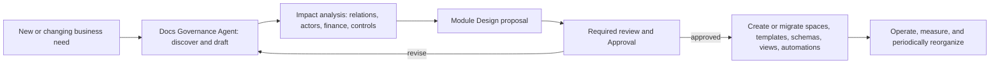

# Module Design

```text
status: canonical product contract
owner_role: product
canonical_for: safely introducing or reorganizing a Company OS business domain
```

## Purpose

A module is a deliberate, linked operating structure for a recurring business
domain. It is more than a directory and more than a dashboard: it defines the
documents, typed records, relations, people and Agents, controls, views, page
composition, and operating loop needed to run that domain without creating
disconnected pages or copying data between systems.

Use a Module Design whenever a new kind of work cannot safely fit in an
existing DocumentSpace and its established record/relation contract. A new
one-off page can remain in its existing space; a repeatable domain, regulated
activity, or cross-functional process requires a design proposal.

## Proposal lifecycle



The Docs Governance Agent is responsible for proposing a coherent
structure, discovering collision with existing modules, and maintaining the
document architecture. It is not authorized to unilaterally make high-risk
governance decisions. The business owner, Finance, legal/security owners,
Org/HR Governance Agent, and required human approvers participate when
the proposed change affects their authority.

## Required Module Design

Every proposal must be a durable document with the following sections. A
section may explicitly state “not applicable” only after analysis.

| Section | Required decision |
| --- | --- |
| Purpose and boundary | The business problem, intended outcome, in-scope and out-of-scope activity, and why existing modules cannot safely contain it. |
| Owning space and navigation | Home `DocumentSpace`, parent or sibling placement, discoverability, ownership, and any required cross-space entry points. |
| Documents and templates | Essential landing pages, decision logs, briefs, checklists, evidence pages, and reusable templates with their owners. |
| TypedRecords | The authoritative record types, key fields, stable identifiers, lifecycle states, source-of-truth rule, and retention needs. |
| Relations and integration | Required links to projects, brands, people/Agents, WorkItems, outputs, evidence, other modules, and the direction/cardinality of important relations. State which links are references rather than copied values. |
| Page composition | Which surfaces are basic rich documents, which use standard views, and which merit a custom page. For every custom page: primary question, declared data queries, approved components, navigation to underlying records, allowed Action Commands, fallback standard view, owner, and visual acceptance fixture. |
| Finance | Whether the module creates budgets, commitments, invoices, payments, refunds, revenue, cost allocation, or financial evidence; which `FinancialRecord` types and relation keys are required; reconciliation and approval rules. |
| Metrics and reporting | KPIs, definitions, source records, calculation ownership, refresh cadence, threshold/alert policy, and the views that expose them. |
| Actors and organization | Accountable human or Agent owner, participating humans, Standing Agents, external parties, roles, capacity/escalation path, and any organization changes required. |
| Work management | WorkItem templates, source-document rules, submitter/requester/accountable/executor/reviewer/approver responsibilities, execution-reference rules, and where results return. |
| Approvals and controls | Approval triggers, required actor types (including human-only requirements), separation of duties, legal/security/privacy controls, audit events, and failure/escalation handling. |
| Permissions | Read/write/share/export boundaries, sensitive fields, external access, retention, and how embedded views inherit or restrict access. |
| Automation | Allowed triggers, idempotency and approval gates, notification/assignment behavior, failure visibility, human override, and prohibited autonomous actions. |
| Archive and migration | Lifecycle/closure criteria, retention and archival destination, migration plan for existing content, provenance preservation, rollback, and ownership after closure. |
| Acceptance and review | Implementation checklist, verification evidence, policy owners, review cadence, and conditions that should trigger redesign. |

## Decision rules

1. **Use existing structure before creating a new module.** A proposal explains
   why an existing space, template, record type, or relation cannot be extended
   without ambiguity or control loss.
2. **Model business facts once.** A related page embeds a View of the source
   `TypedRecord`; it does not manually copy financial totals, status, owners,
   or evidence lists.
3. **Keep accountability explicit.** A request originator, system submitter,
   accountable owner, executor, reviewer, and approver are distinct roles and
   may be fulfilled by different Actors. A matching Agent name or provider
   session does not prove ownership.
4. **Design the result path before triggering work.** Every WorkItem states its
   source and intended result/update location. Executor success alone cannot
   close a business outcome.
5. **Automate within authority.** Automation may prepare, route, notify, or
   update approved fields only as defined by policy. It cannot bypass human-only
   legal, financial, privacy, organization, or permission decisions.
6. **Prefer additive, reversible evolution.** Preserve links and provenance;
   do not silently reclassify historical records or delete a space because a
   newer structure appears cleaner.
7. **Escalate page complexity deliberately.** Start with rich documents and
   standard views. A custom HTML/React page is justified only for a stable,
   high-value surface where standard composition obscures important context or
   actions.
8. **Treat custom code as a constrained client.** A page declares the Views it
   reads and the Action Commands it may request. It cannot own business facts,
   directly write a store, or bypass permissions, audit, or Approval policy.
   Every custom page names a standard-view fallback.

## Risk and approval matrix

| Change | Minimum governance expectation |
| --- | --- |
| New low-risk page/template within an existing controlled space | Space owner review; follow local policy. |
| New record type, shared relation, dashboard, or cross-space view | Document Architecture review plus affected data/module owners. |
| New automation that creates WorkItems or updates records | Owner approval, visible audit trail, failure handling, and policy-scoped permission. |
| Finance relation, financial record type, spending/payment workflow | Finance owner review and required financial approval controls. |
| Legal/IP, personal data, external sharing, or retention rule | Relevant legal/security/privacy owner review; required human approval when policy says so. |
| New Standing Agent, organization unit, permission model, or autonomous authority | Organization Governance review and explicit human approval for authority or access changes. |
| Migration, merge, or archive affecting existing shared content | Affected owners approve a reversible migration plan with provenance and rollback. |

## Compact example: trademark management

Trademark registration should not be added as an isolated checklist under a
brand page. A Module Design may create a **Brand & IP / Trademark Management**
space with an application record collection, evidence and material templates, deadline
views, and a risk/objection log. Its `TrademarkApplication` records relate to
the brand/Milestone, jurisdiction, classification, source documents, WorkItems,
required approvals, submitted materials, and outcomes.

The design must also create links to authoritative `FinancialRecord`s for the
budget, commitment, invoice, payment, and any refund. The trademark page shows
those linked records; Finance uses the same records for company and Milestone
reporting. It names a business owner, IP/Trademark Agent, Finance reviewer,
external counsel where applicable, and human approval for payments or legal
filings under policy. When the module becomes established, its templates and
relations become the reusable route for later trademark work.

Its first application detail page can be a structured document with standard
related-record views. Its module home is a candidate custom page because it
has a stable question — "which applications need a decision, and what is their
financial and legal state?" — and must place several sources together. The
custom page reads application, WorkItem, Approval, and FinancialRecord views;
it requests governed actions such as `trademark.submit_filing`; it never owns
an application status or fee amount. If the package is unavailable, users
return to the standard application and related-record views.

## Relationship to the Document System

This is the change-management contract for the [Document System](document-system.md).
It does not replace the canonical execution contracts of Mission/Wave, Agent
Team, Dynamic Workflow, or host execution. A module may invoke those tools,
but it remains responsible for retaining business context, authority, results,
and relations in the Company OS.
