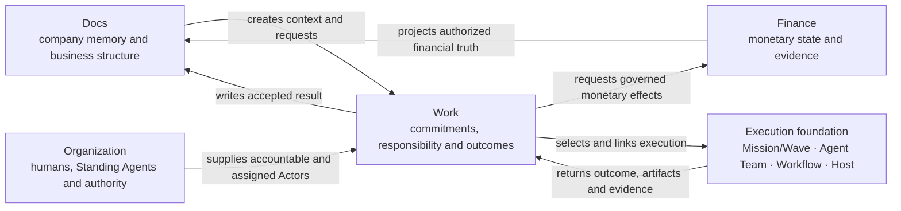

# Company OS product system map

```text
status: canonical product orientation
owner_role: product-architecture
canonical_for: whole-product structure, truth ownership, governance hierarchy, execution boundary, and current delivery status
```

This is the shortest complete entry point for the product. It does not replace
the detailed contracts linked below; it tells a future Human or Agent how those
contracts fit together and which layer owns each decision.

## Product mission

Star Harness is an AI Company OS for turning durable company context into
governed work and returning accepted outcomes to company memory. Its two
primary product systems are **Docs** and **Organization**. Work and Finance are
first-class operating systems connected to them. Mission/Wave, Agent Team,
Dynamic Workflow, Host execution, providers, plugins, and MCP are the shared
execution foundation rather than a second company model.



Relations connect the systems; they do not transfer ownership. Docs may show a
Commitment, but Finance owns its amount and state. Work may show an Agent, but
Organization owns that Agent's identity and authority.

## Initial organization

The first organization is governance-led and deliberately shallow:

```text
Human Owner
└── Lead Agent
    ├── Docs Governance Agent
    ├── Work Governance Agent
    ├── Finance Governance Agent
    └── Org / HR Governance Agent
        ├── Trademark Agent
        ├── Development Agent
        ├── Content Agent
        └── future Business Agents
```

Lead manages the four Governance Agents. Org/HR owns the lifecycle and reporting
placement of Business Agents. Docs, Work, and Finance Governance Agents
collaborate with Business Agents through records and governed Actions; they are
not their organizational manager. A one-off need should normally use an
existing Actor, Agent Team, Workflow, Host execution, or external collaborator
instead of creating a Standing Agent.

## One company operation

The trademark scenario is the first acceptance slice:

1. Docs holds the trademark strategy and application record.
2. Work creates `Submit CN trademark filing`, names responsibility, links a
   Milestone, and waits at the required Human gate.
3. Organization supplies the IP Agent, accountable Human, external counsel,
   and approval authority.
4. Finance records a pending CNY 3,000 Commitment. It does not create a Payment
   before authorization and settlement evidence.
5. The selected executor performs the work and returns observable evidence.
6. Work records review and completion; Docs receives the accepted filing result.

Approval and Wave gate are different decisions. A completed or accepted Wave
cannot authorize legal filing, payment, permission, or organization mutation.

## Native object boundaries

| Layer | Native product objects | Boundary |
| --- | --- | --- |
| Docs | Document, Block, TypedRecord, Relation, View, BusinessModule | durable knowledge and business structure |
| Organization | ActorRef, HumanMember, AgentMember, external/service actors, OrgUnit | identity, reporting, permission, authority and explicit availability/capacity |
| Work | WorkItem, Milestone, WorkType, Assignment, Approval links, execution/delivery refs | commitment, responsibility, lifecycle, evidence and result routing |
| Finance | Commitment, Invoice, Payment, Refund and financial evidence | monetary truth and transitions |
| Execution | Mission, ordered Wave, AgentTeamRun/MemberRun, WorkflowRun/Step, Host outcome | how selected work ran |

There is no native `Project`, Task Graph, GoalPhase, or universal Agent object.
Mission/Wave is the only new long-task coordination model. Temporary Agent Team
members and provider-native subagents do not become Standing Agents.

## Current delivery truth

| Area | Current truth | Next product gap |
| --- | --- | --- |
| Docs substrate | native schemas, stores, APIs, standard views, and Store-live evidence exist | deeper document authoring and governed module evolution |
| Organization substrate | actor kinds, OrgUnit membership, and mixed-actor UI exist | governance-led reporting records, governed organization mutation, and the target Organization Overview |
| Work read model | native Milestone/WorkType/business-line projection and six responsive Store-live views exist | governed intake, reassignment, Milestone mutation, saved views, and delivery adapters |
| Finance/Approval | native records, separation of Commitment and Payment, and governed action slices exist | actor-bound product sessions and broader operator controls |
| Governance Agents | canonical roles and decision contracts exist | durable definitions, permissions, queues, and Org/HR lifecycle Actions |
| Execution foundation | Mission/Wave, Agent Team, Dynamic Workflow, Host, providers and Dashboard contracts exist | continue improving honest observation and adapter coverage without replacing company objects |

“Implemented” never follows from a generated image. The visual inventory
separates baseline, Expected, Actual, historical, and deferred-reference assets.

## Canonical reading order

1. [Vision](vision.md)
2. [This product system map](product-system-map.md)
3. [Four-system collaboration](four-system-collaboration.md)
4. [Organization and actors](organization-and-actors.md)
5. [Work Operating System](work-operating-system.md)
6. [Document system](document-system.md) and [financial relations](financial-relations.md)
7. [Governance Agent workspaces](governance-agent-workspaces.md)
8. [Frontend information architecture](frontend-information-architecture.md)
9. [Execution foundation](execution-foundation.md)
10. [Company OS V2 visual inventory](../design/company-os-v2/visual-index.md)

Detailed schemas, Actions, examples, and implementation audits remain linked
from [the Company OS index](README.md). If a detailed document conflicts with
this map, the specific canonical contract for that object wins; the conflict
must then be corrected here rather than left implicit.

## Superseded decisions

- `Goal`, `GoalPhase`, Project-like task containers, and Task Graph are not
  active product architecture.
- The earlier Lead-directly-manages-every-Business-Agent Organization picture
  is historical. The active target is governance-led with Business Agents
  under Org/HR.
- Rich standalone pages for every Governance Agent are deferred references,
  not current implementation requirements. Compact Organization configuration
  and module queues come first.
- Raw model thinking is never durable product truth. Only sanitized transient
  live state may be shown, without persistence or replay.
