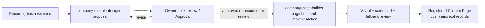

# Future Skill Contracts: Modules and Custom Pages

```text
status: proposed capability contracts — no SKILL.md or runtime implementation yet
owner_role: product + platform
canonical_for: optional Agent capability inputs, outputs, and governance boundaries
```

## Purpose and non-authority

The future `company-module-designer` and `company-page-builder` skills reduce
variance when an Agent helps design a business module or creates an approved
custom page. They are procedural capabilities, not part of the Company OS data
model and not an authority for product, organization, security, finance, or
legal decisions.

They may inspect permitted context, draft specifications, prepare artifacts,
and implement within an approved boundary. They must not create durable
authority merely because they can generate a proposal, HTML, React, or a
convincing visual. Module records, permissions, policies, Approvals, and
governance remain authoritative only when created and accepted through their
respective Company OS contracts.

The capability should be optional: a human team can use the same Module Design
and custom-page process without invoking either skill. A future `SKILL.md`
should be concise, refer to the canonical docs below, and avoid duplicating
product contracts.

Governance Agents may later receive narrower procedural skills such as
`document-architecture`, `work-intake-and-routing`, `finance-governance`, and
`organization-governance`. Their Agent definition still consists of explicit
responsibility, prompt, tools/Skills, permissions, maintained Docs, and
escalation. A Skill is never installed or invoked merely because an Agent has a
governance title, and it never expands that Agent's permission policy.

## Shared operating rules

Both skills must:

- identify assumptions, unknowns, affected owners, risk, and permissions
  before proposing a durable change;
- treat Documents, TypedRecords, Relations, Views, WorkItems, Approvals,
  FinancialRecords, and ActorRefs as canonical objects rather than inventing
  page-local substitutes;
- use the [Module Design](module-design.md), [Document System](document-system.md),
  [WorkItems and Approvals](work-items-and-approvals.md), and
  [Governance](governance.md) contracts as constraints;
- preserve provenance and give every proposed migration a rollback or safe
  non-destructive path;
- keep ordinary chat, provider transcripts, and private reasoning out of
  durable output; and
- make no claim that a proposal, code change, or visual comparison has passed
  policy approval unless the relevant review and Approval records prove it.

Neither skill gets a general store-write client. Any write it initiates uses
declared, policy-checked commands, and any required Approval remains a real
first-class decision.

## `company-module-designer`

### Job

Use this skill when a recurring, cross-functional, regulated, or structurally
new business domain may need a `BusinessModule`, or when an existing module
needs a significant redesign. Do not use it simply to create a one-off page or
to make a page visually distinctive.

### Required input

| Input | Requirement |
| --- | --- |
| Business need | Problem, intended outcome, boundary, sponsor/accountable owner, and why existing documents/modules may be insufficient. |
| Existing context | Permitted documents, spaces, record types, relations, Views, policies, organization, and relevant historical data. |
| Operational loop | Recurring triggers, work/result path, participants, external systems, and failure/escalation path. |
| Control context | Finance, legal, privacy, retention, permissions, separation-of-duties, and human-only decision requirements. |
| Change constraints | Migration tolerance, reversibility, integrations, target timing, and explicit unknowns. |

If context is missing, the output is an investigation/decision request rather
than fabricated schema or authority.

### Required output

The skill produces a durable **Module Design proposal** and machine-readable
companion specification for review. Together they include:

```text
purpose and module boundary
owning DocumentSpace and navigation
documents, templates, TypedRecord types, lifecycle states, and retention
Relations with direction/cardinality and canonical source rules
Views, metrics, and reporting definitions
Actors, organization, responsibility, capacity, and escalation
WorkItem templates with source/result provenance
Finance record types, reconciliation, and approval rules
permissions, automation limits, audit/failure handling
migration, rollback, acceptance checks, owners, and required reviews
```

The companion spec should separate **proposed additions**, **changes to
existing contracts**, **assumptions**, and **decisions requiring human or
owner approval**. It may include a page brief for a later custom view, but it
does not choose or generate a coded UI by default.

### Completion rule

The skill is complete when a reviewer can decide whether to accept, revise, or
reject the proposal and can trace every material fact to permitted context or
an explicitly labelled assumption. It is not complete merely because a schema
or document tree was generated.

## `company-page-builder`

### Job

Use this skill only after a page is justified under
[Agent-Programmable Pages](agent-programmable-pages.md), and only with an
approved or explicitly review-pending module/page specification. It designs
and implements a custom page whose governed `CustomPageDefinition` registers a
versioned `CustomPagePackage`. Its primary job is to make a stable
operating question clear across multiple canonical information types.

It is not the default editor, dashboard generator, access-control mechanism,
or business automation engine. Basic documents and structured pages remain the
default routes for routine work.

### Required input

| Input | Requirement |
| --- | --- |
| Page brief | Stable audience, purpose, primary question, navigation entry/exit, owner, and why standard Blocks/Views are insufficient. |
| Approved data contract | Parent Module/space/document, record types, relation paths, View/query definitions, metric definitions, and data sensitivity. |
| Command contract | Explicit allowed Action Commands, expected state transitions, required approvals, error states, and no-action cases. |
| Experience constraints | Device breakpoints, accessibility, shared UI components, visual language, performance limits, and standard-view fallback. |
| Acceptance fixture | Representative and policy-safe records for normal, empty, pending approval, error, and restricted-permission states. |

The skill must stop for direction when the page brief requires a new data
model, unknown field access, an undeclared command, an external integration,
or a policy change. It hands that work back to module design and governance.

### Required output

The builder produces the following reviewable artifact set:

| Artifact | Minimum contents |
| --- | --- |
| `page-spec` | Page purpose, user question, information priority, target, scoped reads, allowed commands, fallback, owner, and dependency/component versions. |
| Layout options | A small set of reasoned layouts when the hierarchy is not already prescribed; identify the recommended option and trade-offs. |
| Expected design | Expected image(s) and concise responsive/interaction notes, tied to fixture data and the selected layout. |
| Registered view implementation | Custom page code using shared components, declared scoped reads, and only registered Action Commands. |
| Fixture | Representative, non-sensitive data plus expected empty/error/restricted states. |
| Actual capture | Screenshots for declared breakpoints produced from the implementation and fixture. |
| Comparison | Expected-to-actual visual diff/assessment, material deviations, accessibility/interaction observations, and disposition. |
| Fallback verification | Proof that the linked standard Document/Views expose the same underlying records and essential next actions. |

Generated React/HTML is an implementation artifact. It must not contain copied
business facts, embedded secrets, direct persistence calls, policy decisions,
or hidden dependencies that the registered specification does not declare.

### Visual acceptance loop

```text
page brief + approved data/command contract
  -> layout options and expected design
  -> selected design review
  -> implementation against representative fixture
  -> actual screenshots at declared breakpoints
  -> expected / actual comparison
  -> visual, accessibility, command, and fallback acceptance
```

The visual comparison is a decision aid: it records where expected and actual
hierarchy, density, states, or responsive behavior materially differ. It must
not be used to conceal a missing source link, an unapproved command, or an
unmet human Approval requirement.

### Completion rule

The skill is complete only when the registered view has declared scoped reads,
governed commands, a functioning standard-view fallback, and the artifact set
above is reviewable. Final product acceptance additionally requires the
appropriate code, security, accessibility, and module-owner checks; a skill
cannot self-accept its own authority.

## Handoff between the skills



The module skill establishes *what the business system is*. The page-builder
skill establishes *how an approved subset is presented and interacted with*.
They remain separate because a visually successful page cannot validate a poor
record/relation model, and an excellent module design does not itself justify
custom code.

## Trademark Management walkthrough

For `CN-2026-018`, `company-module-designer` receives the brand request,
existing Brand & IP context, the ¥3,000 filing need, and policy constraints. It
proposes the `TrademarkApplication` record, relations to source documents,
WorkItems, Approvals, legal evidence, and canonical `FinancialRecord`s; it
names the Brand Owner, Trademark Agent, External Lawyer, and required reviews.
Finance and legal/human approval remain decisions outside the skill.

After that contract is reviewed, `company-page-builder` may receive a page
brief for the Trademark Management home: "What applications require a decision
or legal action, and what costs are committed or awaiting approval?" Its
scoped reads include application status, deadlines, WorkItems, Approval state,
and finance Views. Its allowed commands could create an application, link
materials, create a WorkItem, or request an approval. It cannot file a mark,
approve ¥3,000, or settle a payment.

The builder generates the expected management-home image, implements the
registered view, captures it with an application awaiting the ¥3,000 approval,
and compares it to the expected image. If the renderer fails, users still open
the module document and standard application, finance, work, and approval
Views. The details of the underlying operating loop remain those in the
[trademark registration example](examples/trademark-registration.md).
