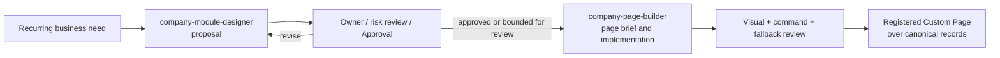

# Skill and CLI Contracts: Company OS Operator Suite

```text
status: mixed — Company OS operator suite installable; Docs dedicated CLI implemented; Work/Finance/Org dedicated CLI planned
owner_role: product + platform
canonical_for: optional Agent capability inputs, outputs, and governance boundaries
```

## Purpose and non-authority

The Company OS operator suite reduces variance when Agents operate company
memory, durable work, organization authority, finance state, module design, and
code-declared business pages.

Install it into both Claude Code and Codex project skill roots with:

```bash
scripts/install-skill.sh --agent both --suite company-os
```

The suite currently expands to:

| Skill | Owning surface | Implementation status |
| --- | --- | --- |
| [`company-docs-operator`](../../skills/company-docs-operator/SKILL.md) | Docs: Document, Block, TypedRecord, Relation, View, BusinessModule, custom page metadata | dedicated `harness company docs ...` CLI implemented |
| [`company-work-operator`](../../skills/company-work-operator/SKILL.md) | Work: WorkItem, Milestone, Assignment, lifecycle, Approval links, execution/result refs | procedural skill over Store/API/Action; dedicated CLI planned |
| [`company-finance-operator`](../../skills/company-finance-operator/SKILL.md) | Finance: Commitment, Payment, invoice, refund, monetary metrics and evidence | procedural skill over Store/API/Action; dedicated CLI planned |
| [`company-org-operator`](../../skills/company-org-operator/SKILL.md) | Organization: Human, Standing Agent, OrgUnit, role, permission, lifecycle | procedural skill over Store/API/Action; dedicated CLI planned |
| [`company-module-designer`](../../skills/company-module-designer/SKILL.md) | Business module design and governance proposal | procedural design skill |
| [`company-page-builder`](../../skills/company-page-builder/SKILL.md) | Code-declared custom page design/implementation contract | procedural page-building skill |

These are procedural capabilities, not part of the Company OS data model and
not an authority for product, organization, security, finance, or legal
decisions.

Docs are **Agent-operated and Human-reviewed**. Skills and CLI/API are the main
Agent interface for reading, editing, governing, and verifying document truth.
The UI is primarily for Humans to inspect, review, approve, and supervise what
Agents maintain. UI editing can exist for necessary low-risk actions, but it is
secondary to the CLI/API command surface and cannot be the only proof that a
Docs capability is implemented.

The capability is optional: a human team or another Agent can use the same
Company OS contracts without invoking a skill. The `SKILL.md` files are concise
operating aids that point back to canonical docs and avoid duplicating product
contracts.

Governance Agents may be configured with these skills, but their authority
still consists of explicit responsibility, prompt, tools/Skills, permissions,
maintained Docs, accepted WorkTypes, and escalation. A Skill is never installed
or invoked merely because an Agent has a governance title, and it never expands
that Agent's permission policy.

The first implemented Docs Governance primitives are CLI-backed and exposed
through the optional [`company-docs-operator`](../../skills/company-docs-operator/SKILL.md)
skill:

```bash
harness company docs query --document <document-id>
harness company docs query --module <business-module-id>
harness company docs health
harness company docs module create \
  --root-document <document-id> \
  --name <module-name> \
  --purpose <purpose> \
  --authority <human-admin-id> \
  --record-type <type> \
  --relation-rule-json '{"relation_type":"source_for","from_kind":"document","to_kind":"typed_record","required":true,"cross_module":false}'
harness company docs page-definition create \
  --module <business-module-id> \
  --fallback-view <view-id> \
  --purpose <purpose> \
  --authority <human-admin-id>
harness company docs document create \
  --definition <custom-page-definition-id> \
  --parent-document <document-id> \
  --title <title> \
  [--template <template-document-id> --instantiate-template] \
  --actor <human-or-agent-id>
harness company docs document rename \
  --definition <custom-page-definition-id> \
  --document <document-id> \
  --title <new-title> \
  --actor <human-or-agent-id> \
  [--dry-run]
harness company docs document move \
  --definition <custom-page-definition-id> \
  --document <document-id> \
  (--parent-document <new-parent-document-id> | --root) \
  --actor <human-or-agent-id> \
  [--dry-run]
harness company docs document archive \
  --definition <custom-page-definition-id> \
  --document <document-id> \
  --actor <human-or-agent-id> \
  (--dry-run | --confirm)
harness company docs template create \
  --definition <custom-page-definition-id> \
  --parent-document <document-id> \
  --title <template-title> \
  [--from-document <source-document-id>] \
  --actor <human-or-agent-id>
harness company docs template status \
  --definition <custom-page-definition-id> \
  --template <template-document-id> \
  --status active|paused|archived \
  --actor <human-or-agent-id>
harness company docs block append \
  --definition <custom-page-definition-id> \
  --document <document-id> \
  --kind <rich_text|heading|callout|table> \
  --text <body> \
  --actor <human-or-agent-id>
harness company docs block update \
  --definition <custom-page-definition-id> \
  --document <document-id> \
  --block <block-id> \
  [--kind <rich_text|heading|callout|table>] \
  [--content-json '{"text":"updated"}' | --text <body>] \
  --actor <human-or-agent-id> \
  [--dry-run]
harness company docs block archive \
  --definition <custom-page-definition-id> \
  --document <document-id> \
  --block <block-id> \
  --actor <human-or-agent-id> \
  (--dry-run | --confirm)
harness company docs block remove \
  --definition <custom-page-definition-id> \
  --document <document-id> \
  --block <block-id> \
  --actor <human-or-agent-id> \
  (--dry-run | --confirm)
harness company docs block reorder \
  --definition <custom-page-definition-id> \
  --document <document-id> \
  --block-order <block-id-2,block-id-1> \
  --actor <human-or-agent-id>
harness company docs typed-record append \
  --definition <custom-page-definition-id> \
  --module <business-module-id> \
  --source-document <document-id> \
  --record-type <type> \
  --title <title> \
  --actor <human-or-agent-id>
harness company docs typed-record update \
  --definition <custom-page-definition-id> \
  --record <typed-record-id> \
  [--title <title>] \
  [--fields-json '{"status":"accepted"}' --merge-fields] \
  [--status <lifecycle-status>] \
  --actor <human-or-agent-id> \
  [--dry-run]
harness company docs view create \
  --definition <custom-page-definition-id> \
  --module <business-module-id> \
  --title <title> \
  [--mode table|board|timeline] \
  --source-kind typed_record \
  [--query-json '{"filters":[{"field":"record_type","value":"trademark_application"}],"group_by":"lifecycle_status","sort_by":"updated_at"}'] \
  --actor <human-or-agent-id>
harness company docs relation link \
  --definition <custom-page-definition-id> \
  --from-document <document-id> \
  --to-record <typed-record-id> \
  --actor <human-or-agent-id>
harness company docs relation unlink \
  --definition <custom-page-definition-id> \
  --relation <relation-id> \
  --actor <human-or-agent-id> \
  (--dry-run | --confirm)
```

`docs query` is the first read command Agents should run before mutation. It is
read-only over the current latest Company OS projection and returns the selected
Document or module root, ordered Blocks, child Documents, templates,
source-linked TypedRecords, Relations, Views, BusinessModule, page-definition
and policy context, scoped health findings, available commands, and explicit
side-effect boundaries. It does not create WorkItems, Approvals, Finance
records, Organization changes, execution runs, or UI-only state.
`docs health` remains the broader read-only structural audit over the current
Company OS projection.
`docs document rename`, `docs document move`, and `docs document archive` are
governed structure-maintenance commands. They update the latest Document row
through `document.append`, preserve existing blocks and references, keep
identity fields immutable, and support dry-run before dispatch. `move` may
change `parent_document_id` inside the same DocumentSpace but cannot move a
Document under itself or create a parent cycle. `archive` requires `--confirm`
unless it is a dry-run. These commands are Docs-only; they do not create Work,
Approval, Finance, Organization, Execution, or UI-only state.
`docs block update`, `docs block archive`, and `docs block remove` are governed
content-maintenance commands. `block update` writes a new latest Block row
through `block.append` while preserving Block identity and keeping
`Document.block_ids` unchanged. `block remove` writes only a Document update to
remove the Block from visible order while preserving the Block row. `block
archive` writes archived metadata into `Block.content` and removes the Block
from visible order. Archive/remove require `--confirm` unless they are
dry-runs. None of these commands physically delete records or imply Work,
Approval, Finance, Organization, Execution, or UI-only state.
`docs module create` and `docs page-definition create` are governance-level
authoring commands: they use the administrative Company OS API envelope, require
a Human `company_os.admin` authority, create the BusinessModule/fallback View
and CustomPageDefinition/package/policy bundle, and do not authorize Work,
Finance, Organization, or Execution effects. `docs module create` may also
preserve explicit BusinessModule relation rules such as Document →
TypedRecord `source_for`; this declares a policy but does not create any
TypedRecord or Relation by itself.
`docs template create` constructs an explicit reusable
`Document(kind=template)` instead of mutating an existing page's identity. With
`--from-document`, it copies the source Document's ordered native Blocks into
the new template through governed `block.append` plus `document.append`
updates. The source Document keeps its original kind, block list, references
and relations. `docs template status` updates only that template Document's
`lifecycle_status` through governed `document.append`; it refuses non-template
Documents and does not change existing child Documents that already recorded
the template through `template_ref`. `docs document create` constructs a scoped child
`document.append` command and can preserve a `template_ref` provenance pointer
when `--template` is supplied. By default it records provenance only. With
`--instantiate-template`, it also copies the template Document's ordered native
Blocks into the child Document through governed `block.append` plus
`document.append` updates. These template commands still do not create
TypedRecords, WorkItems, Relations, Approvals, or Finance effects.
When a module declares a Document → TypedRecord relation rule, agents still
create the TypedRecord and concrete Relation through `typed-record append` and
`relation link` as separate governed actions after the child Document exists.
Later structured truth maintenance uses `typed-record update` and `relation
unlink`; it must not rewrite source Documents, create WorkItems, or physically
delete Relation rows.
`docs block append` creates a Block and then appends the updated source
Document so `Document.block_ids` stays navigable. It supports text shorthand
and structured `--kind`/`--content-json` content for `rich_text`, `heading`,
`callout`, and simple `table` Blocks. The Document Focus UI may expose slash
commands for selecting those Block kinds, but the durable effect is still the
same governed `block.append` plus `document.append` pair. Block reorder remains
a governed `document.append` wrapper: it may change only `Document.block_ids`
order and must preserve exactly the existing Block set. Drag/drop UI is still a
presentation layer over that command, not a separate truth. `docs typed-record append`
creates a source-linked TypedRecord inside a declared BusinessModule.
`docs typed-record update` writes a new latest TypedRecord row through
`typed_record.append`; it may change title, fields, and lifecycle status, but
must preserve the record id, module id, record type, source Document ref,
creator, and creation time. With `--merge-fields`, incoming JSON object keys
overlay existing fields; without it, `--fields-json` replaces the full fields
object. Dry-run returns the before/after record without dispatching a write.
`docs view create` creates a standard View under a BusinessModule and may
persist table/board/timeline mode plus source-kind and JSON query configuration
for simple filter, grouping, and sorting. That configuration is presentation
truth in the native `View`; it does not create a second record store or mutate
the underlying TypedRecords. `docs
relation link` constructs a standard `relation.append` ActionCommand with an
active lifecycle state. `docs relation unlink` writes a new latest Relation row
through `relation.append` with `lifecycle_status=archived`; it preserves the
Relation id, endpoints, relation type, provenance, creator, and creation time,
requires `--confirm` unless dry-run, and never physically deletes history.
Active `docs query` and health projections ignore archived Relations, so a
previously satisfied Document → TypedRecord policy may correctly resurface as a
missing-relation finding after unlink. These
ordinary write commands all dispatch through the same governed Action transport
used by Store-live UI. They do not receive a general store-write client and
require the normal `HARNESS_COMPANY_OS_TOKEN` write capability plus a matching
`CustomPageDefinition` policy.

## Shared operating rules

These skills must:

- treat CLI/API as the primary Agent interface and UI as Human review context;
- identify assumptions, unknowns, affected owners, risk, and permissions
  before proposing a durable change;
- treat Documents, TypedRecords, Relations, Views, WorkItems, Approvals,
  FinancialRecords, and ActorRefs as canonical objects rather than inventing
  page-local substitutes;
- use the [Module Design](module-design.md), [Document System](document-system.md),
  [WorkItems and Approvals](work-items-and-approvals.md), and
  [Governance](governance.md) contracts as constraints;
- preserve provenance and give every proposed migration a rollback or safe
  non-destructive path;
- keep ordinary chat, provider transcripts, and private reasoning out of
  durable output; and
- make no claim that a proposal, code change, or visual comparison has passed
  policy approval unless the relevant review and Approval records prove it.

No skill gets a general store-write client. Any write it initiates uses
declared, policy-checked commands, and any required Approval remains a real
first-class decision.

## `company-docs-operator`

### Job

Use this skill when a Governance Agent or business Agent needs to inspect or
operate Docs through the implemented CLI/API path: structure health, child
Document creation, structured Block append, TypedRecord append, View creation,
and Document ↔ TypedRecord Relation linking.

Do not use it to design a new recurring business module, grant authority,
approve spending, file legal submissions, create custom UI code, or silently
rewrite company memory. Those cases escalate to module design, Organization,
Finance, Work Approval, or page-builder contracts as appropriate.

### Required input

| Input | Requirement |
| --- | --- |
| Operating intent | What document truth needs to change and why. |
| Source context | Current Document, module, record, relation, health finding, or projection evidence. |
| Actor | Human or Agent responsible for the change. |
| Policy context | CustomPageDefinition, capability token, or Human admin authority when required. |
| Boundary | Confirmation that Work, Organization, Finance, and Execution side effects are not being implied unless explicitly routed through their own commands. |

### Required output

The skill produces a short operation note:

```text
selected command
source and target native object refs
actor and permission assumption
idempotency / capability requirement
expected native effects
negative side-effect assertions
verification command and result
remaining planned/gated gaps
```

### Completion rule

The skill is complete only when the relevant native rows and invariants can be
verified. For example, a Block append is incomplete if the Block row exists but
the owning Document's `block_ids` does not reference it. A visual page or
fixture is not sufficient evidence by itself.

## `company-module-designer`

### Job

Use this skill when a recurring, cross-functional, regulated, or structurally
new business domain may need a `BusinessModule`, or when an existing module
needs a significant redesign. Do not use it simply to create a one-off page or
to make a page visually distinctive.

### Required input

| Input | Requirement |
| --- | --- |
| Business need | Problem, intended outcome, boundary, sponsor/accountable owner, and why existing documents/modules may be insufficient. |
| Existing context | Permitted documents, spaces, record types, relations, Views, policies, organization, and relevant historical data. |
| Operational loop | Recurring triggers, work/result path, participants, external systems, and failure/escalation path. |
| Control context | Finance, legal, privacy, retention, permissions, separation-of-duties, and human-only decision requirements. |
| Change constraints | Migration tolerance, reversibility, integrations, target timing, and explicit unknowns. |

If context is missing, the output is an investigation/decision request rather
than fabricated schema or authority.

### Required output

The skill produces a durable **Module Design proposal** and machine-readable
companion specification for review. Together they include:

```text
purpose and module boundary
owning DocumentSpace and navigation
documents, templates, TypedRecord types, lifecycle states, and retention
Relations with direction/cardinality and canonical source rules
Views, metrics, and reporting definitions
Actors, organization, responsibility, capacity, and escalation
WorkItem templates with source/result provenance
Finance record types, reconciliation, and approval rules
permissions, automation limits, audit/failure handling
migration, rollback, acceptance checks, owners, and required reviews
```

The companion spec should separate **proposed additions**, **changes to
existing contracts**, **assumptions**, and **decisions requiring human or
owner approval**. It may include a page brief for a later custom view, but it
does not choose or generate a coded UI by default.

### Completion rule

The skill is complete when a reviewer can decide whether to accept, revise, or
reject the proposal and can trace every material fact to permitted context or
an explicitly labelled assumption. It is not complete merely because a schema
or document tree was generated.

## `company-page-builder`

### Job

Use this skill only after a page is justified under
[Agent-Programmable Pages](agent-programmable-pages.md), and only with an
approved or explicitly review-pending module/page specification. It designs
and implements a custom page whose governed `CustomPageDefinition` registers a
versioned `CustomPagePackage`. Its primary job is to make a stable
operating question clear across multiple canonical information types.

It is not the default editor, dashboard generator, access-control mechanism,
or business automation engine. Basic documents and structured pages remain the
default routes for routine work.

### Required input

| Input | Requirement |
| --- | --- |
| Page brief | Stable audience, purpose, primary question, navigation entry/exit, owner, and why standard Blocks/Views are insufficient. |
| Approved data contract | Parent Module/space/document, record types, relation paths, View/query definitions, metric definitions, and data sensitivity. |
| Command contract | Explicit allowed Action Commands, expected state transitions, required approvals, error states, and no-action cases. |
| Experience constraints | Device breakpoints, accessibility, shared UI components, visual language, performance limits, and standard-view fallback. |
| Acceptance fixture | Representative and policy-safe records for normal, empty, pending approval, error, and restricted-permission states. |

The skill must stop for direction when the page brief requires a new data
model, unknown field access, an undeclared command, an external integration,
or a policy change. It hands that work back to module design and governance.

### Required output

The builder produces the following reviewable artifact set:

| Artifact | Minimum contents |
| --- | --- |
| `page-spec` | Page purpose, user question, information priority, target, scoped reads, allowed commands, fallback, owner, and dependency/component versions. |
| Layout options | A small set of reasoned layouts when the hierarchy is not already prescribed; identify the recommended option and trade-offs. |
| Expected design | Expected image(s) and concise responsive/interaction notes, tied to fixture data and the selected layout. |
| Registered view implementation | Custom page code using shared components, declared scoped reads, and only registered Action Commands. |
| Fixture | Representative, non-sensitive data plus expected empty/error/restricted states. |
| Actual capture | Screenshots for declared breakpoints produced from the implementation and fixture. |
| Comparison | Expected-to-actual visual diff/assessment, material deviations, accessibility/interaction observations, and disposition. |
| Fallback verification | Proof that the linked standard Document/Views expose the same underlying records and essential next actions. |

Generated React/HTML is an implementation artifact. It must not contain copied
business facts, embedded secrets, direct persistence calls, policy decisions,
or hidden dependencies that the registered specification does not declare.

### Visual acceptance loop

```text
page brief + approved data/command contract
  -> layout options and expected design
  -> selected design review
  -> implementation against representative fixture
  -> actual screenshots at declared breakpoints
  -> expected / actual comparison
  -> visual, accessibility, command, and fallback acceptance
```

The visual comparison is a decision aid: it records where expected and actual
hierarchy, density, states, or responsive behavior materially differ. It must
not be used to conceal a missing source link, an unapproved command, or an
unmet human Approval requirement.

### Completion rule

The skill is complete only when the registered view has declared scoped reads,
governed commands, a functioning standard-view fallback, and the artifact set
above is reviewable. Final product acceptance additionally requires the
appropriate code, security, accessibility, and module-owner checks; a skill
cannot self-accept its own authority.

## Handoff between the skills



The module skill establishes *what the business system is*. The page-builder
skill establishes *how an approved subset is presented and interacted with*.
They remain separate because a visually successful page cannot validate a poor
record/relation model, and an excellent module design does not itself justify
custom code.

## Trademark Management walkthrough

For `CN-2026-018`, `company-module-designer` receives the brand request,
existing Brand & IP context, the ¥3,000 filing need, and policy constraints. It
proposes the `TrademarkApplication` record, relations to source documents,
WorkItems, Approvals, legal evidence, and canonical `FinancialRecord`s; it
names the Brand Owner, Trademark Agent, External Lawyer, and required reviews.
Finance and legal/human approval remain decisions outside the skill.

After that contract is reviewed, `company-page-builder` may receive a page
brief for the Trademark Management home: "What applications require a decision
or legal action, and what costs are committed or awaiting approval?" Its
scoped reads include application status, deadlines, WorkItems, Approval state,
and finance Views. Its allowed commands could create an application, link
materials, create a WorkItem, or request an approval. It cannot file a mark,
approve ¥3,000, or settle a payment.

The builder generates the expected management-home image, implements the
registered view, captures it with an application awaiting the ¥3,000 approval,
and compares it to the expected image. If the renderer fails, users still open
the module document and standard application, finance, work, and approval
Views. The details of the underlying operating loop remain those in the
[trademark registration example](examples/trademark-registration.md).
