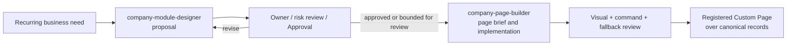

# Skill and CLI Contracts: Company OS Operator Suite

```text
status: mixed — Company OS operator suite installable; Docs, Work, Organization, Approval, and Finance baseline dedicated CLI implemented; governed OrgChangeProposal and deeper Finance lifecycle remain planned
owner_role: product + platform
canonical_for: optional Agent capability inputs, outputs, and governance boundaries
```

## Purpose and non-authority

The Company OS operator suite reduces variance when Agents bootstrap commercial
projects, operate company memory, durable work, organization authority, finance
state, module design, and code-declared business pages.

Install it into both Claude Code and Codex project skill roots with:

```bash
scripts/install-skill.sh --agent both --suite company-os
```

The suite currently expands to:

| Skill | Owning surface | Implementation status |
| --- | --- | --- |
| [`company-business-project-bootstrap`](../../skills/company-business-project-bootstrap/SKILL.md) | High-level commercial-project bootstrap across Docs IA/page contracts, Work, Org, Finance, external software/social sources, and custom pages | procedural orchestration skill |
| [`company-docs-operator`](../../skills/company-docs-operator/SKILL.md) | Docs: Document, Block, page contract, TypedRecord, Relation, View, BusinessModule, custom page metadata | dedicated `harness company docs ...` CLI implemented |
| [`company-work-operator`](../../skills/company-work-operator/SKILL.md) | Work: WorkItem, Milestone, Assignment, lifecycle, Approval links, execution/result refs shown through Docs page contracts | dedicated `harness company work ...` CLI implemented for list/query/create/update/assign/transition/close plus `work milestone ...` baseline lifecycle |
| [`company-finance-operator`](../../skills/company-finance-operator/SKILL.md) | Finance: Commitment, Payment, invoice, refund, monetary metrics and evidence linked into Docs page contracts | dedicated flat `harness company finance ...` plus nested `commitment/payment ...` baseline CLI implemented; budget/invoice/refund/reporting and settlement depth remain planned |
| [`company-org-operator`](../../skills/company-org-operator/SKILL.md) | Organization: Human, Standing Agent, OrgUnit, role, permission, lifecycle and actor refs for Docs page context | dedicated flat `harness company org ...` plus nested `actor/unit/membership ...` baseline CLI implemented; proposal/promotion/grant-revoke workflows remain planned |
| [`company-module-designer`](../../skills/company-module-designer/SKILL.md) | Business module design, page contracts, frontend surface intent, and governance proposal | procedural design skill |
| [`company-page-builder`](../../skills/company-page-builder/SKILL.md) | Code-declared custom page design/implementation from approved page contracts, visual expected images, and actual verification | procedural page-building skill |
| [`dogfood-company-os`](../../skills/dogfood-company-os/SKILL.md) | Repeated, evidence-backed Company OS self-hosting across Docs, Work, Organization, external delivery, execution, and result return | procedural composition skill |
| [`connect-github-company-os`](../../skills/connect-github-company-os/SKILL.md) | GitHub repository/source observation and software-delivery evidence correlated to Company OS records without replacing company truth | procedural connector skill |
  [`orchestrate-mission-waves`](../../skills/orchestrate-mission-waves/SKILL.md) | Host Lead coordination: Mission, Mission Log, AgentTeam, Works, review, and explicit Host acceptance | team coordination skill (Host-facing) |
  [`collaborate-as-agent-team-member`](../../skills/collaborate-as-agent-team-member/SKILL.md) | Persistent Agent Team Member: Works board, lifecycle, mailbox, blocker, submission, and native session | team coordination skill (Member-facing) |

This eleven-Skill suite includes the dogfood and GitHub connector packages
because its bootstrap and operator Skills delegate work to them. Installation
must preflight the complete suite and fail before writing either agent target
when any delegated Skill package is missing.

These are procedural capabilities, not part of the Company OS data model and
not an authority for product, organization, security, finance, or legal
decisions.

For real commercial projects, the operator suite must produce more than a
folder tree or a sequence of CLI writes. It must define the operating page
architecture, write the corresponding page contracts and business facts into
the selected Company Store, and then link Work, Organization, Finance, external software
sources, Views, and any custom page presentation to those contracts. A page such
as a commercial Project Home or Business Model page is not accepted when it
only contains generic prose; it must be legible to humans in UI and operable by
Agents through CLI/API. Seed or materialization scripts may remain acceptance
fixtures, but they are not the normal authoring path for a registered project
Store.

`agent-company` is the active local Company Store for the first real commercial
dogfood path: Wanchengwanling and AgentOS dogfood records now live in the same
Company Store. The older `new-day-wanchengwanling` project-derived Store is
compatibility/migration evidence, not the normal operating target. The
Wanchengwanling GitHub `dev` branch is an external software product source;
commercial operating truth must remain in Company OS records through Docs,
Work, Organization, Finance, source-sync records, and custom page definitions.

Social/content platforms follow the same rule. Xiaohongshu, WeChat Channels,
Douyin, WeCom, ecommerce, logistics, and future channels enter through
gateway observations, platform-account TypedRecords, content campaign/post
records, WorkItems, and evidence refs. Platform-specific operations should be
packaged as plugins that provide:

- a Skill for Agent operating procedure and policy boundaries;
- a selected transport for concrete actions, such as an existing CLI (`gh`),
  MCP tool, plugin-owned CLI adapter, official API, browser automation, or
  phone automation;
- a connector for syncing external account/message/order/logistics/metric
  state into Company OS records; and
- view extensions that declare how synced records appear in Docs, Work,
  Organization, and Agent detail surfaces.

`harness company gateway social readiness` is a read-only device/API readiness
probe retained as a core bootstrap. It does not log in, publish, delete, pay
for promotion, export private messages, or mutate Company Store truth by
itself. Full social operations such as media upload, title/body/topic fill,
publication submit, comment/private-message sync, profile management, paid
promotion preparation, and analytics sync belong in platform plugins. They may
be invoked through MCP or through plugin-owned CLI commands, but their durable
effects must return as governed Company OS Actions, typed records, relations,
WorkItems, metrics, and evidence.

## Company Store selection

All operator skills must make Store selection explicit before reading or
writing durable company records:

```bash
harness company current
harness company init --id <company-id> --name <display-name>
harness company migrate-from-project --from-project <project-id|path> --id <company-id> --name <display-name>
harness company migrate-from-project --from-project <project-id|path> --id <company-id> --verify-only
harness --company <company-id> company migrations
harness --company <company-id> company docs query --document <doc-id>
HARNESS_COMPANY=<company-id> harness company work list
```

If no Company is selected, current commands still fall back to the
project-derived compatibility Store. That fallback is allowed for legacy reads
and migration work, but new dogfood/company operations should prefer an
explicit Company Store. `migrate-from-project` copies only `company_os_*.jsonl`
ledgers and must not be treated as Execution Space, Project Binding, provider
session, prompt, or runtime migration. A successful copy or `--verify-only`
run proves every exact source row remains present in the destination, appends
an audit record to `company_store_migrations.jsonl`, and writes an advisory
source marker. The marker recommends read-only audit use but does not falsely
claim filesystem write enforcement.

Docs are **Agent-operated and Human-reviewed**. Skills and CLI/API are the main
Agent interface for reading, editing, governing, and verifying document truth.
The UI is primarily for Humans to inspect, review, approve, and supervise what
Agents maintain. UI editing can exist for necessary low-risk actions, but it is
secondary to the CLI/API command surface and cannot be the only proof that a
Docs capability is implemented.

The capability is optional: a human team or another Agent can use the same
Company OS contracts without invoking a skill. The `SKILL.md` files are concise
operating aids that point back to canonical docs and avoid duplicating product
contracts.

Governance Agents may be configured with these skills, but their authority
still consists of explicit responsibility, prompt, tools/Skills, permissions,
maintained Docs, accepted WorkTypes, and escalation. A Skill is never installed
or invoked merely because an Agent has a governance title, and it never expands
that Agent's permission policy.

The first implemented Docs Governance primitives are CLI-backed and exposed
through the optional [`company-docs-operator`](../../skills/company-docs-operator/SKILL.md)
skill. The surface includes read/query commands (`query`, `search`,
`traverse`, `refs`, `related`, `health`, `snapshot`, `diff`,
`change-report`), governance authoring (`module create`,
`page-definition create`, `page scaffold`, `page verify`, `page publish`),
and governed maintenance for `document create|rename|move|archive`,
`template create|status`, `block append|update|archive|remove|reorder`,
`typed-record append|update|validate`, `view create|update`, and
`relation link|unlink|relink|repair-missing`.

External software source sync is Company Store-routed and observes an external
Git worktree. `--company` selects where Company OS truth is written;
`--repo-path` selects the software source being observed.

```bash
harness --company <company-store-id> company docs source sync \
  --definition <custom-page-definition-id> \
  --module <business-module-id> \
  --source-document <document-id> \
  --actor <human-or-agent-id> \
  --repo-path <local-git-worktree> \
  --repo <owner/repo> \
  --branch <branch> \
  --project-id <external-software-project-id> \
  --path docs/prd \
  [--path docs/architecture] \
  [--dry-run]
harness company docs view create \
  --definition <custom-page-definition-id> \
  --module <business-module-id> \
  --title <title> \
  [--mode table|board|timeline] \
  --source-kind typed_record \
  [--query-json '{"filters":[{"field":"record_type","value":"trademark_application"}],"group_by":"lifecycle_status","sort_by":"updated_at"}'] \
  --actor <human-or-agent-id>
harness company docs relation link \
  --definition <custom-page-definition-id> \
  --from-document <document-id> \
  --to-record <typed-record-id> \
  --actor <human-or-agent-id>
harness company docs relation unlink \
  --definition <custom-page-definition-id> \
  --relation <relation-id> \
  --actor <human-or-agent-id> \
  (--dry-run | --confirm)
harness company docs relation repair-missing \
  --definition <custom-page-definition-id> \
  --actor <human-or-agent-id> \
  (--dry-run | --confirm)
```

`docs query` is the first read command Agents should run before mutation. It is
read-only over the current latest Company OS projection and returns the selected
Document or module root, ordered Blocks, child Documents, templates,
source-linked TypedRecords, Relations, Views, BusinessModule, page-definition
and policy context, scoped health findings, available commands, and explicit
side-effect boundaries. It does not create WorkItems, Approvals, Finance
records, Organization changes, execution runs, or UI-only state.
`docs source sync` is the first external software product-source mapping
command. It reads a local Git worktree and writes Docs `TypedRecord` rows for
`external_project`, `product_doc_source`, `product_doc_snapshot`, and
`source_sync_run`, plus an idempotent `Document → source_for → TypedRecord`
Relation for each row, preserving repo, branch, commit, path, content hash,
headings, and source class. The command treats GitHub/webhook delivery as a
transport, not authority: it does not create WorkItems, approve spending,
change Organization, mutate Finance, overwrite commercial truth, execute
GitHub actions, or claim software delivery completion. Use the top-level
`--company` option to select the Company Store and command-level `--project-id`
to name the external software source; these are intentionally different
identifiers.
`docs health` remains the broader read-only structural audit over the current
Company OS projection.
`docs document rename`, `docs document move`, and `docs document archive` are
governed structure-maintenance commands. They update the latest Document row
through `document.append`, preserve existing blocks and references, keep
identity fields immutable, and support dry-run before dispatch. `move` may
change `parent_document_id` inside the same DocumentSpace but cannot move a
Document under itself or create a parent cycle. `archive` requires `--confirm`
unless it is a dry-run. These commands are Docs-only; they do not create Work,
Approval, Finance, Organization, Execution, or UI-only state.
`docs block update`, `docs block archive`, and `docs block remove` are governed
content-maintenance commands. `block update` writes a new latest Block row
through `block.append` while preserving Block identity and keeping
`Document.block_ids` unchanged. `block remove` writes only a Document update to
remove the Block from visible order while preserving the Block row. `block
archive` writes archived metadata into `Block.content` and removes the Block
from visible order. Archive/remove require `--confirm` unless they are
dry-runs. None of these commands physically delete records or imply Work,
Approval, Finance, Organization, Execution, or UI-only state.
`docs module create` and `docs page-definition create` are governance-level
authoring commands: they use the administrative Company OS API envelope, require
a Human `company_os.admin` authority, create the BusinessModule/fallback View
and CustomPageDefinition/package/policy bundle, and do not authorize Work,
Finance, Organization, or Execution effects. `docs module create` may also
preserve explicit BusinessModule relation rules such as Document →
TypedRecord `source_for`; this declares a policy but does not create any
TypedRecord or Relation by itself.
`docs document create --root` is the CLI bootstrap for a new DocumentSpace or
top-level operating area inside the selected Company Store. It requires a Human
admin authority and writes only a root Document; module, PageDefinition,
TypedRecord, Relation, Work, Finance, and Organization records remain separate
governed commands.
`docs template create` constructs an explicit reusable
`Document(kind=template)` instead of mutating an existing page's identity. With
`--from-document`, it copies the source Document's ordered native Blocks into
the new template through governed `block.append` plus `document.append`
updates. The source Document keeps its original kind, block list, references
and relations. `docs template status` updates only that template Document's
`lifecycle_status` through governed `document.append`; it refuses non-template
Documents and does not change existing child Documents that already recorded
the template through `template_ref`. `docs document create` constructs a scoped child
`document.append` command and can preserve a `template_ref` provenance pointer
when `--template` is supplied. By default it records provenance only. With
`--instantiate-template`, it also copies the template Document's ordered native
Blocks into the child Document through governed `block.append` plus
`document.append` updates. These template commands still do not create
TypedRecords, WorkItems, Relations, Approvals, or Finance effects.
When a module declares a Document → TypedRecord relation rule, agents still
create the TypedRecord and concrete Relation through `typed-record append` and
`relation link` as separate governed actions after the child Document exists.
Later structured truth maintenance uses `typed-record update` and `relation
unlink`; it must not rewrite source Documents, create WorkItems, or physically
delete Relation rows.
`docs block append` creates a Block and then appends the updated source
Document so `Document.block_ids` stays navigable. It supports text shorthand
and structured `--kind`/`--content-json` content for `rich_text`, `heading`,
`callout`, and simple `table` Blocks. The Document Focus UI may expose slash
commands for selecting those Block kinds, but the durable effect is still the
same governed `block.append` plus `document.append` pair. Block reorder remains
a governed `document.append` wrapper: it may change only `Document.block_ids`
order and must preserve exactly the existing Block set. Drag/drop UI is still a
presentation layer over that command, not a separate truth. `docs typed-record append`
creates a source-linked TypedRecord inside a declared BusinessModule.
`docs typed-record update` writes a new latest TypedRecord row through
`typed_record.append`; it may change title, fields, and lifecycle status, but
must preserve the record id, module id, record type, source Document ref,
creator, and creation time. With `--merge-fields`, incoming JSON object keys
overlay existing fields; without it, `--fields-json` replaces the full fields
object. Dry-run returns the before/after record without dispatching a write.
`docs view create` creates a standard View under a BusinessModule and may
persist table/board/timeline mode plus source-kind and JSON query configuration
for simple filter, grouping, and sorting. That configuration is presentation
truth in the native `View`; it does not create a second record store or mutate
the underlying TypedRecords. `docs
relation link` constructs a standard `relation.append` ActionCommand with an
active lifecycle state. `docs relation unlink` writes a new latest Relation row
through `relation.append` with `lifecycle_status=archived`; it preserves the
Relation id, endpoints, relation type, provenance, creator, and creation time,
requires `--confirm` unless dry-run, and never physically deletes history.
Active `docs query` and health projections ignore archived Relations, so a
previously satisfied Document → TypedRecord policy may correctly resurface as a
missing-relation finding after unlink. These
ordinary write commands all dispatch through the same governed Action transport
used by Store-live UI. They do not receive a general store-write client and
require the normal `HARNESS_COMPANY_OS_TOKEN` write capability plus a matching
`CustomPageDefinition` policy.

## Shared operating rules

These skills must:

- treat CLI/API as the primary Agent interface and UI as Human review context;
- identify assumptions, unknowns, affected owners, risk, and permissions
  before proposing a durable change;
- treat Documents, TypedRecords, Relations, Views, WorkItems, Approvals,
  FinancialRecords, and ActorRefs as canonical objects rather than inventing
  page-local substitutes;
- use the [Module Design](module-design.md), [Document System](document-system.md),
  [WorkItems and Approvals](work-items-and-approvals.md), and
  [Governance](governance.md) contracts as constraints;
- preserve provenance and give every proposed migration a rollback or safe
  non-destructive path;
- keep ordinary chat, provider transcripts, and private reasoning out of
  durable output; and
- make no claim that a proposal, code change, or visual comparison has passed
  policy approval unless the relevant review and Approval records prove it.

No skill gets a general store-write client. Any write it initiates uses
declared, policy-checked commands, and any required Approval remains a real
first-class decision.

## Gateway plugin operator contract

Gateway plugins are optional capability packages, not Company OS authority.
They may include Skills, connector daemons/jobs, view declarations, and one or
more operation transports. A transport can be an existing tool such as `gh`,
an MCP tool, a plugin-owned CLI adapter, official API calls, browser
automation, or phone automation. A plugin should expose a manifest naming:

- external platform and supported transports (`mcp`, `plugin_cli`,
  `existing_cli`, `phone_automation`, `browser_automation`, `official_api`, or
  another reviewed transport);
- supported actions and whether each action writes external state, reads
  private data, or implies financial/legal/security risk;
- Company OS record types and relation types it emits;
- required Actor permissions and Human/Finance/Approval gates;
- idempotency keys, evidence outputs, failure semantics, and rollback/retry
  boundaries; and
- view extensions and their fallback standard Views.

The operation path is:

```text
Agent reads Docs/Work/Org context
  -> uses platform Skill
  -> calls the selected transport: existing CLI, MCP tool, plugin CLI, API,
     browser automation, or phone automation
  -> plugin action/connector returns structured observation or effect
  -> Company OS writes governed records / relations / WorkItems / evidence
  -> Docs, Work, Org, and Agent detail views render those records
```

For GitHub specifically, the first priority is connector sync and views. Agents
already have a mature `gh`/Git operation path, so the plugin should first use
`gh` or GitHub API/webhook observation to sync issues, PRs, checks, reviews,
and source snapshots into Company OS. A new MCP server or dedicated plugin CLI
is optional later, not a prerequisite for the first GitHub connector slice.

A plugin view extension is presentation over Company OS truth. It can provide
an account overview, inbox queue, content calendar, post performance table,
merchant/order/logistics panel, or Agent detail gateway panel. It cannot own
business facts, store an alternate task list, hide required approvals, or
mutate external systems without an explicit Action and policy gate.

Private-message, merchant-chat, customer-data, account-settings, publication,
delete, paid-promotion, order, payment, and logistics actions must declare
their risk class. The default is prepare/sync/review first; submission,
external reply, publish, paid promotion, payment, and destructive changes
remain gated unless the account and Actor policy explicitly allow automation.

## `company-docs-operator`

### Job

Use this skill when a Governance Agent or business Agent needs to inspect or
operate Docs through the implemented CLI/API path: structure health, child
Document creation, structured Block append, TypedRecord append, View creation,
and Document ↔ TypedRecord Relation linking.

Do not use it to design a new recurring business module, grant authority,
approve spending, file legal submissions, create custom UI code, or silently
rewrite company memory. Those cases escalate to module design, Organization,
Finance, Work Approval, or page-builder contracts as appropriate.

### Required input

| Input | Requirement |
| --- | --- |
| Operating intent | What document truth needs to change and why. |
| Source context | Current Document, module, record, relation, health finding, or projection evidence. |
| Actor | Human or Agent responsible for the change. |
| Policy context | CustomPageDefinition, capability token, or Human admin authority when required. |
| Boundary | Confirmation that Work, Organization, Finance, and Execution side effects are not being implied unless explicitly routed through their own commands. |

### Required output

The skill produces a short operation note:

```text
selected command
source and target native object refs
actor and permission assumption
idempotency / capability requirement
expected native effects
negative side-effect assertions
verification command and result
remaining planned/gated gaps
```

### Completion rule

The skill is complete only when the relevant native rows and invariants can be
verified. For example, a Block append is incomplete if the Block row exists but
the owning Document's `block_ids` does not reference it. A visual page or
fixture is not sufficient evidence by itself.

## `company-work-operator`

### Job

Use this skill when an Agent needs to inspect, create, assign, transition, or
close native WorkItems and Milestones through the governed CLI/API path. Work
owns durable commitments, accountability, lifecycle, assignment, approval
links, execution refs, result provenance, and WorkItem detail fields. It does
not own Docs structure, Organization membership, Finance state, or
Mission/Wave execution lifecycle.

### Required input

| Input | Requirement |
| --- | --- |
| Source context | Source Document or TypedRecord that explains why the WorkItem exists. |
| Work detail | Title, objective, description when needed, acceptance criteria, context refs, WorkType, business line, and Milestone when known. |
| Responsibility | Submitter, requester when known, accountable owner, assignees, contributors, reviewer, and approver as distinct ActorRefs. |
| Side-effect boundary | Whether the work is direct, execution-linked, finance-linked, approval-gated, external, or mixed. |

### Required output

The skill reports the created or updated native Work refs, assignment refs,
source/result refs, approval refs, finance refs if any, execution refs if any,
and remaining gaps. New WorkItems should preserve enough machine-operable
detail for an Agent to execute without scraping prose:

```text
description
acceptance_criteria
context_refs
deliverable_refs
```

### Completion rule

The skill is complete only when `harness company work query` and/or
`harness company work list` can reconstruct the WorkItem, its role chain,
detail fields, source/result provenance, and linked assignment/approval
context. A document paragraph, chat message, fixture, or visual page alone is
not a completed WorkItem.

## `company-module-designer`

### Job

Use this skill when a recurring, cross-functional, regulated, or structurally
new business domain may need a `BusinessModule`, or when an existing module
needs a significant redesign. Do not use it simply to create a one-off page or
to make a page visually distinctive.

### Required input

| Input | Requirement |
| --- | --- |
| Business need | Problem, intended outcome, boundary, sponsor/accountable owner, and why existing documents/modules may be insufficient. |
| Existing context | Permitted documents, spaces, record types, relations, Views, policies, organization, and relevant historical data. |
| Operational loop | Recurring triggers, work/result path, participants, external systems, and failure/escalation path. |
| Control context | Finance, legal, privacy, retention, permissions, separation-of-duties, and human-only decision requirements. |
| Change constraints | Migration tolerance, reversibility, integrations, target timing, and explicit unknowns. |

If context is missing, the output is an investigation/decision request rather
than fabricated schema or authority.

### Required output

The skill produces a durable **Module Design proposal** and machine-readable
companion specification for review. Together they include:

```text
purpose and module boundary
owning DocumentSpace and navigation
documents, templates, TypedRecord types, lifecycle states, and retention
Relations with direction/cardinality and canonical source rules
Views, metrics, and reporting definitions
Actors, organization, responsibility, capacity, and escalation
WorkItem templates with source/result provenance
Finance record types, reconciliation, and approval rules
permissions, automation limits, audit/failure handling
migration, rollback, acceptance checks, owners, and required reviews
```

The companion spec should separate **proposed additions**, **changes to
existing contracts**, **assumptions**, and **decisions requiring human or
owner approval**. It may include a page brief for a later custom view, but it
does not choose or generate a coded UI by default.

### Completion rule

The skill is complete when a reviewer can decide whether to accept, revise, or
reject the proposal and can trace every material fact to permitted context or
an explicitly labelled assumption. It is not complete merely because a schema
or document tree was generated.

## `company-page-builder`

### Job

Use this skill only after a page is justified under
[Agent-Programmable Pages](agent-programmable-pages.md), and only with an
approved or explicitly review-pending module/page specification. It designs
and implements a custom page whose governed `CustomPageDefinition` registers a
versioned `CustomPagePackage`. Its primary job is to make a stable
operating question clear across multiple canonical information types.

It is not the default editor, dashboard generator, access-control mechanism,
or business automation engine. Basic documents and structured pages remain the
default routes for routine work.

### Required input

| Input | Requirement |
| --- | --- |
| Page brief | Stable audience, purpose, primary question, navigation entry/exit, owner, and why standard Blocks/Views are insufficient. |
| Approved data contract | Parent Module/space/document, record types, relation paths, View/query definitions, metric definitions, and data sensitivity. |
| Command contract | Explicit allowed Action Commands, expected state transitions, required approvals, error states, and no-action cases. |
| Experience constraints | Device breakpoints, accessibility, shared UI components, visual language, performance limits, and standard-view fallback. |
| Acceptance fixture | Representative and policy-safe records for normal, empty, pending approval, error, and restricted-permission states. |

The skill must stop for direction when the page brief requires a new data
model, unknown field access, an undeclared command, an external integration,
or a policy change. It hands that work back to module design and governance.

### Required output

The builder produces the following reviewable artifact set:

| Artifact | Minimum contents |
| --- | --- |
| `page-spec` | Page purpose, user question, information priority, target, scoped reads, allowed commands, fallback, owner, and dependency/component versions. |
| Layout options | A small set of reasoned layouts when the hierarchy is not already prescribed; identify the recommended option and trade-offs. |
| Expected design | Expected image(s) and concise responsive/interaction notes, tied to fixture data and the selected layout. |
| Registered view implementation | Custom page code using shared components, declared scoped reads, and only registered Action Commands. |
| Fixture | Representative, non-sensitive data plus expected empty/error/restricted states. |
| Actual capture | Screenshots for declared breakpoints produced from the implementation and fixture. |
| Comparison | Expected-to-actual visual diff/assessment, material deviations, accessibility/interaction observations, and disposition. |
| Fallback verification | Proof that the linked standard Document/Views expose the same underlying records and essential next actions. |

Generated React/HTML is an implementation artifact. It must not contain copied
business facts, embedded secrets, direct persistence calls, policy decisions,
or hidden dependencies that the registered specification does not declare.

### Visual acceptance loop

```text
page brief + approved data/command contract
  -> layout options and expected design
  -> selected design review
  -> implementation against representative fixture
  -> actual screenshots at declared breakpoints
  -> expected / actual comparison
  -> visual, accessibility, command, and fallback acceptance
```

The visual comparison is a decision aid: it records where expected and actual
hierarchy, density, states, or responsive behavior materially differ. It must
not be used to conceal a missing source link, an unapproved command, or an
unmet human Approval requirement.

### Completion rule

The skill is complete only when the registered view has declared scoped reads,
governed commands, a functioning standard-view fallback, and the artifact set
above is reviewable. Final product acceptance additionally requires the
appropriate code, security, accessibility, and module-owner checks; a skill
cannot self-accept its own authority.

## `orchestrate-mission-waves`

### Job

Use this skill when a Host Agent must create, resume, or re-plan a long-running
Mission, coordinate one or more persistent Agent Teams through shared Works,
preserve provider-native sessions across re-plans, review submitted Work, or
close the Mission. Use for Mission context, Mission Log judgment, Works
allocation, Team composition, blocker handling, carry-over, and explicit Host
acceptance.

This is a **team coordination skill**, not a Company OS operator skill. It
operates on execution-plane objects (Mission, AgentTeam, AgentTeamRun, Work,
TeamMessage) rather than company-plane objects (Document, WorkItem,
Organization, Finance). Do not use it to operate Docs, manage Organization
membership, approve spending, or create governed Company OS records.

### Required input

| Input | Requirement |
| --- | --- |
| Mission intent | Durable objective, completion criteria, constraints, and success standard. |
| Current state | Mission Log, linked Teams, Works board, messages, pending interactions, Member/Supervisor health, and native-session bindings. |
| Execution Space and Project Binding | Explicit `HARNESS_SPACE` and `HARNESS_PROJECT` selection. |
| Decision boundary | Work to assign, Members to compose, and acceptance authority for submitted Work. |

### Required output

The skill produces a durable Mission Log judgment entry and the invoked Work
operations. Every responsibility created is writeable Work; Messages explain
coordination without becoming task state. The Host records explicit acceptance
or requested changes for each reviewed Work.

### Completion rule

The skill is complete only when the Mission Log, Works board, TeamMessages, and
WorkDelivery facts are reconstructable from durable store state. A conversation
handoff or visual page alone is not a completed Host cycle. No Work is `done`
without explicit Host acceptance.

## `collaborate-as-agent-team-member`

### Job

Use this skill when a persistent Agent Team Member receives, claims, resumes,
executes, blocks, or submits shared Work; reads its WorkDelivery and message
Inbox; coordinates with the Host or peers; uses provider-native subagents; or
survives review and runtime restart.

This is a **team coordination skill**, not a Company OS operator skill. It
operates on execution-plane objects (Works board, TeamMessage, native session)
rather than company-plane objects (Document, WorkItem, Organization, Finance).
A Member may create follow-up Work but does not create Company OS WorkItems,
manage Organization membership, or approve spending.

### Required input

| Input | Requirement |
| --- | --- |
| Collaboration envelope | `HARNESS_TEAM_RUN_ID`, `HARNESS_MEMBER_RUN_ID`, `HARNESS_BIN`, and current Work identity from `HARNESS_WORK_ID`/`HARNESS_WORK_VERSION`. |
| Work context | Title, Markdown context, completion criteria, owner, owned paths, permission ceiling, and Team roster. |
| Provider session | Native session id and execution driver (`host_driven`, `provider_driven`, or `user_driven`). |

### Required output

The skill produces a durable result summary on Work submission, with
artifact/check refs when the completion criteria require them. Message-linked
conversation explains blockers, questions, or coordination without changing Work
state. Provider-native session records remain the sole execution truth.

### Completion rule

The skill is complete only when the Member submitted Work carries a result
summary, any required artifact/check refs, and the latest Work version matches
the action performed. Host acceptance, not provider completion or submission,
moves Work to `done`. A blocked Work must carry a structured reason; a
submitted Work must never claim Host acceptance.

## Handoff between the skills


```mermaid
flowchart LR
  N["Recurring business need"] --> M["company-module-designer\nproposal"]
  M --> R["Owner / risk review / Approval"]
  R -->|"approved or bounded for review"| P["company-page-builder\npage brief and implementation"]
  P --> V["Visual + command + fallback review"]
  V --> O["Registered Custom Page\nover canonical records"]
  R -->|"revise"| M
```

The module skill establishes *what the business system is*. The page-builder
skill establishes *how an approved subset is presented and interacted with*.
They remain separate because a visually successful page cannot validate a poor
record/relation model, and an excellent module design does not itself justify
custom code.

## Trademark Management walkthrough

For `CN-2026-018`, `company-module-designer` receives the brand request,
existing Brand & IP context, the ¥3,000 filing need, and policy constraints. It
proposes the `TrademarkApplication` record, relations to source documents,
WorkItems, Approvals, legal evidence, and canonical `FinancialRecord`s; it
names the Brand Owner, Trademark Agent, External Lawyer, and required reviews.
Finance and legal/human approval remain decisions outside the skill.

After that contract is reviewed, `company-page-builder` may receive a page
brief for the Trademark Management home: "What applications require a decision
or legal action, and what costs are committed or awaiting approval?" Its
scoped reads include application status, deadlines, WorkItems, Approval state,
and finance Views. Its allowed commands could create an application, link
materials, create a WorkItem, or request an approval. It cannot file a mark,
approve ¥3,000, or settle a payment.

The builder generates the expected management-home image, implements the
registered view, captures it with an application awaiting the ¥3,000 approval,
and compares it to the expected image. If the renderer fails, users still open
the module document and standard application, finance, work, and approval
Views. The details of the underlying operating loop remain those in the
[trademark registration example](examples/trademark-registration.md).
