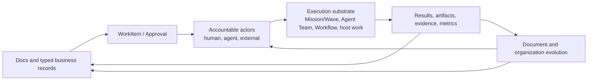

# AI Company OS Vision

```text
status: canonical product vision
owner_role: product
canonical_for: AI Company OS thesis, dual cores, and document-driven operating loop
```

## Thesis

An AI-native company needs more than agents that can run tasks. It needs a
durable way to understand its business, decide what should happen, assign
accountability, preserve evidence, and reorganize itself as new work appears.

Star Harness provides that operating system through two equal cores:

- **Docs** are the company’s memory and operational hub. They hold context,
  business records, plans, decisions, relations, metrics, and the durable
  results of work.
- **Organization** is a mixed team of humans, Standing Agents, and constrained
  external participants. It gives each business area explicit responsibility,
  authority, capacity, and escalation paths.

Docs and Organization are intentionally inseparable: a document without a
responsible actor cannot reliably become action, and an actor without a
documented business context cannot reliably advance the company.

## The operating loop



1. A document or typed business record establishes intent and context.
2. It creates a WorkItem when action is needed, and an Approval when authority
   or risk requires it.
3. Named actors are accountable, assigned, consulted, reviewing, or approving;
   they may execute directly or select the appropriate execution substrate.
4. The resulting artifact, evidence, decision, and metric change update the
   originating document and all related records.
5. When the business introduces a new kind of work, the company can propose and
   approve a new document module, relationship structure, template, role, or
   organizational unit rather than filing it as an orphaned page or chat.

For example, a trademark application links its legal record, source documents,
WorkItems, approvals, evidence, budget, invoice, and payment. Updating the
payment updates the trademark view and finance view because both reference the
same typed financial record, rather than copied text.

## Execution is a substrate, not the product center

Mission/Wave, Agent Team, Dynamic Workflow, host execution, provider sessions,
plugins, and MCP are retained as provider-neutral execution infrastructure.
They answer *how a bounded piece of work ran*. They do not own the long-lived
business context, organizational accountability, or company knowledge model.

- A `Mission` and its ordered `Wave`s can be an execution reference for a
  WorkItem.
- An `AgentTeamRun` is an attempt within a Wave, not a standing department.
- A `MemberRun` is a participation in that attempt, not a durable employee or
  Standing Agent identity.
- A Standing Agent can have explicit assignments across documents and execution
  contexts, but those assignments must be based on stable links, never inferred
  from a matching name, provider session, or chat history.

## Truth and safety boundaries

The company truth layer contains only durable, reviewable information:

- documents and typed records;
- explicit WorkItems, Assignments, and Approvals;
- accountable actors and organization policies;
- decisions, final outputs, evidence, and meaningful metrics; and
- auditable relations between those records.

Ordinary conversation is activity, not an authoritative WorkItem, Assignment,
Approval, or document update. Raw provider transcripts and private model
thinking are not evidence or company knowledge. Thinking may be exposed only as
sanitized, transient live state; it is never persisted, replayed, forwarded to
peers, or used to establish accountability.

## Retirement

The former coordination model is being removed from active product context and
code. Its historical ledgers are exported and verified before deletion and are
never silently reinterpreted as Company OS records. ADR 0028 owns the temporary
migration procedure.

## Product outcome

The result is a company that can grow its own operating structure deliberately:
documents initiate and receive work; people and agents share clear roles;
execution remains observable and provider-neutral; and new domains become
linked business modules instead of disconnected tasks, chats, or dashboards.
