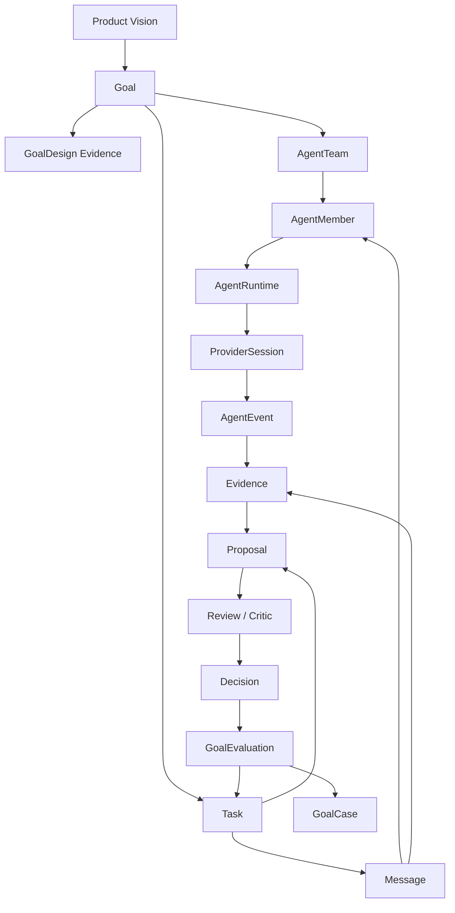

# Concept Model

This document defines the canonical object relationships for Multi-Agent
Harness. It exists to prevent architecture drift: implementation may add
fields, commands, and views, but it must not change the meaning of the core
objects without updating this model first.

## Vision

The product vision is:

```text
Turn a project goal into an agent-operable workflow:
Goal -> Scenario -> Infra -> Agent Team -> Task Graph -> Message Delivery
  -> Evidence -> Proposal -> Review -> Decision -> Goal Evaluation
```

The harness is the coordination and evidence system. Project-specific tools
are connected through adapters.

Source-of-truth rules and gate invariants now live in [data-model.md](data-model.md). This document keeps object meaning, relationship rules, and open-enum vocabularies.

## Core Object Relationships



## Goal And Task

A `Goal` is the durable outcome. A `Task` is the smallest assignable and
reviewable unit of work inside or near that outcome.

Rules:

- a goal owns the objective, success criteria, priority, owner, and closeout
  standard;
- a task may belong to one goal, or no goal only for short administrative work;
- a goal is not complete because all tasks are `done`; it is complete only
  after a decision and goal evaluation show that the success criteria are met;
- task decomposition can change while the goal remains stable;
- follow-up tasks are created when evidence changes the plan.

Failure mode this prevents: replacing a hard goal with a sequence of convenient
tasks and then claiming completion from activity.

## Agent, Goal, And Task

An `AgentMember` is a durable teammate identity. It is not just a provider
thread.

Rules:

- a goal has an owner agent, normally the Leader, who interprets success;
- a task has one owner, zero or one current assignee, and optionally one
  reviewer;
- the owner is accountable for task definition and acceptance criteria;
- the assignee is accountable for producing the task output and evidence;
- the reviewer or critic is accountable for checking evidence and risks;
- workers can propose task splits or follow-ups, but the Leader owns graph
  changes that affect the goal.

Failure mode this prevents: anonymous provider output being treated as owned
work, or a worker silently changing the global plan.

## Task And Message

A `Task` is the canonical work item. A `Message` is the communication and
delivery envelope.

The system intentionally supports `Message(kind=task)` because task assignment
must be visible in the same channel as reports, questions, handoffs, and peer
coordination.

Rules:

- creating a task is not enough to assign it;
- setting `assignee_agent_id` is a projection of assignment state, not by
  itself proof of assignment;
- assigning work requires a `Message(kind=task)` from the Lead or owner to the
  target member or channel;
- the task message should include objective, acceptance criteria, owned paths,
  permissions, expected evidence, and reviewer when relevant;
- a member report is a `Message(kind=report)` linked to the task;
- peer questions and handoffs are normal messages and should link to the task
  when they affect task execution;
- message delivery status records whether the member actually received or
  failed to receive the instruction.

Failure mode this prevents: direct field mutation that makes the Dashboard show
an assigned task even though no agent member received an actionable instruction.

## Task, Evidence, Proposal, And Decision

`Evidence` supports claims. `Proposal` packages a change or conclusion for
review. `Decision` records the accepted outcome or next action.

Rules:

- a task can move to review only when it has evidence or an explicit blocker;
- implementation work should produce a proposal with changed paths, checks, and
  evidence refs;
- critic or reviewer output is evidence, not the final decision;
- the Leader records accept, revise, split, reject, waive, or follow up;
- waivers must name evidence and follow-up tasks instead of weakening the
  workflow silently.

Failure mode this prevents: treating a confident summary as proof or letting a
worker self-merge a cross-module decision.

## Generic Object Model (Review, Gap, Learning Layer, Vision)

The object model was extended with six generic objects so that evaluator
output, defect ledgers, and the learning loop are first-class records instead of
unstructured report messages or flat files. Each object is domain-neutral; the
exact vocabularies are documented below and validated in Rust. The schema
evolution rule (additive-optional, no `schema_version` field) and the design
rationale live in [decisions/0017-generic-object-model.md](decisions/0017-generic-object-model.md)
and [schemas.md](schemas.md).

| Object | Replaces | Rule |
| --- | --- | --- |
| `Review` | unstructured report `Message` | A `Review` is the structured evaluator/critic output: `review_kind`, `verdict`, `summary`, `blockers`, `residual_risk`, `missing_validation`, `evidence_ids`. It is **evidence for** a `Decision`, never the global decision itself. |
| `Gap` | the `product-gap-inbox.md` flat file and a separate bug ledger | A `Gap` is a defect/risk ledger row with `category`, `severity`, `status`, `summary`, and `evidence_ids`. **A Bug is a `Gap` with `category=bug`** plus optional `repro_ref` / `closing_test_ref`. There is no separate Bug object. |
| `GoalDesign` | `Evidence(source_type=goal_design)` | The Lead's executable plan: `scenario_summary`, `non_goals`, `risk_and_permission_boundaries`, `required_infra`, `agent_team`, `task_graph`, `evidence_plan`, `acceptance_gates`. |
| `GoalEvaluation` | `Evidence(source_type=goal_evaluation)` | The evaluator's retrospective: `outcome`, `what_worked`, `what_failed`, missing-infra/evidence, design/graph/dashboard feedback, reusable patterns, anti-patterns, follow-up tasks, proposed goals. |
| `GoalCase` | `examples/goal-cases/<case-id>/` files | A sanitized, reusable teaching artifact distilled from a goal. The committed files remain the human artifact; the schema validates an optional `case.json` manifest. |
| `Vision` | loose `vision_ref` / `vision_summary` fields | A long-lived target a `Goal` points to via `Goal.vision_id`; the next-goal proposal compares a `GoalEvaluation` against the linked `Vision`. |

`Phase` is now a first-class object (`GoalPhase`), superseding the earlier
"a phase is just a `Task` with a `phase` label" model. A `Goal` carries an
agent-planned, sequential `phases: Vec<GoalPhase>`, and a `Task` joins its phase
through `Task.phase_id` (the legacy free-text `Task.phase` label was retired).
See `crates/harness-core/src/lib.rs` (`struct GoalPhase`, `Goal.phases`,
`Task.phase_id`) and the phase model in
[goal-phase-loop.md](goal-phase-loop.md). The phase shape, the phase→task
DAG, and the `goal run-phases` orchestrator shipped in #146–#153.

### Closeout Gate

A `Goal` may move to `complete` only when a closeout `Decision`
(`decision_kind=closeout`) scoped to the goal with at least one backing
`evidence_id` exists **and** a `GoalEvaluation` exists for the goal — or an
explicit waiver `Decision` (`is_waiver=true`) names a follow-up task and backing
evidence. This generalizes "a verdict must be backed by evidence, never activity
alone". The gate is enforced by the CLI `goal close` command and surfaced in the
`goal_learning_status` snapshot. The self-evaluation stop loop generalizes to a
`Decision(decision_kind=stop_gate)` whose `decision` is `stop_approved` or
`continue_required`; `Task.requires_human_approval` blocks auto-advance without
encoding what "dangerous" means (that meaning is supplied by adapters/skills).

### Open-Enum Vocabularies

Useful but domain-flavored taxonomies are **open enums**: a canonical
harness-owned set is modeled in Rust (an enum with an `Other(String)` fallback),
the JSON Schema keeps the field as a free `string`, and adapters may supply
extra values without a schema bump. The canonical sets are:

| Field | Object | Canonical values |
| --- | --- | --- |
| `review_kind` | Review | `acceptance`, `correctness`, `safety`, `design`, `data_flow`, `docs`, `other` |
| `verdict` | Review | `pass`, `fail`, `blocked`, `needs_changes` (let-me-try `keep`/`kill`/`refine` map to `pass`/`fail`/`needs_changes`) |
| `decision` | Decision | `accept`, `reject`, `revise`, `split`, `block`, `promote`, `waive`, `follow_up`, `stop_approved`, `continue_required` |
| `decision_kind` | Decision | `verdict`, `gate`, `stop_gate`, `waiver`, `closeout`, `promotion`, `other` |
| `evidence_kind` | Evidence | `check`, `log`, `session`, `diff`, `review_note`, `screenshot`, `artifact`, `snapshot`, `goal_design`, `goal_evaluation`, `other` |
| `category` | Gap | `ux`, `data`, `observability`, `parity`, `tooling`, `workflow`, `docs`, `bug`, `other` |
| `outcome` | GoalEvaluation | `success`, `partial`, `failed`, `blocked` |

Only truly closed, harness-owned sets use a hard JSON `enum`: `Gap.severity`
(`p0`/`p1`/`p2`) and `Gap.status` (`open`/`in_progress`/`fixed`/`blocked`/
`deferred`/`wontfix`). Harness core carries zero domain vocabulary; a domain
label (for example a market or strategy name) lives in a free `*_detail` /
`source_type` field or in an adapter tool descriptor, never in core.

## Agent Runtime And Provider Session

`AgentRuntime` and `ProviderSession` connect durable members to external agent
providers such as Codex.

Rules:

- the harness owns member identity and task/message state;
- the provider owns model execution and transcript details;
- provider output becomes useful only after it is reduced into messages,
  evidence, events, or proposals;
- hooks are event inputs, not the message bus;
- process health must be represented as lifecycle state, not inferred only from
  pids or stdout.

Failure mode this prevents: the provider becoming the hidden source of truth
for task ownership, status, or acceptance.

## Agent Team Run

An `AgentTeamRun` is one ephemeral wave of cross-provider team execution
attached to a `GoalPhase` (ADR
[0025](decisions/0025-agent-team-run-control-plane.md)). It exists because a
sub-agent is one function call — input task, returned result, stateless to
the caller — while an Agent Team member is a living collaborator with its
own state, mailbox, and responsibility domain, kept accountable for a lane
until acceptance.

| Object | Meaning | Rule |
| --- | --- | --- |
| `AgentTeamRun` | One team execution (a wave) created by the Host Session: objective, status, wave index, member/task ids, budget limit. | A run ends at its integration gate and becomes read-only history; it is not a standing organization. |
| `MemberRun` | A member instance inside one run: role, provider, model, status, provider session, worktree, `owned_paths`. | Released when the run ends; an execution instance, not a durable `AgentMember`. Owns its lane (branch/PR/evidence) until acceptance. |
| `TeamMessage` | Run-scoped communication envelope: kind, correlation/causation ids, evidence refs, plus one delivery record per recipient (policy queue/inject/interrupt/manual_ack, status, attempt count). | Semantics and delivery are separate facts; handoffs and key tasks must be acknowledged, and un-ACKed deliveries re-send and escalate. |
| `MemberAction` | One normalized, auditable action reduced from raw provider output (plan/tool/file/command/test/delegation/review/message/waiting/blocked/completed, plus `thinking` for the reasoning stream) with status and evidence refs. | Thinking actions are derived reasoning: collapsed by default, never execution evidence, never forwarded into other members' contexts. Member live state is derived from actions plus runtime, queue, and heartbeat — never provider self-report. |
| `DelegationRun` | Attribution record for a member's re-delegation: mode (`provider_native` capture, `harness_worker`/`dynamic_workflow` orchestrated), provider, child thread or workflow run, objective, status, evidence. | The harness never schedules a member's sub-agents; capture mode audits after the fact, orchestrated mode enforces depth <= 2, child permissions <= parent, `owned_paths` subset, and budget limits. Unverified capabilities degrade to `dynamic_workflow` and say so. |
| `TeamRunEvent` | Ordered event log for one run with monotonic `seq`, source (host/member/delegation), entity, operation, summary. | The SSE stream and reconnect resume both key on `seq`; payloads are sanitized before storage. |

Relationship rules:

- a wave attaches to a `GoalPhase`; the plan-vs-actual re-plan loop at a
  wave boundary reuses `GoalEvaluation` -> `NextRoundPlan` — Agent Team
  adds no new planning layer;
- `MemberRun.current_task_id` points at ordinary `Task` records, so
  assignment, evidence, and review keep their existing semantics;
- `TeamMessage.evidence_refs` and `MemberAction.evidence_refs` point at
  `Evidence`; nothing here replaces the `Evidence -> Proposal -> Review ->
  Decision` chain.

Failure mode this prevents: treating a fire-and-forget sub-agent pool as a
team — context collapse in the main thread, lanes with no durable owner,
and authorization boundaries crossed by default — or pretending unverified
provider capabilities are unified.

Field-level shapes, delegation guardrails, and the plugin/call-surface split
are owned by ADR [0025](decisions/0025-agent-team-run-control-plane.md).

## Dashboard

The Agent Dashboard is a control-plane projection over harness objects.

Rules:

- Dashboard lanes are read models over goals, teams, members, tasks, messages,
  runtimes, proposals, evidence, decisions, and warnings;
- safe Dashboard actions create or update canonical harness objects;
- project dashboards remain domain-specific and are linked through adapters;
- the Agent Dashboard must show assignment messages and member reports, not
  only task assignees.

Failure mode this prevents: a polished UI that hides whether the harness
workflow really happened.

Gate invariants are maintained in [data-model.md](data-model.md).

## What To Ask Before Adding A Module

Before adding a module, ask:

- which product or workflow problem does it solve;
- which existing module cannot solve that problem without losing its boundary;
- what canonical object or contract it owns;
- what failure mode appears if it does not exist;
- which docs, schema, CLI, Dashboard view, or CI gate will eventually verify it;
- whether the idea should start as docs, skill, schema, CLI/API, Dashboard, or
  plugin.

If these questions cannot be answered, keep the idea as a note or task rather
than adding a new core module.
