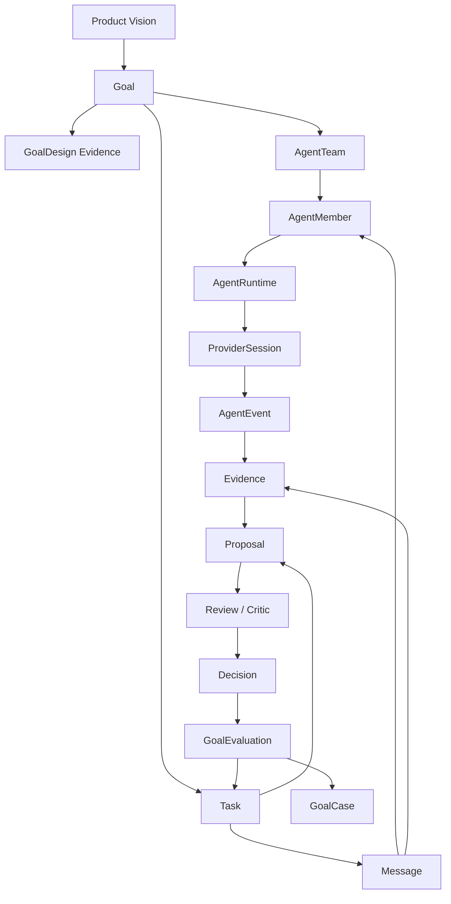

# Concept Model

This document defines the canonical object relationships for Multi-Agent
Harness. It exists to prevent architecture drift: implementation may add
fields, commands, and views, but it must not change the meaning of the core
objects without updating this model first.

## Vision

The product vision is:

```text
Turn a project goal into an agent-operable workflow:
Goal -> Scenario -> Infra -> Agent Team -> Task Graph -> Message Delivery
  -> Evidence -> Proposal -> Review -> Decision -> Goal Evaluation
```

The harness is the coordination and evidence system. Project-specific tools
are connected through adapters.

## Source Of Truth

| Concept | Canonical source | Projection or evidence |
| --- | --- | --- |
| Product purpose | PRD and design basis | README summaries |
| Object meaning | This concept model and schemas | Dashboard labels, CLI help |
| Coordination state | Harness store | Provider transcripts, hooks, logs |
| Work assignment | `Task` plus `Message(kind=task)` | `assignee_agent_id`, Dashboard lanes |
| Runtime execution | `AgentRuntime`, `ProviderSession`, `AgentEvent` | provider stdout, hook payloads |
| Acceptance | `Proposal`, `Evidence`, `Decision` | chat summaries |
| Learning | `GoalEvaluation`, `GoalCase` | follow-up notes |

Provider sessions, hooks, and raw logs are evidence sources. They are not the
coordination state machine.

## Core Object Relationships



## Goal And Task

A `Goal` is the durable outcome. A `Task` is the smallest assignable and
reviewable unit of work inside or near that outcome.

Rules:

- a goal owns the objective, success criteria, priority, owner, and closeout
  standard;
- a task may belong to one goal, or no goal only for short administrative work;
- a goal is not complete because all tasks are `done`; it is complete only
  after a decision and goal evaluation show that the success criteria are met;
- task decomposition can change while the goal remains stable;
- follow-up tasks are created when evidence changes the plan.

Failure mode this prevents: replacing a hard goal with a sequence of convenient
tasks and then claiming completion from activity.

## Agent, Goal, And Task

An `AgentMember` is a durable teammate identity. It is not just a provider
thread.

Rules:

- a goal has an owner agent, normally the Leader, who interprets success;
- a task has one owner, zero or one current assignee, and optionally one
  reviewer;
- the owner is accountable for task definition and acceptance criteria;
- the assignee is accountable for producing the task output and evidence;
- the reviewer or critic is accountable for checking evidence and risks;
- workers can propose task splits or follow-ups, but the Leader owns graph
  changes that affect the goal.

Failure mode this prevents: anonymous provider output being treated as owned
work, or a worker silently changing the global plan.

## Task And Message

A `Task` is the canonical work item. A `Message` is the communication and
delivery envelope.

The system intentionally supports `Message(kind=task)` because task assignment
must be visible in the same channel as reports, questions, handoffs, and peer
coordination.

Rules:

- creating a task is not enough to assign it;
- setting `assignee_agent_id` is a projection of assignment state, not by
  itself proof of assignment;
- assigning work requires a `Message(kind=task)` from the Lead or owner to the
  target member or channel;
- the task message should include objective, acceptance criteria, owned paths,
  permissions, expected evidence, and reviewer when relevant;
- a member report is a `Message(kind=report)` linked to the task;
- peer questions and handoffs are normal messages and should link to the task
  when they affect task execution;
- message delivery status records whether the member actually received or
  failed to receive the instruction.

Failure mode this prevents: direct field mutation that makes the Dashboard show
an assigned task even though no agent member received an actionable instruction.

## Task, Evidence, Proposal, And Decision

`Evidence` supports claims. `Proposal` packages a change or conclusion for
review. `Decision` records the accepted outcome or next action.

Rules:

- a task can move to review only when it has evidence or an explicit blocker;
- implementation work should produce a proposal with changed paths, checks, and
  evidence refs;
- critic or reviewer output is evidence, not the final decision;
- the Leader records accept, revise, split, reject, waive, or follow up;
- waivers must name evidence and follow-up tasks instead of weakening the
  workflow silently.

Failure mode this prevents: treating a confident summary as proof or letting a
worker self-merge a cross-module decision.

## Agent Runtime And Provider Session

`AgentRuntime` and `ProviderSession` connect durable members to external agent
providers such as Codex.

Rules:

- the harness owns member identity and task/message state;
- the provider owns model execution and transcript details;
- provider output becomes useful only after it is reduced into messages,
  evidence, events, or proposals;
- hooks are event inputs, not the message bus;
- process health must be represented as lifecycle state, not inferred only from
  pids or stdout.

Failure mode this prevents: the provider becoming the hidden source of truth
for task ownership, status, or acceptance.

## Dashboard

The Agent Dashboard is a control-plane projection over harness objects.

Rules:

- Dashboard lanes are read models over goals, teams, members, tasks, messages,
  runtimes, proposals, evidence, decisions, and warnings;
- safe Dashboard actions create or update canonical harness objects;
- project dashboards remain domain-specific and are linked through adapters;
- the Agent Dashboard must show assignment messages and member reports, not
  only task assignees.

Failure mode this prevents: a polished UI that hides whether the harness
workflow really happened.

## Anti-Drift Invariants

These invariants should become CLI/API/CI checks as the implementation matures:

1. A goal cannot be closed without a decision and goal evaluation.
2. A task cannot be considered assigned without a prior `Message(kind=task)`.
3. A non-trivial worker claim cannot be accepted without a report message and
   evidence refs.
4. A proposal cannot be accepted by the same worker as a global decision.
5. A failed provider delivery cannot be ignored when it is the only assignment
   path.
6. Parallel file-changing tasks need distinct workspaces, branches, or explicit
   owned-path coordination.
7. Project-specific behavior must enter through adapters, skills, and tool
   descriptors, not generic core runtime code.
8. Repeated manual work must become a CLI, skill, adapter, Dashboard view, CI
   gate, or follow-up task.

## What To Ask Before Adding A Module

Before adding a module, ask:

- which product or workflow problem does it solve;
- which existing module cannot solve that problem without losing its boundary;
- what canonical object or contract it owns;
- what failure mode appears if it does not exist;
- which docs, schema, CLI, Dashboard view, or CI gate will eventually verify it;
- whether the idea should start as docs, skill, schema, CLI/API, Dashboard, or
  plugin.

If these questions cannot be answered, keep the idea as a note or task rather
than adding a new core module.
