# Concept Model

This document defines the canonical object relationships for Star Harness. It
exists to prevent architecture drift: implementation may add fields, commands,
and views, but it must not change the meaning of the core objects without
updating this model first.

Source-of-truth rules and gate invariants live in
[data-model.md](data-model.md). This document owns product meaning,
relationship rules, active vocabulary, and anti-drift invariants.

## Vision

The accepted product vision is:

```text
Turn a project objective into an agent-operable workflow:
Mission -> Scenario -> Infra -> Wave -> executor
  -> Harness coordination / native session refs / artifacts
  -> lightweight Wave gate -> Mission outcome
```

The harness is the coordination and evidence system. Project-specific tools are
connected through adapters.

## Active Vocabulary

Mission/Wave is the only active coordination vocabulary and native contract
for new work. The superseded coordination stack is governed by
[ADR 0028](decisions/0028-retire-goal-phase-task-graph.md) and is not exposed
through product projections or authoring paths. Optional review and evaluation
records may strengthen a high-risk gate, but they do not replace Mission
closeout or become mandatory hierarchy levels.

## Core Object Relationships

```mermaid
flowchart TD
  Vision[Product Vision]
  Mission[Mission]
  Wave[Native Wave]
  TeamRun[AgentTeamRun]
  WorkflowRun[WorkflowRun]
  HostExec[Host execution]
  Message[Message]
  TeamMessage[TeamMessage]
  Member[AgentMember or MemberRun]
  Provider[NativeSessionRef / provider-owned execution]
  Event[Durable event stream]
  Evidence[Artifacts / optional Evidence]
  Gate[Lightweight Wave gate]
  Outcome[Mission outcome]
  Proposal[Proposal]
  Review[Review / Critic]
  Decision[Decision]
  Eval[Optional evaluation]
  Case[reusable learning note]

  Vision --> Mission
  Mission --> Wave
  Wave --> TeamRun
  Wave --> WorkflowRun
  Wave --> HostExec
  TeamRun --> TeamMessage
  TeamRun --> Member
  WorkflowRun --> Event
  HostExec --> Event
  Message --> Member
  TeamMessage --> Member
  Member --> Provider
  Provider --> Event
  Event --> Evidence
  Message --> Evidence
  TeamMessage --> Evidence
  Evidence --> Gate
  Gate --> Outcome
  Mission --> Outcome
  Outcome -. optional governance .-> Eval
  Evidence -. repository governance .-> Proposal
  Proposal --> Review
  Review --> Decision
  Decision -. repository governance .-> Eval
  Eval --> Case
```



## Mission And Wave

A `Mission` is the durable objective. A `Wave` is the lightweight ordered unit
inside a Mission.

Rules:

- a Mission owns objective, success interpretation, priority, and closeout
  standard;
- a Wave owns objective, exit criteria, status, executor reference, outcome,
  and a lightweight gate;
- a Wave does not require or expose a legacy dependency graph as a product concept;
- replanning happens between Waves as an explicit design/update step, not as a
  hidden side effect;
- a Mission is not complete because activity happened; it is complete when its
  Wave gates and explicit closeout summary support the desired outcome. Stricter
  evidence or evaluation may be layered on when the domain or risk requires it.

Failure mode this prevents: replacing a durable objective with a sequence of
convenient implementation steps and then claiming completion from activity
alone.

## Executors

A Wave chooses one executor kind:

- `agent_team`
- `dynamic_workflow`
- `host`

### `agent_team`

Agent Team is for living collaborators with persistent session state, explicit
assignment, handoff, review, and lane ownership inside the Wave.

The target proof is assignment-message correlation:

```text
TeamMessage(kind=assignment)
  -> correlation_id
  -> Harness blocker / handoff / review / PendingInteraction
  -> explicit outcome + artifacts/check refs
  -> NativeSessionRef for member execution detail
```

Automatic handoff preserves this correlation. Manual progress, blocker, review,
and control messages can explicitly reuse the same-run Assignment correlation;
a causation-only reply inherits its direct cause's correlation. Cross-run,
unknown, and mismatched lineage is rejected before persistence.

### `dynamic_workflow`

Dynamic Workflow is a one-shot structured executor. It may share runtime
infrastructure with other executors, but it is not an Agent Team and should not
be described with Agent Team semantics.

### `host`

The Host executor is direct work by the resident Host Agent. The host may use
provider-native subagents internally. Those subagents are optional observation
targets, not canonical child records unless the harness actually controls them.

## Messages And Ownership

Messages remain runtime facts, but a Wave does not contain a task graph. Agent
Team ownership begins with `TeamMessage(kind=assignment)` and its correlation;
Dynamic Workflow owns its steps; Host execution records its observable outcome.
Residual task-named internal fields are removal debt and cannot define a new
product flow.

## Agent Team Objects

`AgentTeamRun` is one wave-scoped execution owned by the `agent_team`
executor kind. It is not a standing organization.

| Object | Meaning | Rule |
| --- | --- | --- |
| `AgentTeamRun` | One team execution attempt for one Wave. | One Wave may have multiple attempts; every terminal attempt becomes read-only history. |
| `MemberRun` | One member instance inside a run: role, provider, model, status, worktree, owned paths. | Exists only for that run; it is not a durable standing employee record. |
| `TeamMessage` | Run-scoped communication envelope with delivery records. | Assignment, handoff, blocker, review, and control messages live here. |
| `MemberAction` | Transitional Harness action row. Target use is limited to Harness-owned coordination/control facts. | Provider tool, command, file, chat, turn, and reasoning streams stay solely in the native provider session. |
| `DelegationRun` | Attribution record for observed or orchestrated delegation. | Parent permissions, paths, and budgets bound the child. |
| `TeamRunEvent` | Transitional ordered event projection for Harness-owned run lifecycle. | It must not become a mirror of provider-native activity. |

Relationship rules:

- a Wave using `agent_team` may instantiate one or more `AgentTeamRun` attempts
  and records which attempt its gate accepted;
- ownership inside the Wave is explained by `TeamMessage(kind=assignment)` plus
  `correlation_id`;
- `TeamMessage`, explicit outcomes, and Harness control facts may reference
  artifacts or `Evidence`; the
  Wave gate needs an explicit outcome and acceptance note but does not require
  Proposal/Review/Decision objects;
- residual task-named runtime fields are removal debt, not the product model or
  a supported ownership path.

## Generic Object Model

The learning and governance layer remains domain-neutral.

| Object | Rule |
| --- | --- |
| `Review` | Structured evaluator or critic output. Evidence for a Decision, never the Decision itself. |
| `Gap` | Defect/risk ledger row. `category=bug` is a bug; there is no separate Bug object. |
| `Evaluation` | Optional structured assessment layered on a high-risk outcome. |
| `LearningNote` | Reusable teaching artifact distilled from a closed Mission. |
| `Vision` | Long-lived target that Missions advance toward. |

## Agent Runtime And Native Session

`AgentRuntime` and `NativeSessionRef` connect durable members, Wave executors,
and host tools to external providers such as Codex, Claude, or Kimi.

Rules:

- Harness owns assignment, interaction routing, responsibility, explicit
  outcomes, artifact/check references, and gates;
- the provider-native store owns model execution, transcript, tool/command/file
  activity, provider turns, and resume state;
- provider output can support an execution claim through its native session
  reference without being copied into Harness;
- hooks are observation inputs, not the canonical message bus;
- runtime health is represented as lifecycle state, not inferred only from raw
  provider output.

Failure modes this prevents: a provider transcript becoming the hidden source
of truth for ownership or acceptance, and a Harness mirror becoming a divergent
second transcript.

## Thinking Policy

The target contract makes thinking transient live-only state.

- It may be shown live when a provider exposes it.
- It is bounded and sanitized.
- It is never persisted in canonical harness history.
- It is never replayable state.
- It is never execution evidence.
- It is never forwarded into another member's context.

Persist only Harness-owned coordination, artifact/check references, blockers,
handoffs, control acknowledgements, and explicit outcomes instead.

No provider thinking may enter a Harness ledger. Provider-derived action rows
are excluded by the implemented ADR 0032 boundary; historical rows do not
define current product state and are not projected as active activity.

## Closeout Gates

The product contract and this repository's current self-hosting governance are
deliberately different:

- a Wave product gate records `accepted | revise | blocked`, the accepted run
  attempt, actor/time, outcome summary, a short note, and useful artifact refs;
- a Mission outcome is based on its Wave gates and an explicit Mission-level
  closeout summary;
- this repository may layer review, evidence, or evaluation on high-risk Waves,
  but those objects are not mandatory for every self-hosting change.

The legacy governance chain must not leak into every Agent Team product Wave as
a mandatory object graph.

## Open-Enum Vocabularies

Useful but workflow-flavored taxonomies remain open enums: harness defines a
canonical starter set in Rust, JSON keeps the field as `string`, and adapters
may add values without a schema bump.

| Field | Object | Canonical values |
| --- | --- | --- |
| `review_kind` | Review | `acceptance`, `correctness`, `safety`, `design`, `data_flow`, `docs`, `other` |
| `verdict` | Review | `pass`, `fail`, `blocked`, `needs_changes` |
| `decision` | Decision | `accept`, `reject`, `revise`, `split`, `block`, `promote`, `waive`, `follow_up`, `stop_approved`, `continue_required` |
| `decision_kind` | Decision | `verdict`, `gate`, `stop_gate`, `waiver`, `closeout`, `promotion`, `other` |
| `evidence_kind` | Evidence | `check`, `log`, `session`, `diff`, `review_note`, `screenshot`, `artifact`, `snapshot`, `historical work design`, `outcome evaluation`, `other` |
| `category` | Gap | `ux`, `data`, `observability`, `parity`, `tooling`, `workflow`, `docs`, `bug`, `other` |
| `outcome` | outcome evaluation | `success`, `partial`, `failed`, `blocked` |

Only truly closed, harness-owned sets should use hard JSON enums.
