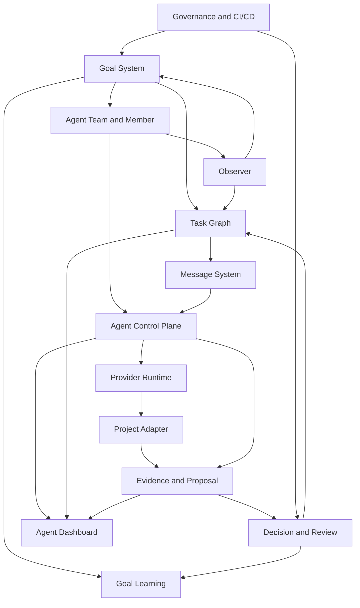

# Core Modules

This document is the product and architecture map for the system we are
building. The PRD explains why the product exists. The architecture explains
how the product is decomposed. This file connects the two by naming every core
module, its product purpose, its source of truth, and the contract it must
eventually expose through CLI/API/Dashboard.

The canonical relationships between goals, tasks, agent members, messages,
evidence, proposals, and decisions are defined in
[concept-model.md](concept-model.md). This document explains why each module
exists; the concept model explains how the objects are allowed to relate.

## Product Shape

Multi-Agent Harness is not only an agent runner. It is a control system for a
standing team that can observe a project, propose goals, adjust the task graph,
and turn accepted work into durable multi-agent execution:

```text
Standing AgentTeam
  -> Observation and proposed goal / graph change
  -> Goal
  -> Scenario and infra design
  -> Agent team
  -> Task graph
  -> Message-driven execution
  -> Evidence, proposal, critic, decision
  -> Goal evaluation and reusable case
```

The product is useful only if it makes agent work shorter, more observable,
and easier to judge. Each module below exists because one of those properties
cannot be solved by provider chat alone.

## Problems Each Module Solves

The modules are defined by the problems they solve, not by folders or
implementation convenience.

| Module | Problem it exists to solve | Failure mode if missing |
| --- | --- | --- |
| Goal System | Preserve the durable "why", success criteria, and closeout standard for a body of work. | Agents chase chat momentum, close work without proving the objective, or replace unclear goals with new vague goals. |
| Scenario And Infra Design | Force the Lead to understand the domain workflow and decide which CLI, skill, adapter, dashboard, or CI/CD surface would shorten future work. | Agents edit code too early, repeat manual inspection, and rely on the user to re-explain project facts. |
| Agent Team And Member System | Turn anonymous provider sessions into accountable teammates with roles, prompts, skills, permissions, ownership, and long-lived responsibility. | Work cannot be attributed, reviewed, resumed, or continued because agents are treated as one-shot jobs. |
| Observer System | Continuously inspect Dashboard warnings, CI, adapters, stale tasks, prior cases, and project state, then propose goals or graph changes. | The system waits for the user to discover every next task, so it cannot self-improve or keep momentum. |
| Agent Control Plane | Operate persistent members through lifecycle, busy/idle state, inbox/outbox, queue policy, peer messages, autonomous proposals, and event reduction. | The Dashboard shows a roster but cannot tell what each member is doing, what is queued, or whether the team is generating useful next work. |
| Task Graph System | Decompose goals into assignable, parallelizable, blocked, reviewable, accepted, and dynamically adjustable work units. | Multiple agents collide on the same work, dependencies are hidden, and "done" has no acceptance boundary. |
| Message System | Make assignment, task reports, questions, handoffs, and review requests replayable. | Critical coordination stays in private chat or provider transcripts and cannot be audited by future agents. |
| Provider Runtime System | Connect harness members to Codex and later providers while keeping harness state authoritative. | Provider chat becomes the source of truth, delivery health is guessed from stdout or pids, and failed turns are not reconstructable. |
| Project Adapter System | Let the generic harness use a real project through stable commands, evidence policy, permissions, and links without importing domain logic. | The generic core becomes polluted with project-specific behavior, or agents fall back to broad unstructured reading. |
| Evidence, Proposal, And Review System | Make claims, diffs, checks, critic findings, and acceptance decisions inspectable before integration. | Summaries are treated as proof, weak changes pass review, and later agents cannot verify what happened. |
| Decision And Goal Learning System | Convert outcomes, waivers, failures, and lessons into reusable future guidance. | The same workflow mistakes recur because every goal ends as chat memory instead of a case or follow-up task. |
| Agent Dashboard | Give humans and agents a shared control surface for goals, teams, members, tasks, messages, evidence, proposals, decisions, and warnings. | The system is technically present but operationally invisible; the user must inspect raw JSON and logs to manage it. |
| Governance And CI/CD | Turn stable promises into executable checks across schemas, docs, skills, adapters, runtime behavior, and dashboard views. | Contracts drift silently and future agents trust stale docs or broken command surfaces. |

## Module Map



The source of truth is the harness store plus versioned repo artifacts. Provider
threads, transcripts, hooks, and project dashboards are evidence sources, not
the canonical coordination state.

## Goal System

PRD purpose: make work judgeable. A goal gives the Leader a durable objective,
owner, success criteria, priority, and closeout condition.

Architecture boundary:

- owns `Goal` identity, objective, owner, status, priority, and success
  criteria;
- starts the design loop before tasks are assigned;
- refuses vague chat momentum as a completion signal.

Primary objects: `Goal`, `GoalDesign` evidence, `GoalEvaluation` evidence.

Done when: a future agent can answer why the work existed and which evidence
proved or blocked completion.

## Scenario And Infra Design

PRD purpose: prevent agents from treating every request as "edit code now".
The Lead first understands the project scenario and decides which missing CLI,
skill, adapter, dashboard, or CI/CD surface would shorten the work.

Architecture boundary:

- owns scenario workflow, non-goals, infra gaps, permission model, and planned
  evidence;
- creates follow-up tasks when repeated manual work appears;
- refuses hidden local reasoning as the normal operating path.

Primary objects: `GoalDesign` evidence, task graph, adapter descriptors,
skills, docs, CI checks.

Done when: a goal can be decomposed into infra plus agent-team work without
requiring the user to repeatedly explain the same project facts.

## Agent Team And Member System

PRD purpose: make agents accountable teammates, not anonymous transcripts. A
team expresses role composition; a member expresses durable identity. A
standing team should survive across tasks and goals.

Architecture boundary:

- owns `AgentTeam`, `AgentMember`, role, description, prompt refs, skill refs,
  provider selection, capability hints, worktree refs, and permission profile;
- separates harness members from provider-native subagents;
- refuses to treat one-shot helper output as durable member work unless it is
  ingested as a report and evidence.

Primary objects: `AgentTeam`, `AgentMember`, prompt files, skills.

Done when: the Dashboard can show who is on the team, what each member owns,
what they are allowed to do, whether they are active, and how their role
continues across multiple messages or goals.

## Observer System

PRD purpose: make the team self-progressing. Observer is a role and eventual
projection that turns system state into proposed work.

Architecture boundary:

- watches Dashboard warnings, stale tasks, queued messages, provider sessions,
  CI results, adapter outputs, and prior GoalCases;
- produces proposed goals, blockers, graph-change proposals, and follow-up
  tasks for Lead acceptance;
- refuses to make final priority decisions or silently mutate the task graph.

Primary objects: `AgentMember(role=observer)`, `Message`, `Evidence`,
proposed `Goal`, proposed `Task`, `Decision`.

Done when: a future Lead can see which observations generated which proposed
goals or task changes, why each was accepted or rejected, and what evidence
supported the proposal.

## Agent Control Plane

PRD purpose: make the team operable. The control plane handles create/start,
busy/idle state, inbox/outbox, peer messages, reducer output, and close.

Architecture boundary:

- owns member lifecycle, message queue policy, active-turn state, event
  reducer, child-thread visibility, and Dashboard actions;
- takes provider events and hooks as inputs, then reduces them into stable
  harness objects;
- refuses to use hooks as the message bus or a roster as proof of teamwork.

Primary objects: `AgentRuntime`, `Message.delivery`, `AgentEvent`,
`ProviderSession`, `ProviderChildThread`.

Detailed contracts: [agent-runtime.md](agent-runtime.md) for provider-neutral
runtime and [agent-control-plane.md](agent-control-plane.md) for lifecycle,
queues, peer messages, and reducer behavior.

Done when: a user can see what each agent is doing, which message it is
handling, what is queued, what is blocked, and whether delivery is healthy.

## Task Graph System

PRD purpose: turn a goal into assignable, reviewable work. The task graph lets
the Leader split, parallelize, block, reassign, and accept work.

Architecture boundary:

- owns `Task`, dependencies, parent/child decomposition, owner, assignee,
  reviewer, workspace, branch, PR, owned paths, status, and acceptance criteria;
- expresses concurrency through separate tasks and worktrees;
- refuses unowned TODOs as meaningful work units.

Primary objects: `Task`, `Proposal`, worktree refs, branch refs.

Detailed workflow: [workflow-git-pr.md](workflow-git-pr.md) for worktree,
branch, PR, proposal, review, and decision integration.

Done when: the task graph explains what can run now, what is blocked, who owns
each piece, and what acceptance requires.

## Message System

PRD purpose: make collaboration reconstructable. Assignments, peer questions,
reports, handoffs, and review requests all flow through messages.

Architecture boundary:

- owns `Message`, sender, recipient or channel, task ref, kind, content,
  evidence refs, delivery state, and correlation/reply refs when implemented;
- supports Lead-to-member, member-to-member, and channel communication;
- refuses private chat as the only assignment or report path.

Primary objects: `Message`, message delivery records, inbox/outbox read model.

Done when: a future agent can replay who asked whom to do what, who responded,
and which unresolved messages still block progress.

## Provider Runtime System

PRD purpose: connect durable members to real agent providers without making the
provider the source of truth.

Architecture boundary:

- owns runtime process lifecycle, control endpoint, pid/socket/protocol/delivery
  health, provider thread mapping, request/response fixtures, and close;
- starts with Codex app-server but must support other providers behind the same
  member/message/event contract;
- refuses fake delivery, pid-only health, or stdout-only success.

Primary objects: `AgentRuntime`, `ProviderSession`, provider thread ids,
runtime logs.

Done when: every delivered or failed turn has a reproducible provider-session
record and the member state can be reconciled after process failure.

## Project Adapter System

PRD purpose: let agents use a real project without coupling project business
logic into the generic core.

Architecture boundary:

- owns project tool descriptors, command contracts, dashboard links, artifact
  readers, permission policy, and domain evidence policy;
- teaches agents the shortest path to project facts through skills and CLI/API;
- refuses to import domain runtime code into the generic harness.

Primary objects: tool descriptors, project skills, adapter docs, project
evidence refs.

Done when: an agent can inspect and operate a target project through stable
commands and evidence links without reading broad unstructured context.

## Evidence, Proposal, And Review System

PRD purpose: make claims inspectable before decisions. Evidence references
support reports; proposals package candidate changes or conclusions; review
gates decide whether the evidence is enough.

Architecture boundary:

- owns `Evidence`, `Proposal`, check evidence, diff evidence, provider output,
  critic findings, and review-gate validation;
- rejects missing refs, failed checks, stale failed provider sessions, and
  path-ownership violations;
- refuses unsupported summaries as proof.

Primary objects: `Evidence`, `Proposal`, check artifacts, diff artifacts,
critic reports.

Done when: a decision can name exact evidence and another agent can inspect the
same artifacts later.

## Decision And Goal Learning System

PRD purpose: make outcomes durable and improve future Lead behavior.

Architecture boundary:

- owns `Decision`, rationale, evidence refs, waivers, follow-up tasks,
  `GoalEvaluation`, and reusable `GoalCase`;
- turns workflow failures into infra tasks rather than chat memory;
- refuses silent acceptance or closing a goal without evaluation.

Primary objects: `Decision`, `GoalEvaluation`, `GoalCase`, follow-up tasks.

Done when: the system can explain what worked, what failed, what should be
reused, and what must be improved before the next similar goal.

## Agent Dashboard

PRD purpose: give humans and agents a shared operational view. The Dashboard is
the control plane UI for coordination, not a replacement for project dashboards.

Architecture boundary:

- owns read models and safe actions for goals, teams, members, inbox/outbox,
  task graph, runtime timeline, proposals, evidence, decisions, and warnings;
- links to project dashboards for domain charts;
- refuses to maintain a separate state machine from the harness store.

Primary objects: dashboard snapshot/API, task board, team board, inbox/outbox,
runtime timeline, evidence lanes.

Detailed contract: [dashboard.md](dashboard.md).

Done when: a user can answer "who is doing what, why, with which evidence, and
what is blocked?" without opening raw JSON or provider logs.

## Governance And CI/CD

PRD purpose: make stable commitments executable. Repeated mistakes become
checks; release gates protect schemas, docs, adapters, and runtime behavior.

Architecture boundary:

- owns schema validation, docs registry checks, skill checks, tool descriptor
  checks, Rust tests, dashboard checks, and live acceptance gates;
- distinguishes stable contracts from planned concepts;
- refuses checks that do not map to a real product commitment.

Primary objects: schemas, fixtures, docs registry, package scripts, CI jobs.

Done when: broken contracts fail before a user or future agent relies on them.

## Build Order

The practical build order is:

```text
Goal + task + message + evidence store
  -> provider runtime and delivery fixtures
  -> review gate and proposal flow
  -> agent control-plane state machine
  -> Dashboard control plane
  -> project adapters
  -> goal learning and case library
  -> plugin packaging
```

Current priority is the agent control-plane state machine: message policy,
busy/idle reducer, peer messaging, and Dashboard inbox/outbox. Without that,
the product can show objects but cannot reliably operate an agent team.
