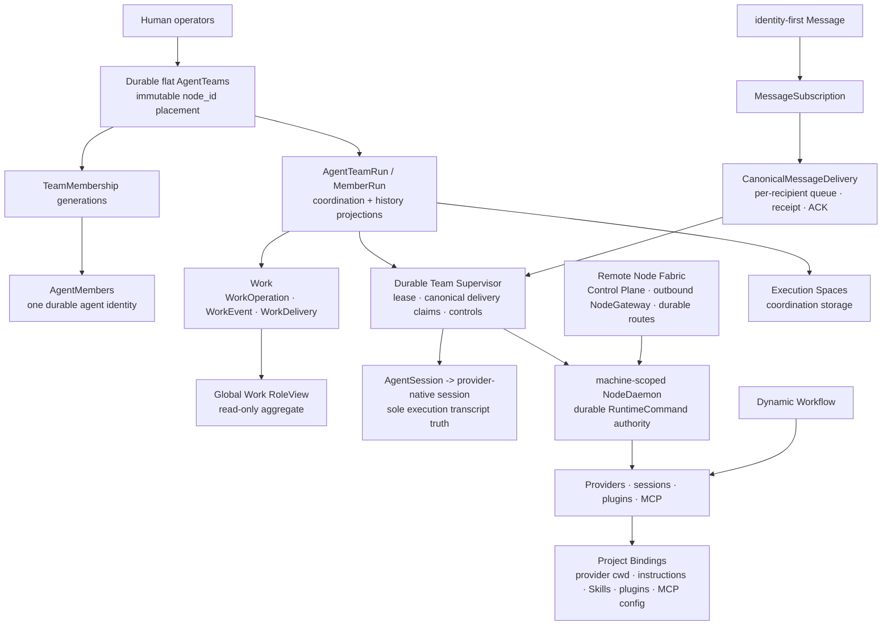

# Architecture Map

This is the canonical product-level architecture map of the implemented
execution foundation. The legacy Company OS product layers (Docs,
Organization, Finance, Approval) and the legacy Mission/Wave/Mission Log
coordination objects are retired (DOC-108); their historical contracts remain
in Git history and the superseded ADRs.

## Layer responsibilities

| Layer | Owns | Does not own |
| --- | --- | --- |
| Agent Teams and Membership | durable Team identity, immutable `node_id` placement, roster generations, Host membership | provider execution lifecycle, a second agent identity |
| Agent Team Runs | TeamRun/MemberRun projections, attempts, lineage | a provider process, a provider effect authorization |
| Team Supervision | one current Supervisor generation per run: delivery claims, live controls, reconnect | Work authority, Message authorship |
| Work | durable responsibility rebuilt from ordered WorkOperations, WorkEvents, WorkDeliveries, submission and Host acceptance | authored conversation, runtime control, provider transcripts |
| Messages | identity-first authorship, MessageSubscription authorization, per-recipient CanonicalMessageDelivery | Work lifecycle mutation, RuntimeCommand authority |
| Execution Spaces and Project Bindings | coordination storage vs provider cwd/instructions/Skills/plugins/MCP selection | each other's scope; `--project` never switches the coordination store |
| Runtime | provider processes, native sessions, native activity readers/resume, plugins, MCP, and ephemeral projections | a second provider history or assignment inference |
| Remote Node Fabric | cross-machine RoutedOperation/Attempt/Receipt, mTLS gateway generations, reconcile, and bounded artifacts | a second Node identity, Message/Work/RuntimeCommand truth |

For persistent Agent Team members, Work ownership and continuous native
execution are separate. Harness owns Work, WorkEvent, WorkDelivery, immutable
Message, subscriptions, and per-recipient CanonicalMessageDelivery; one
current `TeamSupervisorLease` generation owns delivery claims and live controls,
while one selected execution driver owns provider cycles for a
MemberRun/native session/writable Workspace. A provider receipt proves
transport acceptance, not semantic completion. Provider Goal satisfaction
never implies Host acceptance. See
[Member Continuation Model](member-continuation-model.md) and
[ADR 0041](../../decisions/0041-provider-neutral-member-continuation.md), plus
[ADR 0044](../../decisions/0044-durable-team-supervision-and-typed-mail.md) for
cross-process ownership and typed-mail guarantees, and
[ADR 0050](../../decisions/0050-agent-team-work-board-and-message-boundary.md) for the
Work/Message boundary.

## Source-of-truth rule

Provider-native execution remains in its native session. Only explicit
outcomes, artifact/check references, evidence, and decisions are promoted into
Harness coordination truth. The retired Company OS ledgers are readable only
as historical exports.

## Retired layers

ADR 0051 (Mission/Wave single-intent spine), ADR 0027 (the retired Company OS
primary model), and ADR 0026 (Mission/Wave foundation) are superseded by
DOC-108: no retired Mission, Mission Log, Wave, or Company OS object is
current authority. ADR
0029 (programmable document runtime) retired with the built-in Docs layer.
