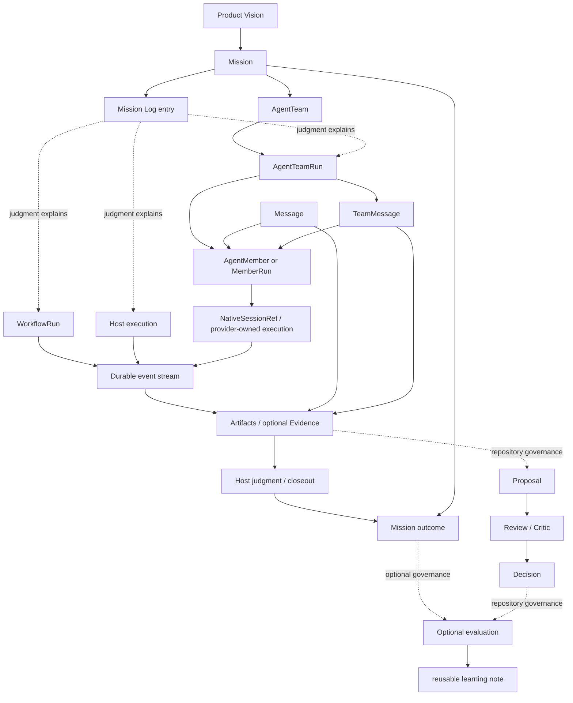

# Concept Model

This document defines the canonical object relationships for Star Harness. It
exists to prevent architecture drift: implementation may add fields, commands,
and views, but it must not change the meaning of the core objects without
updating this model first.

Source-of-truth rules and gate invariants live in
[data-model.md](data-model.md). This document owns product meaning,
relationship rules, active vocabulary, and anti-drift invariants.

## Vision

The accepted product vision is:

```text
Turn a project objective into agent-operable work:
Mission -> append-only Mission Log
Mission -> one flat AgentTeam -> TeamRun -> MemberRun
  -> Harness coordination / native session refs / artifacts
  -> explicit Host judgment and closeout -> Mission outcome
```

The harness is the coordination and evidence system. Project-specific tools are
connected through adapters.

## Active Vocabulary

Mission plus its append-only Mission Log is the active coordination vocabulary
and native contract for new work. Wave authoring and gates are retired under
ADR 0051; pre-cutover Wave rows remain read/export-only historical context.
The older superseded coordination stack is governed by
[ADR 0028](../../decisions/0028-retire-goal-phase-task-graph.md) and is not exposed
through product projections or authoring paths. Optional review and evaluation
records may strengthen a high-risk gate, but they do not replace Mission
closeout or become mandatory hierarchy levels.

## Core Object Relationships



## Mission And Mission Log

A `Mission` is the durable objective and one-Team ownership boundary.
A `MissionLogEntry` is a lightweight append-only Markdown record of the Host's
judgment, replan, recovery, or closeout evidence. It is part of the Mission's
history, not another lifecycle object.

Rules:

- a Mission owns objective, success interpretation, priority, and closeout
  standard;
- a Mission owns exactly one flat AgentTeam, and a Team belongs to exactly one
  Mission;
- a Mission Log entry records changed facts, Work/member composition changes,
  blockers, carry-over, evidence, and the Host's judgment;
- a Mission Log entry does not require or expose a dependency graph;
- a Mission Log entry is not an executor container, task graph, session
  boundary, gate, revision lifecycle, or barrier;
- replanning appends a `replan` entry; it does not mutate or replace prior Host
  judgment;
- a Mission is not complete because activity happened; it is complete when its
  Host decisions and explicit closeout summary support the desired outcome. Stricter
  evidence or evaluation may be layered on when the domain or risk requires it.

Failure mode this prevents: replacing a durable objective with a sequence of
convenient implementation steps and then claiming completion from activity
alone.

## Execution Capabilities

The Host may use an Agent Team, Dynamic Workflow, direct Host work, or a
combination. Mission context and Mission Log judgment explain the choice
without owning the runtime.

### `agent_team`

Agent Team is for living collaborators with persistent session state, explicit
Work ownership, review, and responsibility that spans the Mission as needed.

A Member is the accountable end-to-end lane owner. Provider-native subagents
are bounded internal helpers whose results, permissions, evidence, and review
responsibility return to that Member. A separate Member is required for an
independent mailbox, Workspace, session, or acceptance role.

The accepted target proof is Work responsibility:

```text
Work assignment/claim -> WorkOperation(WorkEvent + resulting Work + deliveries)
  -> WorkDelivery
  -> MemberRun + Workspace + NativeSessionRef
  -> Work block / submission / review / acceptance
  -> linked correlated TeamMessage/reply where needed
  -> explicit outcome + artifacts/check refs
```

Messages can link the same-run Work while preserving correlation/reply lineage.
They do not mutate owner or state. Cross-run, unknown, and mismatched Work or
message lineage is rejected before persistence.

Members may communicate directly with same-run peers without routine Host
approval. The Host can observe those messages and answers its own Inbox.
Minimal Work blockers compute readiness; no conditional message or general Task
Graph is introduced.

### `dynamic_workflow`

Dynamic Workflow is a one-shot structured engine. It may share runtime
infrastructure with other executors, but it is not an Agent Team and should not
be described with Agent Team semantics.

### `host`

Host execution is direct work by the resident Host Agent. The host may use
provider-native subagents internally. Those subagents are optional observation
targets, not canonical child records unless the harness actually controls them.

## Messages And Ownership

Messages remain runtime facts, but a Mission Log does not contain a task graph. Agent
Team ownership lives in Work; Dynamic Workflow owns its steps; Host execution
records its observable outcome. Residual Assignment-message fields are removal
debt and cannot define another ownership path.

## Agent Team Objects

`AgentTeamRun` is one execution attempt of its required Mission-owned flat
AgentTeam. It is not standalone, is not a standing organization, and is not
owned by a Mission Log entry or one historical Wave.

| Object | Meaning | Rule |
| --- | --- | --- |
| `AgentTeam` | One Mission's flat execution agency with Host and immutable Node placement. | One Team equals one Mission; there is no parent/child Team topology. |
| `AgentTeamRun` | One Team execution with frozen Team, Node, and Project Binding. | May span many Mission Log judgments; every terminal run remains read-only history. |
| `AgentIdentity` | Durable addressable agent identity and organization status. | It is not a provider process, Team membership, Work owner, or native transcript. |
| `AgentSession` | One machine-local provider session owned by an exact NodeDaemon generation. | It has no Team identity and cannot outlive or bypass its NodeDaemon authority. |
| `TeamMembership` | The collaboration overlay joining an AgentIdentity to one flat Team on the Team's immutable Node. | It does not own the provider session or Work result. |
| `WorkExecutionBinding` | Exact Work revision → membership → AgentIdentity → AgentSession generation binding. | A successor Session cannot inherit active Work implicitly. |
| `MemberRun` | Run-scoped coordination/history projection for role and Work attribution. | It is not provider runtime authority and cannot dispatch, interrupt, resume, or stop a provider. |
| `Work` | TeamRun-scoped responsibility, owner, readiness, state, criteria and result. | Assignment, claim, block, submission and acceptance are Work operations governed by ADR 0050. |
| `WorkOperation` | Crash-atomic Store replay row containing one WorkEvent, its complete resulting Work, delivery creates/updates, and target-caused WorkDelegation revisions. | It prevents Work, delivery, and cross-Team roll-up projections from becoming independently visible; Hosts still act on Work, not WorkOperation. |
| `WorkDelivery` | Reliable delivery of one Work version to a Member runtime. | It reuses delivery machinery but is not authored conversation or Work ownership. |
| `Message` | Immutable source-NodeDaemon-authored conversation envelope, addressed through canonical subscriptions. | It cannot carry Work ownership or runtime-control authority. |
| `MessageSubscription` / `SubscriptionCursor` | Recipient policy and exact delivery/ACK progress. | The browser and Control Plane cannot fabricate recipient state. |
| `ExecutionNode` / `NodeDaemonLease` | Stable machine identity and its one active daemon generation. | One NodeDaemon owns all local Teams and registered Project Bindings. |
| `TeamSupervisorLease` | Latest-wins cross-process authority for one active TeamRun generation. | Parent-fenced by NodeDaemon generation; owns this run's transports, claims, reconnect, and real controls. |
| `CanonicalMessageDelivery` | Delivery state for one immutable Message recipient at an exact AgentSession generation. | Makes provider receipt, acknowledgement, retries, and uncertainty explicit without a second Message or inbox authority. |
| `RuntimeCommand` | Durable prepare/settle journal for start, resume, turn/input, interrupt, and stop effects. | Ambiguous effects become `RecoveryRequired`; TeamRun, MemberRun, Message, and WorkDelivery cannot bypass it. |
| `ProviderInvocation` | Clean-cut provider-facing projection derived by the target NodeDaemon from a claimed delivery. | Public callers and browsers cannot author it or select provider compatibility. |
| `MemberAction` | Transitional Harness action row. Target use is limited to Harness-owned coordination/control facts. | Provider tool, command, file, chat, turn, and reasoning streams stay solely in the native provider session. |
| `DelegationRun` | Attribution record for observed or orchestrated delegation. | Parent permissions, paths, and budgets bound the child. |
| `TeamRunEvent` | Transitional ordered event projection for Harness-owned run lifecycle. | It must not become a mirror of provider-native activity. |

Runtime control authority is resolved by the server as exact self or the exact
machine Operator/NodeDaemon. Team Host authority is Team-scoped and cannot
start, stop, resume, or cancel a global AgentSession. Callers cannot submit
capabilities, provider profiles, permission envelopes, full AgentSession
objects, or a different machine placement. A standalone AgentIdentity may own
a machine Session without TeamMembership; join/leave never creates or closes
that Session. A Team and AgentIdentity have at most one active
TeamMembership generation; duplicate historical authority makes RoleViews fail
closed. Unknown provider effects remain Operator-visible RecoveryRequired work
until an evidence-backed, generation-fenced resolution records certainty
without replaying the native effect.

Relationship rules:

- a Mission owns one flat AgentTeam and may create multiple runs of that same
  Team;
- ownership is explained by the latest Work projection and the ordered
  WorkOperations that preserve its WorkEvent audit;
- every message carries typed sender and recipient provenance; UI or MCP callers
  cannot impersonate a Member unless they are explicitly bound to that
  MemberRun;
- the current Supervisor atomically claims delivery only after its provider
  transport is healthy and records the native receipt. TeamMessage ACK is a
  separate idempotent intake state; WorkDelivery has no ACK state and a Work
  claim/start records responsibility acknowledgement;
- `Work`, `TeamMessage`, explicit outcomes, and Harness control facts may reference
  artifacts or `Evidence`; the
  Host Mission closeout needs an explicit outcome but does not require
  Proposal/Review/Decision objects;
- residual task-named runtime fields are removal debt, not the product model or
  a supported ownership path.

## Generic Object Model

The learning and governance layer remains domain-neutral.

| Object | Rule |
| --- | --- |
| `Review` | Structured evaluator or critic output. Evidence for a Decision, never the Decision itself. |
| `Gap` | Defect/risk ledger row. `category=bug` is a bug; there is no separate Bug object. |
| `Evaluation` | Optional structured assessment layered on a high-risk outcome. |
| `LearningNote` | Reusable teaching artifact distilled from a closed Mission. |
| `Vision` | Long-lived target that Missions advance toward. |

## Agent Runtime And Native Session

`MemberRun` and `NativeSessionRef` connect durable members, independent
execution runs, and Host tools to external providers such as Codex, Claude, or
Kimi.

Rules:

- Harness owns Work responsibility, interaction routing, explicit
  outcomes, artifact/check references, and gates;
- the provider-native store owns model execution, transcript, tool/command/file
  activity, provider turns, and resume state;
- provider output can support an execution claim through its native session
  reference without being copied into Harness;
- hooks are observation inputs, not the canonical message bus;
- runtime health is represented as lifecycle state, not inferred only from raw
  provider output.

Failure modes this prevents: a provider transcript becoming the hidden source
of truth for ownership or acceptance, and a Harness mirror becoming a divergent
second transcript.

## Thinking Policy

The target contract makes thinking transient live-only state.

- It may be shown live when a provider exposes it.
- It is bounded and sanitized.
- It is never persisted in canonical harness history.
- It is never replayable state.
- It is never execution evidence.
- It is never forwarded into another member's context.

Persist only Harness-owned coordination, artifact/check references, blockers,
Work submission/acceptance, control acknowledgements, and explicit outcomes instead.

No provider thinking may enter a Harness ledger. Provider-derived action rows
are excluded by the implemented ADR 0032 boundary; historical rows do not
define current product state and are not projected as active activity.

## Closeout Gates

The product contract and this repository's current self-hosting governance are
deliberately different:

- Mission Log entries record Host judgment, replanning, recovery, and closeout
  evidence with actor/time, a short note, and useful artifact refs;
- AgentTeamRun and WorkflowRun remain distinct execution record types; a
  historical Wave does not need or own an `accepted_run_id`. That field is
  legacy direct-executor compatibility only;
- a Mission outcome is based on accepted Work evidence and an explicit
  Mission-level closeout summary; historical Wave gates are read-only context;
- this repository may layer review, evidence, or evaluation on high-risk Missions,
  but those objects are not mandatory for every self-hosting change.

The legacy governance chain must not leak into every Agent Team Mission as
a mandatory object graph.

## Open-Enum Vocabularies

Useful but workflow-flavored taxonomies remain open enums: harness defines a
canonical starter set in Rust, JSON keeps the field as `string`, and adapters
may add values without a schema bump.

| Field | Object | Canonical values |
| --- | --- | --- |
| `review_kind` | Review | `acceptance`, `correctness`, `safety`, `design`, `data_flow`, `docs`, `other` |
| `verdict` | Review | `pass`, `fail`, `blocked`, `needs_changes` |
| `decision` | Decision | `accept`, `reject`, `revise`, `split`, `block`, `promote`, `waive`, `follow_up`, `stop_approved`, `continue_required` |
| `decision_kind` | Decision | `verdict`, `gate`, `stop_gate`, `waiver`, `closeout`, `promotion`, `other` |
| `evidence_kind` | Evidence | `check`, `log`, `session`, `diff`, `review_note`, `screenshot`, `artifact`, `snapshot`, `historical work design`, `outcome evaluation`, `other` |
| `category` | Gap | `ux`, `data`, `observability`, `parity`, `tooling`, `workflow`, `docs`, `bug`, `other` |
| `outcome` | outcome evaluation | `success`, `partial`, `failed`, `blocked` |

Only truly closed, harness-owned sets should use hard JSON enums.
