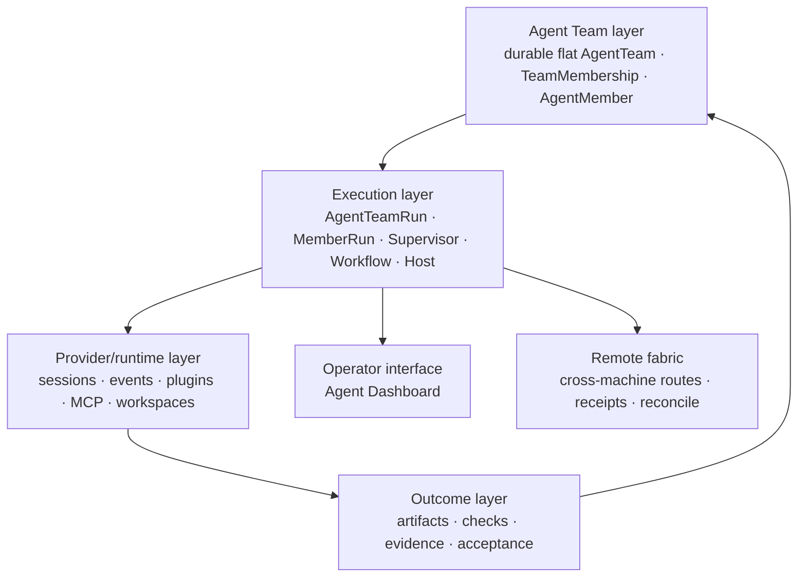

# Design Basis

```text
status: canonical architecture rationale
owner_role: product-architecture
canonical_for: system decomposition, module core ideas, truth boundaries, and documentation structure
supersedes: the retired Company OS decomposition (DOC-108)
```

The PRD explains why Star Harness exists. Architecture and schemas describe
what is implemented. This document explains why the product is decomposed into
execution-foundation subsystems and where each truth lives.

ADR 0042 defines the storage/identity boundary behind coordination and
execution resources (its Company Store identity is retired by DOC-108):

```text
Execution Space       Project Binding
        \                    /
         \-- explicit, optional relations --/
```

Execution Spaces own provider-neutral coordination. Project Bindings own
repository/worktree/runtime-resource selection and must not own coordination
truth.

## Core thesis

An AI-native company needs accountable capability and explicit, provable
execution records. Agents and workflows are the execution capability; the
harness is the coordination and evidence system, not the company's memory.

```text
durable Team and Work context
  -> explicit Work responsibility and claim
  -> selected human or execution capability
  -> observable outcome, artifacts and evidence
  -> explicit Host review and acceptance on the Work record
```

## Design layers



| Layer | Why it exists | Must preserve |
| --- | --- | --- |
| Agent Teams | work needs durable accountable identity and roster generations | Team placement is immutable; membership authority is TeamMembership |
| Execution | long or parallel work needs provider-neutral coordination | Work carries responsibility, submission, and Host acceptance; one execution driver per member; run completion never closes a runtime |
| Runtime / Project Binding | providers and repositories differ in process, session, tool, worktree, instruction, and observation capability | provider cwd comes from a project root or validated worktree; provider state never becomes organization identity |
| Outcome/evidence | accepted claims must be reconstructable | outcomes point to useful artifacts, checks and durable records without storing private thinking |
| Interface | humans and Agents need comprehensible operating views | the Agent Dashboard presents store truth, never a fabricated projection |
| Remote fabric | Teams on different machines must exchange Messages and deliveries | route facts are generation-fenced and never impersonate the source |

## Module core ideas

| Module | Owns | Refuses | Invariant |
| --- | --- | --- | --- |
| Agent Team | durable flat Team identity, immutable Node placement, roster | nested Team topology or copied provider history | responsibility is proven by Work/WorkEvent; live control by the NodeDaemon-fenced Supervisor |
| Work kernel | responsibility, lifecycle axes, hard dependency DAG, readiness, evidence and acceptance | persistence mechanics, authored conversation or runtime control | one Work authority; peer nodes only; Global Work is read-only |
| Messages | identity-first authorship, subscriptions, per-recipient delivery | Work lifecycle or RuntimeCommand authority | Messages never mutate Work |
| Execution Space / Project Binding | coordination storage vs provider cwd/instructions/Skills selection | repo path as coordination owner or store directory as provider cwd | `--project` never switches the coordination store |
| Runtime | sessions, processes, events, workspace and capability observation | Work or TeamMembership truth | the provider-native session is the sole execution transcript truth |
| Dynamic Workflow (retired) | historical WorkflowRun, steps, outputs and artifacts | current execution or universal coordination | legacy archive export/verify/restore-read only; no writers or live projections |
| Skills/adapters | repeatable usage guidance and domain capability access | product authority or domain truth in generic core | capabilities reduce variance but never grant permission |

There is no active `Goal`, `GoalPhase`, Project-like task container, universal
task ledger, or workflow-executor graph for new work. Current peer Works do
form the bounded hard-dependency DAG defined by ADR 0058. The retired Mission,
Mission Log, Wave, and Company OS
object set exist only as read-only legacy history under DOC-108. Historical
occurrences of the older stack exist only in migration, compatibility,
research or archive contexts governed by ADR 0028.

## Why the record planes stay separate

Work, Messages, and runtime control answer different questions and must never
impersonate one another. Work ownership is rebuilt from ordered
WorkOperations; conversation is immutable identity-first Messages with
per-recipient deliveries; provider effects settle through durable
RuntimeCommands. A provider receipt proves transport acceptance, not semantic
completion; a provider `completed` status is not by itself proof of semantic
success, answer, or approval.

## Documentation mapping

Documentation mirrors authority rather than implementation folders:

| Location | Role |
| --- | --- |
| `docs/current/product/` | product requirements and Work/Team product contracts |
| `docs/current/architecture/` | executable architecture and object relationships |
| `docs/decisions/` | durable decisions and supersession records |
| `docs/current/dashboard/`, `docs/current/integration/`, runtime/workflow docs | execution implementation and operations |
| `design/<workstream>/` (git history) | versioned visual intent and evidence |
| git history | historical provenance excluded from normal planning |

The creation, ownership, lifecycle, registry and archive rules live in
[Documentation Governance](../documentation-governance.md). Stable fields belong
in schema; stable behavior belongs in code; stable operations belong in CLI or
API; documentation owns rationale, boundaries, exceptions and upgrade rules.

## Review questions

Before adding an object, module, page or document:

1. Which system owns the truth?
2. Is this a new durable object, a relation, a projection or execution evidence?
3. Can an existing canonical contract own the change?
4. Does the change require Human authority or a governed approval?
5. What does not belong in this module?
6. Which schema, store, API, UI and acceptance evidence make the claim real?
7. Which older direction becomes superseded and how is it removed from default
   context?
8. Does Work policy remain in the kernel, persistence in Store, orchestration
   in one application service, and presentation in RoleViews/Dashboard?
