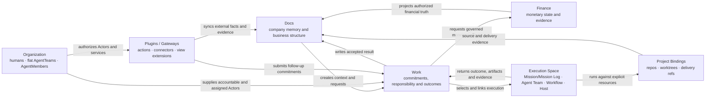

# Company OS product system map

```text
status: canonical product orientation
owner_role: product-architecture
canonical_for: whole-product structure, truth ownership, governance hierarchy, execution boundary, and current delivery status
```

This is the shortest complete entry point for the product. It does not replace
the detailed contracts linked below; it tells a future Human or Agent how those
contracts fit together and which layer owns each decision.

## Product mission

Star Harness is an AI Company OS for turning durable company context into
governed work and returning accepted outcomes to company memory. Its two
primary product systems are **Docs** and **Organization**. Work and Finance are
first-class operating systems connected to them. AgentOS is the programmable
operating layer that lets durable AgentMembers use skills, MCP tools, plugins,
connectors, custom pages, and execution substrates without turning those tools
into company authority. Mission/Mission Log, Agent Team, Dynamic Workflow, Host
execution, providers, plugins, and MCP are the shared execution foundation
rather than a second company model.

The product-level subject is an **Agent Company Workspace**: a company-like
operating boundary where humans, AgentMembers, Docs, Work, Organization,
Finance, plugins/gateways, and external repositories are coordinated. The
technical Store boundary for that subject is the **Company Store**. ADR 0042
separates that Company Store from standalone **Execution Spaces** and
repository/worktree **Project Bindings**.



Relations connect the systems; they do not transfer ownership. Docs may show a
Commitment, but Finance owns its amount and state. Work may show an Agent, but
Organization owns that Agent's identity and authority.

The diagram is not a mandatory process order. In the AgentOS self-hosting
scenario, Docs, Work, and Organization form a continuous loop: an Org gap may
create Work and a role-charter Document; a Work blocker may request a new
capability; a Document audit may create Work; an accepted implementation may
update all three. See
AgentOS self-hosting dogfood loop.

## Initial organization

The first organization is a deliberately small flat AgentTeam:

```text
Supervising Operator
  <-> Lead AgentMember (Team Host)
        ├── Docs Member
        ├── Work / Product Member
        └── CTO Member
```

Teams are flat; there is no child AgentTeam. A Member may delegate Work to
another Team and remain accountable for the parent Work (WorkDelegation).
Role names are company choices rather than required architecture. The
Supervising Operator can inspect all Teams, create unassigned intake Work, and
message the Lead, but it does not impersonate a Member or become the hidden
scheduler. See [ADR 0052](../../decisions/0052-nested-agent-teams-are-the-agent-organization.md).

## One company operation

The trademark scenario is the first acceptance slice:

1. Docs holds the trademark strategy and application record.
2. Work creates `Submit CN trademark filing`, names responsibility, links a
   Milestone, and waits at the required Human gate.
3. Organization supplies the IP Agent, accountable Human, external counsel,
   and approval authority.
4. Finance records a pending CNY 3,000 Commitment. It does not create a Payment
   before authorization and settlement evidence.
5. The selected executor performs the work and returns observable evidence.
6. Work records review and completion; Docs receives the accepted filing result.

Approval and Mission closeout are different decisions. A closed Mission or a
Host Mission Log judgment cannot authorize legal filing, payment, permission,
or organization mutation.

## Native object boundaries

| Layer | Native product objects | Boundary |
| --- | --- | --- |
| Docs | Document, Block, TypedRecord, Relation, View, BusinessModule | durable knowledge and business structure |
| Organization | ActorRef, HumanMember, AgentMember, flat AgentTeam, external/service actors; OrgUnit as optional business grouping | identity, direct-Team administration, authority and explicit availability/capacity |
| Work | Work, WorkEvent, WorkDelivery, Milestone and typed business/Approval relations | commitment, responsibility, lifecycle, evidence and result routing |
| Finance | Commitment, Invoice, Payment, Refund and financial evidence | monetary truth and transitions |
| Plugins / Gateways | GatewayPlugin manifest, GatewayAction, GatewayEvent, connector sync records, view-extension declarations, evidence refs | platform capabilities, external state synchronization, and presentation extensions; never approval or business truth |
| Execution Space | Mission context, append-only Mission Log judgment, Mission-owned AgentTeamRun/MemberRun, WorkflowRun/Step, Host outcome | how selected work was planned, delegated, and run; Company is optional |
| Project Binding / external source | ProjectBinding, ExternalProject, ProductDocSource, ProductDocSnapshot, ProductDocMapping, SourceChangeEvent, SourceSyncRun, DeliveryRef | how repositories, worktrees, GitHub-hosted software PRDs, ADRs, code delivery, and CI evidence are selected or mapped |

There is no native `Project`, Task Graph, GoalPhase, or separate universal
Agent Membership scheduler. Mission plus its Mission Log is the optional
long-task coordination model. AgentMember is the durable agent identity;
MemberRun and provider-native subagents remain execution details.

An external GitHub repository may own the software product contract for a real
application. Company OS still owns the commercial model, operating modules,
Works, Organization, Finance, and launch readiness around that application.
The integration contract is External Project Product Sources.
Under ADR 0042, the Git repository is a Project Binding and/or external source,
not the owner of the Company Store. One Agent Company Workspace may contain
multiple operating areas, such as Wanchengwanling and AgentOS / Star Harness,
while mapping several repositories.

## AgentOS plugin and connector layer

AgentOS capabilities should enter Company OS through plugins rather than
platform-specific core commands. A plugin can package:

- Skill instructions for the Agent using the capability;
- a selected operation transport such as an existing CLI, MCP tool,
  plugin-owned CLI adapter, official API, browser automation, or phone
  automation;
- connector sync for external account, issue, message, order, logistics,
  payment, or metric state;
- view extensions that declare how synced records appear in Docs, Work,
  Organization, and Agent detail surfaces; and
- a manifest naming actions, risk class, required permissions, idempotency,
  evidence, fallback views, and policy gates.

This layer is the right place for GitHub, WeCom, Xiaohongshu, Douyin, WeChat
Channels, ecommerce, logistics, and future integrations. The core `harness`
CLI may provide generic Company OS object and Action commands plus a small
readiness/bootstrap probe, but it should not hard-code platform page flows,
API quirks, or business-specific automation. Whether an operation is invoked
through an existing tool such as `gh`, MCP, a plugin CLI, API, browser
automation, or phone automation is an implementation choice; the durable effect
must return to Docs, Works, Organization actors, metrics, evidence, and
Finance/Approval records when protected actions or money are involved.

The first AgentOS connector to implement should be **GitHub** because this
repository is the dogfood system. Development Works need a reliable bridge
to issues, branches, pull requests, review status, checks, preview/deployment
evidence, and software PRD source snapshots. Social, WeCom, ecommerce, and
logistics plugins should follow the same action + connector + view pattern
after the GitHub path proves the contract.

## Current delivery truth

| Area | Current truth | Next product gap |
| --- | --- | --- |
| Company / execution identity | AgentMember is canonical; Company stores ActorRef membership projections while Execution Space owns MemberRun/runtime/provider state | durable cross-process Team Supervisor integration |
| Docs substrate | native schemas, stores, APIs, standard views, and Store-live evidence exist | deeper document authoring and governed module evolution |
| Organization substrate | actor kinds, OrgUnit membership, canonical AgentMember projection, and mixed-actor UI exist | flat AgentTeam topology and shared Member/Team views |
| Work read model | Team Works plus current Company TeamWork/Milestone projections exist | one persistent Team-scoped Work kernel, recursive Global Works, and explicit compatibility cutover |
| Finance/Approval | native records, separation of Commitment and Payment, and governed action slices exist | actor-bound product sessions and broader operator controls |
| Agent roles | current governance-role records and decision contracts exist | role-neutral AgentMembers organized by flat Teams instead of a fixed governance hierarchy |
| AgentOS self-hosting | AgentOS Lead, canonical AgentMember/TeamWork and real execution evidence exist | Flat Team-to-Team WorkDelegation dogfood over one Work kernel and machine NodeDaemon |
| Execution foundation | Mission/Mission Log, Agent Team, Dynamic Workflow, Host, providers and Dashboard contracts exist; Wave authoring is retired historical compatibility | continue improving honest observation and adapter coverage without replacing company objects |
| AgentOS plugins/gateways | generic external gateway and plugin contract exists; social readiness is a read-only bootstrap probe; local repo source sync exists | GitHub connector plugin first, then WeCom/social/ecommerce/logistics plugins with connector sync and view extensions |

“Implemented” never follows from a generated image. The visual inventory
separates baseline, Expected, Actual, historical, and deferred-reference assets.

## Canonical reading order

1. Vision
2. [This product system map](product-system-map.md)
3. Four-system collaboration
4. [Organization and actors](organization-and-actors.md)
5. [Work Operating System](work-operating-system.md)
6. [Document system](document-system.md) and financial relations
7. Agent Firm Mental Model
8. External project product sources
9. External Gateway and Plugin Intake
10. Frontend information architecture
11. [Execution foundation](execution-foundation.md)
12. Company OS V2 visual inventory

Detailed schemas, Actions, examples, and implementation audits remain linked
from [the Company OS index](README.md). If a detailed document conflicts with
this map, the specific canonical contract for that object wins; the conflict
must then be corrected here rather than left implicit.

## Superseded decisions

- `Goal`, `GoalPhase`, Project-like task containers, and Task Graph are not
  active product architecture.
- The earlier Lead-directly-manages-every-Business-Agent Organization picture
  is historical. The active target is governance-led with Business Agents
  under Org/HR.
- Rich standalone pages for every Governance Agent are deferred references,
  not current implementation requirements. Compact Organization configuration
  and module queues come first.
- Raw model thinking is never durable product truth. Only sanitized transient
  live state may be shown, without persistence or replay.
