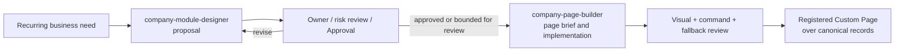

# Skill and CLI Contracts: Company OS Operator Suite

```text
status: mixed — Company OS operator suite installable; Docs, Work, Organization, and Approval baseline dedicated CLI implemented; governed OrgChangeProposal remains planned; Finance contract-layer retired (see issue #323); Commitment/Payment code remains dormant
owner_role: product + platform
canonical_for: optional Agent capability inputs, outputs, and governance boundaries
```

## Purpose and non-authority

The Company OS operator suite reduces variance when Agents bootstrap commercial
projects, operate company memory, durable work, organization authority, finance
state, module design, and code-declared business pages.

Install it into both Claude Code and Codex project skill roots with:

```bash
scripts/install-skill.sh --agent both --suite company-os
```

The suite currently expands to:

| Skill | Owning surface | Implementation status |
| --- | --- | --- |
| [`company-business-project-bootstrap`](../../../skills/company-business-project-bootstrap/SKILL.md) | High-level commercial-project bootstrap across Docs IA/page contracts, Work, Org, Finance, external software/social sources, and custom pages | procedural orchestration skill |
| [`company-docs-operator`](../../../skills/company-docs-operator/SKILL.md) | Docs: Document, Block, page contract, TypedRecord, Relation, View, BusinessModule, custom page metadata | dedicated `firm company docs ...` CLI implemented |
| [`company-work-operator`](../../../skills/company-work-operator/SKILL.md) | Unified Work: read-only Company aggregate, native TeamWork lifecycle, reports, gates, decisions, and Milestone refs | `firm company work list/query/milestone` for Company views; `firm team-run work ...` for all mutations |
| [`company-org-operator`](../../../skills/company-org-operator/SKILL.md) | Organization: Human, Standing Agent, OrgUnit, role, permission, lifecycle and actor refs for Docs page context | dedicated flat `firm company org ...` plus nested `actor/unit/membership ...` baseline CLI implemented; proposal/promotion/grant-revoke workflows remain planned |
| [`company-module-designer`](../../../skills/company-module-designer/SKILL.md) | Business module design, page contracts, frontend surface intent, and governance proposal | procedural design skill |
| [`company-page-builder`](../../../skills/company-page-builder/SKILL.md) | Code-declared custom page design/implementation from approved page contracts, visual expected images, and actual verification | procedural page-building skill |
| [`dogfood-company-os`](../../../skills/dogfood-company-os/SKILL.md) | Repeated, evidence-backed Company OS self-hosting across Docs, Work, Organization, external delivery, execution, and result return | procedural composition skill |
| [`connect-github-company-os`](../../../skills/connect-github-company-os/SKILL.md) | GitHub repository/source observation and software-delivery evidence correlated to Company OS records without replacing company truth | procedural connector skill |
| [`orchestrate-mission-waves`](../../../skills/orchestrate-mission-waves/SKILL.md) | Host Lead coordination: Mission, Mission Log, AgentTeam, Works, review, and explicit Host acceptance | team coordination skill (Host-facing) |
| [`collaborate-as-agent-team-member`](../../../skills/collaborate-as-agent-team-member/SKILL.md) | Persistent Agent Team Member: Works board, lifecycle, mailbox, blocker, submission, and native session | team coordination skill (Member-facing) |

This ten-Skill suite includes the dogfood and GitHub connector packages
because its bootstrap and operator Skills delegate work to them. Installation
must preflight the complete suite and fail before writing either agent target
when any delegated Skill package is missing.

These are procedural capabilities, not part of the Company OS data model and
not an authority for product, organization, security, finance, or legal
decisions.

For real commercial projects, the operator suite must produce more than a
folder tree or a sequence of CLI writes. It must define the operating page
architecture, write the corresponding page contracts and business facts into
the selected Company Store, and then link Work, Organization, Finance, external software
sources, Views, and any custom page presentation to those contracts. A page such
as a commercial Project Home or Business Model page is not accepted when it
only contains generic prose; it must be legible to humans in UI and operable by
Agents through CLI/API. Seed or materialization scripts may remain acceptance
fixtures, but they are not the normal authoring path for a registered project
Store.

`agent-company` is the active local Company Store for the first real commercial
dogfood path: Wanchengwanling and AgentOS dogfood records now live in the same
Company Store. The older `new-day-wanchengwanling` project-derived Store is
compatibility/migration evidence, not the normal operating target. The
Wanchengwanling GitHub `dev` branch is an external software product source;
commercial operating truth must remain in Company OS records through Docs,
Work, Organization, Finance, source-sync records, and custom page definitions.

Social/content platforms follow the same rule. Xiaohongshu, WeChat Channels,
Douyin, WeCom, ecommerce, logistics, and future channels enter through
gateway observations, platform-account TypedRecords, content campaign/post
records, TeamWorks, and evidence refs. Platform-specific operations should be
packaged as plugins that provide:

- a Skill for Agent operating procedure and policy boundaries;
- a selected transport for concrete actions, such as an existing CLI (`gh`),
  MCP tool, plugin-owned CLI adapter, official API, browser automation, or
  phone automation;
- a connector for syncing external account/message/order/logistics/metric
  state into Company OS records; and
- view extensions that declare how synced records appear in Docs, Work,
  Organization, and Agent detail surfaces.

`firm company gateway social readiness` is a read-only device/API readiness
probe retained as a core bootstrap. It does not log in, publish, delete, pay
for promotion, export private messages, or mutate Company Store truth by
itself. Full social operations such as media upload, title/body/topic fill,
publication submit, comment/private-message sync, profile management, paid
promotion preparation, and analytics sync belong in platform plugins. They may
be invoked through MCP or through plugin-owned CLI commands, but their durable
effects must return as governed Company OS Actions, typed records, relations,
TeamWorks, metrics, and evidence.

## Company Store selection

All operator skills must make Store selection explicit before reading or
writing durable company records:

```bash
firm company current
firm company init --id <company-id> --name <display-name>
firm company migrate-from-project --from-project <project-id|path> --id <company-id> --name <display-name>
firm company migrate-from-project --from-project <project-id|path> --id <company-id> --verify-only
harness --company <company-id> company migrations
harness --company <company-id> company docs query --document <doc-id>
HARNESS_COMPANY=<company-id> firm company work list
```

If no Company is selected, current commands still fall back to the
project-derived compatibility Store. That fallback is allowed for legacy reads
and migration work, but new dogfood/company operations should prefer an
explicit Company Store. `migrate-from-project` copies and verifies only the
explicit active Company Store ledger allowlist. Retired WorkItem, Assignment,
and cutover ledgers are disposable history and are not migration inputs. The
command must not be treated as Execution Space, Project Binding, provider
session, prompt, or runtime migration. A successful copy or `--verify-only`
run proves every exact active source row remains present in the destination,
appends an audit record to `company_store_migrations.jsonl`, and writes an advisory
source marker. The marker recommends read-only audit use but does not falsely
claim filesystem write enforcement.

Docs are **Agent-operated and Human-reviewed**. Skills and CLI/API are the main
Agent interface for reading, editing, governing, and verifying document truth.
The UI is primarily for Humans to inspect, review, approve, and supervise what
Agents maintain. UI editing can exist for necessary low-risk actions, but it is
secondary to the CLI/API command surface and cannot be the only proof that a
Docs capability is implemented.

The capability is optional: a human team or another Agent can use the same
Company OS contracts without invoking a skill. The `SKILL.md` files are concise
operating aids that point back to canonical docs and avoid duplicating product
contracts.

Governance Agents may be configured with these skills, but their authority
still consists of explicit responsibility, prompt, tools/Skills, permissions,
maintained Docs, accepted WorkTypes, and escalation. A Skill is never installed
or invoked merely because an Agent has a governance title, and it never expands
that Agent's permission policy.

The first implemented Docs Governance primitives are CLI-backed and exposed
through the optional [`company-docs-operator`](../../../skills/company-docs-operator/SKILL.md)
skill. The surface includes read/query commands (`query`, `search`,
`traverse`, `refs`, `related`, `health`, `snapshot`, `diff`,
`change-report`), governance authoring (`module create`,
`page-definition create`, `page scaffold`, `page verify`, `page publish`),
the v2 page surface (`page create|read|write|append|search|rename|move|archive`),
and governed maintenance for `typed-record append|update|validate`,
`view create|update`, and `relation link|unlink|relink|repair-missing`.

Supersession note (ADR 0054): page/document creation and content authoring
belong to the AI-first Docs v2 surface (`page create|read|write|append|search`
over whole-page revisions; see `docs/current/company-os/ai-first-docs-spec.md`). The
Block-era `document create|rename|move|archive`, `template create|status`, and
`block *` commands were deleted at retirement stage R3 (spec §13), together
with the `document.append`/`block.append` API actions; legacy documents remain
readable through `page read` as honest legacy projections. Record-layer
commands (`module`, `typed-record`, `view`, `relation`, health, source sync)
are unaffected and stay current; legacy template Documents remain readable
records without an authoring surface.

External software source sync is Company Store-routed (`--company`) and
observes a Git worktree (`--repo-path`).

```bash
harness --company <id> company docs source sync --definition <id> --module <id> --source-document <id> --actor <ref> --repo-path <path> --repo <owner/repo> --branch <branch> --project-id <id> [--path docs/prd] [--dry-run]
firm company docs view create --definition <id> --module <id> --title <title> [--mode table|board|timeline] --source-kind typed_record [--query-json '…'] --actor <ref>
firm company docs relation link --definition <id> --from-document <id> --to-record <id> --actor <ref>
firm company docs relation unlink --definition <id> --relation <id> --actor <ref> (--dry-run|--confirm)
firm company docs relation repair-missing --definition <id> --actor <ref> (--dry-run|--confirm)
```

Command contract:

- **`docs query`** (read-first): returns the selected Document/module root,
  ordered Blocks, children, templates, TypedRecords, Relations, Views, health
  findings, and available commands. No Work/Approval/Finance/Org/Execution side
  effects.
- **`docs source sync`**: reads a Git worktree, writes `external_project`,
  `product_doc_source`, `product_doc_snapshot`, `source_sync_run` TypedRecords
  plus `Document → source_for → TypedRecord` Relations (repo/branch/commit/path
  /hash/headings/source-class). GitHub/webhook is a transport, not authority.
- **`docs health`**: read-only structural audit over the current projection.
- **`docs page create/read/write/append/search`**: v2 page authoring over
  whole-page immutable revisions with sha256 digests and `expected_revision`
  optimistic concurrency; scoped reads (`outline/section/range/keyword`) and
  revision selection; legacy ledger documents project read-only with
  `legacy_projection=true`. Docs-only, no side effects.
- **`docs page rename/move/archive`**: structure maintenance as metadata
  revisions through the same revision mechanism. `move` may change
  `parent_document_id` within same space (no parent cycles); `archive`
  requires `--confirm` to commit. Docs-only, no side effects.
- **`docs module create` / `docs page-definition create`**: require
  `company_os.admin`; create BusinessModule/View + CustomPageDefinition bundle.
  May declare BusinessModule relation rules but creates no TypedRecords.
- **`docs typed-record append/update`**: append creates a source-linked
  TypedRecord; update writes a new latest row (preserves id, module, type,
  source, creator, created). `--merge-fields` overlays; dry-run previews.
- **`docs view create`**: creates a View (table/board/timeline + query config)
  under a BusinessModule. Presentation truth only.
- **`docs relation link/unlink`**: `link` creates active relation; `unlink`
  writes `lifecycle_status=archived` (preserves history, requires `--confirm`).

Record/view/relation write commands dispatch through governed Action transport
and require `HARNESS_COMPANY_OS_TOKEN` plus a matching `CustomPageDefinition`
policy; v2 page commands write through the revision mechanism behind the same
Company OS write capability and need no PageDefinition policy bundle.

## Shared operating rules

These skills must:

- treat CLI/API as the primary Agent interface and UI as Human review context;
- identify assumptions, unknowns, owners, risk, and permissions before
  proposing a durable change;
- treat Documents, TypedRecords, Relations, Views, TeamWorks, Approvals,
  FinancialRecords, and ActorRefs as canonical objects;
- use [Module Design](module-design.md), [Document System](document-system.md),
  [TeamWorks and Approvals](work-items-and-approvals.md), and
  [Governance](governance.md) as constraints;
- preserve provenance with a rollback or safe non-destructive path;
- keep chat, transcripts, and private reasoning out of durable output; and
- never claim policy approval without review and Approval records.

No skill gets a general store-write client. Any write uses declared,
policy-checked commands; required Approval remains a first-class decision.

## Gateway plugin operator contract

Gateway plugins are optional capability packages (Skills, connectors, view
declarations, and transports: `mcp`, `plugin_cli`, `existing_cli`,
`browser_automation`, `phone_automation`, `official_api`). Each must expose a
manifest naming the external platform, supported transports and actions,
emitted Company OS record/relation types, required Actor permissions and
Human/Finance/Approval gates, idempotency/evidence/failure/rollback semantics,
and view extensions with fallback standard Views.

Operation path: Agent reads Docs/Work/Org → platform Skill → selected transport
→ structured observation/effect → governed Company OS writes → Docs/Work/Org
views render. GitHub priority is connector sync via `gh`/API/webhook; a
dedicated MCP server or plugin CLI is optional later.

View extensions are presentation over Company OS truth (account overview, inbox
queue, content calendar, performance table, merchant/order panel). They cannot
own business facts, store alternate task lists, hide approvals, or mutate
external systems without an explicit Action and policy gate.

Submission, external reply, payment, paid promotion, and destructive actions
require declared risk class and are gated unless Actor policy explicitly allows
automation.

## `company-docs-operator`

### Job

Use this skill when a Governance Agent or business Agent needs to inspect or
operate Docs through the implemented CLI/API path: structure health, child
Document creation, structured Block append, TypedRecord append, View creation,
and Document ↔ TypedRecord Relation linking.

Do not use it to design a new recurring business module, grant authority,
approve spending, file legal submissions, create custom UI code, or silently
rewrite company memory. Those cases escalate to module design, Organization,
Finance, Work Approval, or page-builder contracts as appropriate.

### Required input

| Input | Requirement |
| --- | --- |
| Operating intent | What document truth needs to change and why. |
| Source context | Current Document, module, record, relation, health finding, or projection evidence. |
| Actor | Human or Agent responsible for the change. |
| Policy context | CustomPageDefinition, capability token, or Human admin authority when required. |
| Boundary | Confirmation that Work, Organization, Finance, and Execution side effects are not being implied unless explicitly routed through their own commands. |

### Required output

The skill produces a short operation note:

```text
selected command
source and target native object refs
actor and permission assumption
idempotency / capability requirement
expected native effects
negative side-effect assertions
verification command and result
remaining planned/gated gaps
```

### Completion rule

The skill is complete only when the relevant native rows and invariants can be
verified. For example, a Block append is incomplete if the Block row exists but
the owning Document's `block_ids` does not reference it. A visual page or
fixture is not sufficient evidence by itself.

## `company-work-operator`

### Job

Use this skill when an Agent needs to inspect Company Work, route to the
owning execution space, mutate native TeamWork, or manage Milestone refs.
Native Work owns identity, revision, lifecycle, reports, gates, evidence, and
operational decisions. Company Work owns no executable row or assignment
ledger. The skill does not own Docs structure, Organization membership,
Finance state, or Mission/Wave execution lifecycle.

### Required input

| Input | Requirement |
| --- | --- |
| Execution scope | Explicit execution space, Team, and TeamRun for every mutation. |
| Work detail | Title, context Markdown, completion criteria, priority, gates, and prerequisites. |
| Responsibility | Native owner Member and reviewer/gate separation. |
| Revision | Latest expected Work revision for every transition. |

### Required output

The skill reports exact Work ids/revisions, mutation routes, immutable report
refs, evidence/check refs, gate evaluations, decisions, and remaining gaps.
New TeamWorks preserve enough machine-operable detail for execution:

```text
context_markdown
completion_criteria_markdown
gates
artifact_refs / check_refs
```

### Completion rule

The skill is complete only when `firm company work query` can rediscover the
same native Work id/revision and the authoritative `firm team-run work show`
record explains its lifecycle, report, evidence, gates, and decision. A
document paragraph, chat message, fixture, or visual page alone is not a
completed TeamWork.

## `company-module-designer`

### Job

Use this skill when a recurring, cross-functional, regulated, or structurally
new business domain may need a `BusinessModule`, or when an existing module
needs a significant redesign. Do not use it simply to create a one-off page or
to make a page visually distinctive.

### Required input

| Input | Requirement |
| --- | --- |
| Business need | Problem, intended outcome, boundary, sponsor/accountable owner, and why existing documents/modules may be insufficient. |
| Existing context | Permitted documents, spaces, record types, relations, Views, policies, organization, and relevant historical data. |
| Operational loop | Recurring triggers, work/result path, participants, external systems, and failure/escalation path. |
| Control context | Finance, legal, privacy, retention, permissions, separation-of-duties, and human-only decision requirements. |
| Change constraints | Migration tolerance, reversibility, integrations, target timing, and explicit unknowns. |

If context is missing, the output is an investigation/decision request rather
than fabricated schema or authority.

### Required output

The skill produces a durable **Module Design proposal** and machine-readable
companion specification for review. Together they include:

```text
purpose and module boundary
owning DocumentSpace and navigation
documents, templates, TypedRecord types, lifecycle states, and retention
Relations with direction/cardinality and canonical source rules
Views, metrics, and reporting definitions
Actors, organization, responsibility, capacity, and escalation
TeamWork templates with source/result provenance
Finance record types, reconciliation, and approval rules
permissions, automation limits, audit/failure handling
migration, rollback, acceptance checks, owners, and required reviews
```

The companion spec should separate **proposed additions**, **changes to
existing contracts**, **assumptions**, and **decisions requiring human or
owner approval**. It may include a page brief for a later custom view, but it
does not choose or generate a coded UI by default.

### Completion rule

The skill is complete when a reviewer can decide whether to accept, revise, or
reject the proposal and can trace every material fact to permitted context or
an explicitly labelled assumption. It is not complete merely because a schema
or document tree was generated.

## `company-page-builder`

### Job

Use this skill only after a page is justified under
Agent-Programmable Pages, and only with an
approved or explicitly review-pending module/page specification. It designs
and implements a custom page whose governed `CustomPageDefinition` registers a
versioned `CustomPagePackage`. Its primary job is to make a stable
operating question clear across multiple canonical information types.

It is not the default editor, dashboard generator, access-control mechanism,
or business automation engine. Basic documents and structured pages remain the
default routes for routine work.

### Required input

| Input | Requirement |
| --- | --- |
| Page brief | Stable audience, purpose, primary question, navigation entry/exit, owner, and why standard Blocks/Views are insufficient. |
| Approved data contract | Parent Module/space/document, record types, relation paths, View/query definitions, metric definitions, and data sensitivity. |
| Command contract | Explicit allowed Action Commands, expected state transitions, required approvals, error states, and no-action cases. |
| Experience constraints | Device breakpoints, accessibility, shared UI components, visual language, performance limits, and standard-view fallback. |
| Acceptance fixture | Representative and policy-safe records for normal, empty, pending approval, error, and restricted-permission states. |

The skill must stop for direction when the page brief requires a new data
model, unknown field access, an undeclared command, an external integration,
or a policy change. It hands that work back to module design and governance.

### Required output

The builder produces the following reviewable artifact set:

| Artifact | Minimum contents |
| --- | --- |
| `page-spec` | Page purpose, user question, information priority, target, scoped reads, allowed commands, fallback, owner, and dependency/component versions. |
| Layout options | A small set of reasoned layouts when the hierarchy is not already prescribed; identify the recommended option and trade-offs. |
| Expected design | Expected image(s) and concise responsive/interaction notes, tied to fixture data and the selected layout. |
| Registered view implementation | Custom page code using shared components, declared scoped reads, and only registered Action Commands. |
| Fixture | Representative, non-sensitive data plus expected empty/error/restricted states. |
| Actual capture | Screenshots for declared breakpoints produced from the implementation and fixture. |
| Comparison | Expected-to-actual visual diff/assessment, material deviations, accessibility/interaction observations, and disposition. |
| Fallback verification | Proof that the linked standard Document/Views expose the same underlying records and essential next actions. |

Generated React/HTML is an implementation artifact. It must not contain copied
business facts, embedded secrets, direct persistence calls, policy decisions,
or hidden dependencies that the registered specification does not declare.

### Visual acceptance loop

```text
page brief + approved data/command contract
  -> layout options and expected design
  -> selected design review
  -> implementation against representative fixture
  -> actual screenshots at declared breakpoints
  -> expected / actual comparison
  -> visual, accessibility, command, and fallback acceptance
```

The visual comparison is a decision aid: it records where expected and actual
hierarchy, density, states, or responsive behavior materially differ. It must
not be used to conceal a missing source link, an unapproved command, or an
unmet human Approval requirement.

### Completion rule

The skill is complete only when the registered view has declared scoped reads,
governed commands, a functioning standard-view fallback, and the artifact set
above is reviewable. Final product acceptance additionally requires the
appropriate code, security, accessibility, and module-owner checks; a skill
cannot self-accept its own authority.

## `orchestrate-mission-waves`

### Job

Use this skill when a Host Agent must create, resume, or re-plan a long-running
Mission, coordinate one or more persistent Agent Teams through shared Works,
preserve provider-native sessions across re-plans, review submitted Work, or
close the Mission. Use for Mission context, Mission Log judgment, Works
allocation, Team composition, blocker handling, carry-over, and explicit Host
acceptance.

This is a **team coordination skill**, not a Company OS operator skill. It
operates on execution-plane objects (Mission, AgentTeam, AgentTeamRun, Work,
TeamMessage) rather than company-plane objects (Document, TeamWork,
Organization, Finance). Do not use it to operate Docs, manage Organization
membership, approve spending, or create governed Company OS records.

### Required input

| Input | Requirement |
| --- | --- |
| Mission intent | Durable objective, completion criteria, constraints, and success standard. |
| Current state | Mission Log, its Mission-owned Team, Works board, messages, pending interactions, Member/Supervisor health, and native-session bindings. |
| Execution Space and Project Binding | Explicit `HARNESS_SPACE` and `HARNESS_PROJECT` selection. |
| Decision boundary | Work to assign, Members to compose, and acceptance authority for submitted Work. |

### Required output

The skill produces a durable Mission Log judgment entry and the invoked Work
operations. Every responsibility created is writeable Work; Messages explain
coordination without becoming task state. The Host records explicit acceptance
or requested changes for each reviewed Work.

### Completion rule

The skill is complete only when the Mission Log, Works board, TeamMessages, and
WorkDelivery facts are reconstructable from durable store state. A conversation
handoff or visual page alone is not a completed Host cycle. No Work is `done`
without explicit Host acceptance.

## `collaborate-as-agent-team-member`

### Job

Use this skill when a persistent Agent Team Member receives, claims, resumes,
executes, blocks, or submits shared Work; reads its WorkDelivery and message
Inbox; coordinates with the Host or peers; uses provider-native subagents; or
survives review and runtime restart.

This is a **team coordination skill**, not a Company OS operator skill. It
operates on execution-plane objects (Works board, TeamMessage, native session)
rather than company-plane objects (Document, TeamWork, Organization, Finance).
A Member may create follow-up Work but does not create Company OS TeamWorks,
manage Organization membership, or approve spending.

### Required input

| Input | Requirement |
| --- | --- |
| Collaboration envelope | `HARNESS_TEAM_RUN_ID`, `HARNESS_MEMBER_RUN_ID`, `HARNESS_BIN`, and current Work identity from `HARNESS_WORK_ID`/`HARNESS_WORK_VERSION`. |
| Work context | Title, Markdown context, completion criteria, owner, owned paths, permission ceiling, and Team roster. |
| Provider session | Native session id and execution driver (`host_driven`, `provider_driven`, or `user_driven`). |

### Required output

The skill produces a durable result summary on Work submission, with
artifact/check refs when the completion criteria require them. Message-linked
conversation explains blockers, questions, or coordination without changing Work
state. Provider-native session records remain the sole execution truth.

### Completion rule

The skill is complete only when the Member submitted Work carries a result
summary, any required artifact/check refs, and the latest Work version matches
the action performed. Host acceptance, not provider completion or submission,
moves Work to `done`. A blocked Work must carry a structured reason; a
submitted Work must never claim Host acceptance.

## Handoff between the skills



The module skill establishes *what the business system is*; page-builder
establishes *how an approved subset is presented*. They remain separate: a
visually successful page cannot validate a poor record/relation model, and
excellent design does not itself justify custom code.

## Trademark Management walkthrough

For `CN-2026-018`, `company-module-designer` receives the brand request and
proposes `TrademarkApplication` records, relations, TeamWorks, Approvals, and
`FinancialRecord`s with named actors (Brand Owner, Trademark Agent, External
Lawyer). Finance and legal approval remain decisions outside the skill.

After review, `company-page-builder` receives a page brief: "What applications
require a decision or legal action, and what costs are committed or awaiting
approval?" Scoped reads include status, deadlines, TeamWorks, Approval state,
and finance Views. Allowed commands include create application, link materials,
create TeamWork, request approval — not file a mark, approve ¥3,000, or settle
a payment.

The builder produces the expected image, implements the registered view against
a fixture, captures it, and compares; fallback is the standard module document
and Views. Full detail: trademark registration example.
