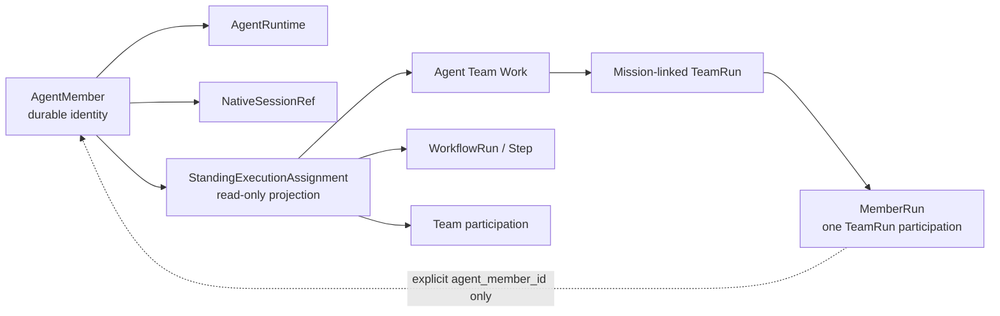

# Standing Agent Focus Page Spec

```text
status: partial implementation — explicit Agent Team participation projection is implemented
owner_role: product-design
canonical_for: one durable StandingAgent organization identity with explicitly linked execution history
route_or_surface: Organization -> StandingAgent
```

## Product question

The operator opens a long-lived teammate to answer: is this Agent available,
which explicit contexts is it serving, what has it done across those contexts,
and can I safely message it now?

This is not a `MemberRun` or AgentMember page. A `StandingAgent` retains Company
identity and authority independently of provider execution. A `MemberRun`
remains one participation in one `AgentTeamRun` attempt.

The implemented slice uses the Company-owned relation
`StandingAgent.execution_agent_member_ref -> AgentMember.id ->
MemberRun.agent_member_id`. Creating a TeamRun from an AgentTeam definition
preserves the AgentMember identifier on each MemberRun. Equal ids never bind,
and ad-hoc unlinked members remain execution-only. The Company OS snapshot
derives `standing_assignments` from latest native rows; it never creates
another assignment ledger or writes execution lifecycle back to Organization.

The first edge is authored only by `firm company org link-execution` /
`unlink-execution`, which validate the AgentMember against an explicitly named
Execution Space. See `docs/current/company-os/organization-and-actors.md` for the write
contract and the cross-store boundary.

### `standing_assignment_conflicts`

The snapshot always carries `standing_assignment_conflicts` beside
`standing_assignments`; it is an empty array in the healthy case. Consumers must
read both keys: when two StandingAgents claim the same
`execution_agent_member_ref`, the projection refuses to guess a winner and
withholds that `agent_member_id` from `standing_assignments`, so reading
assignments alone would show the participation as silently absent.

Each entry names the ambiguity and the way out:

```json
{
  "id": "standing-link-conflict:<agent_member_id>",
  "kind": "duplicate_execution_agent_member_ref",
  "severity": "error",
  "agent_member_id": "<agent_member_id>",
  "standing_agent_ids": ["<claimant>", "<claimant>"],
  "affected_member_run_ids": ["<withheld member run>"],
  "detail": "duplicate StandingAgent execution_agent_member_ref ...",
  "resolution_hint": "firm company org actor unlink-execution ..."
}
```

The page renders these as a bounded warning banner: at most five entries plus a
`+N more` indicator, so a pathological store cannot flood the surface. An empty
list renders nothing. A duplicate link is a local, visible defect — it must
never fail the whole snapshot.

## Object boundary



Shared UI does not imply shared lifecycle. Never join an `AgentMember` to a
`MemberRun` by name, role, provider, model, or temporal proximity.

## Required read model

### AgentMember availability

The snapshot needs explicit optional fields rather than deriving availability
from `idle` or a healthy process:

```text
availability = available | busy | paused | offline | unknown
assignment_capacity: integer | null
exclusive_assignment_ref: string | null
```

Missing values render as `Availability not reported`. `Available` means the
Agent can accept work under its capacity and permission policy; it does not
mean the Agent has no history or no active non-exclusive assignments.

### StandingExecutionAssignment projection

`StandingExecutionAssignment` is a read-only cross-executor projection, not a
legacy dependency graph and not a new universal executor:

```text
id
agent_member_id
source_kind = agent_team_work | agent_team_participation
source_ref
work_id?
mission_id? / wave_id?
team_run_id? / member_run_id?
workflow_run_id? / workflow_step_id?
title
role
status
assigned_at
last_activity_at?
navigation_target
```

Projection rules:

- An owned Agent Team Work projects as `agent_team_work`; `source_ref` and
  `work_id` both identify that durable Work. Work status, not a message kind,
  supplies the execution status.
- A MemberRun with no owned Work may project as `agent_team_participation`, so
  the page can show honest team presence without inventing responsibility.
- Mission/Wave context comes from the TeamRun's explicit links. A Wave does not
  own the Work or MemberRun.
- Workflow participation uses an explicit step owner and the step's
  `NativeSessionRef` when provider-native activity is available.
- TeamMessage is conversation only. A direct message may appear in activity,
  but never creates a responsibility row.
- Missing links remain missing. The UI must not fall back to legacy
  `current_task_id` or an old assignment message to invent a Work relation.
- Retries and runtime generations remain execution lineage for one Work, not
  duplicate active responsibility.

## Layout contract

Use the shared `FocusShell`: continuous activity/conversation in the center,
sticky composer, and a composed Context Rail. The active execution-workbench
visual contract is in git history (design/execution-workbench-v3);
the retired `workbench-layout-v2` concept package is no longer an active
design source.

Center reading order:

1. durable identity header: name, availability, `Standing Agent`, provider and
   model;
2. availability banner, including exclusive-assignment truth;
3. chronological cross-context activity: direct messages, owned Works,
   workflow participation, delivered artifacts, provider-native
   activity projections, and agent replies;
4. composer addressed to the AgentMember, with queue/busy behavior stated
   honestly.

Context Rail order:

1. Agent Profile;
2. Availability and capacity;
3. Active Assignments;
4. Capabilities and skills;
5. Runtime and permission/workspace boundaries;
6. Provider Sessions and observed child threads.

At tablet width the product navigation uses the shared compact rail and context
moves behind `Context & controls`. Mobile preserves one central stream and a
fixed composer; context remains a disclosure rather than disappearing.

## Explicit non-goals

- no Mission > Wave > Team breadcrumb as page ownership;
- no Wave gate or TeamRun retry lifecycle at Agent level;
- no legacy dependency graph requirement;
- no inference that a provider-native child thread is another AgentMember;
- no persisted thinking in the activity stream;
- no fake capacity, capability, assignment, interrupt, or wake state;
- no reuse of legacy `Tasks` as the primary cross-executor model.

## Implemented state

The Store-live Organization chart routes Human and Standing Agent cards to
their profile. A Standing Agent profile now shows:

- WorkItems linked through Company OS Actor references;
- Agent Team Works linked through `MemberRun.agent_member_id`;
- the exact TeamRun, MemberRun, Work id/version/status, and optional
  provider-native session locator;
- a deep link to the Team/Member execution surface; and
- an explicit empty state when no MemberRun is linked.

The profile continues to keep organizational status, business authority, and
runtime participation separate. A running member does not grant authority, and
an offline runtime does not retire a Standing Agent.

## Remaining representative state

`available-multi-work` proves:

- one healthy durable AgentMember with explicit `available` state;
- multiple non-exclusive Works or WorkItems from at least two source kinds;
- capacity remains available;
- provider-native session history reached through explicit native-session refs;
- a delivered artifact and durable message history;
- no single Wave owns the page and no thinking is persisted.

## Remaining gates

This page is not complete until:

1. availability and capacity ownership are implemented rather than inferred;
2. Workflow participation and direct durable-agent messaging gain equally
   explicit source links;
3. the candidate expected design is marked approved in the visual contract;
4. deterministic Dashboard interaction coverage proves chart-to-profile and
   profile-to-MemberRun navigation at supported viewports; and
5. a durable Team Supervisor can report cross-client member runtime health.
