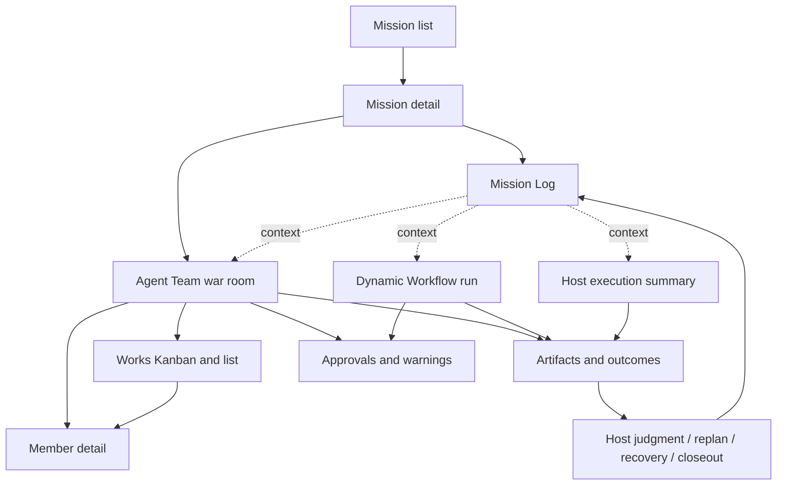

# Agent Workbench

The Agent Workbench is the operator UI for Star Harness. Its job is to make
durable flat AgentTeams, shared Works, execution state, artifacts, Host
decisions, and capability gaps inspectable
without raw JSON or duplicated provider transcripts.

`Agent Workbench` is the product name. `Agent Dashboard` remains a compatibility
module/path name in `apps/agent-dashboard`, snapshots, and commands.

## Product Flow

```text
AgentTeam (durable, flat)
  -> Team/Node/Project-fenced TeamRun
      -> shared Works -> Member execution
  -> Dynamic Workflow | Host work
  -> observable actions/messages/artifacts/outcome
  -> explicit Host judgment on the Work records
  -> plan adjustment, recovery, or run completion
```

The Workbench must not require or introduce a dependency graph for Agent Team
or Work objects. Retired coordination pages (Mission detail, Team War Room,
Company OS) are not part of active navigation or authoring; Agent Teams
navigation lists durable Teams and their runs.

## Key Questions

| Question | Workbench answer |
| --- | --- |
| What durable outcome are we pursuing? | Mission header with Markdown context, status, owning Team, and closeout summary. |
| What should happen next? | Latest Mission Log judgment with context, cited Work, outcome, and next action. |
| Which execution is active? | Mission-owned TeamRuns, Workflows, and Host work with honest native status; Log entries do not own them. |
| Who owns Agent Team work? | Work owner, status, readiness, WorkDelivery receipt, submission, and review state. |
| Which service owns the live Team? | Machine NodeDaemon generation plus its parent-fenced Team Supervisor generation, heartbeat, loopback locator, reconnect state, and control availability. |
| Who sent this message? | Authenticated sender Actor plus exact AgentIdentity/AgentSession where applicable; UI never infers authorship from display text or Team role. |
| What is each member doing? | Provider/model, lifecycle, current explicit action, pressure, heartbeat, and blockers. |
| What did a Dynamic Workflow produce? | Workflow steps, artifact manifests, typed result/verdict, and patch state. |
| What did the Host do directly? | Observable actions, artifacts, and outcome without invented child ownership. |
| What needs the user? | Authorization, blocker, failed delivery, budget, retry, and Host-decision alerts. |
| Can I trust the view? | Capability gaps are explicit; unsupported joins are never fabricated. |

## Information Architecture



## Core Views

| View | Purpose | Safe actions |
| --- | --- | --- |
| Mission list | Find active, blocked, completed, and proposed Missions. | create/open Mission |
| Mission detail | Read durable context, its one Team, append-only Mission Log, and outcome. | append Mission Log, close |
| Mission Log | Read Host judgments, replans, recovery, cited evidence, and closeout in order. | append judgment/replan/recovery/closeout entry, open linked execution |
| Agent Team | Operate one Mission-owned, single-Node TeamRun across Mission plan changes. | create/assign/claim/review Works, delegate, message, inspect runtime, add/close/resume members |
| Works | Inspect assigned, unassigned, ready, active, blocked, review, done, and child Work without reading chat. | create, assign, claim, start, block, submit, request changes, accept, release, cancel, delegate |
| Member detail | Inspect one MemberRun lane, My Works, ready pool, mailbox, native-session locator, and actions. | claim/start/submit Work, message, inspect, interrupt/close/resume when supported |
| Dynamic Workflow | Inspect one WorkflowRun and its steps/artifacts/patches. | apply/reject patch, cite result from Host plan |
| Host execution | Show direct Host outcome and optional observed delegation. | attach artifact/outcome |
| Warnings/approvals | Surface unsafe or incomplete state. | approve/reject, retry, clarify, record Mission judgment |

## Agent Team Proof

The target ownership chain is:

```text
Mission -> one AgentTeam -> AgentTeamRun(agent_team_id, execution_node_id, project_binding_id)
  -> Work -> owner + WorkEvents + WorkDelivery
  -> MemberRun + native session execution
  -> optional Work-linked canonical Messages
  -> artifacts + outcome
MissionLogEntry -. Host judgment / optional origin metadata .-> Work or outcome
```

Assignment and claim are Work operations. WorkDelivery records the exact Work
id/version consumed by the provider round. Message correlation remains
conversation lineage and may link a Work, but never proves ownership or current
status. The UI renders WorkEvent, delivery, native execution, discussion,
submission, and acceptance as separate facts.

## Data Requirements

| Workbench need | Required contract |
| --- | --- |
| Mission/Log | Mission id/status/context plus ordered append-only Log entries with kind, Markdown body, actor/time, citations, and closeout |
| Executions | frozen TeamRun/WorkflowRun ids, status, lineage, outcomes, and explicit Mission/context relations |
| Team Works | Work id/version, owner, status, readiness, claim policy, blockers, parent/child, results, artifacts, and checks |
| Work delivery | WorkEvent id, target MemberRun, claim, provider receipt/failure, invalidation, retry, and reconciliation; Work claim/start is the semantic responsibility acknowledgement |
| Member state | lifecycle, provider/model, latest explicit action, heartbeat, queue pressure |
| Supervisor | current lease generation, owner/heartbeat, routed-control health, reconnect/close latch |
| Delivery | authenticated Message sender, authorized recipients, claim, provider receipt, per-recipient acknowledgement, retry/reconciliation |
| AgentMember mail | immutable Message plus one CanonicalMessageDelivery per recipient AgentIdentity, frozen to the exact AgentSession generation on claim |
| Workflow | WorkflowRun/Step, artifacts, result/verdict, patch state |
| Host path | observable artifact/outcome without fake controlled children |
| Mission Log decision | Host outcome, actor/time, note, artifacts, and next-plan/recovery context |

Fields that affect acceptance, authorization, or ownership belong in schemas
and runtime contracts, not frontend-only state.

## Thinking Boundary

The Console can show sanitized, truncated, rate-limited provider activity while
a provider is streaming it. A `thinking` preview is sent only as the exact
owner's Execution-Space + Project-Binding-scoped SSE
`live_provider_activity` frame, includes an
expiry, and disappears on terminal state, refresh/reconnect, TTL expiry, or
process restart. It never enters snapshot history, JSONL, replay, evidence,
messages, Host inspection, or peer context.

New Kimi writes do not persist thinking, and active stores do not retain
`MemberAction(type=thinking)` rows. The live preview is intentionally
display-only and cannot be used to reconstruct an attempt.

## Warnings

| Warning | Trigger |
| --- | --- |
| Orphan execution | Member execution has no active Work or explicit Host-only exception. |
| Ambiguous Work owner | active Work has conflicting or stale ownership versions. |
| Ready work stranded | ready unassigned Work exists while eligible Members remain idle. |
| Failed/unacknowledged delivery | Required per-recipient delivery is failed or beyond its acknowledgement threshold. |
| Delivery uncertain | A claim exists without a provider receipt and requires explicit reconciliation. |
| Supervisor unavailable | No current owner can prove provider transport or execute live controls. |
| Stale Supervisor generation | A client attempted delivery/control through a superseded lease. |
| Closed member | New mail or start attempted after the Host's durable Close latch. |
| Authorization required | Deploy, remote deletion, protected merge, payment, or comparable external change is pending. |
| Stale member | No recent explicit action/heartbeat for an active member. |
| Path/permission conflict | Member action exceeds owned paths or permission ceiling. |
| Missing outcome/artifact | Attempt claims completion without the gate's required result. |
| Ambiguous accepted attempt | A Mission cites retries but no single accepted run. |
| Durable thinking | A new runtime write persists thinking after the migration gate is enabled. |
| Capability unavailable | Provider, hook, delegation observation, or control action is unsupported. |

Warnings link to a real repair action or clearly state that no repair surface
exists yet.

## Document Boundary

| Document | Owns |
| --- | --- |
| `docs/architecture-map.md` | cross-module product and runtime map |
| `docs/current/operations/dashboard.md` | Workbench product purpose and information architecture |
| `docs/current/dashboard/pages/*.md` | page purpose, proof, actions, and layout contracts |
| `docs/current/dashboard/frontend-architecture.md` | frontend modules, routing, and read-model plumbing |
| `apps/agent-dashboard/src/model/*.ts` | implemented projections and selectors |
| git history (design/execution-workbench-v4) | Team War Room Works browser, screenshot, responsive, and visual acceptance |
| `docs/current/dashboard/runbook.md` | local run/build/snapshot entry points |
| `docs/current/dashboard/frontend-design.md` | shared visual doctrine and layout decisions |

## Acceptance

Workbench acceptance requires fixtures plus at least one live Mission showing:

1. Mission context plus append-only Mission Log without a legacy dependency graph;
2. the Mission's flat AgentTeam and a Team/Node/Project-fenced TeamRun with
   assigned, unassigned, claimed, delivered, reviewed, and child Work data;
3. at least one independent WorkflowRun/Host-work projection or an explicit
   unsupported-state fixture;
4. preserved terminal run history without making a Log entry own the run;
5. artifacts/outcome and an explicit Host Mission Log decision;
6. authorization and failed-delivery alerts;
7. honest correlation and provider capability degradation;
8. no new thinking in durable snapshots after the transient migration;
9. an asynchronous attempt start whose durable updates arrive in the selected
   project's SSE read model;
10. transient thinking that is absent after reload/expiry and from snapshots;
11. no retired coordination or unlinked-TeamRun surface in active navigation;
12. desktop, tablet, and mobile screenshot evidence with no horizontal overflow.

## Invariants

1. Mission is the primary product navigation; Mission Log is its judgment history.
2. A Mission Log entry is append-only and never owns lifecycle or execution.
3. Executor-specific semantics remain visible rather than collapsed.
4. Agent Team ownership starts with an atomic Work assignment or claim and its
   WorkEvent, never a Message or an unversioned display-only assignee field.
5. Unsupported correlation, delegation, or thinking behavior is labeled.
6. UI actions route through canonical API/MCP/runtime contracts.
7. The Workbench read model never outranks store/schema/runtime truth.
