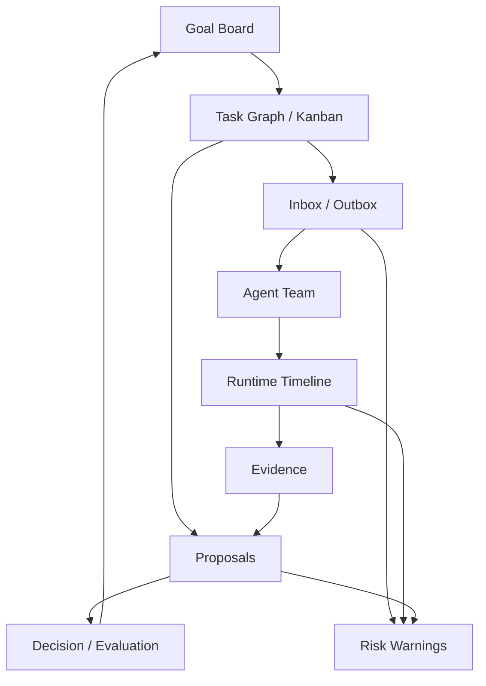

# Agent Dashboard

The Agent Dashboard is the control-plane UI for Multi-Agent Harness. It is not
a decorative report and it is not a replacement for project-specific
dashboards. Its job is to make the harness workflow inspectable and operable.

## Vision Link

The product is accepted only when users can see that the multi-agent workflow
actually happened:

```text
goal -> task graph -> task message -> agent runtime
  -> report/evidence -> proposal/review -> decision/evaluation
```

If the user must inspect raw JSON, provider transcripts, or chat history to
know whether agents are working, the Dashboard has failed.

## Key Questions

| Question | Dashboard answer |
| --- | --- |
| What goal is active and why? | Goal board with objective, success criteria, owner, and evaluation status. |
| What work can run now? | Task graph and Kanban lanes with dependencies and blockers. |
| Who is working? | Agent team roster with role, permissions, runtime, current task, and latest event. |
| Was work actually assigned? | Inbox/outbox and delivery state for `Message(kind=task)`. |
| What is the agent doing now? | Runtime timeline, provider sessions, event age, queue state, and failures. |
| What evidence supports the result? | Evidence lane linked to commands, diffs, artifacts, screenshots, or reviews. |
| What decision was made? | Proposal, critic/review, Leader decision, and follow-up tasks. |
| What threatens acceptance? | Warnings for stale runtimes, failed deliveries, missing evidence, path conflicts, and missing evaluations. |

## Information Architecture



## Backward Data Requirements

Dashboard needs should force the data model to expose missing state.

| Dashboard need | Required state |
| --- | --- |
| Show real assignment | task-linked `Message(kind=task)` and delivery status |
| Show member activity | `AgentMember.status`, `current_task_id`, `current_proposal_id`, latest `AgentEvent` |
| Show runtime health | `AgentRuntime` process/socket/protocol/delivery health |
| Show queue | undelivered or queued messages by member/channel |
| Show proposal progress | proposal status, changed paths, evidence refs, review refs |
| Show review quality | critic/reviewer report, missing evidence, path ownership checks |
| Show acceptance | `Decision` plus rationale and evidence ids |
| Show learning | `GoalEvaluation`, follow-up tasks, reusable goal case link |

If a field is needed only for a visual label, it may remain a read model. If it
changes acceptance or safety, it belongs in schema/CLI/API and eventually CI.

## Core Views

| View | Purpose | Safe actions |
| --- | --- | --- |
| Goal board | Track active goals, acceptance, and evaluation. | create follow-up task, record evaluation |
| Task graph / Kanban | Show work order, blockers, owner, assignee, reviewer, PR/workspace. | create/split/block/assign task |
| Agent team | Show member identity, role, skills, permissions, runtime state. | create/start/stop/close member |
| Inbox / outbox | Show messages, queued work, delivery success/failure. | send message, retry delivery, ask follow-up |
| Runtime timeline | Show provider sessions, event age, failures, hooks, child threads. | interrupt, reconcile, close runtime |
| Proposal and evidence | Show diffs, checks, artifacts, review, critic findings. | request review, attach evidence |
| Decisions | Show Leader choices, waivers, follow-ups, acceptance state. | record decision, create follow-up |

Dashboard actions must update canonical harness objects. A UI action that only
changes local display state cannot be the source of truth.

## Product Layout

The first Dashboard should be a work surface, not a landing page. The default
screen should answer "what is happening now and what needs a decision?"

```text
left rail:
  goals
  task boards
  teams
  provider sessions
  decisions

main work area:
  selected goal
  task graph / Kanban
  selected task detail

right rail:
  member roster
  inbox/outbox
  warnings
  latest evidence and decisions
```

## Task Detail Panel

Selecting a task should show:

- objective and acceptance criteria;
- owner, assignee, reviewer, dependencies, parent, and follow-ups;
- assignment messages and delivery state;
- current member/runtime handling the task;
- workspace, branch, PR, and owned paths;
- reports, evidence refs, proposal, review, and Leader decision;
- warnings for missing assignment, missing evidence, stale runtime, failed
  provider session, path conflict, or missing evaluation.

This panel is the primary way to verify that a task was really run through the
harness rather than backfilled after local work.

## Agent Member Panel

Selecting a member should show:

- id, name, description, role, team, prompt ref, skill refs, capabilities;
- provider, runtime id, health layers, control endpoint, provider thread id;
- current task, current proposal, queue length, latest event age;
- permission profile, workspace roots, approval state, and forbidden actions;
- provider sessions and child threads;
- messages sent to and from the member.

The member panel should make one-shot provider output visibly different from a
durable harness `AgentMember`.

## Warnings

Warnings are product features because they expose harness failure modes.

| Warning | Trigger |
| --- | --- |
| Fake assignment risk | task has assignee but no prior delivered task message |
| Missing evidence | proposal or decision references no valid evidence |
| Stale runtime | runtime has no recent event or failed protocol health |
| Failed delivery | latest task message delivery failed or lacks terminal status |
| Path conflict | task changed paths outside owned scope or overlaps active task |
| Provider-only claim | provider output exists but no report/evidence/proposal was recorded |
| Missing evaluation | goal is closing without goal evaluation or waiver |

Warnings should link to repair actions: send message, retry delivery, attach
evidence, request review, split task, record decision, or create follow-up.

## UI/UX Direction

The first product shape should be operational and dense:

- Kanban-like task board for repeated work;
- team roster and member runtime panels;
- message inbox/outbox adjacent to tasks and members;
- proposal/evidence/review lanes for acceptance;
- warnings panel for broken workflow invariants.

The Dashboard should link to project dashboards through adapters instead of
duplicating domain UI. For example, a strategy adapter may link to trading
charts, but the Agent Dashboard still owns task/message/evidence/decision
visibility.

## Acceptance

Dashboard acceptance requires a fixture or live snapshot that shows:

1. a goal with design and evaluation state;
2. a task graph or Kanban board with dependencies and blockers;
3. a member roster with runtime health and message queue state;
4. assignment messages with delivered or failed status;
5. provider sessions and runtime events;
6. proposal, evidence, review, decision, and follow-up visibility;
7. warnings when any required workflow link is missing.

## Invariants

1. Dashboard must show assignment messages, not only assignee fields.
2. Dashboard warnings should expose missing evidence and failed delivery.
3. Dashboard should distinguish harness state from provider or project links.
4. Safe actions should route through CLI/API/store contracts.
5. A polished page that cannot prove the workflow happened is not accepted.
