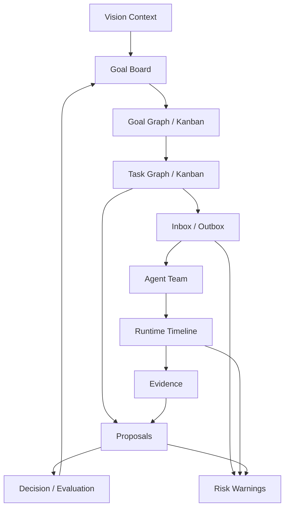

# Agent Dashboard

The Agent Dashboard is the control-plane UI for Multi-Agent Harness. It is not
a decorative report and it is not a replacement for project-specific
dashboards. Its job is to make the harness workflow inspectable and operable.

## Vision Link

The product is accepted only when users can see that the multi-agent workflow
actually happened:

```text
vision -> goal collection -> selected goal -> goal design
  -> goal graph/Kanban -> task graph/Kanban
  -> task message -> agent runtime
  -> report/evidence -> proposal/review -> decision/evaluation
  -> distance-to-vision assessment
  -> next-round plan -> follow-up task / next goal / goal case
```

If the user must inspect raw JSON, provider transcripts, or chat history to
know whether agents are working, the Dashboard has failed.

## Key Questions

| Question | Dashboard answer |
| --- | --- |
| What goal is active and why? | Goal board with objective, success criteria, owner, and evaluation status. |
| How does this goal serve the vision? | Vision context with final acceptance signals, goal collection, pilot/scenario, and distance-to-vision gaps. |
| Which goals are complete or still open? | Vision goal collection grouped by complete, active, blocked, proposed, and archived/rejected states. |
| What work should exist next? | Observer proposals for goals, blockers, graph changes, and follow-up tasks. |
| What goal work can move now? | Goal graph and goal Kanban with generated goals, blockers, follow-ups, review/evaluation readiness, and Lead disposition. |
| What task work can run now? | Task graph and task Kanban lanes with dependencies, blockers, execution state, and review state. |
| Which team should this goal use? | GoalDesign team plan plus current AgentTeam roster, role gaps, and runtime changes. |
| Who is working? | Agent team roster with role, permissions, runtime, current task, and latest event. |
| Was work actually assigned? | Inbox/outbox and delivery state for `Message(kind=task)`. |
| What is the agent doing now? | Runtime timeline, provider sessions, event age, queue state, and failures. |
| What evidence supports the result? | Evidence lane linked to commands, diffs, artifacts, screenshots, or reviews. |
| What decision was made? | Proposal, critic/review, Leader decision, and follow-up tasks. |
| What threatens acceptance? | Warnings for stale runtimes, failed deliveries, missing evidence, path conflicts, and missing evaluations. |

## Information Architecture



## Backward Data Requirements

Dashboard needs should force the data model to expose missing state.

| Dashboard need | Required state |
| --- | --- |
| Show real assignment | task-linked `Message(kind=task)` and delivery status |
| Show member activity | `AgentMember.status`, `current_task_id`, `current_proposal_id`, latest `AgentEvent` |
| Show runtime health | `AgentRuntime` process/socket/protocol/delivery health |
| Show queue | undelivered or queued messages by member/channel |
| Show proposal progress | proposal status, changed paths, evidence refs, review refs |
| Show review quality | critic/reviewer report, missing evidence, path ownership checks |
| Show acceptance | `Decision` plus rationale and evidence ids |
| Show learning | `GoalEvaluation`, follow-up tasks, reusable goal case link |

If a field is needed only for a visual label, it may remain a read model. If it
changes acceptance or safety, it belongs in schema/CLI/API and eventually CI.

## Core Views

| View | Purpose | Safe actions |
| --- | --- | --- |
| Goal board | Track active goals, acceptance, and evaluation. | create follow-up task, record evaluation |
| Observer proposals | Show proposed goals, blockers, graph changes, evidence, and Lead disposition. | accept/reject/defer proposal |
| Goal graph / Kanban | Show goal dependencies, generated goals, blockers, follow-ups, completion state, review/evaluation readiness, and Lead disposition. | propose/accept/reject/defer goal, create follow-up |
| Task graph / Kanban | Show task work order, blockers, owner, assignee, reviewer, PR/workspace, graph changes, and execution state. | create/split/block/assign task |
| Agent team | Show member identity, role, skills, permissions, runtime state. Prefer roster/control-plane layout over graph by default. | create/start/stop/close member |
| Inbox / outbox | Show messages, queued work, delivery success/failure. | send message, retry delivery, ask follow-up |
| Runtime timeline | Show provider sessions, event age, failures, hooks, child threads. | interrupt, reconcile, close runtime |
| Proposal and evidence | Show diffs, checks, artifacts, review, critic findings. | request review, attach evidence |
| Decisions | Show Leader choices, waivers, follow-ups, acceptance state. | record decision, create follow-up |

Dashboard actions must update canonical harness objects. A UI action that only
changes local display state cannot be the source of truth.

## Product Layout

The first Dashboard should be a work surface, not a landing page. The default
screen should answer "what is happening now and what needs a decision?"

```text
left rail:
  vision context
  goals
  task boards
  teams
  provider sessions
  decisions

main work area:
  selected vision/goal status
  selected goal
  goal team design
  goal graph / Kanban
  task graph / Kanban
  selected task detail

right rail:
  member roster
  inbox/outbox
  warnings
  latest evidence and decisions
```

## Document Boundary

Dashboard knowledge is split by responsibility so product intent does not get
mixed with frontend implementation details:

| Document | Owns | Refuses |
| --- | --- | --- |
| `docs/dashboard.md` | product-level Dashboard purpose, information architecture, backward data requirements, user-facing acceptance | component folder layout, package commands, framework internals |
| `docs/dashboard/README.md` | Dashboard docs placement map, change order, and docs/surface routing rules | product semantics or component implementation |
| `docs/dashboard/design-principles.md` | core frontend design principles, graph/Kanban policy, AgentTeam/AgentMember UI doctrine, visual system, and current UX failure modes | route-level layout details or React module boundaries |
| `docs/dashboard/ui-ux-layout.md` | global shell, route/page layout, responsive behavior, and per-surface composition | canonical object semantics, framework internals, run commands, browser acceptance |
| `docs/dashboard/frontend-architecture.md` | Agent Dashboard frontend architecture, component responsibilities, app-local source boundary | product PRD or runbook commands |
| `docs/dashboard/read-model.md` | read-model projections, goal scope, warning promotion rules | canonical validation rules or Rust implementation |
| `docs/dashboard/acceptance.md` | browser screenshot evidence, web-quality gate, and frontend acceptance sequence | product purpose or local development commands |
| `docs/dashboard/runbook.md` | run, build, snapshot, and live API entry points | architecture rationale or acceptance policy |
| `docs/decisions/0014-react-vite-agent-dashboard.md` | durable frontend framework decision and consequences | day-to-day runbook or product view inventory |

Canonical Dashboard docs live under `docs/`. The app directory contains source,
configuration, and build output only.

The frontend architecture follows this product boundary:

```text
Rust store / CLI / API
  -> snapshot JSON
  -> frontend read model
  -> goal-scoped control-plane panels and warnings
```

The UI/UX layout contract is in
[dashboard/ui-ux-layout.md](dashboard/ui-ux-layout.md). Frontend changes that
reshape the Dashboard should update that document before changing component
structure or CSS.

Browser screenshot and web-quality acceptance lives in
[dashboard/acceptance.md](dashboard/acceptance.md). Layout PRs should plan that
evidence before implementation starts.

Frontend warnings are operator read-model warnings until promoted. If a warning
becomes an acceptance rule, it must move into schema, Rust validation, CLI/API,
review gate, or CI/CD. This prevents Dashboard convenience logic from silently
becoming the source of truth.

## Task Detail Panel

Selecting a task should show:

- objective and acceptance criteria;
- owner, assignee, reviewer, dependencies, parent, and follow-ups;
- assignment messages and delivery state;
- current member/runtime handling the task;
- workspace, branch, PR, and owned paths;
- reports, evidence refs, proposal, review, and Leader decision;
- warnings for missing assignment, missing evidence, stale runtime, failed
  provider session, path conflict, or missing evaluation.

This panel is the primary way to verify that a task was really run through the
harness rather than backfilled after local work.

## Agent Member Panel

Selecting a member should show:

- id, name, description, role, team, prompt ref, skill refs, capabilities;
- provider, runtime id, health layers, control endpoint, provider thread id;
- current task, current proposal, queue length, latest event age;
- permission profile, workspace roots, approval state, and forbidden actions;
- provider sessions and child threads;
- messages sent to and from the member.

The member panel should make one-shot provider output visibly different from a
durable harness `AgentMember`.

## Warnings

Warnings are product features because they expose harness failure modes.

| Warning | Trigger |
| --- | --- |
| Fake assignment risk | task has assignee but no prior delivered task message |
| Missing evidence | proposal or decision references no valid evidence |
| Stale runtime | runtime has no recent event or failed protocol health |
| Failed delivery | latest task message delivery failed or lacks terminal status |
| Path conflict | task changed paths outside owned scope or overlaps active task |
| Provider-only claim | provider output exists but no report/evidence/proposal was recorded |
| Missing evaluation | goal is closing without goal evaluation or waiver |

Warnings should link to repair actions: send message, retry delivery, attach
evidence, request review, split task, record decision, or create follow-up.

## UI/UX Direction

The first product shape should be operational and dense:

- goal graph plus goal Kanban for generated goals, blockers, follow-ups, and
  evaluation readiness;
- task graph plus task Kanban for dependency and execution work;
- team roster and member runtime panels;
- message inbox/outbox adjacent to tasks and members;
- proposal/evidence/review lanes for acceptance;
- warnings panel for broken workflow invariants.

The Dashboard should link to project dashboards through adapters instead of
duplicating domain UI. For example, a strategy adapter may link to trading
charts, but the Agent Dashboard still owns task/message/evidence/decision
visibility.

## Acceptance

Dashboard acceptance requires a fixture or live snapshot that shows:

1. a goal with design and evaluation state;
2. vision context, goal collection grouped by completion state, and
   distance-to-vision state, or explicit missing-context warnings for any
   self-improving/autonomous goal;
3. Observer or equivalent proposals for next goals, blockers, graph changes, or
   follow-up tasks when the workflow is long-running;
4. selected-goal AgentTeam design plus current team roster, role gaps, runtime
   health, and message queue state;
5. goal graph and goal Kanban views for generated goals, blockers, follow-ups,
   completion state, and evaluation readiness;
6. task graph and task Kanban views with dependencies, blockers, and
   graph-change history;
7. assignment messages with delivered or failed status;
8. provider sessions and runtime events;
9. proposal, evidence, review, decision, and follow-up visibility;
10. warnings when any required workflow link is missing.

Frontend layout PRs must also include a web-quality pass. The recommended
optional skill source is `https://github.com/addyosmani/web-quality-skills`;
use it for accessibility, Core Web Vitals, performance, SEO, and browser
best-practices checks after the harness-specific workflow acceptance passes.

## Invariants

1. Dashboard must show assignment messages, not only assignee fields.
2. Dashboard warnings should expose missing evidence and failed delivery.
3. Dashboard should distinguish harness state from provider or project links.
4. Safe actions should route through CLI/API/store contracts.
5. A polished page that cannot prove the workflow happened is not accepted.
6. AgentTeam should render as a persistent organization by default, not as a
   decorative graph.
7. Goal and Task graph/Kanban views must be synchronized projections of the
   same harness state, not independent frontend state machines.
