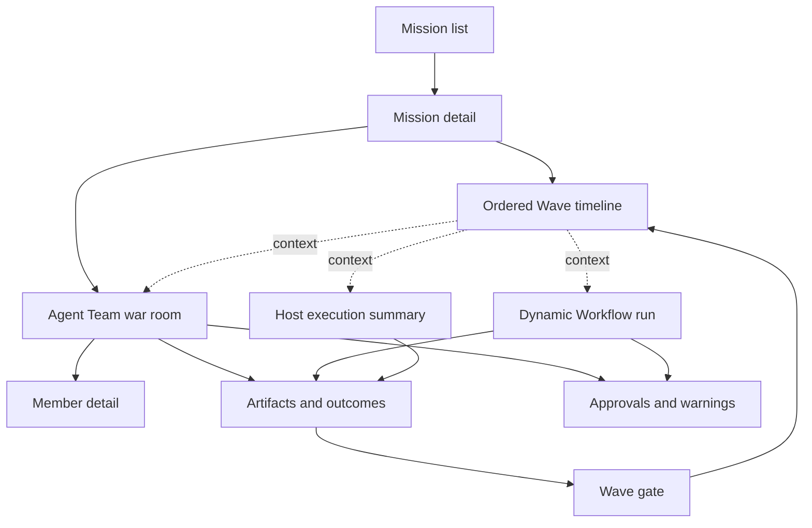

# Agent Workbench

The Agent Workbench is the operator UI for Star Harness. Its job is to make
Mission/Wave Host planning, linked Agent Teams, execution state, assignment
ownership, artifacts, advance decisions, and capability gaps inspectable
without raw JSON or duplicated provider transcripts.

`Agent Workbench` is the product name. `Agent Dashboard` remains a compatibility
module/path name in `apps/agent-dashboard`, snapshots, and commands.

## Product Flow

```text
Mission
  -> ordered Host-plan Wave
  <-> independent Agent Team -> Mission-scoped TeamRun
  -> Dynamic Workflow | Host work
  -> observable actions/messages/artifacts/outcome
  -> explicit Host Wave advance
  -> next Wave or Mission closeout
```

The Workbench must not require or introduce a dependency graph for Mission,
Wave, or Agent Team. Retired coordination pages and unlinked Team Runs are not
part of active navigation or authoring.

## Key Questions

| Question | Workbench answer |
| --- | --- |
| What durable outcome are we pursuing? | Mission header with Markdown context, status, linked teams, and closeout summary. |
| What should happen next? | Ordered Wave list with full Host context, revision, carry-over, outcome, and next action. |
| Which execution is active? | Mission-linked TeamRuns/Workflows/Host work with honest native status; Wave does not own them. |
| Who owns Agent Team work? | Assignment-message id/correlation, member lane, delivery/ACK, handoff, and review state. |
| What is each member doing? | Provider/model, lifecycle, current explicit action, pressure, heartbeat, and blockers. |
| What did a Dynamic Workflow produce? | Workflow steps, artifact manifests, typed result/verdict, and patch state. |
| What did the Host do directly? | Observable actions, artifacts, and outcome without invented child ownership. |
| What needs the user? | Authorization, blocker, failed delivery, budget, retry, and Wave-gate alerts. |
| Can I trust the view? | Capability gaps are explicit; unsupported joins are never fabricated. |

## Information Architecture



## Core Views

| View | Purpose | Safe actions |
| --- | --- | --- |
| Mission list | Find active, blocked, completed, and proposed Missions. | create/open Mission |
| Mission detail | Read durable context, linked teams, ordered Host-plan Waves, and outcome. | link/create team, create/update/advance Wave, close |
| Wave timeline | Compare Host plan revisions, carry-over, evidence, and advance outcomes. | update/advance Wave, open linked execution |
| Agent Team | Operate one collaborative Wave attempt. | start asynchronously, message, ACK/re-deliver, open member, request review |
| Member detail | Inspect one MemberRun lane and its assignments/actions. | send control/question, review handoff |
| Dynamic Workflow | Inspect one WorkflowRun and its steps/artifacts/patches. | apply/reject patch, attach result to gate |
| Host execution | Show direct Host outcome and optional observed delegation. | attach artifact/outcome |
| Warnings/approvals | Surface unsafe or incomplete state. | approve/reject, retry, clarify, revise Wave |

## Agent Team Proof

The target ownership chain is:

```text
Wave
  -> AgentTeamRun attempt
  -> TeamMessage(kind=assignment)
  -> correlation_id
  -> explicit member actions / blocker / handoff / review / delegation
  -> artifacts + outcome
  -> Wave gate
```

Automatic handoff preserves assignment correlation. Manual CLI, HTTP, and MCP
sends can reuse that assignment correlation or inherit it from a validated
same-run cause. The UI should render these structural joins and label messages
with omitted lineage as unanchored rather than fabricating ownership.

## Data Requirements

| Workbench need | Required contract |
| --- | --- |
| Mission/Wave | additive ids, status, ordered membership, objective, executor kind |
| Attempts | executor run ids, lineage, accepted run id |
| Team ownership | assignment message id and reusable correlation/causation inputs |
| Member state | lifecycle, provider/model, latest explicit action, heartbeat, queue pressure |
| Delivery | per-recipient delivery/ACK state and retry/escalation |
| Workflow | WorkflowRun/Step, artifacts, result/verdict, patch state |
| Host path | observable artifact/outcome without fake controlled children |
| Wave gate | accepted/revise/blocked, actor/time, note, artifacts, accepted run |

Fields that affect acceptance, authorization, or ownership belong in schemas
and runtime contracts, not frontend-only state.

## Thinking Boundary

The Console can show sanitized, truncated, rate-limited member activity while a
provider is streaming it. A `thinking` preview is sent only as a project-scoped
SSE `member_activity` frame, includes an expiry, and disappears on refresh or
TTL expiry. It never enters snapshot history, JSONL, replay, evidence,
messages, or peer context.

New Kimi writes do not persist thinking, and active stores do not retain
`MemberAction(type=thinking)` rows. The live preview is intentionally
display-only and cannot be used to reconstruct an attempt.

## Warnings

| Warning | Trigger |
| --- | --- |
| Missing assignment | Agent Team lane began without an assignment message. |
| Broken correlation | Follow-up claims an assignment but lacks a structural or explicit fallback reference. |
| Failed/unacknowledged delivery | Required delivery is failed or beyond ACK threshold. |
| Authorization required | Deploy, remote deletion, protected merge, payment, or comparable external change is pending. |
| Stale member | No recent explicit action/heartbeat for an active member. |
| Path/permission conflict | Member action exceeds owned paths or permission ceiling. |
| Missing outcome/artifact | Attempt claims completion without the gate's required result. |
| Ambiguous accepted attempt | A Wave has retries but no single accepted run. |
| Durable thinking | A new runtime write persists thinking after the migration gate is enabled. |
| Capability unavailable | Provider, hook, delegation observation, or control action is unsupported. |

Warnings link to a real repair action or clearly state that no repair surface
exists yet.

## Document Boundary

| Document | Owns |
| --- | --- |
| `docs/architecture-map.md` | cross-module product and runtime map |
| `docs/dashboard.md` | Workbench product purpose and information architecture |
| `docs/dashboard/pages/*.md` | page purpose, proof, actions, and layout contracts |
| `docs/dashboard/frontend-architecture.md` | frontend modules, routing, and read-model plumbing |
| `apps/agent-dashboard/src/model/*.ts` | implemented projections and selectors |
| `docs/design/execution-workbench-v3/visual-contract.json` | browser, screenshot, responsive, and visual acceptance |
| `docs/dashboard/runbook.md` | local run/build/snapshot entry points |
| `docs/company-os/frontend-information-architecture.md` | shared visual doctrine and layout decisions |

## Acceptance

Workbench acceptance requires fixtures plus at least one live Mission showing:

1. ordered Waves without a legacy dependency graph;
2. at least one Agent Team attempt with assignment/delivery/member/handoff data;
3. at least one other executor kind or an explicit unsupported-state fixture;
4. retry lineage and one accepted attempt;
5. artifacts/outcome and a lightweight Wave gate;
6. authorization and failed-delivery alerts;
7. honest correlation and provider capability degradation;
8. no new thinking in durable snapshots after the transient migration;
9. an asynchronous attempt start whose durable updates arrive in the selected
   project's SSE read model;
10. transient thinking that is absent after reload/expiry and from snapshots;
11. no retired coordination or unlinked-TeamRun surface in active navigation;
12. desktop, tablet, and mobile screenshot evidence with no horizontal overflow.

## Invariants

1. Mission/Wave is the primary product navigation.
2. A Wave never requires a legacy dependency graph.
3. Executor-specific semantics remain visible rather than collapsed.
4. Agent Team ownership starts with assignment, not an assignee field.
5. Unsupported correlation, delegation, or thinking behavior is labeled.
6. UI actions route through canonical API/MCP/runtime contracts.
7. The Workbench read model never outranks store/schema/runtime truth.
