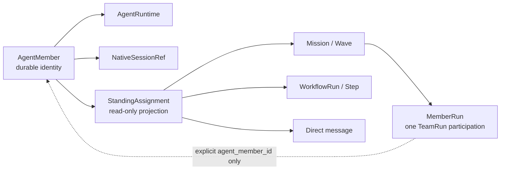

# Standing Agent Focus Page Spec

```text
status: proposed — object contract approval required before implementation
owner_role: product-design
canonical_for: one durable AgentMember across assignments and provider sessions
route_or_surface: Agents -> AgentMember
```

## Product question

The operator opens a long-lived teammate to answer: is this Agent available,
which explicit contexts is it serving, what has it done across those contexts,
and can I safely message it now?

This is not a `MemberRun` page. A standing `AgentMember` retains identity across
provider restarts and may participate in multiple Missions or Workflows. A
`MemberRun` remains one participation in one `AgentTeamRun` attempt.

## Object boundary



Shared UI does not imply shared lifecycle. Never join an `AgentMember` to a
`MemberRun` by name, role, provider, model, or temporal proximity.

## Required read model

### AgentMember availability

The snapshot needs explicit optional fields rather than deriving availability
from `idle` or a healthy process:

```text
availability = available | busy | paused | offline | unknown
assignment_capacity: integer | null
exclusive_assignment_ref: string | null
```

Missing values render as `Availability not reported`. `Available` means the
Agent can accept work under its capacity and permission policy; it does not
mean the Agent has no history or no active non-exclusive assignments.

### StandingAssignment projection

`StandingAssignment` is a read-only cross-executor projection, not a legacy dependency graph
and not a new universal executor:

```text
id
agent_member_id
source_kind = mission_wave | workflow_participation | direct_assignment
source_ref
mission_id? / wave_id?
team_run_id? / member_run_id?
workflow_run_id? / workflow_step_id?
title
role
status
assigned_at
last_activity_at?
navigation_target
```

Projection rules:

- Mission/Wave participation requires an explicit `MemberRun.agent_member_id`
  or equivalent stable source link.
- Workflow participation uses an explicit step owner and the step's
  `NativeSessionRef` when provider-native activity is available.
- A direct assignment must be an explicit assignment/task message addressed to
  the durable AgentMember; ordinary conversation is activity, not assignment.
- Missing links remain missing. The UI must not fall back to legacy
  `current_task_id` to invent a cross-executor assignment.
- Retries are lineage of one source assignment, not duplicate active work.

## Layout contract

Use the shared `FocusShell`: continuous activity/conversation in the center,
sticky composer, and a composed Context Rail. The expected visual direction is
the candidate under
`docs/design/workbench-layout-v2/expected/standing-agent-focus/`.

Center reading order:

1. durable identity header: name, availability, `Standing Agent`, provider and
   model;
2. availability banner, including exclusive-assignment truth;
3. chronological cross-context activity: direct messages, explicit assignment
   entries, workflow participation, delivered artifacts, provider-native
   activity projections, and agent replies;
4. composer addressed to the AgentMember, with queue/busy behavior stated
   honestly.

Context Rail order:

1. Agent Profile;
2. Availability and capacity;
3. Active Assignments;
4. Capabilities and skills;
5. Runtime and permission/workspace boundaries;
6. Provider Sessions and observed child threads.

At tablet width the product navigation uses the shared compact rail and context
moves behind `Context & controls`. Mobile preserves one central stream and a
fixed composer; context remains a disclosure rather than disappearing.

## Explicit non-goals

- no Mission > Wave > Team breadcrumb as page ownership;
- no Wave gate or TeamRun retry lifecycle at Agent level;
- no legacy dependency graph requirement;
- no inference that a provider-native child thread is another AgentMember;
- no persisted thinking in the activity stream;
- no fake capacity, capability, assignment, interrupt, or wake state;
- no reuse of legacy `Tasks` as the primary cross-executor model.

## Representative state

`available-multi-assignment` proves:

- one healthy durable AgentMember with explicit `available` state;
- multiple non-exclusive assignments from at least two source kinds;
- capacity remains available;
- persistent provider-session history;
- a delivered artifact and durable message history;
- no single Wave owns the page and no thinking is persisted.

## Design gate

Implementation may begin only when:

1. availability and capacity ownership are approved;
2. the explicit AgentMember-to-MemberRun link and Workflow projection rule are
   approved;
3. the candidate expected design is marked approved in the visual contract;
4. a deterministic fixture validates that unlinked MemberRuns never appear as
   Standing Agent assignments.
