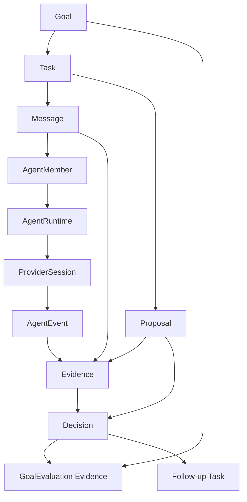

# Data Model

This document explains the object and state model that must exist for the
product vision to be true. It does not replace JSON schemas. Schemas own stable
fields; this file owns the relationships, projections, and source-of-truth
rules those fields must preserve.

## Vision Link

Multi-Agent Harness must turn a goal into:

```text
scenario -> infra -> agent team -> task graph -> message execution
  -> evidence -> review -> decision -> learning
```

The data model succeeds when another human or agent can reconstruct that chain
from harness state without relying on chat memory or provider transcripts.

## Key Questions

| Question | Data-model answer |
| --- | --- |
| What is the durable outcome? | `Goal` plus goal design and goal evaluation evidence. |
| What is the work graph? | `Task` nodes plus parent, dependency, review, handoff, and follow-up edges. |
| How is work actually assigned? | `Message(kind=task)` delivery; `assignee_agent_id` is a projection. |
| Who is accountable? | `AgentMember` identity, role, team, permissions, current task, and runtime refs. |
| What proves a claim? | `Evidence` refs, provider sessions, check results, review notes, or artifacts. |
| What is being accepted? | `Proposal` plus evidence, review, and Leader `Decision`. |
| What is provider state? | `AgentRuntime`, `ProviderSession`, and `AgentEvent`; provider transcript is evidence, not canonical state. |
| What becomes reusable learning? | `GoalEvaluation`, follow-up tasks, and reusable goal cases. |

## Source Of Truth

| Concept | Canonical object | Projection or evidence |
| --- | --- | --- |
| Goal status | `Goal` + `Decision` + `GoalEvaluation` | Dashboard goal lane |
| Task graph | `Task` records and edge fields | Kanban columns, graph view |
| Assignment | `Message(kind=task)` delivery | `Task.assignee_agent_id`, member current task |
| Agent identity | `AgentMember` | provider thread id, prompt file |
| Runtime health | `AgentRuntime` + `AgentEvent` | pid, socket, provider stdout |
| Provider interaction | `ProviderSession` | raw transcript, JSONL frames, hook payloads |
| Claim support | `Evidence` | chat summary |
| Candidate change | `Proposal` | Git diff or PR URL alone |
| Acceptance | `Decision` | PR merge, reviewer comment, provider self-report |
| Evaluator output | `Review` | report message text |
| Defect / risk ledger | `Gap` (Bug = `Gap(category=bug)`) | `product-gap-inbox.md` flat file |
| Goal plan | `GoalDesign` (or legacy `Evidence(source_type=goal_design)`) | chat plan |
| Goal retrospective | `GoalEvaluation` (or legacy `Evidence(source_type=goal_evaluation)`) | final chat summary |
| Reusable lesson | `GoalCase` + `examples/goal-cases/**` | full transcript |
| Long-lived target | `Vision`; `Goal.vision_id` links a goal | loose `vision_ref` text |

## Object Clusters



## Task Graph Edges

The task graph is a view over tasks and their edges, not a separate competing
state machine.

| Edge | Field or source | Meaning |
| --- | --- | --- |
| Goal membership | `task.goal_id` | Task contributes to one goal. |
| Decomposition | `task.parent_task_id` | Task is a child of a broader task. |
| Execution dependency | `depends_on_task_ids` | Task waits for prior work. |
| Review | `reviewer_agent_id` | Reviewer or critic expected before acceptance. |
| Assignment | delivered `Message(kind=task)` | Work was sent to a member or channel. |
| Handoff | task-linked message | Context moved between members. |
| Follow-up | decision or evaluation evidence | New task created from result or learning. |

## Generic Objects And Edges

Six generic objects extend the model (full field lists and vocabularies in
[concept-model.md](concept-model.md) and [schemas.md](schemas.md)). They add the
following edges over existing objects:

| Object | Edge fields | Meaning |
| --- | --- | --- |
| `Review` | `task_id` / `goal_id`, `reviewer_agent_id`, `evidence_ids` | Structured evaluator verdict for a task or goal; backs a `Decision`. |
| `Gap` | `goal_id` / `task_id`, `owner_agent_id`, `evidence_ids` | Defect or risk row; a Bug is `category=bug`. `severity`/`status` are closed enums. |
| `GoalDesign` | `goal_id`, `task_graph[]` (task ids), `agent_team` | The goal's plan; `Goal.goal_design_id` may point back to it. |
| `GoalEvaluation` | `goal_id`, `follow_up_task_ids[]`, `proposed_goal_ids[]` | The retrospective; closes the learning loop into the next round. |
| `GoalCase` | `source_goal_id`, `goal_design_ref`, `evaluation_ref` | Sanitized reusable lesson. |
| `Vision` | referenced by `Goal.vision_id` | Long-lived target a goal collection moves toward. |

New scalar links on existing objects: `Goal.vision_id` /
`Goal.goal_design_id` / `Goal.closed_by_decision_id`; `Task.phase_id`
(the join key to a `GoalPhase`; the legacy free-text `Task.phase` label was
retired) / `Task.scope_refs[]` / `Task.requires_human_approval` /
`Task.verdict_decision_id`;
`Evidence.evidence_kind` / `Evidence.goal_id`; `Decision.decision_kind` /
`Decision.goal_id` / `Decision.is_waiver` / `Decision.follow_up_task_id`.

### Evidence-to-Object Graduation (dual-read)

`GoalDesign` and `GoalEvaluation` first existed as
`Evidence(source_type=goal_design | goal_evaluation)`. They have now graduated
to first-class objects, and **both representations are read at once**: the
read model and the `goal_learning_status` gate union legacy `Evidence` rows and
the graduated objects by `goal_id`, with no backfill. Old goals keep their
`Evidence` rows; new goals write the objects; the gate is satisfied by either.
The graduation contract is documented in
[goal-learning-loop.md](goal-learning-loop.md).

## Projection Rules

- `Task.assignee_agent_id` is allowed only as a read-model or convenience
  projection of assignment; assignment truth is the task message.
- `AgentMember.current_task_id` is a projection of delivery and active runtime
  events; it is not proof that the member received the task.
- Dashboard columns are read models; safe actions must create or update
  canonical harness objects.
- Provider thread ids are correlation refs; they do not own task or decision
  state.
- PR refs and diff refs support a proposal; they are not the proposal itself.

## Invariants To Gate

These should become CLI/API/CI checks as implementation matures. Invariant 1 is
now enforced by the CLI `goal close` closeout gate; the rest remain documented
targets:

1. A completed goal has a closeout decision (with evidence) and a goal
   evaluation, or an explicit waiver — **enforced** by CLI `goal close`.
2. An assigned task has an earlier `Message(kind=task)` delivery attempt.
3. Accepted non-trivial work has assignee report, evidence refs, and review.
4. Accepted proposals name changed paths and check or review evidence.
5. Provider failure tied to the only assignment path blocks acceptance.
6. Domain project facts enter through adapters, not generic core state.

## Relationship To Schemas

When a relationship is stable, schemas should include the fields needed to
represent it. When a rule is stable, CLI/API/CI should validate it. This file
keeps the reason and invariant so future schema changes do not erase the
product intent.
