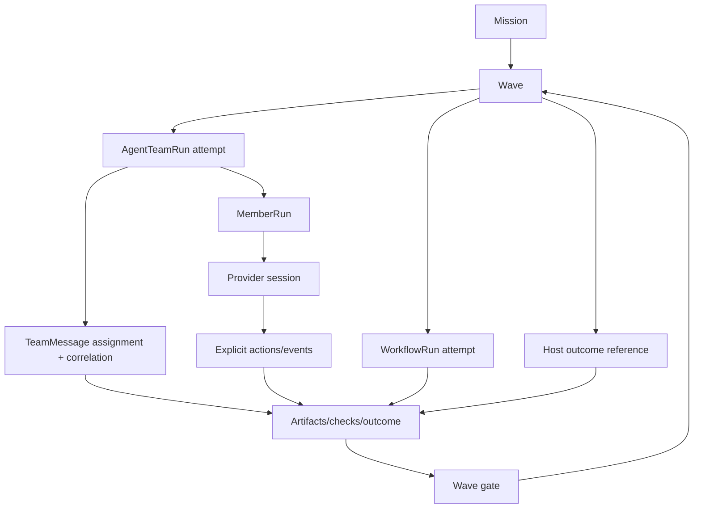

# Data Model

This document explains the object and state model that must exist for the
product vision to be true. It does not replace JSON schemas. Schemas own stable
fields; this file owns the relationships, projections, and source-of-truth
rules those fields must preserve.

## Vision Link

Star Harness must turn durable intent into:

```text
Mission -> ordered Wave -> executor attempt(s)
  -> explicit messages/actions/artifacts/outcome
  -> lightweight Wave gate -> next Wave or Mission closeout
```

The executor is `agent_team`, `dynamic_workflow`, or `host`. A Wave never
requires a Task Graph. The data model succeeds when another human or agent can
reconstruct the selected executor, attempts, ownership, outcome, and gate from
harness state without relying on chat memory or provider transcripts.

## Key Questions

| Question | Data-model answer |
| --- | --- |
| What is the durable intent? | Native `Mission`; old Goals appear only as provenance-marked read-only projections. |
| What is the ordered work boundary? | Native `Wave` rows ordered by `index`; there is no required work graph. |
| Which execution happened? | `Wave.executor_run_ids`; executor-specific ledgers own internal state. |
| How is Agent Team work assigned? | `TeamMessage(kind=assignment)` plus its `correlation_id`. |
| Who is accountable inside a team attempt? | `MemberRun` role/identity plus assignment and handoff lineage. |
| What supports an outcome? | Explicit actions, check results, artifact refs, handoffs, and optional review. |
| What is being accepted? | The Wave outcome and one completed attempt through the lightweight Wave gate. |
| What is provider state? | `AgentRuntime`, `ProviderSession`, and `AgentEvent`; provider transcript is evidence, not canonical state. |
| What becomes reusable learning? | Mission closeout, follow-up Waves/issues, and optional evaluation/cases. |

## Source Of Truth

| Concept | Canonical object | Projection or evidence |
| --- | --- | --- |
| Product purpose | PRD and design basis | README summaries |
| Object meaning | [concept-model.md](concept-model.md) and schemas | Dashboard labels, CLI help |
| Coordination state | Harness store | Provider transcripts, hooks, logs |
| Mission status | latest native `Mission` row | Goal compatibility projection, Dashboard summary |
| Wave order and gate | latest native `Wave` rows | Dashboard Wave timeline |
| Agent Team attempts | `AgentTeamRun` rows linked by Mission/Wave ids | run cards |
| Agent Team assignment | assignment `TeamMessage` plus correlation lineage | member current action, lane UI |
| Agent Team identity | `MemberRun` inside one TeamRun | provider thread id, prompt file |
| Runtime health | `AgentRuntime` + `AgentEvent` | pid, socket, provider stdout |
| Provider interaction | `ProviderSession` | raw transcript, JSONL frames, hook payloads |
| Outcome support | explicit artifacts/checks/actions; optional `Evidence` | chat summary |
| Wave acceptance | `Wave.gate_status` + `accepted_run_id` + outcome/artifacts | reviewer comment or provider self-report alone |
| Optional evaluator output | `Review` | report message text |
| Defect / risk ledger | `Gap` (Bug = `Gap(category=bug)`) | `product-gap-inbox.md` flat file |
| Legacy Goal plan | `GoalDesign` (or legacy `Evidence(source_type=goal_design)`) | chat plan |
| Legacy Goal retrospective | `GoalEvaluation` (or legacy `Evidence(source_type=goal_evaluation)`) | final chat summary |
| Reusable lesson | `GoalCase` + `examples/goal-cases/**` | full transcript |
| Long-lived target | `Vision`; `Goal.vision_id` links a goal | loose `vision_ref` text |

## Object Clusters



## Legacy Goal/Task Compatibility Model

The remaining Goal/Task sections document the still-readable classic runtime.
They do not define native Mission/Wave execution and must not be used to require
a Task Graph, Proposal, Decision, or GoalEvaluation for every Wave.

## Task Graph Edges

The task graph is a view over tasks and their edges, not a separate competing
state machine.

| Edge | Field or source | Meaning |
| --- | --- | --- |
| Goal membership | `task.goal_id` | Task contributes to one goal. |
| Decomposition | `task.parent_task_id` | Task is a child of a broader task. |
| Execution dependency | `depends_on_task_ids` | Task waits for prior work. |
| Review | `reviewer_agent_id` | Reviewer or critic expected before acceptance. |
| Assignment | delivered `Message(kind=task)` | Work was sent to a member or channel. |
| Handoff | task-linked message | Context moved between members. |
| Follow-up | decision or evaluation evidence | New task created from result or learning. |

## Generic Objects And Edges

Six generic objects extend the model (full field lists and vocabularies in
[concept-model.md](concept-model.md) and [schemas.md](schemas.md)). They add the
following edges over existing objects:

| Object | Edge fields | Meaning |
| --- | --- | --- |
| `Review` | `task_id` / `goal_id`, `reviewer_agent_id`, `evidence_ids` | Structured evaluator verdict for a task or goal; backs a `Decision`. |
| `Gap` | `goal_id` / `task_id`, `owner_agent_id`, `evidence_ids` | Defect or risk row; a Bug is `category=bug`. `severity`/`status` are closed enums. |
| `GoalDesign` | `goal_id`, `task_graph[]` (task ids), `agent_team` | The goal's plan; `Goal.goal_design_id` may point back to it. |
| `GoalEvaluation` | `goal_id`, `follow_up_task_ids[]`, `proposed_goal_ids[]` | The retrospective; closes the learning loop into the next round. |
| `GoalCase` | `source_goal_id`, `goal_design_ref`, `evaluation_ref` | Sanitized reusable lesson. |
| `Vision` | referenced by `Goal.vision_id` | Long-lived target a goal collection moves toward. |

New scalar links on existing objects: `Goal.vision_id` /
`Goal.goal_design_id` / `Goal.closed_by_decision_id`; `Task.phase_id`
(the join key to a `GoalPhase`; the legacy free-text `Task.phase` label was
retired) / `Task.scope_refs[]` / `Task.requires_human_approval` /
`Task.verdict_decision_id`;
`Evidence.evidence_kind` / `Evidence.goal_id`; `Decision.decision_kind` /
`Decision.goal_id` / `Decision.is_waiver` / `Decision.follow_up_task_id`.

### Evidence-to-Object Graduation (dual-read)

`GoalDesign` and `GoalEvaluation` first existed as
`Evidence(source_type=goal_design | goal_evaluation)`. They have now graduated
to first-class objects, and **both representations are read at once**: the
read model and the `goal_learning_status` gate union legacy `Evidence` rows and
the graduated objects by `goal_id`, with no backfill. Old goals keep their
`Evidence` rows; new goals write the objects; the gate is satisfied by either.
The graduation contract is documented in
[goal-learning-loop.md](goal-learning-loop.md).

## Projection Rules

- `Task.assignee_agent_id` is allowed only as a read-model or convenience
  projection of assignment; assignment truth is the task message.
- `AgentMember.current_task_id` is a projection of delivery and active runtime
  events; it is not proof that the member received the task.
- Dashboard columns are read models; safe actions must create or update
  canonical harness objects.
- Provider thread ids are correlation refs; they do not own task or decision
  state.
- PR refs and diff refs support a proposal; they are not the proposal itself.

## Invariants To Gate

Native invariants:

1. Every Wave references one native Mission and has a positive, unique order
   within it.
2. Every AgentTeamRun linked to a Wave uses an `agent_team` Wave and the same
   Mission id.
3. Every accepted Agent Team Wave names a completed run already present in its
   immutable attempt list.
4. Explicit message lineage stays inside one TeamRun; assignment correlation is
   never fabricated from body text.
5. New provider thinking is never written to durable actions, snapshots,
   replay, evidence, or peer messages.
6. Domain project facts and behavior enter through adapters, skills, and tool
   descriptors, not generic core state.
7. Parallel file-changing members need distinct workspaces, branches, or
   explicit owned-path coordination.

Legacy Goal/Task flows retain their own assignment, proposal, decision, and
learning gates while they remain supported. Those invariants do not migrate
implicitly into native Wave.

## Relationship To Schemas

When a relationship is stable, schemas should include the fields needed to
represent it. When a rule is stable, CLI/API/CI should validate it. This file
keeps the reason and invariant so future schema changes do not erase the
product intent.
