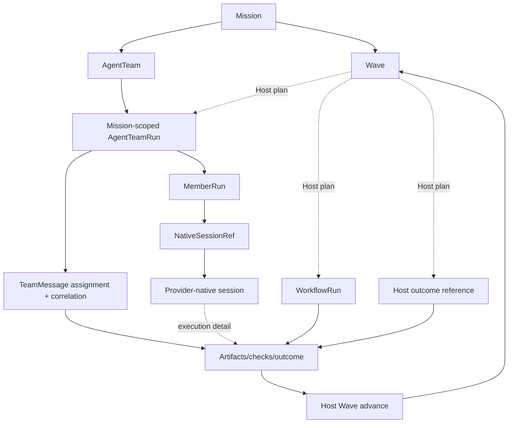

# Data Model

This document explains the object and state model that must exist for the
product vision to be true. It does not replace JSON schemas. Schemas own stable
fields; this file owns the relationships, projections, and source-of-truth
rules those fields must preserve.

## Vision Link

Star Harness must turn durable intent into:

```text
Mission -> ordered Host-plan Wave
Mission <-> AgentTeam -> Mission-scoped TeamRun -> MemberRun
  -> explicit coordination/artifacts/outcome + provider-native session refs
  -> explicit Host advance -> next Wave or Mission closeout
```

Agent Team, Dynamic Workflow, and Host work retain distinct runtime truth. A
Wave never requires a legacy dependency graph and never owns their lifecycle.
The data model succeeds when another human or agent can reconstruct Host plan
changes, execution selection, assignment ownership, outcomes, and advance
decisions from Harness state, then resolve member execution detail from
provider-native sessions without duplicating those sessions.

## Key Questions

| Question | Data-model answer |
| --- | --- |
| What is the durable intent? | Native `Mission`. |
| What is the ordered plan record? | Native `Wave` rows ordered by `index`; there is no required work graph. |
| Which execution happened? | Mission-linked TeamRuns, WorkflowRuns, Host outcomes, and their native records. |
| How is Agent Team work assigned? | `TeamMessage(kind=assignment)` plus its `correlation_id`. |
| Who is accountable inside a team attempt? | `MemberRun` role/identity plus assignment and handoff lineage. |
| What supports an outcome? | Explicit Harness outcome/check/artifact refs and handoffs, plus provider-native records for member-execution claims. |
| What advances? | The Host's explicit Wave outcome; unrelated execution may continue. |
| What is provider state? | A mode-aware native session binding; the provider-native store owns transcript, tools, turns, and resume state. |
| What becomes reusable learning? | Mission closeout, follow-up Waves/issues, and optional evaluation/cases. |

## Source Of Truth

| Concept | Canonical object | Projection or evidence |
| --- | --- | --- |
| Product purpose | PRD and design basis | README summaries |
| Object meaning | [concept-model.md](concept-model.md) and schemas | Dashboard labels, CLI help |
| Coordination state | Harness store | Dashboard projections |
| Mission status | latest native `Mission` row | Dashboard summary |
| Wave order and Host judgment | latest native `Wave` rows and revision history | Dashboard Wave timeline |
| Mission-team relation | `Mission.agent_team_ids` plus stable `AgentTeam` | linked-team controls |
| Agent Team runs | `AgentTeamRun` rows linked by Mission/team ids | run cards |
| Agent Team assignment | assignment `TeamMessage` plus correlation lineage | member current action, lane UI |
| Agent Team identity | `MemberRun` inside one TeamRun | provider thread id, prompt file |
| Runtime health | Harness lifecycle/control acknowledgement plus provider adapter availability | pid, socket, native provider status |
| Provider execution | provider-native session selected by `NativeSessionRef` | ephemeral normalized Dashboard projection |
| Provider interaction routing | Harness `PendingInteraction` | provider reverse-RPC frame in the native session |
| Outcome support | explicit Harness outcome and artifact/check refs; provider-native session for execution claims | unaccepted chat summary |
| Wave advance | Host outcome/actor/time plus artifacts on latest Wave row | reviewer comment or provider self-report alone |
| Optional evaluator output | `Review` | report message text |
| Defect / risk ledger | `Gap` (Bug = `Gap(category=bug)`) | `product-gap-inbox.md` flat file |
| Reusable lesson | `LearningNote` or an explicit reusable document | full transcript |
| Long-lived target | `Vision`; Missions link to the intent they advance | loose text reference |

## Object Clusters



## Optional Governance Objects

`Review`, `Gap`, `Evidence`, `Decision`, `Evaluation`, and `LearningNote` may be
used when a domain or repository gate needs them. They enrich execution proof;
they are not mandatory levels between Wave outcome and gate. Product-specific
WorkItems, Approvals, finance, metrics, and documents are defined by the
Company OS contracts rather than by a generic task graph.

Retired object fields that remain in internal schemas are removal debt governed
by [ADR 0028](decisions/0028-retire-goal-phase-task-graph.md). They must not be
read into native Mission/Wave projections or used as a reason to retain old UI.

## Projection Rules

- `Task.assignee_agent_id` is allowed only as a read-model or convenience
  projection of assignment; assignment truth is the task message.
- `AgentMember.current_task_id` is a projection of delivery and active runtime
  events; it is not proof that the member received the task.
- Dashboard columns are read models; safe actions must create or update
  canonical harness objects.
- Provider thread/session ids are native execution refs; they do not own
  assignment, Approval, outcome acceptance, or Wave gate state.
- Normalized provider activity is an ephemeral read projection, not a Harness
  ledger and not evidence independent of its native session.
- PR refs and diff refs support a proposal; they are not the proposal itself.

## Invariants To Gate

Native invariants:

1. Every Wave references one native Mission and has a positive, unique order
   within it.
2. Every Mission-linked team id resolves to an independent AgentTeam.
3. Every Mission-scoped AgentTeamRun resolves to a team linked to the same
   Mission; its optional `wave_id` exists only for legacy direct-executor rows.
4. Wave advance never terminates an active run, member, assignment, or native
   session.
5. Explicit message lineage stays inside one TeamRun; assignment correlation is
   never fabricated from body text.
6. New provider transcripts, tool/command/file event streams, and thinking are
   never mirrored into durable Harness actions, snapshots, replay, evidence,
   or peer messages.
7. Domain project facts and behavior enter through adapters, skills, and tool
   descriptors, not generic core state.
8. Parallel file-changing members need distinct workspaces, branches, or
   explicit owned-path coordination.

Retired coordination flows have no separate active invariants. Archive records
exist only to explain removal history.

## Relationship To Schemas

When a relationship is stable, schemas should include the fields needed to
represent it. When a rule is stable, CLI/API/CI should validate it. This file
keeps the reason and invariant so future schema changes do not erase the
product intent.
