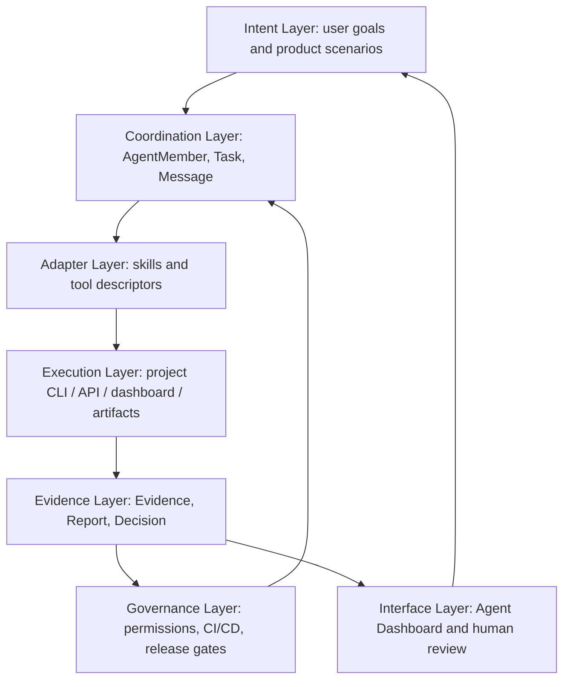

# Design Basis

This document records the design thinking behind Multi-Agent Harness. It sits
between the product requirements and the implementation architecture: PRD says
why the product exists, architecture says what modules exist, and this document
explains why the system is decomposed this way.

## Core Thesis

Raw agents can use project tools, but they often lack durable context,
structured feedback, and a clear way to judge whether work is good. Multi-Agent
Harness turns a project's tools into an agent-governed workflow:

```text
project capability -> adapter -> agent task -> evidence -> decision
```

The product is not a domain engine. It is the governance and coordination layer
that lets agents use domain engines with less guessing and better accountability.

## Design Layers



This diagram answers: how intent becomes work, how work touches project tools,
how results become evidence, and how evidence feeds governance and future work.

| Layer | Design basis | Must preserve |
| --- | --- | --- |
| Intent | Start from user goals and project scenarios, not from generic automation. | Every workflow needs a visible goal and acceptance criteria. |
| Coordination | Multi-agent work needs durable tasks and messages, not only provider chat. | A task must be assignable, reportable, reviewable, and auditable. |
| Adapter | The generic harness should not know project internals. | Domain tools enter through skills, descriptors, APIs, and artifacts. |
| Execution | Real value comes from using the project's actual capabilities. | Commands and dashboards must produce evidence, not just text. |
| Evidence | Decisions should be based on references that can be inspected later. | Important claims need evidence refs. |
| Governance | Repeated mistakes should become checks, not memories. | CI/CD gates validate project promises and permission boundaries. |
| Interface | Humans and agents need a shared operational view. | Agent Dashboard is separate from the project dashboard but links to it. |

## Module Core Ideas

Each core module has a core idea: why the module exists, what it owns, what it
refuses to own, and which invariant should survive implementation changes.

| Module | Core idea | Owns | Refuses | Invariant |
| --- | --- | --- | --- | --- |
| Agent Runtime | Agents must be manageable, accountable instances. | Agent members, capabilities, status | Domain-specific business logic | Agents are not anonymous chat sessions. |
| Task System | Work needs a durable unit that can be assigned and accepted. | Decomposition, ownership, assignment, acceptance | Vague TODOs without an owner or acceptance | Work can be tracked from request to decision. |
| Message System | Collaboration should be reconstructable. | Agent-to-agent communication and reports | Hidden side channels as the only source of truth | Task assignment and reports can be replayed. |
| Evidence System | Claims need inspectable support. | References to proof | Treating unsupported summaries as facts | Decisions point to evidence. |
| Decision System | Outcomes need explicit rationale. | Accept, reject, retry, block, escalate | Silent implicit conclusions | The leader's rationale is durable. |
| Skill System | Repeated working knowledge should become reusable. | How agents should use a scenario or tool | Copying project business logic into generic core | Skills guide usage without owning domain execution. |
| Tool Adapter System | Project capability needs a stable agent-facing contract. | CLI/API/dashboard/artifact access | Direct coupling to a specific project runtime | Domain tools enter through descriptors and adapters. |
| Agent Dashboard | Coordination state needs a shared view. | Operational read model for tasks and evidence | Replacing the project dashboard | It links to domain evidence instead of duplicating it. |
| CI/CD | Repeated mistakes should become checks. | Validation of promises and release readiness | Running checks that do not map to real commitments | Broken contracts fail early. |

## Documentation Mapping

The documentation structure should mirror the system thinking:

| Doc | Design role |
| --- | --- |
| `README.md` | Entry point, product boundary, and fastest route to useful context. |
| `docs/prd.md` | Motivation, scenarios, non-goals, and success criteria. |
| `docs/design-basis.md` | Layering, module core ideas, and the reasoning that connects product to architecture. |
| `docs/architecture.md` | Concrete modules, data flow, object contracts, package boundaries. |
| `docs/operations.md` | How the system is run, checked, released, and recovered. |
| `docs/schemas.md` | Machine-readable contracts that stabilize the workflow. |
| `docs/decisions.md` | Durable tradeoffs that future agents should not re-litigate casually. |
| `skills/` | Operational knowledge that tells agents how to use the project and improve it. |

If a document does not map to a design role, it should not exist yet.

The documentation tree should grow with the project's real state. Keep it flat
while ideas are unstable; split when readers, lifecycles, modules, or machine
consumers become stable. Reorganize when the current tree no longer reflects
the system's actual layers, module relationships, or evidence flow.

## Design Review Questions

Use these questions before adding large docs, new directories, or new modules:

1. What important design idea is this documenting?
2. Which layer or module core idea does it clarify?
3. Does it explain why the decomposition exists, or only list what exists?
4. Can a new agent use it to make a better decision with less context?
5. Does it connect to evidence, CI/CD, schema, CLI, or dashboard surfaces?
6. If the content is stable, should it become a machine contract instead of more prose?

Good documentation should make the system feel smaller because the structure is
clear. Bad documentation makes the system feel larger because it adds text
without revealing the design.
