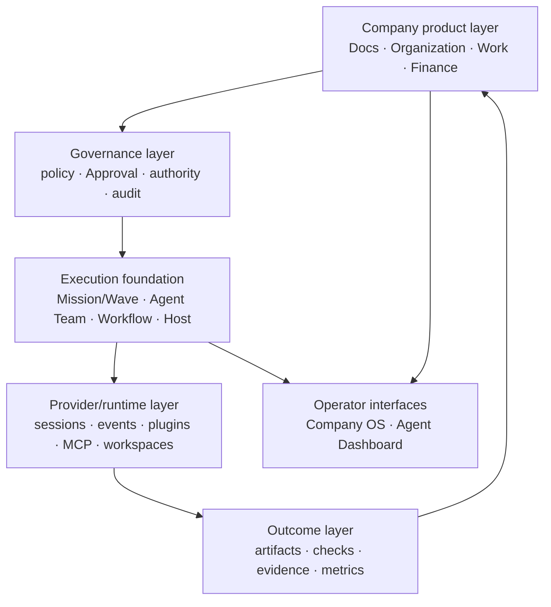

# Design Basis

```text
status: canonical architecture rationale
owner_role: product-architecture
canonical_for: system decomposition, module core ideas, truth boundaries, and documentation structure
```

The PRD explains why Star Harness exists. Architecture and schemas describe
what is implemented. This document explains why the product is decomposed into
Company OS truth systems plus a separate execution foundation.

## Core thesis

An AI-native company needs durable memory, accountable capability, explicit
commitments and governed effects. Agents and workflows are tools used by that
company; they are not the company information model.

```text
durable company context
  -> explicit WorkItem and responsibility
  -> required Approval and effect policy
  -> selected human or execution capability
  -> observable outcome, artifacts and evidence
  -> accepted result and effects return to company records
```

## Design layers



| Layer | Why it exists | Must preserve |
| --- | --- | --- |
| Company product | the company needs one durable model for knowledge, actors, commitments and effects | each fact has one owning system and linked projections never become copies |
| Governance | sensitive effects need named policy and authority | Approval is distinct from comments, execution completion and Wave gates |
| Execution foundation | long or parallel work needs provider-neutral coordination | Mission has ordered lightweight Waves; each executor owns its internal plan and records |
| Runtime | providers differ in process, session, tool and observation capability | provider state never becomes organization identity or business authority |
| Outcome/evidence | accepted claims must be reconstructable | outcomes point to useful artifacts, checks and durable records without storing private thinking |
| Interface | humans and Agents need comprehensible operating views | Company OS presents business truth; Agent Dashboard presents execution truth |

## Module core ideas

| Module | Owns | Refuses | Invariant |
| --- | --- | --- | --- |
| Docs | Documents, Blocks, TypedRecords, Relations, Views and BusinessModules | task lifecycle, actor authority or monetary state | company context and accepted results have a durable home |
| Organization | humans, Standing Agents, external/services, OrgUnits, reporting, permission and authority | WorkItem state, document content or payment state | durable identity is distinct from runtime/session identity |
| Work | WorkItems, Milestones, responsibility, Assignment, lifecycle, evidence and result routing | source knowledge, organization identity or finance ledger truth | every commitment says who owns it and where its result returns |
| Finance | budgets, Commitments, invoices, Payments, refunds and financial evidence | general task or document truth | requested, authorized and actual monetary effects remain distinct |
| Governance | module/organization evolution, policy, Approval and audit | hidden prompt authority or silent structural mutation | high-risk effects stop at the required Human boundary |
| Mission/Wave | durable intent, ordered execution boundaries, attempts, outcomes and lightweight gates | business ownership, payment approval or a task graph | Wave stays small and executor-specific records remain honest |
| Agent Team | run-scoped members, assignment messages, correlations, actions and handoffs | Standing Organization membership | ownership is proven by assignment/message lineage |
| Dynamic Workflow | WorkflowRun, steps, outputs and artifacts | universal company coordination | workflow truth stays inside its executor contract |
| Provider/runtime | sessions, processes, events, workspace and capability observation | WorkItem or Organization truth | optional hooks may observe only what the provider actually exposes |
| Skills/adapters | repeatable usage guidance and domain capability access | product authority or domain truth in generic core | capabilities reduce variance but never grant permission |

There is no active `Goal`, `GoalPhase`, Project-like task container or Task
Graph for new work. Historical occurrences exist only in migration,
compatibility, research or archive contexts governed by ADR 0028.

## Why Documents and Agents are connected

Docs without accountable Actors becomes a passive wiki. Agents without durable
Docs repeat context and leave chat as the only memory. WorkItem links the two:
the source Document explains why work exists; Organization supplies who may act;
Work owns the commitment; Finance owns any monetary effect; the selected
executor proves how work ran; the result returns to Docs.

## Why modules are linked structures

A business domain such as Trademark Management is not just a folder. Its
BusinessModule relates documents, typed records, views, WorkItems, Actors,
Approvals, Finance records, policies and evidence. Creating a new module
therefore requires document and relation design, responsibility placement,
financial impact analysis and governance—not merely a new navigation item.

## Documentation mapping

Documentation mirrors authority rather than implementation folders:

| Location | Role |
| --- | --- |
| `docs/company-os/` | Company OS product contracts and system boundaries |
| `docs/architecture*.md`, `docs/concept-model.md`, `docs/data-model.md` | executable architecture and object relationships |
| `docs/decisions/` | durable decisions and supersession records |
| `docs/dashboard/`, `docs/integration/`, runtime/workflow docs | execution implementation and operations |
| `docs/design/<workstream>/` | versioned visual intent and evidence |
| `docs/research/` | non-authoritative inputs |
| `docs/archive/` | historical provenance excluded from normal planning |

The creation, ownership, lifecycle, registry and archive rules live in
[Documentation Governance](documentation-governance.md). Stable fields belong
in schema; stable behavior belongs in code; stable operations belong in CLI or
API; documentation owns rationale, boundaries, exceptions and upgrade rules.

## Review questions

Before adding an object, module, page or document:

1. Which system owns the truth?
2. Is this a new durable object, a relation, a projection or execution evidence?
3. Can an existing canonical contract own the change?
4. Does the change require Human authority or a governed Action?
5. What does not belong in this module?
6. Which schema, store, API, UI and acceptance evidence make the claim real?
7. Which older direction becomes superseded and how is it removed from default
   context?
