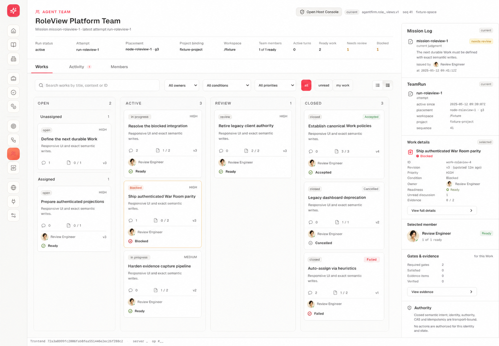
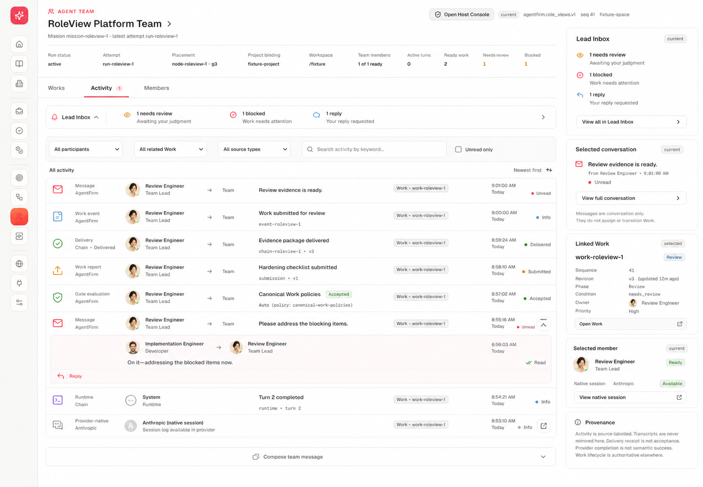
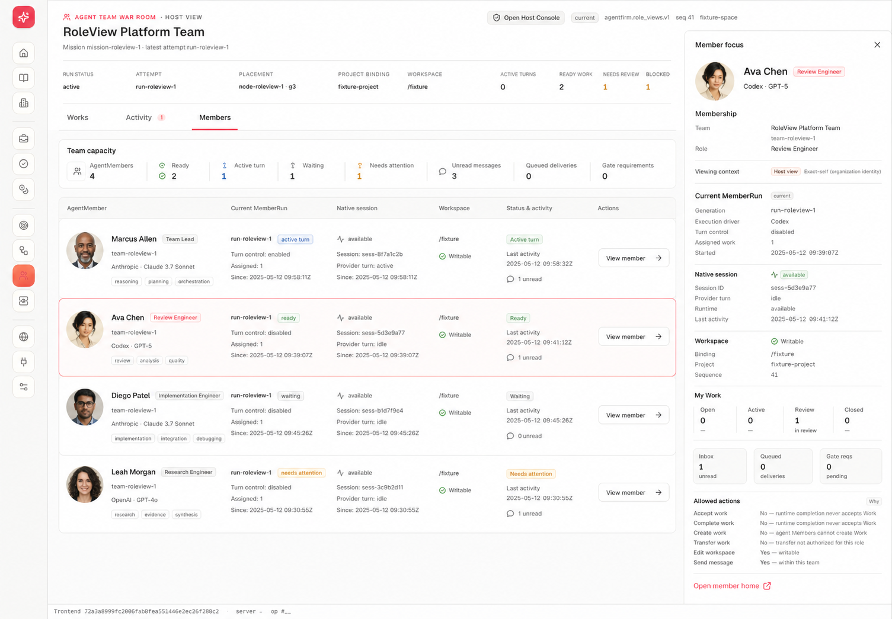
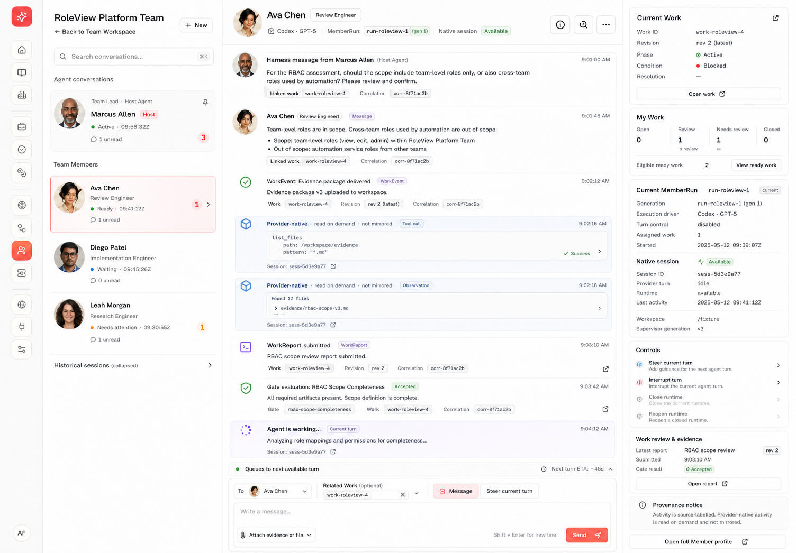
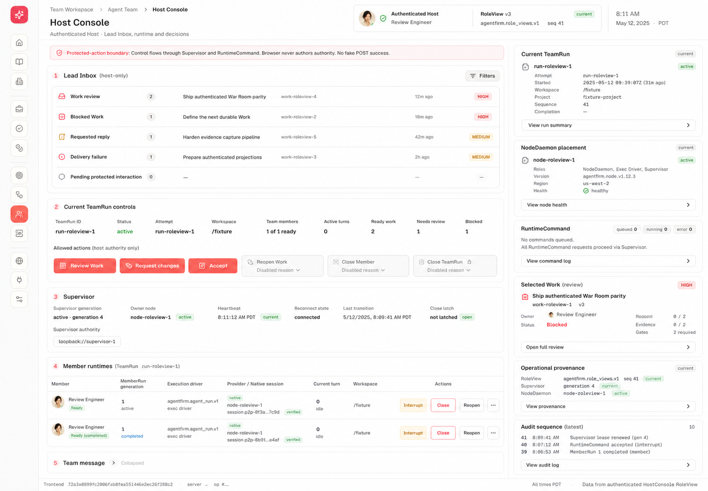
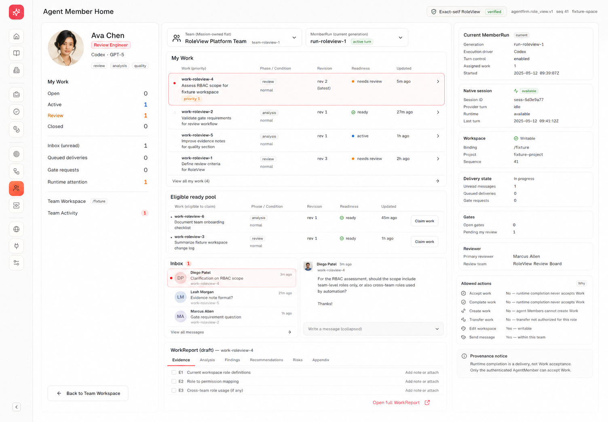
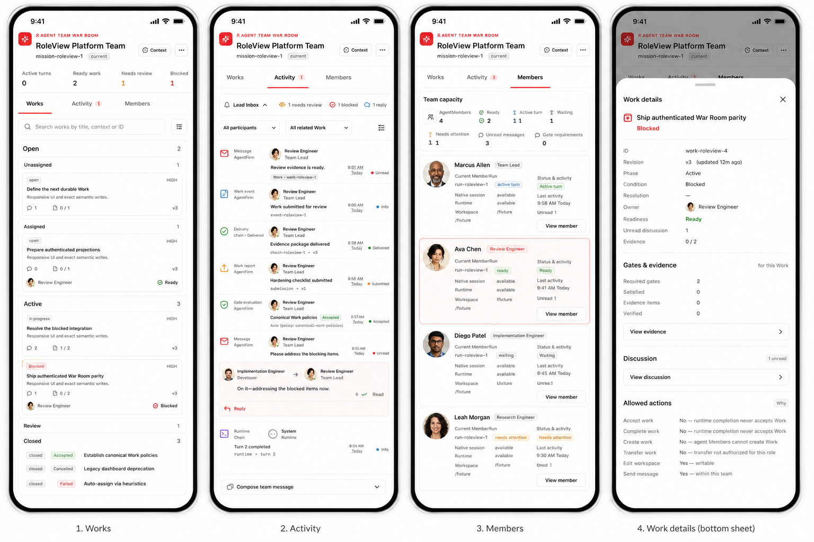

# Agent Team page family — visual product specification

Status: implementation contract for issue #444 / PR #445  
Audience: product, design, frontend, RoleView/API owners, reviewers  
Visual references: generated 2026-08-11 and checked into this directory  
Authority: canonical product docs, schemas, stores and authenticated RoleViews
override every visual reference.

Size exception: this stays one traceable specification because each of the
seven linked concepts must be reconciled against one shared model, token and
acceptance contract; splitting it would duplicate authority and obscure the
cross-page decisions the document exists to preserve.

## 1. Why this specification exists

The reference images established a strong page family, but they are concept
images rather than product authority. The first parity implementation restored
the correct authenticated read path and core information architecture, yet it
did not reach the visual or component completeness shown in the concepts. It
also left several concept assumptions insufficiently reconciled with the
current AgentFirm administrative model.

This specification closes both gaps. For every image it records:

1. what is correct and should ship;
2. what is visually useful but must be adapted to current RoleViews;
3. what conflicts with the current model and must not ship;
4. what the image omitted but the current model requires;
5. the concrete implementation and acceptance work.

The target is not a pixel copy of obsolete semantics. It is the same visual
quality, density and interaction clarity expressed through current product
truth.

## 2. Canonical model that binds the UI

### 2.1 Organization and execution are related but different

- `AgentMember` is the durable organization identity. Portrait, display name,
  role, organization status and memberships belong to this identity.
- `AgentTeam` is one flat Mission-owned execution unit with one explicit Host
  Agent and immutable `node_id` placement. There is no nested Team authority.
- `AgentTeamRun` is one execution attempt of the Team. It may span multiple
  Host-plan Waves.
- `MemberRun` is run-scoped coordination and history. It is not the provider
  process, native transcript, runtime authority or durable AgentMember.
- `AgentIdentity -> AgentSession` binds provider-native execution truth.
  Native transcripts and tool activity are read on demand and are never
  mirrored into a Harness activity ledger.
- Host is a selectable Agent identity, but the browser must not fabricate a
  Host `MemberRun`. If Operator-to-Host authoring is not projected, Host chat is
  honestly read-only.

### 2.2 Work uses one authority and three independent axes

There is one durable `Work` authority. `TeamWork` is the Team-context name and
Company Work is a read-only aggregate, not a second task ledger.

- phase: `open | active | review | closed`
- condition: `normal | blocked | on_hold`
- closed resolution: `accepted | cancelled | failed`

`Assigned` is an Open subgroup, not a phase. `blocked` is not a column and
provider completion is not Work acceptance. A Work shown as current execution
must carry the exact selected `MemberRun` binding; durable AgentMember ownership
alone is not enough.

### 2.3 Coordination, delivery and control stay separate

- `Message` is authored conversation.
- `MessageDelivery` is per-recipient transport/receipt truth.
- `WorkDelivery` delivers a Work version; it is not Work ownership or chat.
- `PendingInteraction` is a provider-native pause requiring an explicit
  answer; it is not an ordinary message.
- `RuntimeCommand` is the durable authority for provider effects.
- Steer, Interrupt, Close, Reopen, Retire and ordinary Message are distinct
  server-authorized operations with exact target generations and disabled
  reasons.

The UI may compose these facts into one readable page, but it may not merge
their authority.

## 3. Page family and navigation

| Page | Primary user job | Primary RoleView | Navigation outcome |
| --- | --- | --- | --- |
| Team Workspace / Works | Understand and route shared responsibility | `TeamWorkspace` | Work detail sheet or Host Console |
| Team Activity | Understand authored coordination and durable facts | `TeamWorkspace` | Work, conversation, delivery detail |
| Team Members | Scan capacity and choose an Agent | `TeamWorkspace` | Agent Conversation or Full Member Profile |
| Agent Conversation | Talk to and inspect one Host/Member | `TeamWorkspace` + Host actions; native read on demand | Work, control, profile |
| Host Console | Make Host-only decisions and control runtimes | `HostConsole` | Work review, runtime action, conversation |
| Full Member Profile | Administer durable AgentMember identity | organization/member RoleViews | Team or run history |

Team tabs remain Works, Activity and Members. Host Console is an independent
surface, not a fourth shared-truth tab and not a dashboard appended below the
Team page. Agent Conversation stays within Team context but replaces the main
canvas while open.

## 4. Visual language contract

The page family follows the reference images' warm editorial operations theme.
It must not fall back to generic pure-white admin panels or a saturated pink
marketing UI.

### 4.1 Color tokens

| Purpose | Token target | Use |
| --- | --- | --- |
| Page paper | `#FBFAF8` | primary canvas |
| Recessed canvas | `#F7F5F2` | lanes, navigation groups, filter bars |
| Card | `#FFFEFC` / white | interactive records and focused facts |
| Hairline | `#E7E2DC` | structural boundaries |
| Primary ink | `#242220` | headings and decisive facts |
| Secondary ink | `#77726D` | labels, timestamps, provenance |
| Coral | `#FF3B57` | active navigation, primary Host action, unread |
| Coral wash | `#FFF0F2` | selected Agent/Work and protected context |
| Green | `#2F9D62` | ready, available, accepted, healthy |
| Amber | `#D88915` | review, waiting, on-hold, attention |
| Red | `#E6494F` | blocked, failed, destructive control |
| Blue | `#3F82D1` | informational delivery/runtime facts |
| Violet | `#7657E8` | provider-native or report provenance only |

Color always communicates state or selection. Decorative coral borders around
large neutral areas are prohibited.

### 4.2 Shape, type and density

- Canvas radius: 12px; cards: 8–10px; chips: 5–6px.
- Borders are one-pixel hairlines. Shadows are reserved for sheets, menus and
  sticky composer separation.
- Primary page titles are 22–26px on desktop and 18–20px on mobile.
- Record titles are 13–15px; metadata is 10–12px, never illegibly faint.
- Desktop pages target a dense first viewport: header plus primary work should
  be visible without a large decorative dead zone.
- Mature portraits are used for AgentMember identity. Generic icons identify
  record type or Host/System, never replace a known AgentMember portrait.
- Lucide icons use consistent 14/16/18px sizes and semantic color. A card must
  not contain an icon only to fill space.

### 4.3 Global and responsive layout

- Keep the existing global product rail.
- Desktop content uses the available width and a maximum near 1500px.
- Tablet preserves the primary task and moves contextual facts into a sheet.
- Mobile is a single-column task surface. Work detail, Agent list and Context
  become bottom/side sheets with Escape, focus trapping and focus restoration.
- No horizontal overflow at 320px.
- A permanent right rail exists only when it contains facts needed for the
  current decision. It disappears rather than showing filler.

## 5. Reference-by-reference reconciliation

### 5.1 Team Workspace / Works — desktop

#### A. Correct and retained

- Compact Team/Mission header and current RoleView provenance.
- Works as the primary default tab.
- Four phase lanes: Open, Active, Review, Closed.
- Open grouped into Unassigned and Assigned.
- Dense Work cards with title, owner portrait, priority, revision and relevant
  decision signals.
- Search, owner and attention filters.
- Selected Work has a clear but restrained coral treatment.

#### B. Retained visually, adapted semantically

- The image's `in progress`, `blocked`, `accepted`, `cancelled` and `failed`
  labels become exact phase/condition/resolution chips rather than one status.
- `Ready` may be shown only from projected readiness/gate/delivery facts. The
  browser does not infer a new readiness state from visual convenience.
- Discussion, evidence and gate counts come from projected summaries. Missing
  projections render “not projected,” not zero.
- `Current Work` means exact `WorkExecutionBinding` to the selected MemberRun,
  not any Work owned by the same AgentMember.

#### C. Removed or replaced

- The permanent Mission Log / TeamRun / selected member / authority right rail
  is removed from the normal Works canvas. It duplicates header/context facts
  and reduces the board.
- The selected-member mini-card is replaced by opening Agent Conversation.
- A Mission judgment badge is not derived from Work pressure.

#### D. Missing from the image and required

- `on_hold` condition and all three Closed resolutions.
- Exact Work revision and binding provenance.
- Disabled Host action reasons from the server.
- Empty, filtered-empty, stale-last-good and initial-error states.
- An intentional Work detail sheet on tablet/mobile.

#### Implementation work

- Increase Work-card density with projected artifact/check/gate/delivery facts.
- Give lanes recessed paper surfaces and stronger grouping without adding fake
  columns.
- Keep selected Work detail in a sheet/overlay; deep link to Host Console only
  for real authorized decisions.
- Test keyboard selection, Escape return and 320px overflow.

### 5.2 Team Activity — desktop

#### A. Correct and retained

- A high-density, newest-first source-labelled stream.
- Different icons for Message, WorkEvent, Delivery, report/finding/gate and
  runtime records.
- Participant, related Work, source and text filters.
- Actor portrait, direction, summary, Work relation, timestamp and delivery
  state are scannable in one row.
- Reply opens a correlated composer rather than mutating the source record.

#### B. Retained visually, adapted semantically

- Provider-native rows are fetched on demand from the native session and
  visibly labelled “not mirrored.” They are not normal durable Team activity.
- Delivery status displays `MessageDelivery` or `WorkDelivery` lineage by exact
  recipient/version. It does not imply ownership or acceptance.
- Runtime completion remains a runtime fact, never a Work outcome.

#### C. Removed or replaced

- Permanent Lead Inbox / selected conversation / linked Work / member /
  provenance right rail is removed from the shared Activity page.
- Lead pressure becomes a compact collapsible strip above filters for Host
  viewers only.
- No generic `Team Lead` recipient is invented when the Host identity is known.

#### D. Missing from the image and required

- Clear empty and no-filter-results states.
- Truncation/cursor disclosure for bounded views.
- Expandable delivery lineage with recipient MemberRun, version and receipt.
- Long identifier wrapping and keyboard access.

#### Implementation work

- Replace oversized message cards with dense semantic rows.
- Keep authored messages visually more prominent than system facts without
  converting the page into a chat transcript.
- Preserve correlated reply and related Work controls.

### 5.3 Team Members — desktop

#### A. Correct and retained

- Capacity/pressure summary before the roster.
- Mature portraits, durable identity, role, provider/model, current MemberRun,
  native-session health, Workspace, last activity and unread/attention state.
- One row per durable Team member and a clear “open conversation” path.

#### B. Retained visually, adapted semantically

- `Ready`, `waiting`, `active turn` and `needs attention` are separate
  projected coordination/runtime/capacity facts, not one universal status.
- Workspace writable state is exact binding/safety truth.
- Provider/model belong to the current integration/session projection, not the
  durable AgentMember identity.

#### C. Removed or replaced

- The permanent selected-member detail rail is removed. It repeats the row and
  the separate profile/conversation destinations.
- The selected row opens Agent Conversation; a secondary link opens Full
  Member Profile.
- Team Lead is not inserted into the MemberRun roster unless the Host has an
  explicit membership and MemberRun.

#### D. Missing from the image and required

- Organization status distinct from coordination status.
- Runtime generation and exact current MemberRun reference.
- No-current-run and non-addressable member states.
- Large-roster pagination/virtualization once the server supplies a cursor.

#### Implementation work

- Replace sparse card grid with a responsive dense roster: table-like rows on
  desktop, stacked identity cards on mobile.
- Ensure a one-member fixture still looks intentional rather than unfinished.

### 5.4 Agent Conversation — desktop

#### A. Correct and retained

- This is the strongest reference and the primary P0 interaction.
- Left Team navigator with explicit Host Agent and Member portraits.
- Dominant center conversation resembling a native coding-agent chat.
- Authored messages, Work events, gate/report facts and on-demand native
  activity can appear in one chronological reading flow with provenance.
- Sticky composer with fixed recipient, related Work and response intent.
- Conditional right context for current Work, execution and allowed controls.

#### B. Retained visually, adapted semantically

- Host and Member are conversation targets, but only server-projected message
  actions can write.
- “Agent is working” appears only from current runtime/native state; it is not
  inferred from Work phase.
- “Current Work” lists every Work exactly bound to the selected MemberRun. Other
  AgentMember-owned Work is separated and labelled non-binding.
- Steer is separate from Message and remains hidden/disabled until a safe-point
  projection and exact allowed action exist.
- Native tool/observation rows are read on demand and remain visually distinct.

#### C. Removed or replaced

- Do not show fake Attach, Steer, Interrupt, Close or Reopen controls merely
  because the design has them.
- Do not fabricate Host provider/model, MemberRun or native session.
- Do not retain a right rail when there is no bound Work, execution fact or
  allowed control.

#### D. Missing from the image and required

- Host conversation read-only explanation when Operator-to-Host authoring is
  not projected.
- Exact MessageDelivery recipient/version/receipt disclosure.
- PendingInteraction and Close-request states when future RoleViews expose
  them.
- Loading/native-unavailable/stale/empty states.
- Mobile Agent and Context sheets.

#### Implementation work

- Widen and enrich the left navigator; restore portrait/status hierarchy.
- Restyle the central stream into mature authored-message, Work/system and
  provider-native record families.
- Build the composer as a real chat control, not a plain textarea footer.
- Reduce the right rail to decision facts and make it conditional.

### 5.5 Host Console — desktop

#### A. Correct and retained

- Independent Host-only surface with authenticated identity and clear
  protected-action boundary.
- Lead Inbox, current TeamRun decisions, Supervisor, member runtimes,
  NodeDaemon placement, runtime command/recovery and audit/provenance.
- Allowed and disabled actions shown together with exact reasons.
- Operational density appropriate to an expert Host.

#### B. Retained visually, adapted semantically

- All controls come from `HostConsole.allowed_actions` and use exact target,
  version, authority generation, idempotency and confirmation contracts.
- Work review and runtime control remain separate action groups.
- Supervisor is cross-process authority; TeamRun/MemberRun never dispatch
  directly.
- A completed provider turn does not enable Work acceptance.

#### C. Removed or replaced

- Do not expose fake catch-all POST success.
- Do not display pending protected interaction counts unless projected.
- Do not show a control from a label-only client capability guess.
- Right-side cards are kept only for active run, node/recovery and selected
  decision context; empty provenance decoration is collapsed.

#### D. Missing from the image and required

- Stale/expired Supervisor and run-scope-mismatch blocking states.
- RecoveryRequired reconciliation path and uncertain-delivery prohibition on
  blind replay.
- Pending close request and PendingInteraction once projected.
- Exact action disabled reasons connected with `aria-describedby`.

#### Implementation work

- Restore visible Lead Inbox categories and TeamRun pressure.
- Restore Supervisor and member runtime tables using projected facts.
- Group RoleActions by Work, TeamRun, MemberRun and recovery target.
- Keep unsupported future groups visible only as an explicit unavailable
  contract when useful; otherwise omit them.

### 5.6 Agent Member Home — desktop

#### A. Correct and retained

- Strong durable identity portrait/profile treatment.
- Clear distinction between own Work, eligible ready pool, inbox, current
  MemberRun, native session and Workspace.
- Exact-self RoleView/provenance and allowed-action explanation.

#### B. Retained visually, adapted semantically

- This becomes the Full Member Profile / exact-self Workbench family, not the
  primary Host-to-Member interaction page.
- `My Work` is exact owned/bound Work from the authoritative Work kernel.
- WorkReport, gates and evidence remain typed linked records, not embedded
  fields invented by the page.

#### C. Removed or replaced

- The middle Inbox preview is not the main communication experience. Selecting
  the Agent from Team opens Agent Conversation with a dominant center chat.
- Do not conflate a durable AgentMember homepage with one current MemberRun.
- Do not make a draft WorkReport editor appear when no write action/schema is
  projected.

#### D. Missing from the image and required

- Membership history and current Team relation for durable identity.
- Clear navigation to Agent Conversation.
- Multiple MemberRuns/history and no-current-run cases.
- Host vs exact-self permissions.

#### Implementation work

- Treat this as P1 administrative profile, after P0 Team and Conversation
  parity.
- Reuse portrait, identity and exact-self fact components; do not duplicate the
  conversation stream.

### 5.7 Team Workspace — mobile family

#### A. Correct and retained

- Single-column Works, Activity and Members surfaces.
- Compact header/pressure, large tap targets and card-based member rows.
- Work details in a bottom sheet.

#### B. Retained visually, adapted semantically

- Work cards use phase/condition/resolution.
- Activity rows preserve source and delivery lineage.
- Member status separates capacity, coordination, runtime and native session.

#### C. Removed or replaced

- No desktop right rail squeezed below content.
- No horizontally scrolling Kanban as the primary mobile behavior.
- No fixed decorative statistics that push the actual task below the fold.

#### D. Missing from the image and required

- Agent Conversation mobile layout: one center stream plus Agent and Context
  sheets.
- Host Console mobile hierarchy and destructive-action confirmation.
- Keyboard/screen-reader sheet semantics and 320px overflow proof.

#### Implementation work

- Keep phase sections stacked and collapse empty lanes.
- Use bottom/side sheets with focus trap, Escape and trigger restoration.
- Capture 390x844 plus explicit 320px overflow evidence.

## 6. Current implementation gap matrix

| Surface | Current gap | Required change | Priority |
| --- | --- | --- | --- |
| Theme | Generic white/pink rather than reference hierarchy | Install shared warm-paper/coral/status tokens and component elevation | P0 |
| Works | Correct lanes but visually thin cards and weak detail | Add projected metadata, stronger lane/card hierarchy, mature sheet | P0 |
| Activity | Oversized generic cards | Dense source-labelled row system and filter bar | P0 |
| Members | Sparse card grid; one member leaves blank canvas | Responsive roster rows and capacity summary | P0 |
| Conversation nav | Too narrow and visually weak | Wider navigator, larger portraits, unread/pressure hierarchy | P0 |
| Conversation stream | Fixture-like rows | Mature message/system/native families and chat rhythm | P0 |
| Composer | Plain textarea footer | Structured sticky chat composer with recipient/context/action clarity | P0 |
| Conversation context | Correct conditional logic, weak presentation | Compact decision cards; omit when empty | P0 |
| Host Console | Most operational areas collapsed or absent | Visible Lead Inbox, TeamRun, Supervisor/runtime and action groups | P0 |
| Mobile | Semantically correct but visually unfinished | Match mobile reference density and sheets | P0 |
| Member Profile | Concept not reconciled with conversation | Split durable profile from chat; implement after P0 | P1 |

## 7. RoleView/API gap ledger

These gaps must not be hidden by client calculations or optimistic controls:

| Needed product fact/action | Current state | UI behavior until available |
| --- | --- | --- |
| Full Host display summary | Host id only in TeamWorkspace | Stable Host treatment with exact id; no fake provider/model |
| PendingInteraction list/resolve | Not in bounded Team/Host RoleViews | Omit control; document deferred projection |
| Pending TeamMemberCloseRequest | Not projected | Do not infer from runtime state |
| Steer safe point/action | Not projected | Do not show enabled Steer |
| Interrupt command state/action | Not fully projected in slice | Only render exact allowed action |
| MessageDelivery ACK/reconcile | lineage projected; recipient action incomplete | Read-only lineage, no impersonated ACK |
| Cursor-backed large Team/Work pages | bounded page only | disclose truncation; no fake infinite scroll |
| Operator-to-Host Message action | not projected | Host conversation is addressable but read-only |

## 8. Implementation slices

### Slice 1 — shared visual foundation

- Add page-family tokens/classes for paper, recessed surfaces, hairlines,
  selection, semantic status and restrained elevation.
- Normalize portrait sizes, icon sizes, chips, record rows and sheets.
- Apply the theme to Team Workspace, Agent Conversation and Host Console.

### Slice 2 — Team Workspace

- Upgrade header and pressure strip.
- Upgrade Work board/cards/detail sheet.
- Replace Activity cards with semantic rows.
- Replace Members grid with responsive roster.
- Complete empty, filtered-empty, stale and error states.

### Slice 3 — Agent Conversation

- Upgrade left navigator and selected-target treatment.
- Upgrade timeline record families and native read-on-demand states.
- Upgrade composer and conditional context.
- Prove Host and Member target behavior.

### Slice 4 — Host Console

- Restore protected boundary, Lead Inbox, current TeamRun, Supervisor,
  MemberRun/runtime and recovery sections.
- Group actions by real target and preserve exact disabled reasons.
- Remove empty decorative cards.

### Slice 5 — responsive and evidence

- Desktop: 1440x1000 for Works, Activity, Members, Agent Conversation, Host
  Conversation and Host Console.
- Tablet: 900x1180 for Workspace, Conversation and Host Console.
- Mobile: 390x844 for Works, Activity, Members, Conversation, Context sheet,
  Work detail sheet and Host Console.
- Overflow: 320px for Workspace, Conversation and Host Console.

## 9. Acceptance contract

### Product/model

- No legacy client joins, dual read/write, retired routes or parallel models.
- No fabricated Host MemberRun, provider, model, native session or action.
- Work always exposes phase, condition and closed-only resolution separately.
- Exact MemberRun bindings are distinguishable from AgentMember ownership.
- Message, delivery, Work, runtime and provider-native activity retain source
  and provenance.
- Every mutation comes from a current server allowed action and preserves exact
  version/auth scope/disabled reason.

### Visual/usability

- First impression matches the reference family: warm paper, coral focus,
  mature portraits, semantic icons, dense but calm operations UI.
- No major functional page appears empty when representative projected data is
  present.
- Empty Teams remain intentional and instructive.
- No component exists only to fill a right rail or create symmetry.
- Center chat remains the dominant Agent Conversation surface.
- No console errors or horizontal overflow.
- Keyboard and non-drag paths work, including sheet focus return.

### Verification

- Screenshot comparison against every applicable reference above.
- Source checks for RoleView-only composition and forbidden legacy authority.
- Browser checks for populated, empty, stale, error and action-disabled states.
- Full frontend/schema/Rust gates on the final exact SHA.
- Independent PM/product-logic and real-user/operator reviews; P0/P1 must be
  zero before merge.

## 10. Explicit non-goals for this PR

- Reintroducing retired TeamWarRoom snapshot joins or writers.
- Implementing server projections not present in this branch by client
  inference.
- Rebuilding the entire Company OS visual system outside this page family.
- Shipping the P1 Full Member Profile before P0 Team/Conversation/Host visual
  parity is complete.
- Treating generated text, counts or provider values in the images as fixtures
  that production must reproduce.
