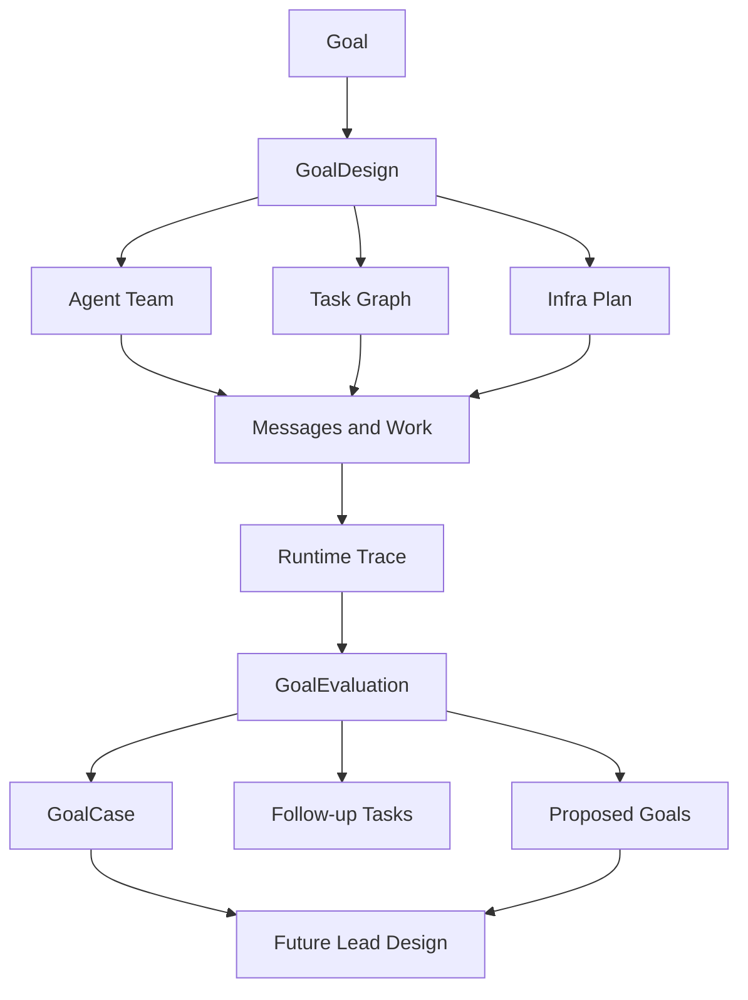

# Goal Learning Loop

## Purpose

A finished goal should improve the next goal. Star Harness therefore
stores both the execution trace and the evaluator's interpretation of that
trace.

In a standing team, goal learning is also the mechanism that creates future
work. Observer, Critic, Dashboard, Runtime, and domain agents can turn an
evaluation, stale warning, failed check, repeated manual step, or adapter
finding into proposed goals and task-graph changes.

The goal learning loop answers:

- how did the Lead design the scenario, infra, team, and task graph;
- what actually happened during execution;
- where the workflow helped or failed;
- which patterns should future Leads reuse;
- which mistakes should become CLI, skill, adapter, dashboard, or CI work.

## Lifecycle



The runtime trace is append-only operational truth. The case is a distilled
teaching artifact.

## Artifacts

### GoalDesign

Created after the goal exists and before implementation starts.

```text
GoalDesign
  goal_id
  scenario_summary
  non_goals
  risk_and_permission_boundaries
  required_infra
  agent_team
  task_graph
  evidence_plan
  acceptance_gates
```

It is the Lead's plan for turning a user goal into an agent-operable workflow.

### Runtime Trace

Produced during execution from existing harness objects:

```text
Goal
Task
Message
AgentEvent
ProviderSession
Proposal
Evidence
Decision
```

The trace stays in the harness store and evidence files. It may contain local
paths, provider logs, sensitive context, or project-specific artifacts, so it is
not automatically a reusable example.

### GoalEvaluation

Created after a goal is accepted, blocked, killed, or materially replanned.

```text
GoalEvaluation
  goal_id
  evaluator_agent_id
  outcome
  what_worked
  what_failed
  missing_infra
  missing_evidence
  team_design_feedback
  task_graph_feedback
  dashboard_feedback
  reusable_patterns
  anti_patterns
  follow_up_tasks
  proposed_goals
```

Evaluation must be performed by an evaluator or critic agent, not only by the
Lead that ran the goal.

### GoalCase

A sanitized reusable example committed to the repository.

```text
GoalCase
  case_id
  source_goal_id
  scenario_type
  project_adapter
  goal_design_ref
  evaluation_ref
  reusable_patterns
  anti_patterns
  follow_up_refs
  tags
```

The case library is not a full transcript. It is the reusable lesson future
Lead Agents should read before designing similar goals.

## Storage

Use two layers:

| Layer | Path | Purpose |
| --- | --- | --- |
| Runtime truth | `.harness/*.jsonl`, `.harness/evidence/**` | append-only operational trace and raw evidence |
| Reusable examples | `examples/goal-cases/**` | sanitized GoalDesign, GoalEvaluation, and GoalCase summaries |

Raw traces may be noisy or sensitive. Reusable examples should remove secrets,
large logs, provider transcripts, and project-specific noise while preserving
the workflow lesson.

### Object Graduation And Dual-Read

The learning artifacts started as evidence records and committed files. They
have now **graduated into first-class objects** (`GoalDesign`,
`GoalEvaluation`, `GoalCase`, `Vision`) with their own schemas, CLI commands
(`harness goal-design|goal-evaluation|goal-case|vision create|list`), and
review-gate checks. The original representations remain valid:

| Artifact | First-version representation | Graduated object | Read rule |
| --- | --- | --- | --- |
| GoalDesign | `Evidence(source_type=goal_design)` | `GoalDesign` schema/CLI | dual-read, union by `goal_id` |
| GoalEvaluation | `Evidence(source_type=goal_evaluation)` | `GoalEvaluation` schema/CLI | dual-read, union by `goal_id` |
| GoalCase | files under `examples/goal-cases/<case-id>/` | optional `case.json` manifest | files remain the human artifact |
| Vision | loose `vision_ref` / `vision_summary` | `Vision` schema/CLI, `Goal.vision_id` | object preferred |

Dual-read means **both representations are read at once**, with no backfill: the
`goal_learning_status` gate and the dashboard read model union legacy `Evidence`
rows and the graduated objects by `goal_id`. Old goals keep their `Evidence`
rows; new goals write the objects; either satisfies the closeout gate. This is
the graduation contract — the schema-evolution policy that makes it safe is in
[decisions/0017-generic-object-model.md](decisions/0017-generic-object-model.md).

## Evaluator Workflow

At goal close:

1. Load the GoalDesign, task graph, messages, evidence, proposals, provider
   sessions, and decisions.
2. Check whether the Lead followed the event order:
   `design -> assignment message -> member report -> evidence -> critic ->
   decision`.
3. Identify where the workflow reduced context, improved feedback, or prevented
   bad decisions.
4. Identify where the Lead bypassed the harness, where evidence was missing,
   and where manual work should become infra.
5. Create follow-up tasks for missing CLI, skill, adapter, dashboard, schema, or
   CI work.
6. Create proposed goals when the lesson is larger than one task or should
   start a new workstream.
7. Distill a GoalCase when the goal teaches a reusable pattern or anti-pattern.

The autonomous runner uses this closeout as a scheduling boundary. It may close
an active goal only after the task graph is complete, GoalEvaluation/final
acceptance exists, strict goal learning has no warnings, and a vision context is
supplied. After close, it compares GoalEvaluation with the supplied `Vision`
(via `Goal.vision_id`) or legacy `vision_ref`/`vision_summary`, creates a
next-goal proposal, and only creates the next GoalDesign/task graph after Lead
disposition accepts the proposal.

The closeout gate is now enforced. CLI `goal close` refuses `complete` unless a
closeout `Decision` (`decision_kind=closeout`) scoped to the goal with at least
one backing `evidence_id` exists **and** a `GoalEvaluation` exists for the goal
— or an explicit waiver `Decision`. The `goal_learning_status` snapshot surfaces
this readiness (`has_closeout_decision`, `has_closeout_waiver`,
`closeout_blockers`), and the dashboard raises a `goal_close_without_evaluation`
warning when a goal's tasks are done but the closeout proof is missing.

## Waivers

Skipping a lifecycle stage is not a bare CLI flag. It must be represented by a
waiver `Decision` (`is_waiver=true`) attached to a task in the same goal. The
CLI accepts a waiver only when:

- the gate command passes `--waiver-decision <decision-id>`;
- the decision is marked a waiver (`is_waiver=true`);
- every referenced evidence id resolves (a waiver requires at least one);
- the decision task has an owner;
- the rationale names a real follow-up task (`follow_up_task_id`) in the same
  goal.

A waiver missing its follow-up task raises a `waiver_without_follow_up` warning
in the dashboard. The self-evaluation stop loop is modeled by a
`Decision(decision_kind=stop_gate)` whose `decision` is `stop_approved` or
`continue_required`.

This keeps temporary exceptions visible and turns them into future work instead
of letting the Lead silently bypass GoalDesign, GoalEvaluation, or review.

## Dashboard

Agent Dashboard should expose:

- goal design completeness;
- task graph and role ownership;
- Observer proposals and whether the Lead accepted, rejected, or deferred them;
- message/report/evidence/decision ordering;
- evaluator verdict;
- follow-up tasks generated by the evaluation;
- links to reusable GoalCases.

This keeps the learning loop visible instead of hiding it in final chat
summaries.
