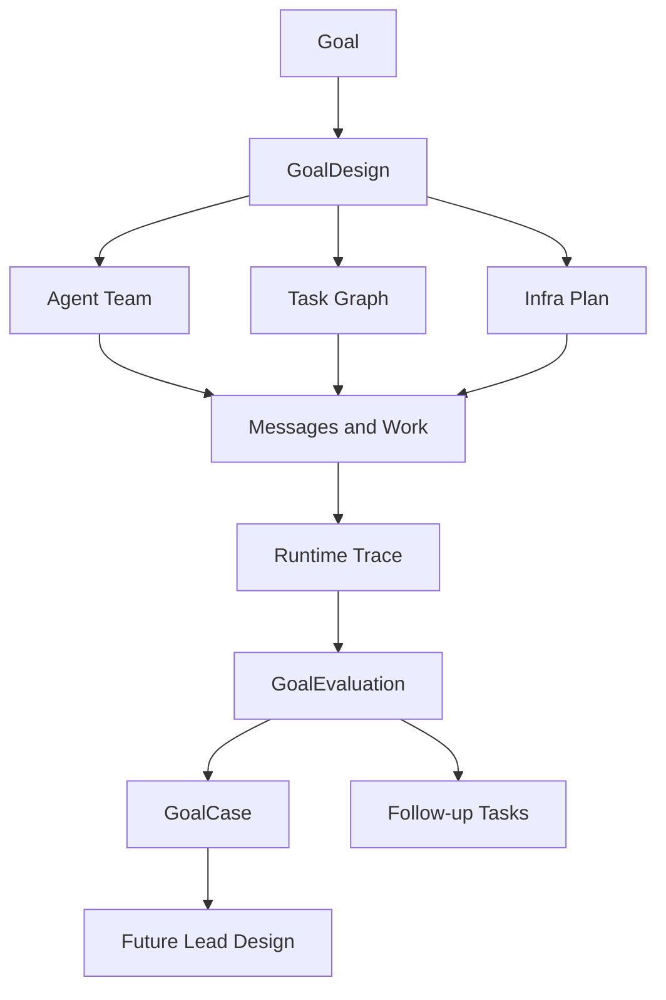

# Goal Learning Loop

## Purpose

A finished goal should improve the next goal. Multi-Agent Harness therefore
stores both the execution trace and the evaluator's interpretation of that
trace.

The goal learning loop answers:

- how did the Lead design the scenario, infra, team, and task graph;
- what actually happened during execution;
- where the workflow helped or failed;
- which patterns should future Leads reuse;
- which mistakes should become CLI, skill, adapter, dashboard, or CI work.

## Lifecycle



The runtime trace is append-only operational truth. The case is a distilled
teaching artifact.

## Artifacts

### GoalDesign

Created after the goal exists and before implementation starts.

```text
GoalDesign
  goal_id
  scenario_summary
  non_goals
  risk_and_permission_boundaries
  required_infra
  agent_team
  task_graph
  evidence_plan
  acceptance_gates
```

It is the Lead's plan for turning a user goal into an agent-operable workflow.

### Runtime Trace

Produced during execution from existing harness objects:

```text
Goal
Task
Message
AgentEvent
ProviderSession
Proposal
Evidence
Decision
```

The trace stays in the harness store and evidence files. It may contain local
paths, provider logs, sensitive context, or project-specific artifacts, so it is
not automatically a reusable example.

### GoalEvaluation

Created after a goal is accepted, blocked, killed, or materially replanned.

```text
GoalEvaluation
  goal_id
  evaluator_agent_id
  outcome
  what_worked
  what_failed
  missing_infra
  missing_evidence
  team_design_feedback
  task_graph_feedback
  dashboard_feedback
  reusable_patterns
  anti_patterns
  follow_up_tasks
```

Evaluation must be performed by an evaluator or critic agent, not only by the
Lead that ran the goal.

### GoalCase

A sanitized reusable example committed to the repository.

```text
GoalCase
  case_id
  source_goal_id
  scenario_type
  project_adapter
  goal_design_ref
  evaluation_ref
  reusable_patterns
  anti_patterns
  follow_up_refs
  tags
```

The case library is not a full transcript. It is the reusable lesson future
Lead Agents should read before designing similar goals.

## Storage

Use two layers:

| Layer | Path | Purpose |
| --- | --- | --- |
| Runtime truth | `.harness/*.jsonl`, `.harness/evidence/**` | append-only operational trace and raw evidence |
| Reusable examples | `examples/goal-cases/**` | sanitized GoalDesign, GoalEvaluation, and GoalCase summaries |

Raw traces may be noisy or sensitive. Reusable examples should remove secrets,
large logs, provider transcripts, and project-specific noise while preserving
the workflow lesson.

First-version lookup uses evidence records, not new schema types:

| Artifact | First-version representation |
| --- | --- |
| GoalDesign | `Evidence(source_type=goal_design, source_ref=...)` |
| GoalEvaluation | `Evidence(source_type=goal_evaluation, source_ref=...)` |
| GoalCase | committed files under `examples/goal-cases/<case-id>/` |

After the fields stabilize, these can graduate into schemas, CLI commands, and
review-gate checks.

## Evaluator Workflow

At goal close:

1. Load the GoalDesign, task graph, messages, evidence, proposals, provider
   sessions, and decisions.
2. Check whether the Lead followed the event order:
   `design -> assignment message -> member report -> evidence -> critic ->
   decision`.
3. Identify where the workflow reduced context, improved feedback, or prevented
   bad decisions.
4. Identify where the Lead bypassed the harness, where evidence was missing,
   and where manual work should become infra.
5. Create follow-up tasks for missing CLI, skill, adapter, dashboard, schema, or
   CI work.
6. Distill a GoalCase when the goal teaches a reusable pattern or anti-pattern.

Until schema and CLI support exist, a goal-close review should warn when
`goal_design` or `goal_evaluation` evidence is missing. Once the fields are
stable and dashboard support exists, accepted goals should require
`goal_evaluation` evidence.

## Waivers

Skipping a lifecycle stage is not a bare CLI flag. It must be represented by a
waiver `Decision` attached to a task in the same goal. The first-version CLI
accepts a waiver only when:

- the gate command passes `--waiver-decision <decision-id>`;
- the decision text marks it as a waiver;
- every referenced evidence id resolves;
- the decision task has an owner;
- the rationale names a real follow-up task in the same goal.

This keeps temporary exceptions visible and turns them into future work instead
of letting the Lead silently bypass GoalDesign, GoalEvaluation, or review.

## Dashboard

Agent Dashboard should expose:

- goal design completeness;
- task graph and role ownership;
- message/report/evidence/decision ordering;
- evaluator verdict;
- follow-up tasks generated by the evaluation;
- links to reusable GoalCases.

This keeps the learning loop visible instead of hiding it in final chat
summaries.
