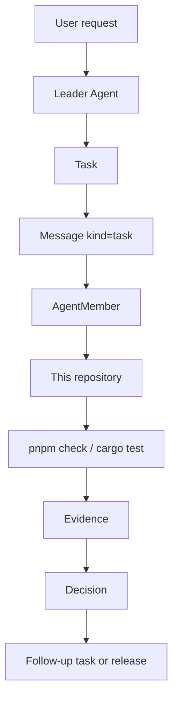
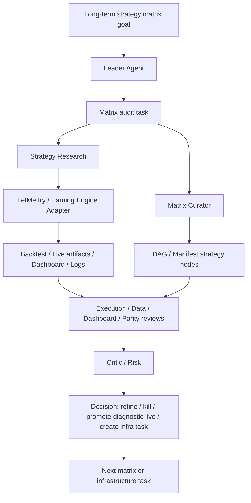

# MVP

The MVP is not a generic automation framework. It is the first evidence that
Multi-Agent Harness can manage real work through its own protocol.

The MVP has two required pilots, in this priority order:

1. Self-hosting development for this repository.
2. LetMeTry / Earning Engine strategy iteration through a project adapter.

Both pilots must use the same generic loop:

```text
Goal -> Task -> Message -> Evidence -> Decision -> Follow-up Task
```

The pilots may use different tools and dashboards, but they must share the same
coordination objects, evidence rules, and decision trail.

## Pilot 1: Self-Hosting Development

The harness should be able to manage its own development.



Minimum capabilities:

- create a goal for the self-hosting MVP;
- create a task for a repository change;
- assign the task to an agent member through a message;
- record evidence from docs checks, schema fixtures, Rust checks, or review;
- record a decision with evidence refs;
- create follow-up tasks when checks or reviews expose gaps.

Acceptance:

- a harness feature can be designed, implemented, checked, reviewed, and
  accepted without relying on chat history as the only state;
- generated evidence points to files, commands, logs, or review notes;
- the repo can distinguish current gates from planned gates;
- stale docs, schema drift, and missing ownership become tasks or blockers.

## Pilot 2: LetMeTry Strategy Matrix Iteration

The harness should also help iterate a real strategy system through an adapter,
without coupling strategy logic into the generic core. This pilot is not
accepted by running a single bounded evaluation. It is accepted when the
harness can coordinate the original strategy-matrix workflow and turn strategy
evidence into strategy or infrastructure tasks.



Minimum adapter capabilities:

- expose strategy-harness status and artifact commands as tool descriptors;
- link to strategy dashboard pages and artifacts as evidence;
- encode permission boundaries for live, wallet, order, and secret-touching
  actions;
- distinguish diagnostic evidence from promotion evidence;
- preserve the backtest/live distinction instead of hiding execution gaps;
- reference active strategy nodes, parameters, lineage, and run history from
  the project source of truth;
- classify strategy problems by layer: strategy logic, execution lifecycle,
  market-data freshness, dashboard visibility, backtest/live parity, wallet or
  order safety, or missing tooling.

Acceptance:

- a Leader Agent can create matrix-level tasks such as audit strategy family,
  compare variants, diagnose quiet strategies, review no-fill behavior, inspect
  exits, or propose a new strategy;
- role-specific agents can inspect the same strategy family from different
  angles: strategy research, matrix curation, backtest parity, live operations,
  execution lifecycle, market-data fabric, dashboard review, infrastructure,
  critic/risk, and knowledge;
- evidence includes DAG or manifest nodes, parameters, backtest/live artifacts,
  dashboard links, logs, screenshots, review summaries, or command outputs;
- the Leader can decide whether to refine, kill, promote bounded live, or
  create an infrastructure task based on evidence;
- repeated friction in live strategy work becomes harness or project
  infrastructure work, for example market-data fabric migration, execution
  telemetry, dashboard detail pages, replay parity, or CLI improvements;
- strategy-specific logic stays in the LetMeTry project or adapter, not in the
  generic harness core.

## Shared MVP Surfaces

| Surface | MVP role |
| --- | --- |
| Rust core | Defines the first stable objects. |
| File store | Persists goals, teams, members, runtimes, tasks, messages, events, proposals, evidence, provider sessions, and decisions locally. |
| CLI | Creates and reads the objects, and records evidence/decisions. |
| Skills | Teach agents how to operate the harness and project adapters. |
| Tool descriptors | Expose project capabilities without importing project code. |
| CI/CD | Verifies docs, schemas, fixtures, and Rust checks. |
| Agent Dashboard | Shows teams, member state, message delivery, runtime events, task Kanban, proposal state, evidence, and decisions. |

The MVP can start with a file store and CLI before a full API or Dashboard. It
does not need provider orchestration to be complete, but provider sessions must
not be treated as the source of truth.

The first Agent Dashboard should prioritize a Kanban-like task board plus an
Agent Member roster. Task cards should show owner, assignee, reviewer,
workspace ref, branch ref, PR ref, evidence count, latest message, blockers,
and decision status. Member cards should show id, name, description, role,
provider, prompt ref, skill refs, runtime status, current task, current
proposal, and latest event.

## Self-Hosting MVP Task Graph

The first active goal is `self-host-mvp`: make the harness capable of managing
its own development before depending on the Earning Engine pilot.

| Task | Primary role | Depends on | Acceptance |
| --- | --- | --- | --- |
| Define goal and task graph contracts | Architecture | none | `Goal` and graph-capable `Task` are represented in docs, schemas, fixtures, and Rust core. |
| Implement local file store | Core implementation | contracts | Goals, tasks, messages, evidence, provider sessions, and decisions can be appended and read locally. |
| Implement CLI workflow | Core implementation | file store | CLI can create goals/tasks, send channel messages, attach evidence, and record decisions. |
| Define persistent Codex runtime | Provider integration | contracts | Codex app-server runtime, prompt composition, message delivery, event ingestion, and close semantics are documented and represented in schemas. |
| Implement persistent Agent Members | Provider integration | CLI workflow | Multiple Codex-backed Agent Members can be created, listed, messaged, observed, and closed through harness state. |
| Add worktree and branch workflow | Infrastructure | CLI workflow | Editing tasks can declare workspace refs, branch refs, PR refs, and owned paths; concurrent tasks do not share write scope by default. |
| Add PR review and decision gate | Review / Critic | CLI workflow | A task cannot be accepted without evidence, PR or diff review, and a Leader decision. |
| Build Kanban read model | Dashboard | file store | Dashboard or structured read model groups tasks by status and shows assignment, workspace, evidence, blockers, and decisions. |
| Dogfood one repo change | Leader | CLI, review, dashboard | A real repository change is managed through the harness objects instead of chat-only state. |
| Expand Earning Engine adapter | Adapter / Strategy | self-hosting proof | Adapter can drive a strategy-matrix operating slice with role reports and follow-up tasks. |

The graph is allowed to change. Any split, blocker, reassignment, or new
infrastructure task must be recorded as a message, evidence item, or decision
so the dashboard can explain why the plan changed.

## Batch 2: CLI Self-Hosting Loop

Batch 2 establishes the local CLI loop across provider delivery files, Git
workflow, review, and dashboard read model.

| Task | Depends on | Done when |
| --- | --- | --- |
| JSON-RPC delivery worker | persistent Agent Members | `agent deliver` builds bounded app-server requests, records provider sessions, and updates delivery status. |
| Notification ingestion | delivery worker | `agent ingest` maps provider output into `AgentEvent`, proposal candidates, evidence, and report messages. |
| Runtime health | persistent Agent Members | `agent start/health` exposes pid, socket, queued messages, and stale runtime detection. |
| Git worktree commands | task graph contracts | `git worktree-create/attach/status/changed-paths` records workspace, branch, PR, dirty state, and owned-path metadata. |
| Proposal from diff | Git worktree commands | `proposal from-diff` captures tracked and untracked changed paths, stores diff evidence, and can attach check evidence. |
| Review and decision gate | proposal from diff | `review gate` requires evidence and records accepted/rejected proposal plus Leader `Decision`. |
| Agent Dashboard read model | store and CLI | `dashboard snapshot` groups teams, members, inbox, events, proposals, and Kanban task columns. |
| Self-hosting dogfood run | all above | A temporary repo change can be assigned, delivered, proposed, reviewed, decided, and shown in dashboard state. |

## Batch 3: Non-Fake Self-Hosting

Batch 3 must remove the easiest ways to fake progress. Static snapshots and
dry-run delivery are useful diagnostics, but they are not enough to prove a
real multi-agent product.

Batch 3 is gated in three phases. Phase 3A blocks Phase 3B and 3C.

### Phase 3A: P0 Runtime And Evidence Gates

| Task | Depends on | Done when |
| --- | --- | --- |
| Real Codex runtime contract | Batch 2 delivery | A non-dry-run `agent deliver --start-runtime` starts runtime, receives real provider thread evidence or records a reproducible request/response/error fixture, and updates message delivery state from provider output. |
| JSON-RPC state machine | Real runtime contract | `thread/start` response is parsed before `turn/start`; fake thread ids and success-by-stdout are rejected. |
| Evidence hardening | review gate | `review gate` rejects fake evidence ids, missing source refs, failed checks, missing proposal evidence, stale runtime evidence, missing provider/worker output, and owned-path violations by default. |
| Critic/Gate agent workflow | evidence hardening | A Critic Agent findings report is required evidence before accepting implementation tasks. |
| Protocol smoke tests | runtime contract | CI or smoke scripts cover frame parsing, thread id extraction, turn delivery, and JSON-RPC error-to-failed-message mapping. |

Current Phase 3A implementation status:

- `agent deliver` no longer fabricates a thread id. It runs
  `initialize + thread/start`, parses the real provider thread id, then sends
  `initialize + turn/start`; current smoke evidence proves the failure-fixture
  path, while a completed real Codex turn remains a follow-up runtime
  compatibility gate.
- provider process failure, empty output, JSON-RPC error, or missing thread id
  becomes a failed message delivery plus a reproducible fixture in
  `.harness/provider-sessions/`;
- `review gate --decision accept` rejects fake evidence ids, missing source
  refs, failed checks, missing proposal evidence, missing `critic_findings`,
  missing provider/worker output, stale failed Codex provider sessions, and
  owned-path violations by default;
- unit smoke tests cover Content-Length frame parsing, thread id extraction,
  JSON-RPC error detection, missing source refs, and acceptance evidence
  requirements.

### Phase 3B: Live Coordination Surface

| Task | Depends on | Done when |
| --- | --- | --- |
| Runtime daemon and API | Phase 3A | A local service exposes dashboard state, runtime health, message delivery, and provider sessions over HTTP polling without manually regenerating snapshot files. |
| Dashboard live mode | runtime daemon | Agent Dashboard can connect to the local service, refresh member/task/message/event/proposal state, and still support JSON snapshot import. |
| Dashboard risk visibility | runtime daemon | Dashboard shows stale runtime, queued/delivered/failed counts, latest event age, and provider session failures. |
| Managed hook/plugin telemetry | runtime daemon | Harness-owned Codex hooks/plugin stream lifecycle checkpoints into `HARNESS_ROOT` or harness API without writing runtime files into the task worktree. |

Current Phase 3B implementation status:

- `harness serve --addr 127.0.0.1:8787` exposes a read-only local API for
  `/health`, `/v1/health`, `/v1/snapshot`, `/v1/dashboard/snapshot`, and
  `/v1/events`;
- Agent Dashboard can poll `/v1/snapshot` from a live URL while retaining file
  and pasted JSON import;
- dashboard summary includes failed message/session count and provider-session
  count;
- member cards expose runtime id, pid, alive flag, control endpoint, and
  provider thread id;
- provider sessions have a dedicated dashboard tab;
- `hook record` appends `codex_hook.*` `AgentEvent` records with payloads under
  `.harness`; trusted plugin/managed-hook activation is still pending.

This is polling live mode, not yet SSE/WebSocket streaming. The product target
is stronger: app-server notifications provide the low-latency stream, while
harness-managed hooks/plugin provide lifecycle checkpoints and terminal
reconciliation. Unknown global plugin hooks must not be enabled by default
because they can pollute task diffs and bypass owned-path reasoning.

### Phase 3C: External Workflow Pilots

| Task | Depends on | Done when |
| --- | --- | --- |
| GitHub PR adapter | Phase 3A | Tasks can attach PR refs and import PR/check/review URLs as evidence without making GitHub the source of truth. |
| Earning Engine adapter pilot | Phase 3A | One strategy-matrix review task produces evidence-backed refine/kill/promote/infra-task decisions through adapter tool descriptors. |

Current Earning Engine adapter slice:

- adapter boundaries live in `examples/adapters/earning-engine/adapter.json`;
- the first pilot scenario lives in
  `examples/adapters/earning-engine/pilot-workflow.md`;
- tool descriptors cover rolling runs, round status, completed-market build,
  live status, Trial DAG inspect, artifact inspect, fabric status,
  calibration summary, dashboard links, and live launch gates;
- live launch is represented as an explicit permission gate, not an implicit
  tool call.
- this slice accepts the adapter surface and initial matrix-audit scenario; it
  does not accept a strategy result or authorize live orders.

Batch 3 acceptance requires at least one real repository task to pass through
Leader assignment, worker output/provider session, proposal from diff, Critic
findings, review gate, decision, and Dashboard visibility. Dry-run delivery,
hand-written JSONL, or command-summary-only evidence cannot satisfy this gate.

## MVP Acceptance Gates

The MVP is accepted only when the repository can prove both the object protocol
and one self-hosted work loop. Passing CI alone is not enough.

| Gate | Accepted when | Does not pass |
| --- | --- | --- |
| Object contracts | Rust types, JSON schemas, valid/invalid fixtures, and docs agree for `Goal`, `Task`, `Message`, `AgentMember`, `AgentRuntime`, `AgentEvent`, `ProviderSession`, `ProviderChildThread`, `Proposal`, `Evidence`, and `Decision`. | A field exists only in code, only in docs, or only in a dashboard view. |
| Persistent Codex member | `agent create --provider codex --start`, `agent health`, `agent send`, `agent deliver`, and `agent close` operate on one durable `AgentMember` and provider thread. | Only `codex exec`, dry-run delivery, pid/socket checks without protocol probe, or chat-only reports. |
| Message delivery trace | A queued task message becomes delivered or failed with `Message.delivery`, provider session refs, thread id, turn id or explicit failure reason. | Success inferred from stdout without updating message state and provider session. |
| Provider event ingestion | Provider notifications become `AgentEvent`; Codex native subagent/collab events become `ProviderChildThread` or child-thread-linked events. | Dashboard can only see the parent member while child work disappears. |
| Goal learning loop | A goal has design evidence before assignment, task message, member report, critic/evaluator evidence, Leader decision, goal evaluation, and follow-up tasks when needed. | Retrospective chat explanation with no durable evidence chain. |
| Review gate | Accepted tasks include proposal evidence, check evidence, critic findings, provider/worker output, owned-path validation, and Leader decision. | Acceptance through hand-written JSONL, missing evidence ids, stale failed provider sessions, or unchecked path changes. |
| Dashboard read model | Snapshot/API shows Kanban task state, member roster, runtime health, queued/delivered/failed messages, provider sessions, child threads, proposals, evidence, decisions, and goal-learning warnings. | A static page that cannot explain who owns work, what is blocked, or what evidence supports a decision. |
| Realtime telemetry path | App-server notifications and harness-managed hooks/plugin can update member status, tool activity, subagent state, permission state, and Stop-hook report without relying on final snapshot regeneration. | Dashboard only learns state after `agent deliver` exits or from unmanaged plugin hooks that write into task worktrees. |
| Self-hosting dogfood | At least one real repo change is designed, assigned, delivered to a persistent member, proposed from diff, reviewed by a critic, accepted/rejected, and visible in dashboard state. | The Lead manually edits everything while only documenting the intended harness flow. |

The current implementation can satisfy the schema and CLI portions of these
gates. A full MVP pass still needs a non-fake self-hosting run with a real
persistent Codex member and critic review evidence.

The staged gate is executable:

```bash
npx pnpm@9.15.4 acceptance:mvp
npx pnpm@9.15.4 acceptance:mvp:live
```

`acceptance:mvp` proves the deterministic object protocol, review gate,
Dashboard API, hook bridge, and adapter surface. `acceptance:mvp:live` adds
real persistent Codex delivery plus Worker/Critic multi-member dogfood and is
the gate for claims that the harness is using live AgentMembers.

Executable stage map:

| Stage | Gate |
| --- | --- |
| S0 | Static repo gates: Rust fmt/lint/test, docs/schema/tool checks, CLI build. |
| S1 | Isolated store can create members, team, and goal. |
| S2 | Goal design evidence exists before task assignment. |
| S3 | Worker report, check evidence, and critic findings are attached. |
| S4 | Provider notification fixture becomes `AgentEvent` records. |
| S5 | Review gate rejects fake acceptance with missing critic evidence. |
| S6 | Proposal passes review gate and records Leader decision. |
| S7 | Goal evaluation and reusable goal case pass strict learning status. |
| S8 | Hook bridge and plugin fallback record telemetry outside task worktree. |
| S9 | Dashboard snapshot and local API expose the workflow state. |
| S10 | Earning Engine adapter descriptors and pilot surface are present. |
| S11 | Live persistent Codex member delivery succeeds when `--live-codex` is used. |
| S12 | Live Worker and Critic persistent members run a dogfood task graph, deliver, report, and appear in Dashboard sessions. |

## Non-Goals For MVP

- No full workflow DSL.
- No generic strategy engine.
- No plugin before CLI/API/schema contracts stabilize.
- No live trading automation without explicit permission gates.
- No replacement for LetMeTry's strategy dashboard or backtest engine.

## Completion Criteria

The MVP is complete when the same harness can:

1. manage a real change to `multi-agent-harness` through goal, task, message,
   evidence, and decision artifacts;
2. use the LetMeTry / Earning Engine adapter to drive strategy-matrix
   iteration from long-term goal to evidence-backed strategy or infrastructure
   decision;
3. show both flows in the Agent Dashboard or an equivalent structured read
   model, with the self-hosting development flow implemented first;
4. run CI gates that verify the contracts used by both flows;
5. produce follow-up tasks from missing evidence, failed checks, or rejected
   strategy ideas.
