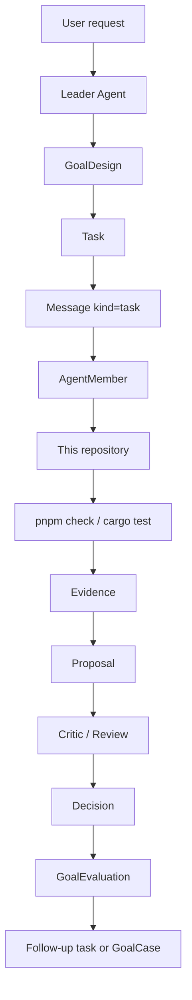
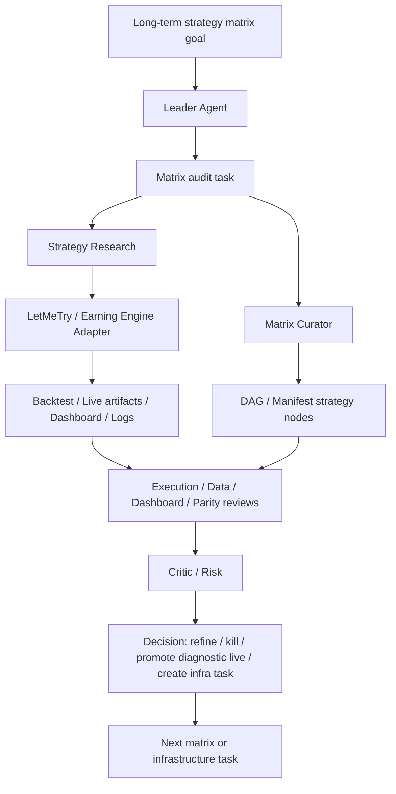

# MVP

The MVP is the first evidence that Star Harness can manage real work
through its own protocol. It is not accepted by having docs, schemas, or a
Dashboard alone. It is accepted when the harness can use those pieces together
to run a non-fake workflow.

## Required Pilots

The MVP has two pilots, in this priority order:

1. self-hosting development for this repository;
2. LetMeTry / Earning Engine strategy-matrix iteration through a project
   adapter.

Both pilots must use the same generic loop. The loop starts before a human
hands over a fully formed task: the standing team should be able to observe
gaps, propose goals, and grow the task graph.

```text
Standing AgentTeam -> Proposed Goal -> GoalDesign -> Task Graph
  -> Message -> AgentMember work
  -> Evidence -> Proposal -> Review -> Decision
  -> GoalEvaluation -> NextRoundPlan
  -> Follow-up Task / Next Goal / GoalCase
```

The pilots may use different domain tools and dashboards, but they must share
the same coordination objects, evidence rules, and decision trail.

Historical implementation notes from the current self-hosting path are kept as
a reusable case in
[self-hosting-mvp-runtime-hardening-20260527](../examples/goal-cases/self-hosting-mvp-runtime-hardening-20260527/README.md).

## Pilot 1: Self-Hosting Development

The harness must manage its own development.



Minimum capabilities:

- keep a standing self-hosting team instead of creating throwaway members for
  each task;
- include an Observer or equivalent member for long-running goals;
- let team members propose goals, follow-up tasks, blockers, or graph changes;
- create a goal and goal-design evidence;
- create a task with owner, assignee, reviewer, dependencies, workspace or
  owned-path policy, and acceptance criteria;
- assign through `Message(kind=task)`;
- run or record provider-backed member work across more than one message for
  the same member;
- support peer messages between members for questions, critique, handoff, and
  review feedback;
- attach evidence from checks, diffs, provider sessions, review, logs, or
  Dashboard snapshots;
- create a proposal from diff or explicit changed paths;
- run critic/review gate and record Leader decision;
- produce goal evaluation and follow-up tasks.

Acceptance:

- a real repository change can be designed, assigned, delivered, proposed,
  reviewed, decided, and shown in Dashboard state without relying on chat
  history as the only state;
- the same team can continue after that task by producing a follow-up task or
  next-goal proposal from evidence, evaluation, or a warning;
- generated evidence points to files, commands, logs, provider sessions, or
  review notes;
- stale docs, schema drift, missing evidence, provider failures, or missing
  ownership become tasks, blockers, or warnings.

## Pilot 2: LetMeTry Strategy Matrix Iteration

The harness must coordinate a real strategy system through an adapter without
coupling strategy logic into the generic core.



Minimum adapter capabilities:

- expose project CLI/API/dashboard/artifact commands through tool descriptors;
- link to strategy dashboard pages and artifacts as evidence;
- encode permission boundaries for live, wallet, order, and secret-touching
  actions;
- distinguish diagnostic evidence from promotion evidence;
- preserve backtest/live differences instead of hiding execution gaps;
- reference strategy nodes, parameters, lineage, and run history from the
  project source of truth;
- classify strategy problems by layer: strategy logic, execution lifecycle,
  market-data freshness, dashboard visibility, backtest/live parity, wallet or
  order safety, or missing tooling.

Acceptance:

- a Leader Agent can create matrix-level tasks such as audit strategy family,
  compare variants, diagnose quiet strategies, review no-fill behavior, inspect
  exits, or propose a new strategy;
- role-specific agents can inspect the same strategy family from strategy,
  execution, data, dashboard, parity, live-ops, critic, and knowledge angles;
- evidence includes DAG or manifest nodes, parameters, backtest/live artifacts,
  dashboard links, logs, screenshots, review summaries, or command outputs;
- the Leader can decide whether to refine, kill, promote bounded live, or
  create an infrastructure task based on evidence;
- strategy-specific logic stays in the LetMeTry project or adapter.

## Shared MVP Surfaces

| Surface | MVP role |
| --- | --- |
| Rust core | Defines first stable objects and state transitions. |
| File store | Persists goals, teams, members, runtimes, tasks, messages, events, proposals, evidence, provider sessions, and decisions locally. |
| CLI/API | Creates, reads, validates, and records the workflow objects. |
| Provider runtime | Backs persistent Agent Members and records delivery/evidence. |
| Skills | Teach agents how to operate the harness and project adapters. |
| Tool descriptors | Expose project capabilities without importing project code. |
| CI/CD | Verifies docs, schemas, fixtures, Rust checks, skill metadata, and stable workflow gates. |
| Agent Dashboard | Shows teams, member state, message delivery, runtime events, task Kanban, proposal state, evidence, review, decisions, and warnings. |

## Acceptance Gates

The MVP is accepted only when the repository can prove both the object protocol
and one self-hosted work loop.

| Gate | Accepted when | Does not pass |
| --- | --- | --- |
| Object contracts | Rust types, JSON schemas, fixtures, and docs agree for core objects. | A field exists only in code, docs, or a Dashboard view. |
| Goal design | GoalDesign exists before implementation assignment. | Retrospective chat explanation only. |
| Message delivery | A task message becomes delivered or failed with provider-session refs or explicit failure reason. | Success inferred from stdout or an assignee field. |
| Persistent member | A durable member receives multiple messages over time, returns to idle between turns, and preserves identity, inbox/outbox, runtime, and provider-thread mapping unless rotation is explained. | Create member, deliver one turn, then close member as a job runner. |
| Standing team | A team persists across a goal and its follow-up work, with stable member roles and Dashboard-visible state. | A test creates temporary agents only to satisfy a single script stage. |
| Observer role | A durable Observer turns Dashboard warnings, CI failures, stale sessions, prior cases, or adapter evidence into proposed goals, blockers, or graph changes. | The user or Lead must manually discover every next task. |
| Peer collaboration | Worker, Critic, Dashboard, or domain agents can exchange task-linked messages without routing every clarification through the Lead. | Hidden provider chat, final summaries, or Lead-only message fanout. |
| Goal generation | Evaluator or member reports can create proposed goals, follow-up tasks, blockers, or graph changes that the Lead accepts, rejects, or prioritizes. | The system waits for the user to discover every next task. |
| Provider events | Provider notifications or fixtures become `AgentEvent` and report/evidence candidates. | Provider output remains raw transcript only. |
| Review gate | Accepted work includes proposal evidence, check evidence, critic findings, worker/provider output, path validation, and Leader decision. | Missing evidence ids, stale failed sessions, or unchecked path changes. |
| Dashboard read model | Dashboard/API shows tasks, members, runtimes, messages, provider sessions, proposals, evidence, decisions, and warnings. | A static page that cannot explain assignment, blockers, or evidence. |
| Goal learning | Goal evaluation and follow-up tasks or cases are produced when useful. | Final chat summary only. |
| Self-hosting dogfood | One real repo change passes through the full workflow. | Lead manually edits everything and only documents the intended flow. |
| Adapter pilot | Earning Engine adapter can drive one strategy-matrix decision or infrastructure task. | Adapter only lists commands with no evidence-backed decision path. |

Executable gates:

```bash
npx pnpm@9.15.4 acceptance:mvp
npx pnpm@9.15.4 acceptance:mvp:live
npx pnpm@9.15.4 acceptance:autonomous-team
```

`acceptance:mvp` proves deterministic object protocol, review gate, Dashboard
API, hook bridge, and adapter surface. The current `acceptance:mvp:live` is a
provider transport gate: it proves real Codex delivery and a Worker/Critic live
smoke. It is not sufficient for autonomous team acceptance until it also proves
member reuse, durable inbox/outbox, idle-to-next-message delivery, peer
communication, and agent-proposed follow-up work.

`acceptance:autonomous-team` is the deterministic autonomous-team gate. It
creates a standing team, proves the same `AgentMember` receives multiple
messages and returns to idle, proves Worker/Critic peer messages, records
GoalEvaluation, then uses `autonomy loop` to close the completed goal, compare
the evaluation with a vision reference, create a next-goal proposal, have Lead
auto-accept it, create the follow-up GoalDesign/task graph, execute that
generated round, and create another accepted follow-up proposal. The Dashboard
`autonomous_proposals` projection must link proposals, evidence, goal-close
decisions, follow-up goals, and follow-up tasks across generated rounds.

## Current Build Order

```text
object contracts
  -> file store and CLI
  -> provider runtime and delivery
  -> evidence / proposal / review gate
  -> Dashboard read model and warnings
  -> self-hosting dogfood
  -> persistent team reuse and peer collaboration
  -> agent-proposed follow-up goals
  -> Earning Engine adapter pilot
  -> goal evaluation and reusable cases
```

## Non-Goals For MVP

- No full workflow DSL.
- No generic strategy engine.
- No plugin before CLI/API/schema contracts stabilize.
- No live trading automation without explicit permission gates.
- No replacement for LetMeTry's strategy dashboard or backtest engine.

## Completion Criteria

The MVP is complete when the same harness can:

1. manage a real change to `multi-agent-harness` through goal, task, message,
   provider/session evidence, proposal, review, decision, and goal evaluation;
2. keep the same standing team alive across multiple messages/tasks and have
   members propose follow-up goals or task-graph changes from evidence;
3. use the LetMeTry / Earning Engine adapter to drive strategy-matrix
   iteration from long-term goal to evidence-backed strategy or infrastructure
   decision;
4. show both flows in the Agent Dashboard or equivalent structured read model;
5. run CI gates that verify the contracts used by both flows;
6. produce follow-up tasks from missing evidence, failed checks, rejected
   proposals, or strategy findings.
