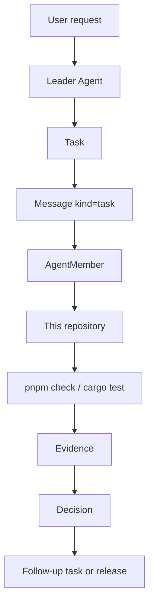
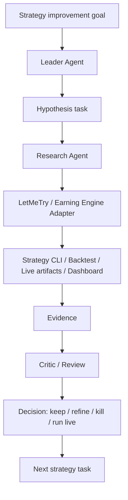

# MVP

The MVP is not a generic automation framework. It is the first evidence that
Multi-Agent Harness can manage real work through its own protocol.

The MVP has two required pilots:

1. Self-hosting development for this repository.
2. LetMeTry / Earning Engine strategy iteration through a project adapter.

Both pilots must use the same generic loop:

```text
Task -> Message -> Evidence -> Decision
```

The pilots may use different tools and dashboards, but they must share the same
coordination objects, evidence rules, and decision trail.

## Pilot 1: Self-Hosting Development

The harness should be able to manage its own development.



Minimum capabilities:

- create a task for a repository change;
- assign the task to an agent member through a message;
- record evidence from docs checks, schema fixtures, Rust checks, or review;
- record a decision with evidence refs;
- create follow-up tasks when checks or reviews expose gaps.

Acceptance:

- a harness feature can be designed, implemented, checked, reviewed, and
  accepted without relying on chat history as the only state;
- generated evidence points to files, commands, logs, or review notes;
- the repo can distinguish current gates from planned gates;
- stale docs, schema drift, and missing ownership become tasks or blockers.

## Pilot 2: LetMeTry Strategy Iteration

The harness should also help iterate a real strategy system through an adapter,
without coupling strategy logic into the generic core.



Minimum adapter capabilities:

- expose strategy-harness status and artifact commands as tool descriptors;
- link to strategy dashboard pages and artifacts as evidence;
- encode permission boundaries for live, wallet, order, and secret-touching
  actions;
- distinguish diagnostic evidence from promotion evidence;
- preserve the backtest/live distinction instead of hiding execution gaps.

Acceptance:

- an agent can create a strategy hypothesis task;
- an agent can run or inspect a bounded evaluation through adapter tools;
- evidence includes backtest/live artifacts, dashboard links, logs, or review
  summaries;
- the Leader can decide whether to refine, kill, or promote a strategy based on
  evidence;
- strategy-specific logic stays in the LetMeTry project or adapter, not in the
  generic harness core.

## Shared MVP Surfaces

| Surface | MVP role |
| --- | --- |
| Rust core | Defines the first stable objects. |
| File store | Persists tasks, messages, evidence, and decisions locally. |
| CLI | Creates and reads the objects, and records evidence/decisions. |
| Skills | Teach agents how to operate the harness and project adapters. |
| Tool descriptors | Expose project capabilities without importing project code. |
| CI/CD | Verifies docs, schemas, fixtures, and Rust checks. |
| Agent Dashboard | Shows task/message/evidence/decision state and links to project dashboards. |

The MVP can start with a file store and CLI before a full API or Dashboard. It
does not need provider orchestration to be complete, but provider sessions must
not be treated as the source of truth.

## Non-Goals For MVP

- No full workflow DSL.
- No generic strategy engine.
- No plugin before CLI/API/schema contracts stabilize.
- No live trading automation without explicit permission gates.
- No replacement for LetMeTry's strategy dashboard or backtest engine.

## Completion Criteria

The MVP is complete when the same harness can:

1. manage a real change to `multi-agent-harness` through task, message,
   evidence, and decision artifacts;
2. use the LetMeTry / Earning Engine adapter to drive one bounded strategy
   iteration from hypothesis to evidence-backed decision;
3. show both flows in the Agent Dashboard or an equivalent structured read
   model;
4. run CI gates that verify the contracts used by both flows;
5. produce follow-up tasks from missing evidence, failed checks, or rejected
   strategy ideas.
