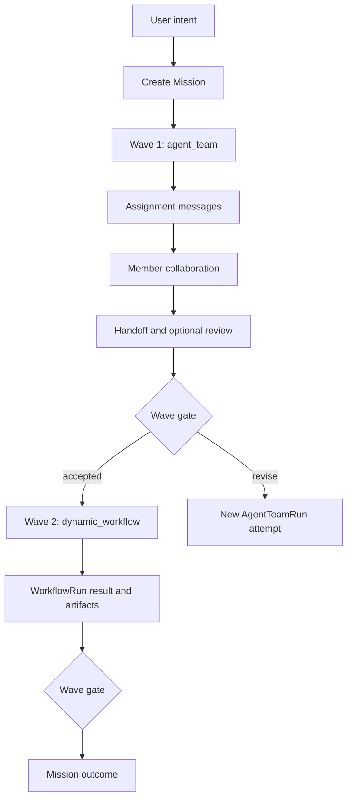

# MVP

## Purpose

The next MVP proves the accepted product hierarchy in running software:

```text
Mission -> ordered Wave -> executor
```

It is not a rewrite of the whole compatibility runtime. It adds the smallest
Mission/Wave contracts and joins needed to run real Agent Team and Dynamic
Workflow Waves while preserving existing Goal/GoalPhase data.

Historical `acceptance:mvp`, `acceptance:mvp:live`, and
`acceptance:autonomous-team` remain compatibility regression gates. Passing
them does not by itself prove this Mission/Wave MVP.

## MVP Slice

### 1. Additive Mission/Wave Contracts

- JSON schemas and Rust types for Mission, Wave, Wave attempt refs, and the
  lightweight gate;
- store ledgers/projections that do not rewrite existing Goal/GoalPhase JSONL;
- dual-read mapping for compatibility records where the mapping is honest;
- explicit `executor_kind = agent_team | dynamic_workflow | host`;
- `executor_run_ids[]` and `accepted_run_id` for retry lineage.

### 2. Agent Team Wave

- create an AgentTeamRun linked to `mission_id` and `wave_id`;
- create assignments before lane execution;
- allow manual messages to reuse assignment `correlation_id` and set
  `causation_id`;
- correlate actions, blockers, handoffs, reviews, and delegation when the
  runtime actually has the reference;
- complete a Wave through a lightweight gate and record the accepted run;
- keep v0 task fields readable but optional for new runs.

### 3. Dynamic Workflow Wave

- attach one or more WorkflowRun attempts to a Wave;
- use WorkflowRun/WorkflowStep/artifacts/result as executor truth;
- accept or revise the Wave without creating a duplicate Task Graph;
- preserve standalone workflow patch/apply/reject behavior.

### 4. Host Wave

- represent direct Host execution and its outcome/artifacts;
- permit provider-native subagents as Host implementation detail;
- record only honestly observable delegation facts;
- never require a fake Task, child MemberRun, or Task Graph.

### 5. Thinking Migration

- provide a sanitized, truncated, rate-limited transient channel when the
  provider exposes thinking;
- exclude new thinking from JSONL, snapshots, replay, evidence, and peer
  messages;
- preserve old durable rows as compatibility history without presenting them
  as accepted product behavior.

### 6. Host And Dashboard Surfaces

- CLI/API/MCP create/read/update Mission and Wave;
- executor launch attaches the correct run kind;
- Mission page shows ordered Waves, attempts, artifacts, and gate state;
- Agent Team page shows assignment ownership, member state, messages, actions,
  approvals, and Wave context;
- host plugins use the same read model and do not invent unsupported fields.

## Primary Acceptance Journey



The accepted journey must prove:

- no Wave has or needs a Task Graph;
- assignment ownership is structurally correlated, not inferred only from body
  prose or `task_id`;
- a retry is a new run attempt and the gate identifies the accepted attempt;
- both executor kinds appear in one Mission read model;
- artifacts and gate notes explain why each Wave was accepted;
- compatibility data remains readable.

## Acceptance Gates

| Gate | Accepted when | Does not pass |
| --- | --- | --- |
| Contracts | Rust, schema, fixtures, store, CLI/API, and docs agree on Mission/Wave. | Future-state prose only. |
| Compatibility | Existing Goal/GoalPhase ledgers and commands still read/run or emit explicit deprecation guidance. | Destructive history rewrite or silent data loss. |
| Wave minimalism | Wave fields are objective/executor/attempt/outcome/artifact/gate focused. | Task DAG embedded in Wave. |
| Agent Team joins | New runs/messages/actions can join Mission, Wave, and assignment correlation without Task. | A `task_id` is still required or manual sends always fork correlation. |
| Team execution | A real provider-backed team completes an assignment/handoff/review path. | Create/start smoke with no accepted outcome. |
| Workflow execution | A WorkflowRun attaches to a Wave and its result/artifacts drive the gate. | Workflow rebuilt as tasks. |
| Host execution | A direct Host outcome can close a Wave without fake child ownership. | Provider-native subagent is claimed as harness-controlled. |
| Retry lineage | A revised Wave creates a second run and records one accepted attempt. | In-place run mutation hides the failed attempt. |
| Thinking | New thinking is live-only and absent from durable snapshots/ledgers. | Durable `MemberAction(type=thinking)` writes continue. |
| Dashboard/plugin truth | UI, CLI, MCP, and plugins render supported fields and capability gaps honestly. | Product UI fabricates Mission/Wave/correlation state. |
| Self-hosting | This repository executes one real migration Wave through the new path. | Only fixtures or chat narrative. |

## Required Tests

Keep current regression checks:

```bash
npx pnpm@9.15.4 check
npx pnpm@9.15.4 acceptance:mvp
npx pnpm@9.15.4 acceptance:mvp:live
```

Add focused Mission/Wave acceptance covering:

1. schema/fixture validation;
2. old Goal/GoalPhase dual-read;
3. Agent Team Wave with assignment correlation and accepted attempt;
4. Dynamic Workflow Wave with artifacts/result;
5. retry/revise lineage;
6. no new durable thinking rows;
7. CLI/API/MCP/Dashboard projection parity.

Live-provider acceptance must use only the minimum expensive calls needed to
prove the cross-provider contract. Deterministic tests own state transitions,
compatibility, failure paths, and read-model parity.

## Build Order

```text
additive schemas/types
  -> store + dual-read projection
  -> assignment correlation inputs
  -> Agent Team Wave routing
  -> Dynamic Workflow Wave attachment
  -> Host Wave outcome path
  -> transient thinking channel / stop durable writes
  -> CLI + API + MCP
  -> Mission/Agent Team Dashboard surfaces
  -> plugin migration
  -> live acceptance
```

## Non-Goals For This MVP

- Removing Goal/GoalPhase code or rewriting old ledgers.
- Standing Agents + Docs business operation.
- A portfolio/project-management suite.
- A mandatory Task Graph, Proposal, Critic, or Decision object for every Wave.
- Full control of provider-native subagent lifecycles.
- Rebuilding Dynamic Workflow around Agent Team semantics.
- Project-specific strategy or commerce logic in the core.

## Completion Criteria

The MVP is complete when one real Mission uses at least two Waves with distinct
executor semantics, including a live Agent Team Wave, and the store/UI can
explain objective, attempts, accepted run, assignment ownership, artifacts,
gate result, and Mission outcome without a Task Graph or persisted thinking.
