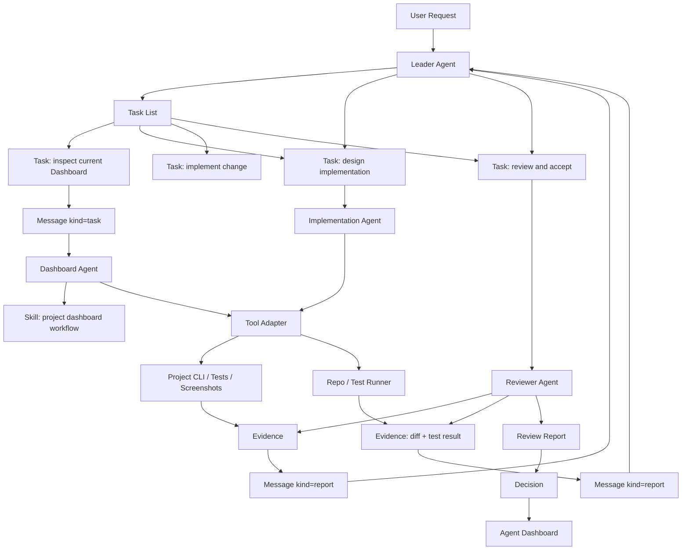
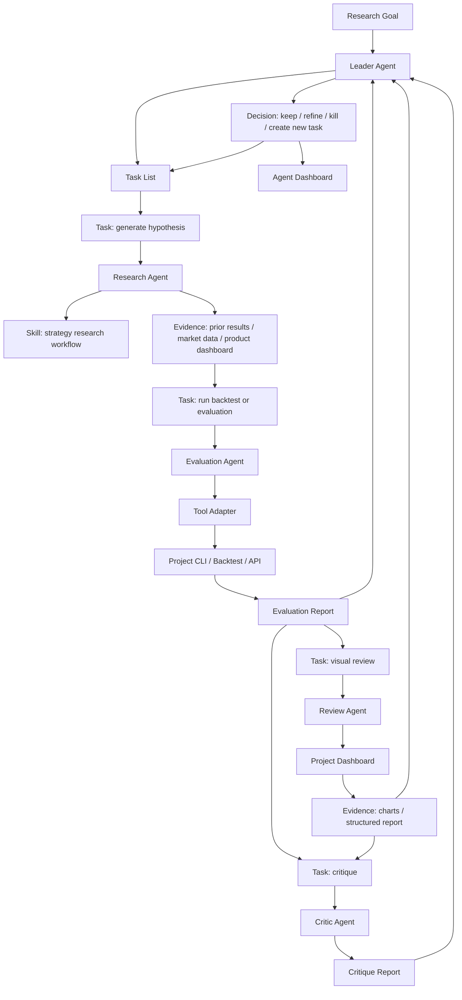
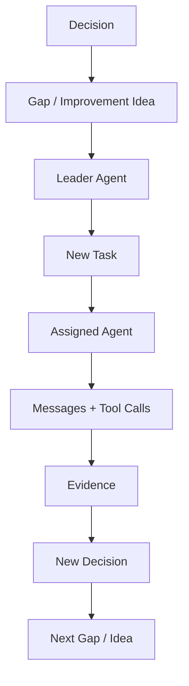

# Product Requirements

## Purpose

Multi-Agent Harness is a product for turning a project or business domain into
an agent-operable system.

Its first job is not to run tasks. Its first job is to understand a goal in its
real project context, model the scenario workflow, identify the missing
infrastructure that would make the scenario easier for agents, design the right
agent team, and then drive the task graph through messages, evidence, reviews,
and decisions.

The product does not replace a project. It helps agents use a project's real
tools with shorter paths, better feedback, and durable decisions.

The product answers three core questions:

1. How can an agent complete a task with the shortest reliable path?
2. How can an agent know whether its work was good or bad, and why?
3. How can the system generate new requirements and better work automatically?

The practical answer is:

```text
Goal
  -> Scenario understanding
  -> Scenario workflow
  -> Required infra: CLI + skill + adapter + dashboard + CI/CD
  -> Agent team design
  -> Task graph design
  -> Message-driven execution
  -> Evidence / report / critic / decision
  -> Follow-up requirements and infra improvements
```

If the Leader Agent skips scenario and team design, then later records a task
after doing the work locally, the harness has failed its purpose even if the
store contains tasks and evidence.

Every goal must also become learning material for future Lead Agents. A goal
starts with a `GoalDesign` artifact and closes with an evaluator-produced
`GoalEvaluation`. Useful, sanitized results become `GoalCase` examples that
future Leads can inspect before designing a similar scenario. The product must
therefore improve its own ability to design goals, not only finish individual
tasks.

## Product Thesis

Modern software and research projects expose useful capabilities through CLI,
APIs, dashboards, artifacts, logs, and tests. A raw agent can call these tools,
but often sees too much unstructured context and too little structured feedback.

The harness turns project capabilities into an agent-operable workflow:

```text
Project / Domain Goal
  -> Scenario Workflow
  -> Tool Adapter + Skill + CLI + CI/CD + Dashboard
  -> Agent Team + Task Graph
  -> Message / Evidence / Review / Decision
  -> Agent Dashboard + Follow-up Requirements
```

The generic harness owns the coordination layer. A project adapter owns the
domain-specific tools and evaluation rules.

This makes the Lead Agent a workflow architect before it is an executor. For
each goal, the Lead must decide:

- which scenario is being operated;
- which project tools should become CLI, adapters, skills, dashboards, or CI
  gates;
- which agent members are needed and what each member owns;
- which tasks can run in parallel and which need worktrees or PR boundaries;
- what evidence proves the work was done by the harness rather than by hidden
  local execution;
- which critic or gate decides whether the result is acceptable.

The design basis for this decomposition is recorded in
[design-basis.md](design-basis.md). That document explains the layers and
module core ideas that connect the product thesis to the concrete architecture.
The canonical object relationships and anti-drift invariants are recorded in
[concept-model.md](concept-model.md). The goal learning loop is specified in
[goal-learning-loop.md](goal-learning-loop.md).

## MVP Definition

The MVP is defined in [mvp.md](mvp.md). It must prove two real pilots:

1. the harness can manage development of this repository itself;
2. the harness can start iterating LetMeTry / Earning Engine strategy work
   through an adapter without coupling strategy logic into the generic core.

Both pilots must use the same task, message, evidence, and decision loop.
The self-hosting development pilot has first priority because the product must
prove it can improve its own docs, schemas, CLI, CI, and dashboard before it can
reliably coordinate another project's strategy work.

## Non-Goals

- Do not build project-specific business logic into the generic core.
- Do not make a large workflow DSL before the simple task loop works.
- Do not require every project to use the same dashboard, CLI, or artifact
  format.
- Do not treat provider chat as evidence before it is recorded into the harness.

## Core Product Modules

The product and architecture narrative for every core module is maintained in
[core-modules.md](core-modules.md). This section keeps the PRD-level summary
and minimum object shape; module responsibilities, boundaries, and build order
belong in that companion document.

### Goal System

Owns durable outcomes and success criteria.

Minimum object:

```text
Goal
  id
  title
  objective
  owner_agent_id
  status
  success_criteria
  priority
  created_at
  updated_at
```

It answers: what long-lived outcome are we pursuing, who interprets it, and
how do we know the task graph has succeeded?

### Agent Runtime

Owns registered agent instances.

Minimum object:

```text
AgentMember
  id
  name
  description
  role
  provider
  model/profile
  capabilities
  team_ids
  prompt_ref
  skill_refs
  status
  current_task_id?
  current_proposal_id?
  provider_runtime_id?
  provider_thread_id?
```

It answers: who is working, which provider backs the instance, what can they
do, and are they available?

The provider-neutral control-plane contract for durable member identity,
lifecycle, queues, peer messages, reducer output, and Dashboard operations is
defined in [agent-control-plane.md](agent-control-plane.md). Codex is the first
persistent provider. Its app-server integration is defined in
[codex-agent-runtime.md](codex-agent-runtime.md).

### Task System

Owns task decomposition, assignment, status, and acceptance.

Minimum object:

```text
Task
  id
  goal_id?
  parent_task_id?
  title
  objective
  owner_agent_id
  assignee_agent_id?
  reviewer_agent_id?
  status
  depends_on_task_ids
  workspace_ref?
  branch_ref?
  pr_ref?
  owned_paths
  acceptance_criteria
  created_at
  updated_at
```

Leader Agent owns the task list and has final interpretation rights. Tasks can
be created from user requests, project observations, failed checks, agent
reports, or generated improvement ideas.

A task is the smallest assignable and reviewable unit. Parallel work should be
split into separate tasks, each with an assignee, optional reviewer, dependency
refs, workspace ref, branch ref, PR ref, and owned paths when it changes files.

### Message System

Owns communication between agents. Task assignment and reports can both be
messages.

Minimum object:

```text
Message
  id
  task_id?
  from_agent_id
  to_agent_id? / channel?
  kind: message | task | report
  content
  evidence_ids
  created_at
```

The system is message-first: a task can start as a message and later become a
materialized `Task`.

### Evidence System

Owns evidence references. It does not copy every artifact; it records what
supports a claim.

Minimum object:

```text
Evidence
  id
  task_id?
  source_type
  source_ref
  summary
  created_at
```

Evidence can point to CLI output, a dashboard URL, a test result, a log range,
a file artifact, or a human review.

### Decision System

Owns the final decision produced by the Leader Agent.

Minimum object:

```text
Decision
  id
  task_id
  decision
  rationale
  evidence_ids
  created_at
```

It answers: what did we decide, why, and based on which evidence?

### Provider Session System

Owns records of external agent execution. Codex is the first provider.

Minimum object:

```text
ProviderSession
  id
  provider
  agent_member_id
  task_id?
  workspace_ref?
  status
  command
  args
  prompt_ref?
  prompt_summary?
  provider_session_ref?
  stdout_ref?
  jsonl_ref?
  transcript_ref?
  last_message_ref?
  exit_code?
  started_at
  ended_at?
  evidence_ids
```

It answers: which provider instance ran, in which workspace, for which task,
with which command, and where the durable output evidence lives?

### Skill System

Skills teach agents how to use tools and how to work in a scenario. In the
first version, skills are files and prompts, not a complex runtime model.

### Tool Adapter System

Adapters expose project tools to agents:

- CLI commands;
- API endpoints;
- dashboard links;
- artifact readers;
- permission policy;
- evidence policy.

The generic harness does not know project internals. It only consumes adapter
descriptors.

### Agent Dashboard

The Agent Dashboard is the operational control plane over the harness, as
specified in [agent-control-plane.md](agent-control-plane.md). It shows:

- active tasks;
- agent members;
- message threads;
- evidence;
- decisions;
- blockers;
- tool calls.

It is not a replacement for a project-specific dashboard. It links to project
dashboards when the evidence lives there.

The first Agent Dashboard should behave like a Kanban-style work operating
view. Columns represent task state, and cards represent durable task objects
with owner, assignee, role, latest message, evidence count, blocker state, and
decision status. Cards for implementation work should also show workspace refs,
branch refs, PR refs, owned paths, dependency blockers, and reviewer state.
Project-specific
dashboards remain the place for domain charts; the Agent Dashboard shows
coordination, accountability, and evidence flow.

## Scenario 1: Technical Development

Example: a user asks the system to improve a project's Dashboard.



This scenario tests whether the harness reduces task path length for technical
work:

- Leader decomposes the request.
- Agents receive bounded tasks.
- Skills explain how to use the project tools.
- Tool adapters expose structured project capabilities.
- Evidence supports the final decision.

## Scenario 2: Strategy / Research Development

Example: a user wants agents to improve a strategy product such as a trading or
research engine.



This scenario tests whether the harness can help agents understand work
quality:

- Evaluation tools tell the agent whether a hypothesis performed well.
- Project dashboards make the evidence inspectable.
- Critic agents challenge unsupported conclusions.
- Leader decides whether to refine, kill, or promote the idea.

## Scenario 3: Self-Improving Project Loop

The harness should generate new work from its own evidence.



Examples:

- A failed task creates a CLI improvement task.
- A repeated manual review step creates a Dashboard feature task.
- A weak evaluation result creates a new research hypothesis task.
- A confusing report creates a schema or skill improvement task.

## Task Directory

Each project using the harness may keep runtime task definitions in `.task`.

Recommended minimal layout:

```text
.task/
  README.md
  active/
  templates/
  prompts/
  archive/
```

`.task` is runtime task state for a project. The generic protocol remains in
this repository.

## Acceptance Criteria

The product is useful when:

- a Leader Agent can turn a user request into a task list;
- a task can be assigned through a message;
- an Agent Member can complete the task using skills and tool adapters;
- the result includes evidence references;
- the Leader can make a decision from evidence;
- the Agent Dashboard can show the full chain from request to decision;
- repeated gaps can generate new tasks automatically.

The first version is complete when it supports:

```text
Task -> Message -> Evidence -> Decision
```

with a project adapter example.
