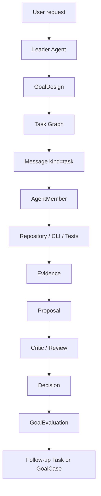
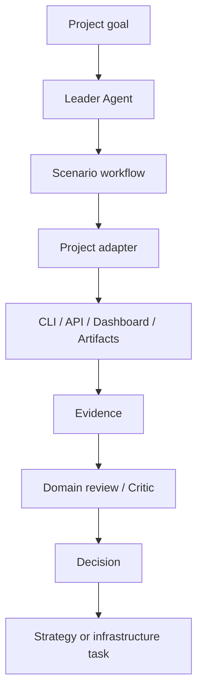
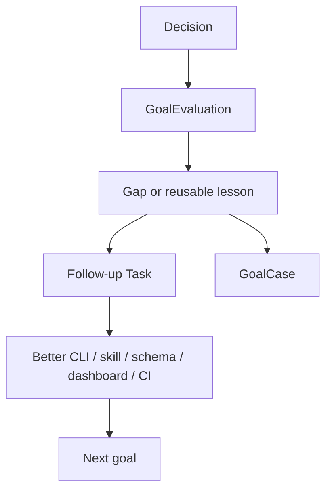

# Product Requirements

## Vision

Multi-Agent Harness turns a project or business domain into an
agent-operable system.

The product is not an agent runner and not a project-specific engine. It is a
coordination layer that lets a Lead Agent transform a real goal into:

```text
scenario -> missing infra -> agent team -> task graph -> message execution
  -> evidence -> review -> decision -> goal learning
```

The harness succeeds only when a human or future agent can reconstruct why work
existed, who owned it, how it was assigned, what evidence was produced, what
decision was made, and what should improve next.

## Product Thesis

Modern projects already expose valuable capability through CLI commands, APIs,
dashboards, artifacts, logs, tests, and domain-specific tools. Raw agents can
call those tools, but they often see too much unstructured context and too
little structured feedback.

The harness makes those capabilities usable by agents through:

- stable project adapters and tool descriptors;
- scenario-specific skills;
- durable agent members and task graphs;
- message-first assignment and reporting;
- evidence-backed proposals, reviews, and decisions;
- Dashboard visibility;
- goal evaluation and reusable cases.

The Lead Agent is therefore a workflow architect before it is an executor.
For each goal, it must decide:

- which scenario is being operated;
- which missing CLI, adapter, skill, Dashboard, or CI/CD surface would shorten
  future work;
- which agent members are needed and what each owns;
- which tasks can run in parallel and which require worktree or PR boundaries;
- what evidence proves the work happened through the harness;
- which critic, reviewer, or gate decides whether the result is acceptable.

## Final Acceptance

The product is accepted when it can manage two real pilots with the same
generic workflow:

1. self-hosting development of this repository;
2. LetMeTry / Earning Engine strategy-matrix iteration through an adapter.

Both pilots must use the same core chain:

```text
Goal -> GoalDesign -> Task Graph -> Message -> AgentMember work
  -> Evidence -> Proposal -> Critic/Review -> Decision
  -> GoalEvaluation -> Follow-up Task or GoalCase
```

The self-hosting pilot has first priority. The product must prove it can
develop its own docs, schemas, CLI, CI/CD, provider integration, and Dashboard
before it can reliably coordinate another project's strategy work.

Detailed MVP gates are in [mvp.md](mvp.md).

## Critical Mechanisms

The product vision depends on these mechanisms working together:

| Mechanism | Key question | Canonical doc |
| --- | --- | --- |
| Goal and learning loop | Why does the work exist and how does the system learn from it? | [goal-learning-loop.md](goal-learning-loop.md) |
| Concept model | What do Goal, Task, Message, AgentMember, Evidence, Proposal, and Decision mean? | [concept-model.md](concept-model.md) |
| Data model | What is source of truth and what is only projection? | [data-model.md](data-model.md) |
| Core modules | Which modules exist because the vision would fail without them? | [core-modules.md](core-modules.md) |
| Agent runtime | How do persistent provider-backed members receive work and emit events? | [agent-runtime.md](agent-runtime.md) |
| Agent control plane | How are lifecycle, queues, peer messages, and reductions operated? | [agent-control-plane.md](agent-control-plane.md) |
| Dashboard | What must the user see to know the workflow really happened? | [dashboard.md](dashboard.md) |
| Git / PR workflow | How do worktrees, branches, PRs, proposals, reviews, and decisions relate? | [workflow-git-pr.md](workflow-git-pr.md) |
| Provider integration | How can Codex and future providers implement the same runtime contract? | [integration/README.md](integration/README.md) |
| Decisions | Which hard-to-reverse tradeoffs must future agents preserve? | [decisions/README.md](decisions/README.md) |

## Scenarios

### Self-Hosting Development

The harness must develop itself through its own protocol.



This scenario proves that the harness is not just documentation. It must use
durable agent members, message delivery, provider sessions, proposals, review
gates, decisions, and Dashboard visibility for real repository work.

### Project Adapter Operation

The harness must operate external projects without importing their domain logic
into the generic core.



The first adapter pilot is LetMeTry / Earning Engine strategy-matrix work.
Strategy-specific logic, wallet/order safety, backtests, live artifacts, and
domain dashboards stay in the project or adapter. The generic harness owns
coordination, evidence, decisions, and follow-up work.

### Self-Improving Workflow

Every significant goal should produce learning.



Repeated manual effort should become infrastructure. Repeated confusion should
become docs, ADR, schema, skill, Dashboard visibility, or CI/CD.

## Non-Goals

- Do not build project-specific business logic into the generic core.
- Do not make a large workflow DSL before the task/message/evidence loop works.
- Do not treat provider chat or transcripts as canonical state.
- Do not claim multi-agent execution from one-shot helper output unless it is
  recorded through harness messages, evidence, and decisions.
- Do not make the Agent Dashboard replace project-specific dashboards.
- Do not use docs as the source of truth for stable fields, commands, runtime
  state, or checks.

## Acceptance Summary

The product is useful when:

- a Lead Agent can turn a goal into scenario workflow, infra gaps, agent team,
  task graph, evidence plan, and reviewer gates;
- work is assigned through `Message(kind=task)`, not hidden chat or field-only
  mutation;
- persistent Agent Members can receive work, report, and be observed;
- proposals are backed by evidence and reviewed before Leader decisions;
- Dashboard views show goals, tasks, teams, messages, runtime health, evidence,
  proposals, reviews, decisions, and goal-learning warnings;
- completed goals produce evaluations and reusable cases or follow-up tasks;
- stable commitments are verified by schema, CLI/API, Dashboard, CI/CD, or
  skills rather than prose alone.
