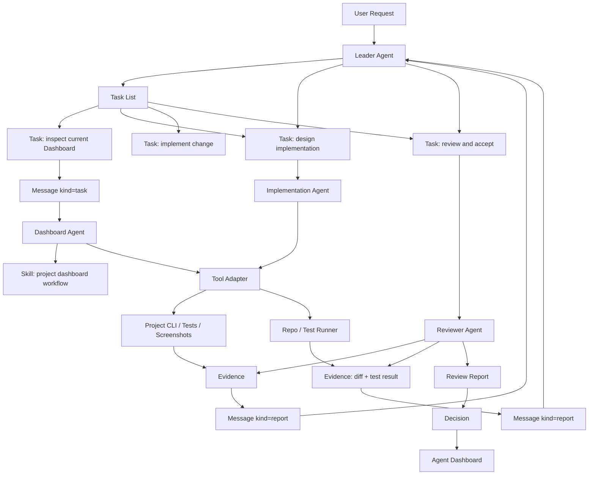
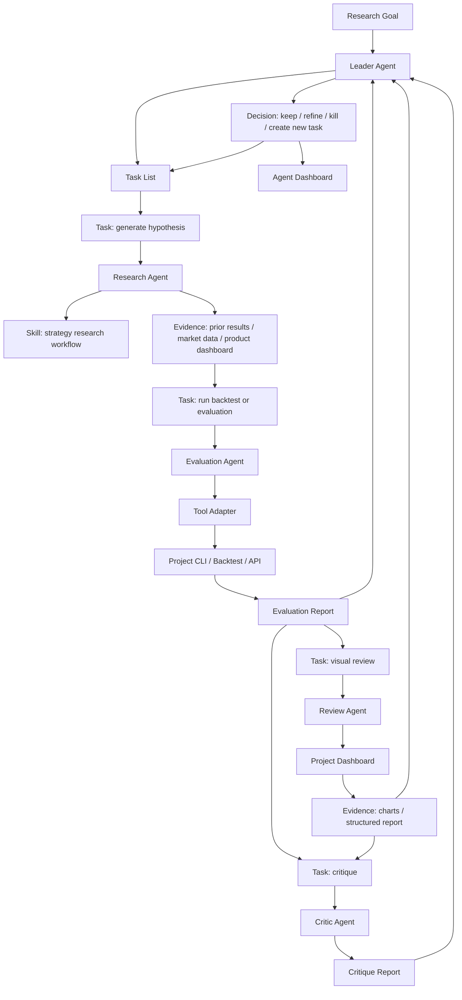
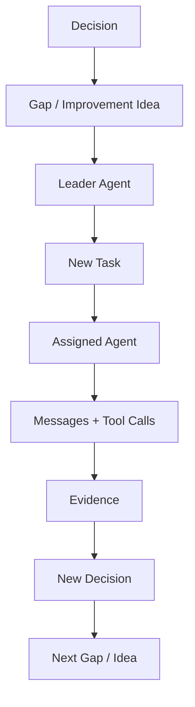

# Product Requirements

## Purpose

Multi-Agent Harness is a product for building, operating, and improving teams of
agents. Its purpose is not to replace a project, but to help agents use a
project's tools with shorter paths, better feedback, and durable decisions.

The product answers three core questions:

1. How can an agent complete a task with the shortest reliable path?
2. How can an agent know whether its work was good or bad, and why?
3. How can the system generate new requirements and better work automatically?

## Product Thesis

Modern software and research projects expose useful capabilities through CLI,
APIs, dashboards, artifacts, logs, and tests. A raw agent can call these tools,
but often sees too much unstructured context and too little structured feedback.

The harness turns project capabilities into agent-usable tools:

```text
Project CLI / API / Dashboard / Artifacts
  -> Tool Adapter + Skill
  -> Task / Message / Evidence / Decision
  -> Agent Dashboard
```

The generic harness owns the coordination layer. A project adapter owns the
domain-specific tools and evaluation rules.

## Non-Goals

- Do not build project-specific business logic into the generic core.
- Do not make a large workflow DSL before the simple task loop works.
- Do not require every project to use the same dashboard, CLI, or artifact
  format.
- Do not treat provider chat as evidence before it is recorded into the harness.

## Core Product Modules

### Agent Runtime

Owns registered agent instances.

Minimum object:

```text
AgentMember
  id
  name
  role
  capabilities
  status
```

It answers: who is working, what can they do, and are they available?

### Task System

Owns task decomposition, assignment, status, and acceptance.

Minimum object:

```text
Task
  id
  title
  objective
  owner_agent_id
  assignee_agent_id?
  status
  acceptance_criteria
  created_at
  updated_at
```

Leader Agent owns the task list and has final interpretation rights. Tasks can
be created from user requests, project observations, failed checks, agent
reports, or generated improvement ideas.

### Message System

Owns communication between agents. Task assignment and reports can both be
messages.

Minimum object:

```text
Message
  id
  task_id?
  from_agent_id
  to_agent_id? / channel?
  kind: message | task | report
  content
  evidence_ids
  created_at
```

The system is message-first: a task can start as a message and later become a
materialized `Task`.

### Evidence System

Owns evidence references. It does not copy every artifact; it records what
supports a claim.

Minimum object:

```text
Evidence
  id
  task_id?
  source_type
  source_ref
  summary
  created_at
```

Evidence can point to CLI output, a dashboard URL, a test result, a log range,
a file artifact, or a human review.

### Decision System

Owns the final decision produced by the Leader Agent.

Minimum object:

```text
Decision
  id
  task_id
  decision
  rationale
  evidence_ids
  created_at
```

It answers: what did we decide, why, and based on which evidence?

### Skill System

Skills teach agents how to use tools and how to work in a scenario. In the
first version, skills are files and prompts, not a complex runtime model.

### Tool Adapter System

Adapters expose project tools to agents:

- CLI commands;
- API endpoints;
- dashboard links;
- artifact readers;
- permission policy;
- evidence policy.

The generic harness does not know project internals. It only consumes adapter
descriptors.

### Agent Dashboard

The Agent Dashboard is the operational view over the harness. It shows:

- active tasks;
- agent members;
- message threads;
- evidence;
- decisions;
- blockers;
- tool calls.

It is not a replacement for a project-specific dashboard. It links to project
dashboards when the evidence lives there.

## Scenario 1: Technical Development

Example: a user asks the system to improve a project's Dashboard.



This scenario tests whether the harness reduces task path length for technical
work:

- Leader decomposes the request.
- Agents receive bounded tasks.
- Skills explain how to use the project tools.
- Tool adapters expose structured project capabilities.
- Evidence supports the final decision.

## Scenario 2: Strategy / Research Development

Example: a user wants agents to improve a strategy product such as a trading or
research engine.



This scenario tests whether the harness can help agents understand work
quality:

- Evaluation tools tell the agent whether a hypothesis performed well.
- Project dashboards make the evidence inspectable.
- Critic agents challenge unsupported conclusions.
- Leader decides whether to refine, kill, or promote the idea.

## Scenario 3: Self-Improving Project Loop

The harness should generate new work from its own evidence.



Examples:

- A failed task creates a CLI improvement task.
- A repeated manual review step creates a Dashboard feature task.
- A weak evaluation result creates a new research hypothesis task.
- A confusing report creates a schema or skill improvement task.

## Task Directory

Each project using the harness may keep runtime task definitions in `.task`.

Recommended minimal layout:

```text
.task/
  README.md
  active/
  templates/
  prompts/
  archive/
```

`.task` is runtime task state for a project. The generic protocol remains in
this repository.

## Acceptance Criteria

The product is useful when:

- a Leader Agent can turn a user request into a task list;
- a task can be assigned through a message;
- an Agent Member can complete the task using skills and tool adapters;
- the result includes evidence references;
- the Leader can make a decision from evidence;
- the Agent Dashboard can show the full chain from request to decision;
- repeated gaps can generate new tasks automatically.

The first version is complete when it supports:

```text
Task -> Message -> Evidence -> Decision
```

with a project adapter example.
